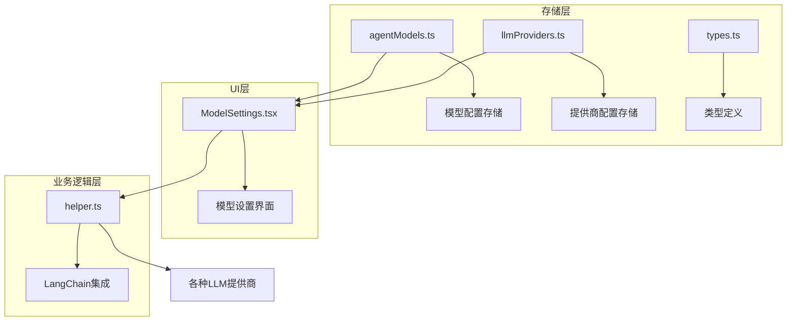
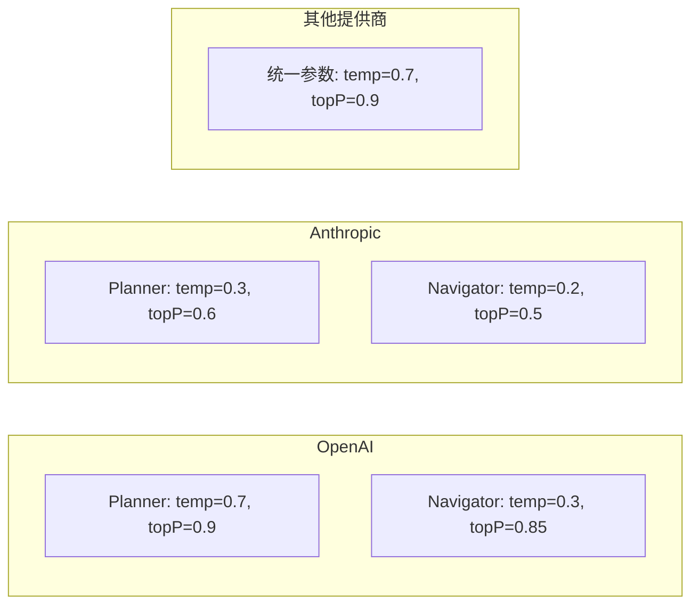
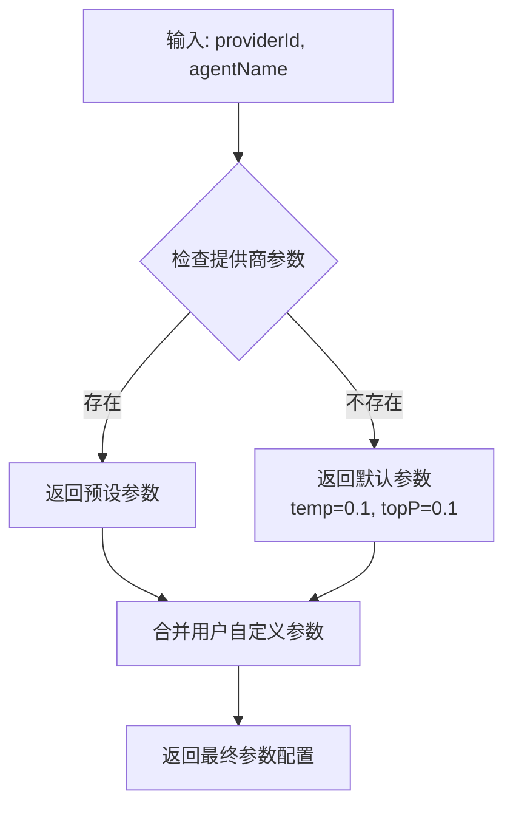
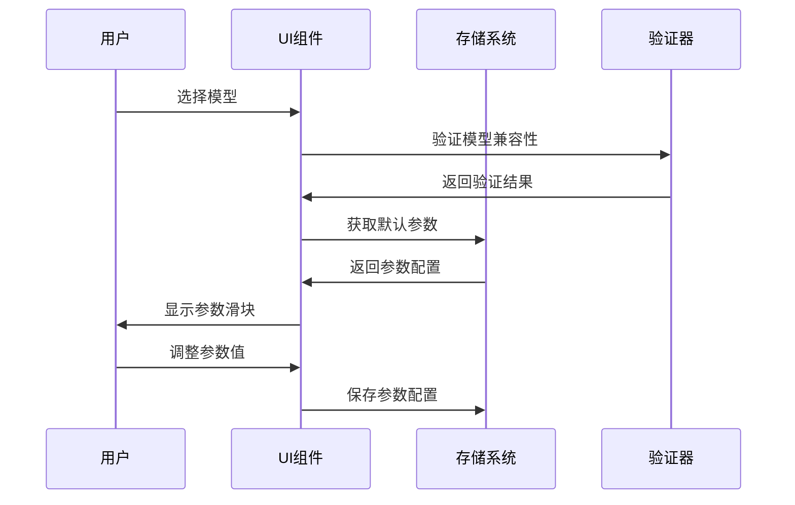
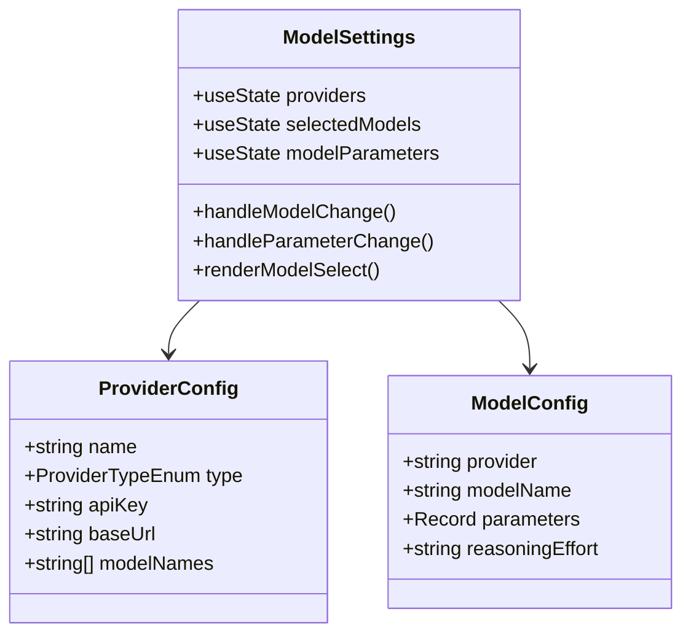
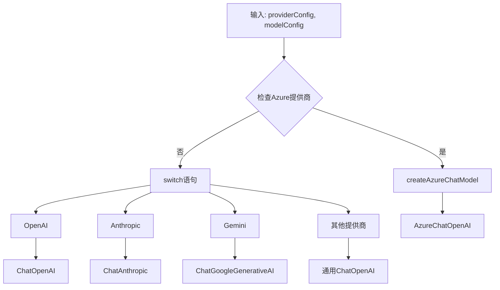
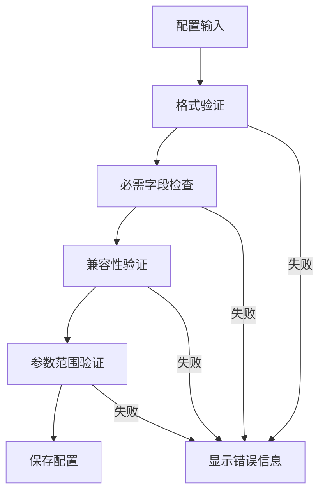

# 模型选择与参数配置

<cite>
**本文档中引用的文件**
- [agentModels.ts](file://packages/storage/lib/settings/agentModels.ts)
- [llmProviders.ts](file://packages/storage/lib/settings/llmProviders.ts)
- [types.ts](file://packages/storage/lib/settings/types.ts)
- [ModelSettings.tsx](file://pages/options/src/components/ModelSettings.tsx)
- [helper.ts](file://chrome-extension/src/background/agent/helper.ts)
</cite>

## 目录
1. [简介](#简介)
2. [项目结构概览](#项目结构概览)
3. [核心常量定义](#核心常量定义)
4. [模型选择机制](#模型选择机制)
5. [参数配置系统](#参数配置系统)
6. [UI组件实现](#ui组件实现)
7. [LangChain集成](#langchain集成)
8. [配置验证与最佳实践](#配置验证与最佳实践)
9. [故障排除指南](#故障排除指南)
10. [总结](#总结)

## 简介

NanoBrowser的LLM模型选择与参数配置系统是一个高度模块化的架构，支持多种AI提供商和智能体类型的灵活配置。该系统通过预定义的模型列表、智能参数调优和直观的用户界面，为用户提供了一个强大而易用的模型管理解决方案。

## 项目结构概览

系统的架构采用分层设计，主要包含以下核心模块：

**图表来源**
- [agentModels.ts](file://packages/storage/lib/settings/agentModels.ts#L1-L122)
- [llmProviders.ts](file://packages/storage/lib/settings/llmProviders.ts#L1-L317)
- [ModelSettings.tsx](file://pages/options/src/components/ModelSettings.tsx#L1-L799)

## 核心常量定义

### llmProviderModelNames 常量

`llmProviderModelNames` 是一个预定义的模型名称映射表，为每个LLM提供商定义了可用的模型列表：

| 提供商 | 支持的模型 |
|--------|------------|
| OpenAI | gpt-5, gpt-5-mini, gpt-5-chat-latest, gpt-4.1, gpt-4.1-mini, gpt-4o |
| Anthropic | claude-opus-4-1, claude-sonnet-4-0, claude-3-7-sonnet-latest, claude-3-5-haiku-latest |
| Gemini | gemini-2.5-flash, gemini-2.5-pro |
| Grok | grok-3, grok-3-fast, grok-3-mini, grok-3-mini-fast |
| Ollama | qwen3:14b, falcon3:10b, qwen2.5-coder:14b, mistral-small:24b |
| Azure OpenAI | gpt-5, gpt-5-mini, gpt-4.1, gpt-4.1-mini, gpt-4o |

**章节来源**
- [types.ts](file://packages/storage/lib/settings/types.ts#L24-L48)

### llmProviderParameters 配置

系统为每个提供商的不同智能体类型（Planner/Navigator）预设了优化的参数组合：

**图表来源**
- [types.ts](file://packages/storage/lib/settings/types.ts#L50-L152)

**章节来源**
- [types.ts](file://packages/storage/lib/settings/types.ts#L50-L152)

## 模型选择机制

### getDefaultAgentModelParams 函数

系统的核心函数 `getDefaultAgentModelParams` 负责根据提供商和智能体类型动态获取最优的模型参数：

**图表来源**
- [llmProviders.ts](file://packages/storage/lib/settings/llmProviders.ts#L164-L169)

### 模型验证机制

系统实现了严格的模型验证规则：

1. **提供商验证**: 确保提供商ID有效且支持所选模型
2. **模型兼容性**: 验证模型是否适用于特定的智能体类型
3. **参数一致性**: 确保温度和topP参数在合理范围内

**章节来源**
- [agentModels.ts](file://packages/storage/lib/settings/agentModels.ts#L38-L42)

## 参数配置系统

### 动态参数调整

系统支持基于模型特性的动态参数调整：

**图表来源**
- [ModelSettings.tsx](file://pages/options/src/components/ModelSettings.tsx#L528-L571)
- [agentModels.ts](file://packages/storage/lib/settings/agentModels.ts#L44-L72)

### 特殊模型处理

系统对特殊模型提供了专门的参数处理逻辑：

| 模型类型 | 处理方式 |
|----------|----------|
| OpenAI Reasoning模型 | 支持推理努力级别配置 |
| Anthropic Opus模型 | 仅使用temperature参数 |
| Azure部署模型 | 使用部署名称而非模型名称 |

**章节来源**
- [helper.ts](file://chrome-extension/src/background/agent/helper.ts#L85-L126)
- [ModelSettings.tsx](file://pages/options/src/components/ModelSettings.tsx#L568-L607)

## UI组件实现

### ModelSettings 组件架构

ModelSettings组件提供了完整的模型配置界面：

**图表来源**
- [ModelSettings.tsx](file://pages/options/src/components/ModelSettings.tsx#L55-L70)

### 模型选择流程

用户通过直观的下拉菜单选择模型，系统自动处理以下流程：

1. **模型加载**: 从存储中加载已配置的模型
2. **参数初始化**: 根据提供商和智能体类型设置默认参数
3. **实时更新**: 实时保存用户的配置更改
4. **兼容性检查**: 验证模型与提供商的兼容性

**章节来源**
- [ModelSettings.tsx](file://pages/options/src/components/ModelSettings.tsx#L126-L156)
- [ModelSettings.tsx](file://pages/options/src/components/ModelSettings.tsx#L528-L571)

## LangChain集成

### 创建聊天模型

系统通过 `createChatModel` 函数为不同提供商创建相应的LangChain聊天模型：

**图表来源**
- [helper.ts](file://chrome-extension/src/background/agent/helper.ts#L242-L384)

### 参数传递机制

系统确保正确的参数被传递给各个提供商：

| 参数类型 | OpenAI | Anthropic | 其他提供商 |
|----------|--------|-----------|------------|
| 温度 | temperature | temperature | temperature |
| Top P | topP | 不适用 | topP |
| 最大令牌数 | maxTokens | maxTokens | maxTokens |
| 推理努力 | modelKwargs.reasoning_effort | 不适用 | 不适用 |

**章节来源**
- [helper.ts](file://chrome-extension/src/background/agent/helper.ts#L85-L126)
- [helper.ts](file://chrome-extension/src/background/agent/helper.ts#L242-L287)

## 配置验证与最佳实践

### 验证规则

系统实现了多层次的配置验证：

**图表来源**
- [llmProviders.ts](file://packages/storage/lib/settings/llmProviders.ts#L200-L250)

### 最佳实践建议

1. **参数设置原则**
   - Planner智能体使用较高温度（0.7）以获得创造性输出
   - Navigator智能体使用较低温度（0.3）以获得稳定准确的输出

2. **模型选择指南**
   - 对于复杂任务选择具有推理能力的模型
   - 对于简单任务选择响应速度快的模型

3. **性能优化**
   - 合理设置最大令牌数以平衡质量和性能
   - 定期清理未使用的模型配置

**章节来源**
- [types.ts](file://packages/storage/lib/settings/types.ts#L50-L152)

## 故障排除指南

### 常见问题及解决方案

| 问题 | 原因 | 解决方案 |
|------|------|----------|
| 模型无法加载 | API密钥无效 | 检查并更新API密钥 |
| 参数不生效 | 参数范围超出限制 | 调整参数值到0-2范围内 |
| Azure部署错误 | 部署名称不匹配 | 确认部署名称存在于Azure配置中 |
| OpenAI推理模型 | 缺少推理努力配置 | 设置适当的推理努力级别 |

### 调试工具

系统提供了丰富的调试功能：
- 控制台日志记录关键操作
- 错误边界处理防止应用崩溃
- 实时状态监控

**章节来源**
- [ModelSettings.tsx](file://pages/options/src/components/ModelSettings.tsx#L528-L571)
- [helper.ts](file://chrome-extension/src/background/agent/helper.ts#L140-L180)

## 总结

NanoBrowser的LLM模型选择与参数配置系统通过精心设计的架构，实现了以下核心功能：

1. **统一的模型管理**: 通过预定义的模型列表和参数配置，为用户提供了标准化的模型选择体验
2. **智能参数调优**: 基于提供商和智能体类型的差异化参数设置，确保最佳的模型性能
3. **灵活的UI交互**: 直观的配置界面支持实时参数调整和即时反馈
4. **强大的LangChain集成**: 无缝对接多种LLM提供商，提供一致的编程接口
5. **完善的验证机制**: 多层次的配置验证确保系统的稳定性和可靠性

该系统不仅满足了当前的功能需求，还为未来的扩展预留了充足的空间，是一个兼具实用性和可维护性的优秀设计。