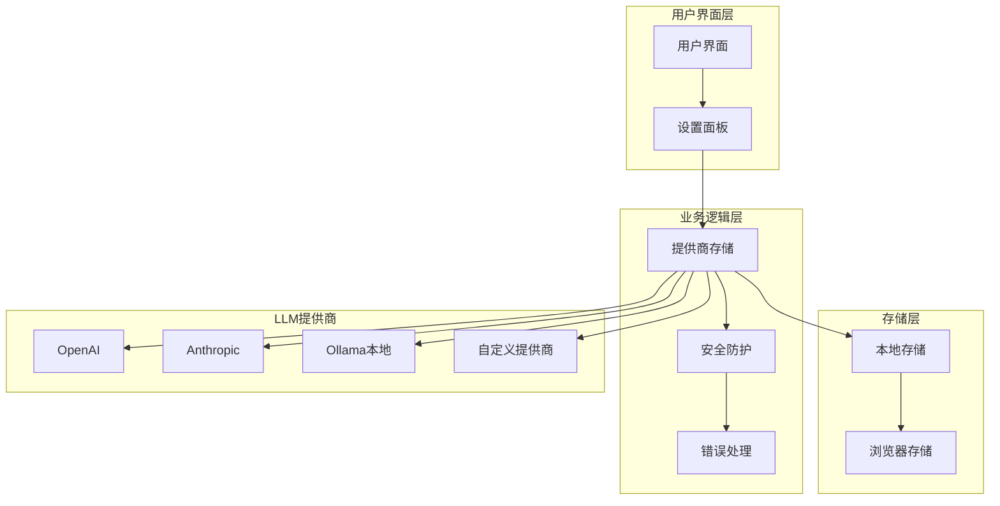
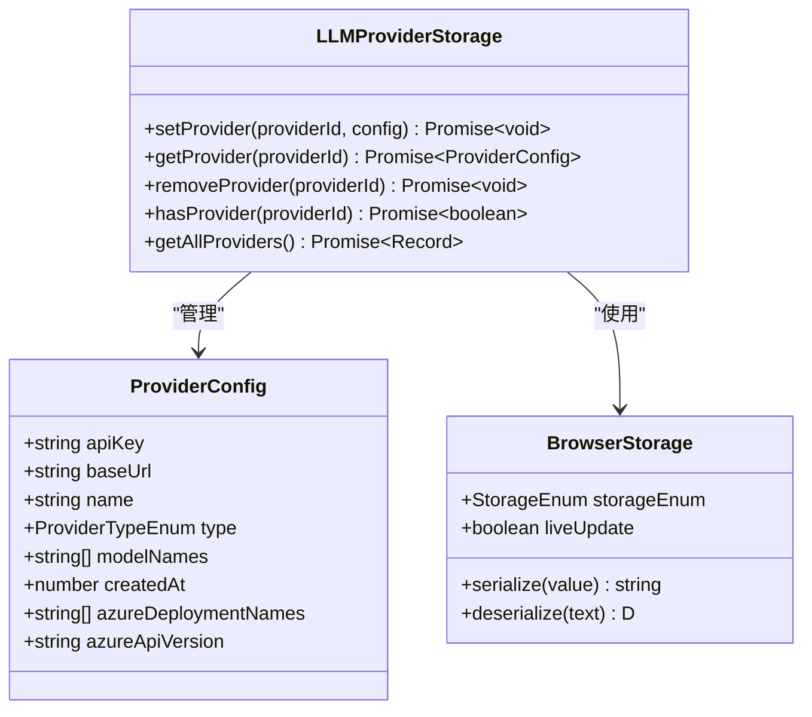
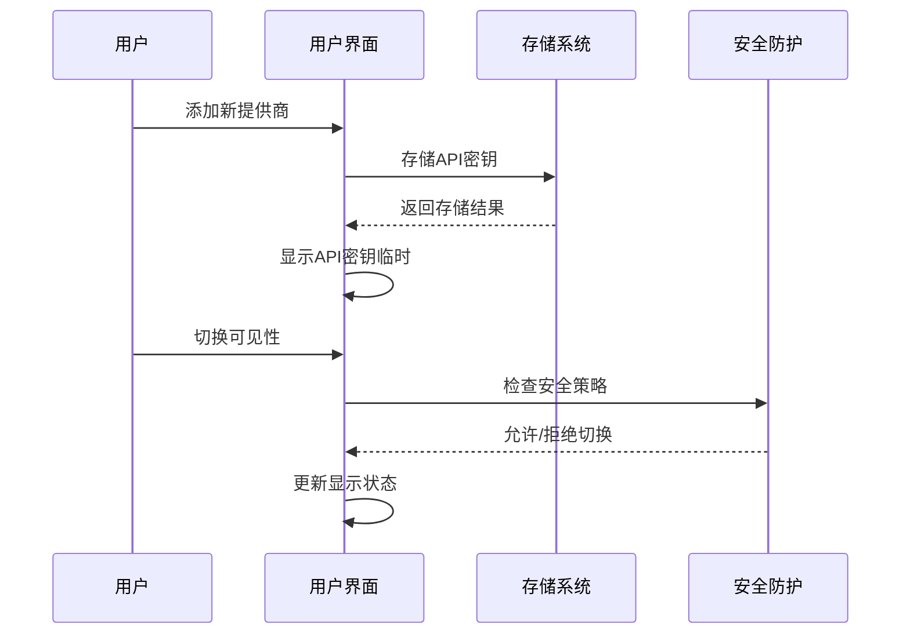
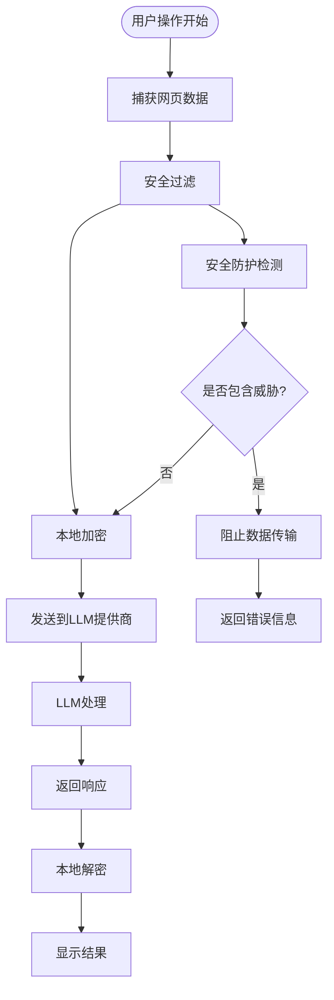
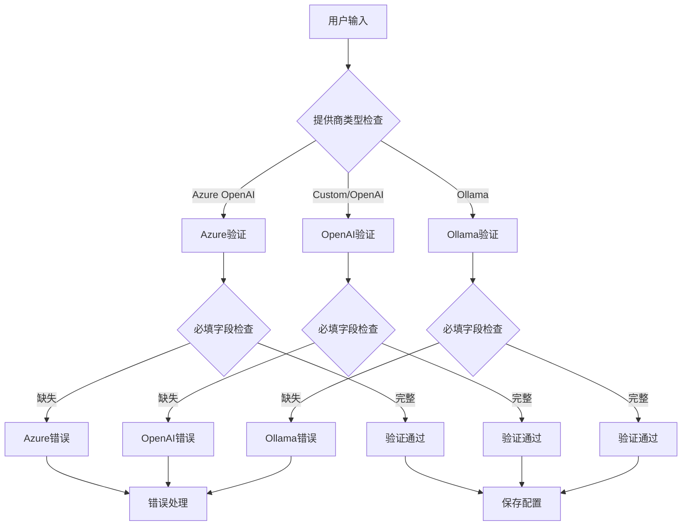
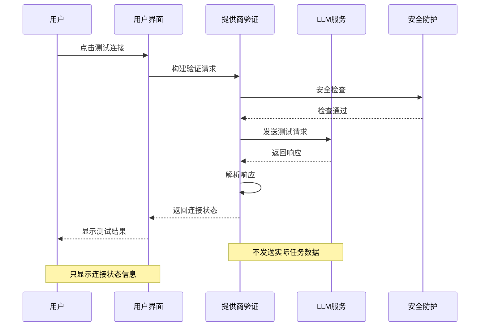
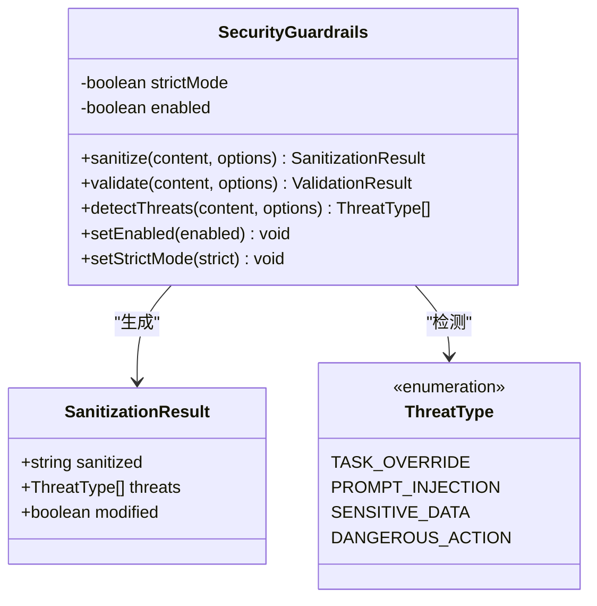
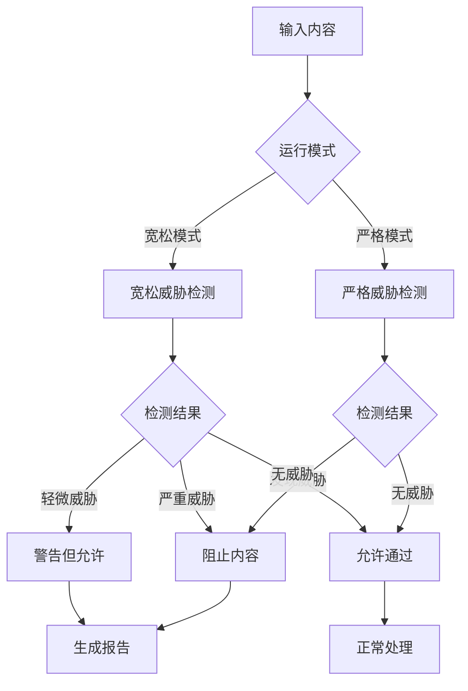
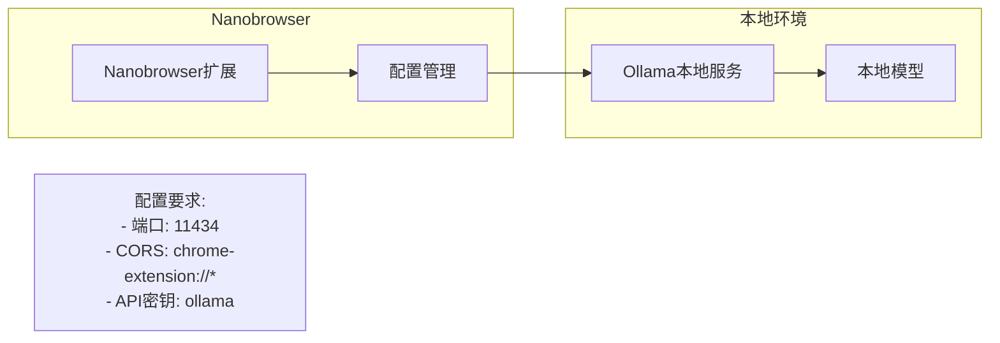
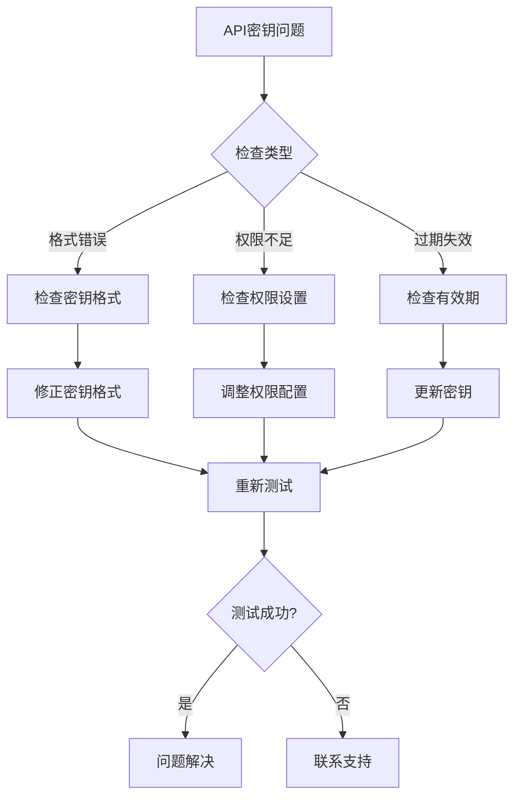

# 集成隐私与安全

<cite>
**本文档中引用的文件**
- [PRIVACY.md](file://PRIVACY.md)
- [llmProviders.ts](file://packages/storage/lib/settings/llmProviders.ts)
- [ModelSettings.tsx](file://pages/options/src/components/ModelSettings.tsx)
- [errors.ts](file://chrome-extension/src/background/agent/agents/errors.ts)
- [index.ts](file://chrome-extension/src/background/services/guardrails/index.ts)
- [types.ts](file://packages/storage/lib/settings/types.ts)
- [base.ts](file://packages/storage/lib/base/base.ts)
- [user.ts](file://packages/storage/lib/profile/user.ts)
</cite>

## 目录
1. [简介](#简介)
2. [系统架构概览](#系统架构概览)
3. [API密钥安全存储机制](#api密钥安全存储机制)
4. [用户数据处理与隐私保护](#用户数据处理与隐私保护)
5. [输入验证与错误处理](#输入验证与错误处理)
6. [测试连接功能的安全性](#测试连接功能的安全性)
7. [安全防护机制](#安全防护机制)
8. [最佳实践建议](#最佳实践建议)
9. [故障排除指南](#故障排除指南)
10. [总结](#总结)

## 简介

Nanobrowser是一个开源的AI网页自动化Chrome扩展，采用完全透明的隐私保护设计。本文档详细阐述了LLM（大语言模型）集成功能中的隐私与安全机制，确保用户数据在整个处理流程中的安全性。

根据[隐私政策](file://PRIVACY.md)，Nanobrowser坚持以下核心隐私原则：
- 所有数据处理完全在用户浏览器内进行
- 登录凭据和Cookie永远不会离开用户浏览器
- 用户数据由默认情况下在本地处理
- 匿名分析数据可选启用

## 系统架构概览

Nanobrowser的LLM集成架构采用了多层次的安全设计，确保用户数据在传输和处理过程中的安全性。



**图表来源**
- [ModelSettings.tsx](file://pages/options/src/components/ModelSettings.tsx#L1126-L1145)
- [llmProviders.ts](file://packages/storage/lib/settings/llmProviders.ts#L26-L56)

**章节来源**
- [PRIVACY.md](file://PRIVACY.md#L1-L53)
- [ModelSettings.tsx](file://pages/options/src/components/ModelSettings.tsx#L1-L50)

## API密钥安全存储机制

### 本地存储架构

Nanobrowser采用浏览器本地存储机制来确保API密钥的安全性。所有敏感信息都存储在用户的浏览器中，不会上传至任何第三方服务器。



**图表来源**
- [llmProviders.ts](file://packages/storage/lib/settings/llmProviders.ts#L26-L56)
- [base.ts](file://packages/storage/lib/base/base.ts#L36-L67)

### 存储配置特性

系统使用以下安全配置来保护API密钥：

| 配置项 | 值 | 安全作用 |
|--------|-----|----------|
| 存储类型 | Local | 数据保留在用户浏览器本地 |
| 实时同步 | 启用 | 确保多窗口间状态同步 |
| 序列化 | 自定义 | 对敏感数据进行编码处理 |
| 权限检查 | 自动 | 验证存储权限的有效性 |

### API密钥可见性控制

为了进一步增强安全性，系统提供了API密钥的可见性控制功能：



**图表来源**
- [ModelSettings.tsx](file://pages/options/src/components/ModelSettings.tsx#L1247-L1288)

**章节来源**
- [llmProviders.ts](file://packages/storage/lib/settings/llmProviders.ts#L26-L56)
- [base.ts](file://packages/storage/lib/base/base.ts#L69-L119)

## 用户数据处理与隐私保护

### 数据流架构

Nanobrowser严格遵循最小化数据收集原则，确保用户数据在传输过程中的安全性。



**图表来源**
- [index.ts](file://chrome-extension/src/background/services/guardrails/index.ts#L0-L44)
- [errors.ts](file://chrome-extension/src/background/agent/agents/errors.ts#L0-L45)

### 数据保护措施

系统实施了多层次的数据保护措施：

| 保护层级 | 措施 | 目标 |
|----------|------|------|
| 输入验证 | 格式检查、长度限制 | 防止恶意输入注入 |
| 内容过滤 | 威胁检测、敏感信息识别 | 阻止危险内容传播 |
| 加密传输 | HTTPS协议、TLS加密 | 保护数据传输安全 |
| 本地处理 | 浏览器内执行 | 避免第三方介入 |

### 网页截图与HTML处理

当使用AI功能时，系统会处理网页数据，但严格遵守隐私原则：

- **直接传输**：网页截图和HTML数据直接发送到用户选择的LLM提供商
- **无存储**：扩展本身不存储或处理原始数据
- **隐私政策**：用户数据隐私受所选LLM提供商的政策约束
- **透明度**：所有数据处理行为完全透明可追溯

**章节来源**
- [PRIVACY.md](file://PRIVACY.md#L35-L42)
- [index.ts](file://chrome-extension/src/background/services/guardrails/index.ts#L0-L44)

## 输入验证与错误处理

### 多层次验证机制

系统实现了严格的输入验证机制，防止恶意配置和敏感信息泄露：



**图表来源**
- [llmProviders.ts](file://packages/storage/lib/settings/llmProviders.ts#L235-L260)
- [ModelSettings.tsx](file://pages/options/src/components/ModelSettings.tsx#L427-L457)

### 错误分类与处理

系统对不同类型的错误进行了详细的分类和处理：

| 错误类型 | 检测方法 | 处理策略 | 用户提示 |
|----------|----------|----------|----------|
| 认证错误 | HTTP 401状态码 | 提供详细配置指导 | "API密钥无效，请检查您的密钥" |
| 权限错误 | HTTP 403状态码 | 指导权限配置 | "访问被拒绝，请检查API权限" |
| 参数错误 | HTTP 400状态码 | 验证输入格式 | "参数格式错误，请检查配置" |
| 连接错误 | 网络异常 | 重试机制 | "连接失败，请检查网络设置" |

### 特殊提供商验证

#### Azure OpenAI验证
```typescript
// Azure OpenAI需要的验证规则
if (providerType === ProviderTypeEnum.AzureOpenAI) {
  if (!config.baseUrl?.trim()) {
    throw new Error('Azure Endpoint (baseUrl) is required');
  }
  if (!config.azureDeploymentNames || config.azureDeploymentNames.length === 0) {
    throw new Error('At least one Azure Deployment Name is required');
  }
  if (!config.azureApiVersion?.trim()) {
    throw new Error('Azure API Version is required');
  }
  if (!config.apiKey?.trim()) {
    throw new Error('API Key is required for Azure OpenAI');
  }
}
```

#### 自定义提供商验证
```typescript
// 自定义OpenAI提供商验证
if (providerType === ProviderTypeEnum.CustomOpenAI && 
    providers[provider].name?.includes(' ')) {
  setNameErrors(prev => ({
    ...prev,
    [provider]: t('options_models_providers_errors_spacesNotAllowed'),
  }));
  return;
}
```

**章节来源**
- [llmProviders.ts](file://packages/storage/lib/settings/llmProviders.ts#L235-L260)
- [ModelSettings.tsx](file://pages/options/src/components/ModelSettings.tsx#L427-L457)

## 测试连接功能的安全性

### 安全连接测试机制

Nanobrowser提供了测试连接功能，允许用户验证API密钥的有效性，同时确保不会暴露额外的敏感信息。



**图表来源**
- [ModelSettings.tsx](file://pages/options/src/components/ModelSettings.tsx#L427-L457)

### 测试连接的安全特性

测试连接功能具有以下安全特性：

1. **最小权限原则**：只发送必要的认证信息
2. **无数据传输**：不发送实际的任务或查询数据
3. **即时反馈**：快速返回连接状态，减少暴露时间
4. **错误隔离**：错误信息经过脱敏处理

### 常见测试连接错误处理

系统针对不同的测试连接场景提供了专门的错误处理：

| 错误场景 | 检测方式 | 处理策略 | 用户指导 |
|----------|----------|----------|----------|
| API密钥无效 | 401 Unauthorized | 显示认证错误 | "请检查您的API密钥是否正确" |
| 网络连接失败 | 超时或断开 | 提示网络问题 | "无法连接到LLM服务，请检查网络" |
| 服务不可用 | 5xx服务器错误 | 显示服务状态 | "LLM服务暂时不可用，请稍后重试" |
| 配置错误 | 参数验证失败 | 显示配置指导 | "请检查您的提供商配置是否完整" |

**章节来源**
- [errors.ts](file://chrome-extension/src/background/agent/agents/errors.ts#L0-L45)
- [ModelSettings.tsx](file://pages/options/src/components/ModelSettings.tsx#L427-L457)

## 安全防护机制

### 内容安全过滤

Nanobrowser实现了强大的安全防护机制，用于检测和过滤潜在的威胁内容：



**图表来源**
- [index.ts](file://chrome-extension/src/background/services/guardrails/index.ts#L0-L44)
- [types.ts](file://chrome-extension/src/background/services/guardrails/types.ts#L0-L42)

### 威胁检测机制

系统能够检测多种类型的威胁：

| 威胁类型 | 检测特征 | 处理方式 | 示例 |
|----------|----------|----------|------|
| 任务覆盖 | 指令重写尝试 | 阻止并标记 | "忽略之前的指令" |
| 提示注入 | 系统提示修改 | 清理并警告 | "参考系统提示" |
| 敏感数据 | 身份信息泄露 | 屏蔽并记录 | "API密钥: abc123" |
| 危险操作 | 恶意命令 | 禁止执行 | "删除重要文件" |

### 严格模式与宽松模式

系统提供两种运行模式以适应不同的安全需求：



**图表来源**
- [index.ts](file://chrome-extension/src/background/services/guardrails/index.ts#L81-L126)

**章节来源**
- [index.ts](file://chrome-extension/src/background/services/guardrails/index.ts#L0-L126)
- [types.ts](file://chrome-extension/src/background/services/guardrails/types.ts#L0-L42)

## 最佳实践建议

### 使用自定义端点增强隐私

为了最大化隐私保护，强烈建议用户使用自定义端点，特别是本地部署的服务：

#### 本地Ollama实例配置



**图表来源**
- [llmProviders.ts](file://packages/storage/lib/settings/llmProviders.ts#L132-L162)

#### 自定义端点配置指南

| 提供商类型 | 默认端点 | 自定义端点建议 | 隐私级别 |
|------------|----------|----------------|----------|
| OpenAI | api.openai.com | 企业内部部署 | 中等 |
| Anthropic | api.anthropic.com | 私有云部署 | 中等 |
| Ollama | localhost:11434 | 专用服务器 | 高 |
| Azure OpenAI | azure端点 | 本地代理 | 高 |

### API密钥管理最佳实践

1. **定期轮换**：定期更新API密钥以降低风险
2. **权限最小化**：为API密钥分配最小必要权限
3. **监控使用**：定期检查API使用情况和费用
4. **备份恢复**：妥善保管API密钥的备份信息

### 网络安全配置

对于使用本地服务的用户，需要正确配置网络安全设置：

```bash
# Ollama CORS配置
OLLAMA_ORIGINS=chrome-extension://*

# 企业防火墙配置
ALLOW_NANOBROWSER=true
```

### 数据处理策略

建议用户采取以下数据处理策略：

- **最小化收集**：只收集完成任务必需的数据
- **及时清理**：定期清理不需要的历史数据
- **加密传输**：确保所有网络通信使用HTTPS
- **审计日志**：启用必要的审计日志以便追踪

**章节来源**
- [llmProviders.ts](file://packages/storage/lib/settings/llmProviders.ts#L132-L162)
- [ModelSettings.tsx](file://pages/options/src/components/ModelSettings.tsx#L1525-L1548)

## 故障排除指南

### 常见问题诊断

#### API密钥相关问题



#### 连接问题排查清单

| 问题类型 | 检查项目 | 解决方案 |
|----------|----------|----------|
| 网络连接 | 网络状态、防火墙设置 | 检查网络连接，配置防火墙规则 |
| DNS解析 | 域名解析、代理设置 | 验证DNS配置，检查代理设置 |
| SSL证书 | 证书有效性、时间同步 | 更新系统时间，检查证书链 |
| 端口阻塞 | 端口可用性、安全软件 | 开放必要端口，配置安全软件 |

### 错误代码参考

系统返回的主要错误代码及其含义：

| 错误代码 | 描述 | 解决步骤 |
|----------|------|----------|
| AUTH_401 | 认证失败 | 检查API密钥有效性 |
| FORBID_403 | 权限不足 | 验证API密钥权限设置 |
| BADREQ_400 | 请求参数错误 | 检查提供商配置参数 |
| TIMEOUT_408 | 请求超时 | 检查网络连接质量 |
| SERVER_5xx | 服务器错误 | 等待服务恢复或联系提供商 |

### 性能优化建议

为了获得最佳的性能体验，建议用户：

1. **选择就近节点**：优先选择地理位置较近的LLM服务提供商
2. **优化模型选择**：根据任务复杂度选择合适的模型
3. **合理设置参数**：平衡质量和速度的需求
4. **定期维护**：清理缓存和过期数据

**章节来源**
- [errors.ts](file://chrome-extension/src/background/agent/agents/errors.ts#L0-L314)
- [ModelSettings.tsx](file://pages/options/src/components/ModelSettings.tsx#L427-L457)

## 总结

Nanobrowser的LLM集成功能在设计上充分考虑了隐私与安全的重要性。通过以下关键措施，系统确保了用户数据的安全性和隐私保护：

### 核心安全特性

1. **本地存储机制**：所有敏感信息存储在用户浏览器本地，不上传至任何第三方服务器
2. **多重验证机制**：严格的输入验证和错误处理，防止恶意配置
3. **安全防护系统**：内置的内容过滤和威胁检测机制
4. **透明数据处理**：用户数据直接发送到所选LLM提供商，扩展本身不存储原始数据
5. **灵活配置选项**：支持使用自定义端点，特别是本地部署的服务

### 隐私保护承诺

- **完全本地处理**：所有AI功能在用户浏览器内完成
- **最小数据收集**：只收集完成任务必需的信息
- **用户完全控制**：用户可以随时清除数据和配置
- **透明度保证**：所有数据处理行为公开可追溯

### 持续改进方向

Nanobrowser将继续致力于提升隐私与安全水平：

- **增强安全防护**：持续改进威胁检测算法
- **优化用户体验**：简化配置流程，提高易用性
- **扩展隐私功能**：提供更多本地处理选项
- **加强合规性**：确保符合最新的隐私法规要求

通过这些措施，Nanobrowser为用户提供了既强大又安全的AI网页自动化体验，真正实现了隐私友好的技术解决方案。