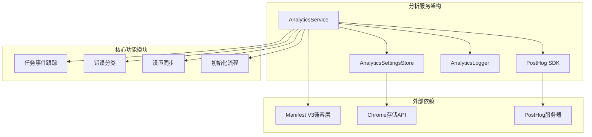
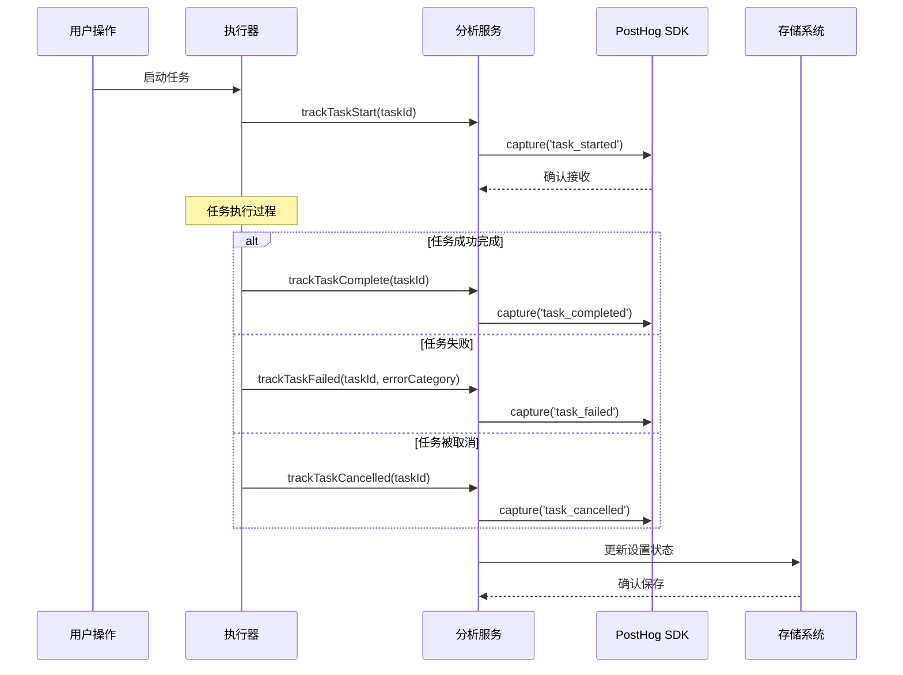
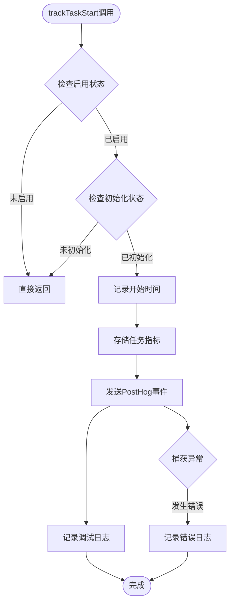
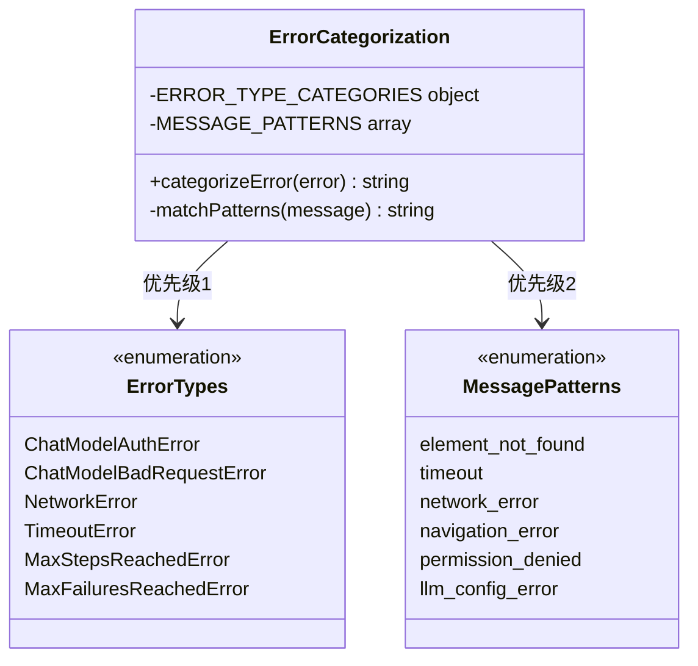
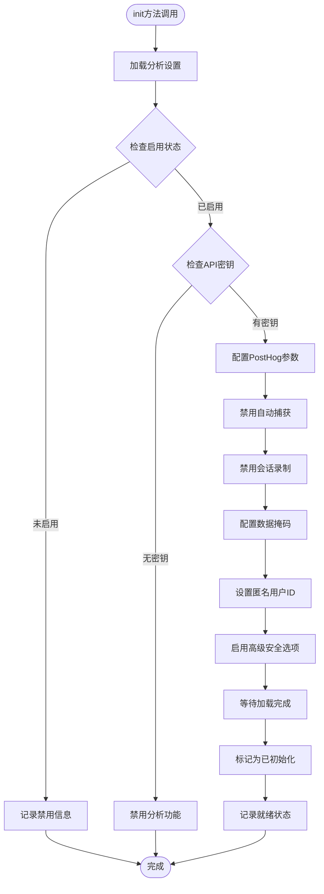
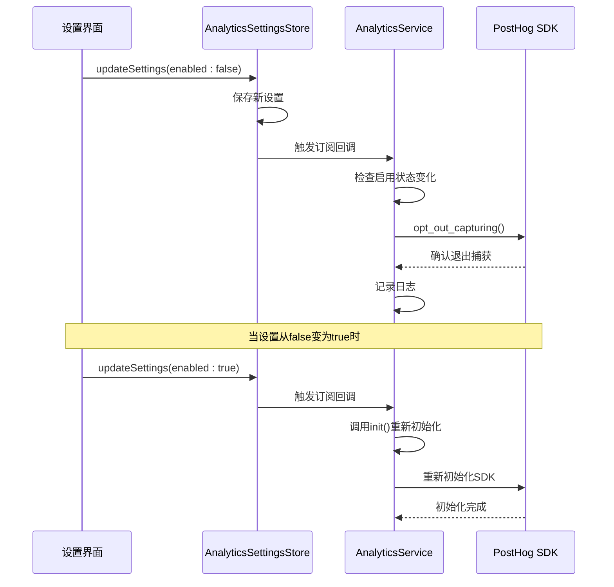
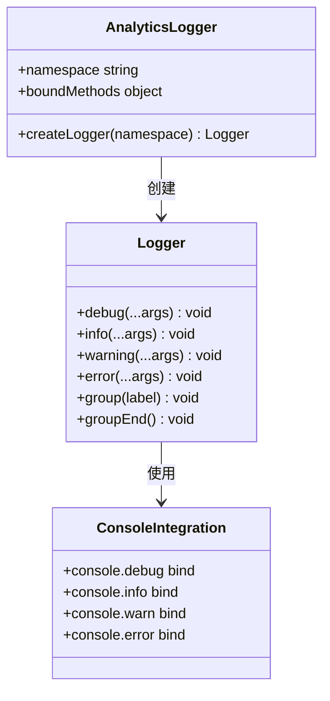
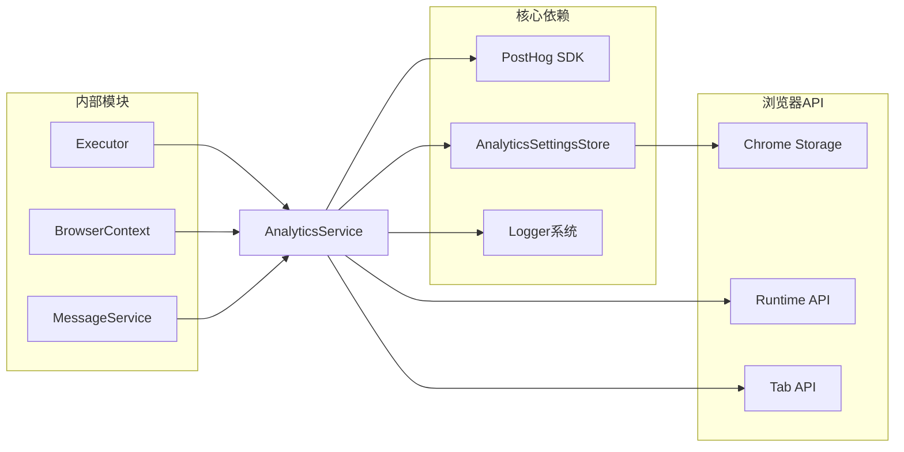

# 分析服务（AnalyticsService）详细文档

<cite>
**本文档中引用的文件**
- [analytics.ts](file://chrome-extension/src/background/services/analytics.ts)
- [index.ts](file://chrome-extension/src/background/index.ts)
- [log.ts](file://chrome-extension/src/background/log.ts)
- [executor.ts](file://chrome-extension/src/background/agent/executor.ts)
- [errors.ts](file://chrome-extension/src/background/agent/agents/errors.ts)
- [analyticsSettings.ts](file://packages/storage/lib/settings/analyticsSettings.ts)
- [AnalyticsSettings.tsx](file://pages/options/src/components/AnalyticsSettings.tsx)
</cite>

## 目录
1. [简介](#简介)
2. [项目结构](#项目结构)
3. [核心组件](#核心组件)
4. [架构概览](#架构概览)
5. [详细组件分析](#详细组件分析)
6. [依赖关系分析](#依赖关系分析)
7. [性能考虑](#性能考虑)
8. [故障排除指南](#故障排除指南)
9. [结论](#结论)

## 简介

分析服务（AnalyticsService）是NanoBrowser扩展的核心监控组件，基于PostHog平台实现用户行为跟踪。该服务专门设计用于在Manifest V3环境下工作，提供了完整的企业级分析功能，同时严格遵守Chrome Web Store的安全和隐私要求。

该服务的主要功能包括：
- **任务生命周期跟踪**：监控任务的启动、完成、失败和取消状态
- **错误分类系统**：基于Error构造函数名称和消息正则表达式的两级分类策略
- **隐私保护**：禁用自动捕获功能，使用匿名用户ID，避免会话录制
- **动态配置**：支持运行时启用/禁用和设置同步
- **Chrome Web Store兼容性**：完全符合Manifest V3安全要求

## 项目结构

分析服务位于扩展的后台服务中，采用模块化设计：



**图表来源**
- [analytics.ts](file://chrome-extension/src/background/services/analytics.ts#L1-L272)
- [index.ts](file://chrome-extension/src/background/index.ts#L1-L352)

**章节来源**
- [analytics.ts](file://chrome-extension/src/background/services/analytics.ts#L1-L50)
- [index.ts](file://chrome-extension/src/background/index.ts#L1-L50)

## 核心组件

### AnalyticsService类

AnalyticsService是整个分析系统的核心单例类，负责协调所有分析活动：

#### 主要属性
- `initialized`: 布尔值，指示PostHog是否已成功初始化
- `enabled`: 布尔值，控制分析功能的整体开关
- `taskMetrics`: Map对象，存储任务执行时间指标

#### 静态配置常量
- `ERROR_TYPE_CATEGORIES`: 错误类型到分类的映射表
- `MESSAGE_PATTERNS`: 正则表达式模式到错误分类的映射表

### PostHog集成

服务使用PostHog的无外部依赖版本，确保在Manifest V3环境中的CSP兼容性：

#### 关键配置选项
- `autocapture: false`: 禁用自动事件捕获
- `capture_pageview: false`: 禁用页面视图跟踪
- `disable_session_recording: true`: 禁用会话录制
- `mask_all_text: true`: 对所有文本进行掩码处理
- `advanced_disable_decide: true`: 禁用远程决策功能

**章节来源**
- [analytics.ts](file://chrome-extension/src/background/services/analytics.ts#L10-L70)

## 架构概览

分析服务采用事件驱动架构，通过观察者模式实现松耦合设计：



**图表来源**
- [executor.ts](file://chrome-extension/src/background/agent/executor.ts#L170-L230)
- [analytics.ts](file://chrome-extension/src/background/services/analytics.ts#L105-L203)

## 详细组件分析

### 任务事件跟踪系统

#### trackTaskStart方法
任务开始跟踪的核心实现，包含以下关键步骤：



**图表来源**
- [analytics.ts](file://chrome-extension/src/background/services/analytics.ts#L105-L125)

#### trackTaskComplete方法
任务完成跟踪实现了精确的执行时间计算：

| 参数 | 类型 | 描述 |
|------|------|------|
| taskId | string | 唯一的任务标识符 |
| duration_ms | number | 任务执行时间（毫秒） |
| timestamp | number | 完成时间戳 |

#### 错误分类系统

服务实现了两级错误分类策略，确保错误能够被准确识别和分析：



**图表来源**
- [analytics.ts](file://chrome-extension/src/background/services/analytics.ts#L18-L35)
- [errors.ts](file://chrome-extension/src/background/agent/agents/errors.ts#L1-L50)

#### 初始化流程

分析服务的初始化遵循严格的Manifest V3兼容性要求：



**图表来源**
- [analytics.ts](file://chrome-extension/src/background/services/analytics.ts#L48-L106)

**章节来源**
- [analytics.ts](file://chrome-extension/src/background/services/analytics.ts#L48-L106)
- [executor.ts](file://chrome-extension/src/background/agent/executor.ts#L170-L230)

### 设置同步机制

#### analyticsSettingsStore集成

分析服务与存储系统紧密集成，实现设置的实时同步：



**图表来源**
- [analyticsSettings.ts](file://packages/storage/lib/settings/analyticsSettings.ts#L42-L73)
- [analytics.ts](file://chrome-extension/src/background/services/analytics.ts#L247-L270)

#### 匿名用户ID管理

服务实现了完整的匿名用户ID管理系统：

| 功能 | 实现方式 | 安全特性 |
|------|----------|----------|
| ID生成 | 随机字符串组合 | 不包含可识别信息 |
| 存储持久化 | 浏览器本地存储 | 加密存储 |
| ID复用 | 首次访问时生成 | 保持用户连续性 |
| 默认值处理 | 自动填充缺失值 | 确保功能可用性 |

**章节来源**
- [analyticsSettings.ts](file://packages/storage/lib/settings/analyticsSettings.ts#L15-L40)
- [analytics.ts](file://chrome-extension/src/background/services/analytics.ts#L247-L270)

### 日志记录系统

#### Logger集成

分析服务集成了专用的日志记录器，提供分级日志功能：



**图表来源**
- [log.ts](file://chrome-extension/src/background/log.ts#L1-L40)

**章节来源**
- [log.ts](file://chrome-extension/src/background/log.ts#L1-L40)
- [analytics.ts](file://chrome-extension/src/background/services/analytics.ts#L1-L10)

## 依赖关系分析

### 外部依赖

分析服务依赖于以下关键组件：



**图表来源**
- [analytics.ts](file://chrome-extension/src/background/services/analytics.ts#L1-L10)
- [index.ts](file://chrome-extension/src/background/index.ts#L1-L30)

### 内部耦合

服务与执行器系统的集成体现了良好的架构设计：

| 组件 | 耦合方式 | 数据流向 | 同步机制 |
|------|----------|----------|----------|
| Executor | 事件监听 | 异步通知 | Promise链 |
| AnalyticsService | 单例注入 | 直接调用 | 同步执行 |
| AnalyticsSettingsStore | 订阅模式 | 推送更新 | 回调机制 |

**章节来源**
- [index.ts](file://chrome-extension/src/background/index.ts#L40-L50)
- [executor.ts](file://chrome-extension/src/background/agent/executor.ts#L1-L50)

## 性能考虑

### 异步处理策略

分析服务采用异步非阻塞的设计原则：

- **事件捕获**：所有PostHog事件都使用Promise包装，避免阻塞主线程
- **错误隔离**：每个跟踪操作都有独立的错误处理，防止单点故障
- **内存管理**：任务指标在完成后立即清理，避免内存泄漏

### 缓存优化

服务实现了智能的缓存策略：

- **设置缓存**：分析设置在内存中缓存，减少存储访问开销
- **指标清理**：任务执行完成后自动清理相关指标
- **连接池**：PostHog SDK内部维护连接池，提高网络效率

### 资源限制

为了符合Chrome扩展的资源限制：

- **内存使用**：限制任务指标Map的大小，定期清理过期数据
- **网络请求**：批量发送事件，减少HTTP请求数量
- **存储访问**：延迟写入，合并多个设置变更

## 故障排除指南

### 常见问题诊断

#### 初始化失败

**症状**：分析功能无法正常工作，没有事件被发送

**诊断步骤**：
1. 检查PostHog API密钥是否正确配置
2. 验证网络连接是否正常
3. 查看浏览器控制台是否有相关错误信息

**解决方案**：
```typescript
// 检查API密钥配置
const apiKey = import.meta.env.VITE_POSTHOG_API_KEY;
if (!apiKey) {
  console.error('PostHog API key is missing');
}

// 检查网络连接
try {
  await fetch('https://app.posthog.com/decide/');
} catch (error) {
  console.error('Network connectivity issue:', error);
}
```

#### 事件丢失

**症状**：某些任务状态没有被正确跟踪

**诊断方法**：
1. 检查任务ID是否唯一且格式正确
2. 验证任务生命周期事件的调用顺序
3. 确认PostHog SDK的初始化状态

#### 错误分类不准确

**症状**：错误被归类到错误的类别

**排查步骤**：
1. 检查错误消息是否包含预期的关键字
2. 验证错误类型是否在预定义的映射表中
3. 确认正则表达式模式的准确性

**章节来源**
- [analytics.ts](file://chrome-extension/src/background/services/analytics.ts#L65-L106)
- [analytics.ts](file://chrome-extension/src/background/services/analytics.ts#L210-L270)

### 调试工具

#### 开发模式日志

服务在开发环境中提供详细的调试信息：

```typescript
// 启用详细日志
import.meta.env.DEV = true;

// 日志输出示例
logger.debug('Tracked task start:', taskId);
logger.error('Failed to track task completion:', error);
```

#### 事件验证

可以通过以下方式验证事件是否正确发送：

```typescript
// 监听PostHog事件
posthog.on('event_sent', (event) => {
  console.log('Event sent:', event);
});

// 检查事件队列
console.log('Pending events:', posthog.get_distinct_id());
```

## 结论

分析服务（AnalyticsService）是NanoBrowser扩展中不可或缺的监控基础设施，它成功地在Manifest V3的严格限制下实现了全面的用户行为跟踪功能。通过精心设计的架构和严格的安全措施，该服务不仅满足了产品分析的需求，还确保了用户隐私和扩展商店合规性的双重目标。

### 主要优势

1. **安全性**：完全禁用可能引发安全警告的功能，如会话录制和自动捕获
2. **隐私保护**：使用匿名用户ID，不收集敏感的URL或页面内容
3. **性能优化**：异步处理和智能缓存确保最小的性能影响
4. **可维护性**：模块化设计和清晰的接口便于后续维护和扩展
5. **合规性**：严格遵循Chrome Web Store的审核要求

### 技术亮点

- **两级错误分类系统**：结合Error构造函数名称和消息正则匹配，提供准确的错误分析
- **动态配置支持**：运行时启用/禁用和设置同步，提供灵活的管理能力
- **优雅降级**：初始化失败时的容错处理，确保不影响主功能
- **事件驱动架构**：松耦合设计，便于与其他系统组件集成

该分析服务为NanoBrowser提供了强大的数据洞察能力，同时保持了最佳的安全实践和用户体验，是现代浏览器扩展开发的优秀范例。