# 服务集成

<cite>
**本文档中引用的文件**
- [analytics.ts](file://chrome-extension/src/background/services/analytics.ts)
- [speechToText.ts](file://chrome-extension/src/background/services/speechToText.ts)
- [firewall.ts](file://packages/storage/lib/settings/firewall.ts)
- [llmProviders.ts](file://packages/storage/lib/settings/llmProviders.ts)
- [analyticsSettings.ts](file://packages/storage/lib/settings/analyticsSettings.ts)
- [speechToText.ts](file://packages/storage/lib/settings/speechToText.ts)
- [AnalyticsSettings.tsx](file://pages/options/src/components/AnalyticsSettings.tsx)
- [FirewallSettings.tsx](file://pages/options/src/components/FirewallSettings.tsx)
- [index.ts](file://chrome-extension/src/background/index.ts)
- [helper.ts](file://chrome-extension/src/background/agent/helper.ts)
- [service.ts](file://chrome-extension/src/background/agent/messages/service.ts)
- [util.ts](file://chrome-extension/src/background/browser/util.ts)
</cite>

## 目录
1. [简介](#简介)
2. [项目架构概览](#项目架构概览)
3. [分析服务（Analytics）](#分析服务analytics)
4. [语音转文本服务（Speech-to-Text）](#语音转文本服务speech-to-text)
5. [LLM提供商配置系统](#llm提供商配置系统)
6. [防火墙（Firewall）安全机制](#防火墙firewall安全机制)
7. [服务集成架构](#服务集成架构)
8. [添加新服务集成指南](#添加新服务集成指南)
9. [最佳实践与安全考虑](#最佳实践与安全考虑)
10. [故障排除指南](#故障排除指南)

## 简介

Nanobrowser Chrome扩展通过精心设计的服务集成架构，实现了与多个外部服务的无缝连接。该架构支持分析数据追踪、语音转文本处理、多种LLM提供商管理以及强大的安全防火墙功能。本文档详细阐述了这些外部服务的集成方式、配置方法和使用场景。

## 项目架构概览

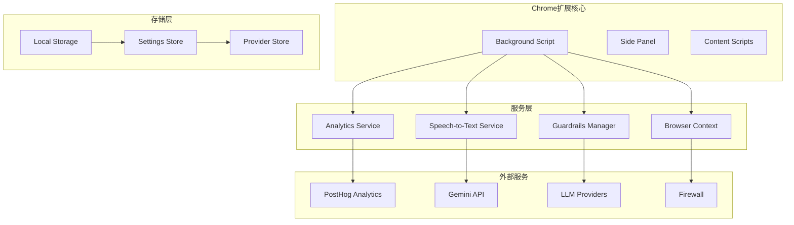

**图表来源**
- [index.ts](file://chrome-extension/src/background/index.ts#L1-L50)
- [analytics.ts](file://chrome-extension/src/background/services/analytics.ts#L1-L30)
- [speechToText.ts](file://chrome-extension/src/background/services/speechToText.ts#L1-L20)

## 分析服务（Analytics）

分析服务基于PostHog平台，为用户提供匿名的使用数据分析功能，帮助改进扩展体验。

### 核心功能特性

| 功能模块 | 描述 | 数据类型 | 安全措施 |
|---------|------|----------|----------|
| 任务追踪 | 跟踪任务生命周期事件 | 时间戳、持续时间、状态 | 匿名化处理 |
| 错误分类 | 自动错误类型识别 | 错误类别、堆栈信息 | 敏感数据过滤 |
| 域名访问 | 网站域名统计分析 | 域名字符串、访问频率 | URL解析脱敏 |
| 用户行为 | 操作模式分析 | 交互序列、成功率 | 无个人标识符 |

### 事件跟踪流程

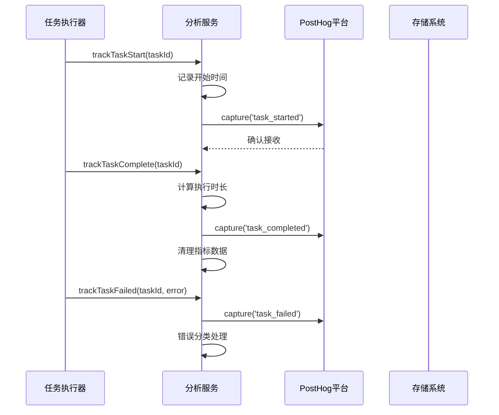

**图表来源**
- [analytics.ts](file://chrome-extension/src/background/services/analytics.ts#L100-L150)

### 配置与隐私保护

分析服务采用严格的隐私保护策略：

- **匿名用户ID**：自动生成唯一标识符，不包含任何个人身份信息
- **数据最小化**：仅收集必要的技术指标和使用统计
- **用户控制**：完全可选的启用/禁用开关
- **本地存储**：所有配置数据保存在浏览器本地存储中

**章节来源**
- [analytics.ts](file://chrome-extension/src/background/services/analytics.ts#L1-L272)
- [analyticsSettings.ts](file://packages/storage/lib/settings/analyticsSettings.ts#L1-L75)
- [AnalyticsSettings.tsx](file://pages/options/src/components/AnalyticsSettings.tsx#L1-L163)

## 语音转文本服务（Speech-to-Text）

语音转文本服务利用Google Gemini API实现高质量的音频内容转录功能。

### 技术架构

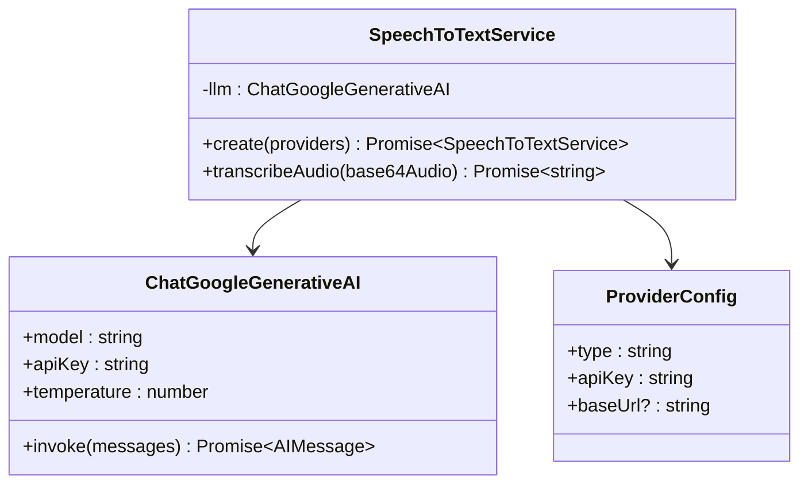

**图表来源**
- [speechToText.ts](file://chrome-extension/src/background/services/speechToText.ts#L10-L50)

### 使用场景与集成

语音转文本服务主要用于以下场景：

1. **语音命令处理**：将用户的语音输入转换为文本指令
2. **音频内容分析**：分析网页中的音频内容
3. **多模态交互**：支持音频和文本的混合输入

### 音频处理流程

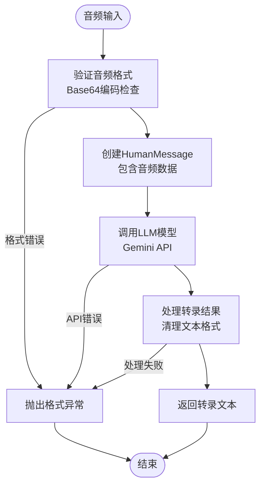

**图表来源**
- [speechToText.ts](file://chrome-extension/src/background/services/speechToText.ts#L40-L77)

**章节来源**
- [speechToText.ts](file://chrome-extension/src/background/services/speechToText.ts#L1-L77)
- [speechToText.ts](file://packages/storage/lib/settings/speechToText.ts#L1-L54)

## LLM提供商配置系统

Nanobrowser支持多种LLM提供商，通过统一的配置管理系统实现灵活的服务切换。

### 支持的提供商类型

| 提供商类型 | API客户端 | 特殊配置 | 用途 |
|-----------|-----------|----------|------|
| OpenAI | ChatOpenAI | API密钥、基础URL | 主要推理任务 |
| Anthropic | ChatAnthropic | API密钥、模型选择 | 高质量对话 |
| Gemini | ChatGoogleGenerativeAI | API密钥、温度参数 | 多模态处理 |
| Azure OpenAI | AzureChatOpenAI | 端点、部署名称 | 企业级部署 |
| Ollama | ChatOllama | 本地服务器地址 | 本地推理 |
| OpenRouter | ChatOpenAI | HTTP Referer头 | 第三方聚合 |

### 配置管理架构

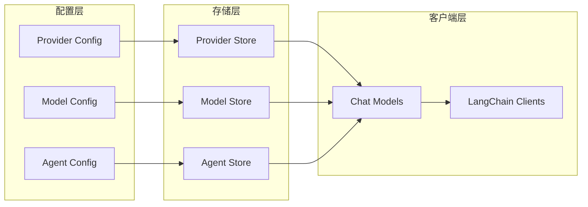

**图表来源**
- [llmProviders.ts](file://packages/storage/lib/settings/llmProviders.ts#L10-L50)
- [helper.ts](file://chrome-extension/src/background/agent/helper.ts#L229-L384)

### 创建聊天模型流程

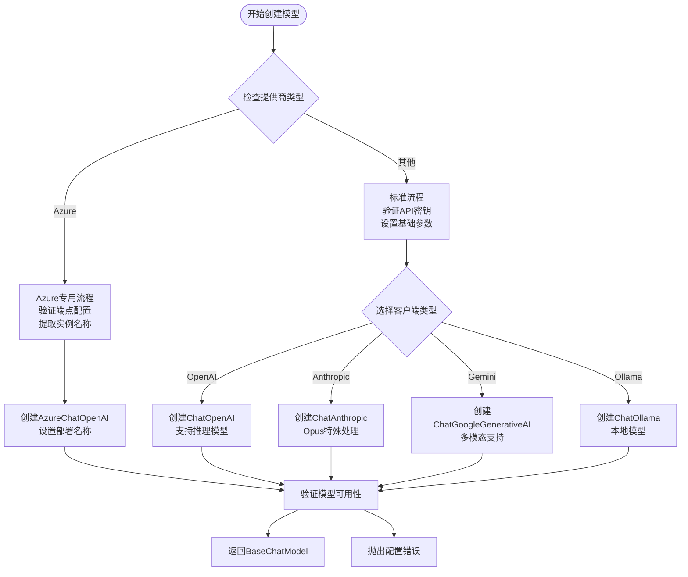

**图表来源**
- [helper.ts](file://chrome-extension/src/background/agent/helper.ts#L229-L384)

**章节来源**
- [llmProviders.ts](file://packages/storage/lib/settings/llmProviders.ts#L1-L317)
- [helper.ts](file://chrome-extension/src/background/agent/helper.ts#L1-L385)

## 防火墙（Firewall）安全机制

防火墙系统通过allowedUrls和deniedUrls配置，严格控制扩展对网络资源的访问权限。

### 防火墙配置结构

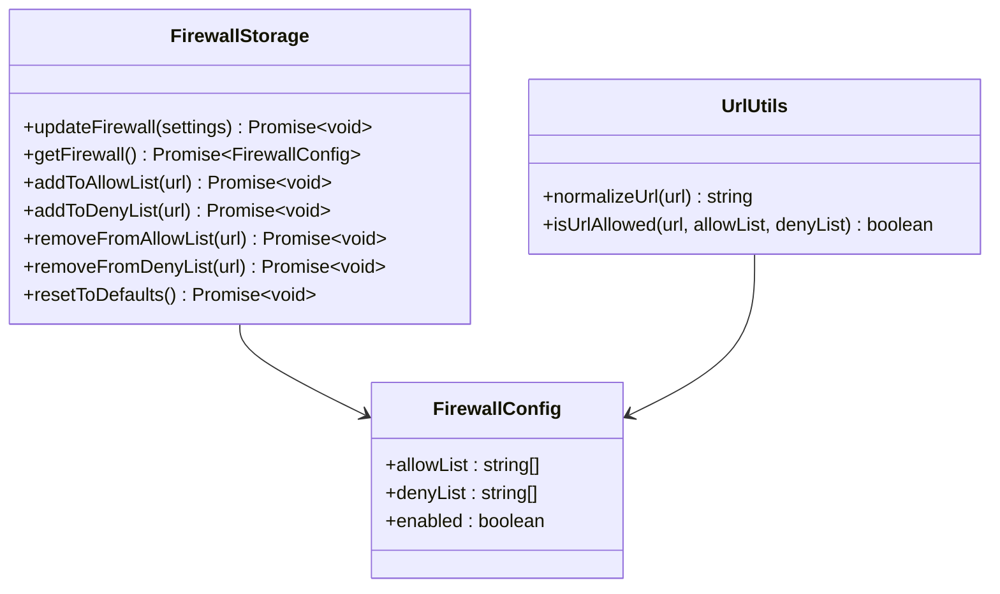

**图表来源**
- [firewall.ts](file://packages/storage/lib/settings/firewall.ts#L5-L30)
- [util.ts](file://chrome-extension/src/background/browser/util.ts#L1-L50)

### URL验证算法

防火墙采用多层次的URL验证策略：

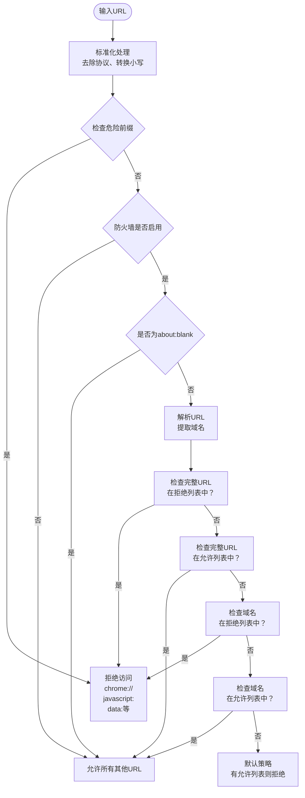

**图表来源**
- [util.ts](file://chrome-extension/src/background/browser/util.ts#L46-L92)

### 安全策略配置

| 配置项 | 默认值 | 描述 | 安全级别 |
|--------|--------|------|----------|
| allowList | [] | 明确允许的URL列表 | 高 |
| denyList | [] | 明确禁止的URL列表 | 高 |
| enabled | true | 防火墙总开关 | 中 |
| 危险前缀检查 | 启用 | 自动阻止恶意URL前缀 | 最高 |

**章节来源**
- [firewall.ts](file://packages/storage/lib/settings/firewall.ts#L1-L105)
- [FirewallSettings.tsx](file://pages/options/src/components/FirewallSettings.tsx#L1-L225)
- [util.ts](file://chrome-extension/src/background/browser/util.ts#L1-L92)

## 服务集成架构

### 整体集成框架

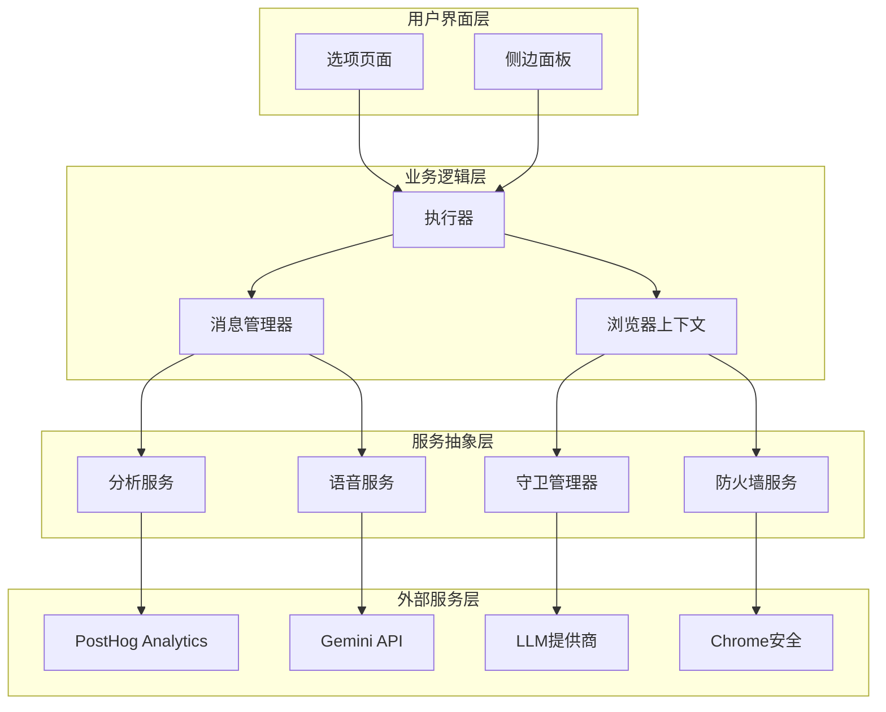

**图表来源**
- [index.ts](file://chrome-extension/src/background/index.ts#L264-L303)

### 服务初始化流程

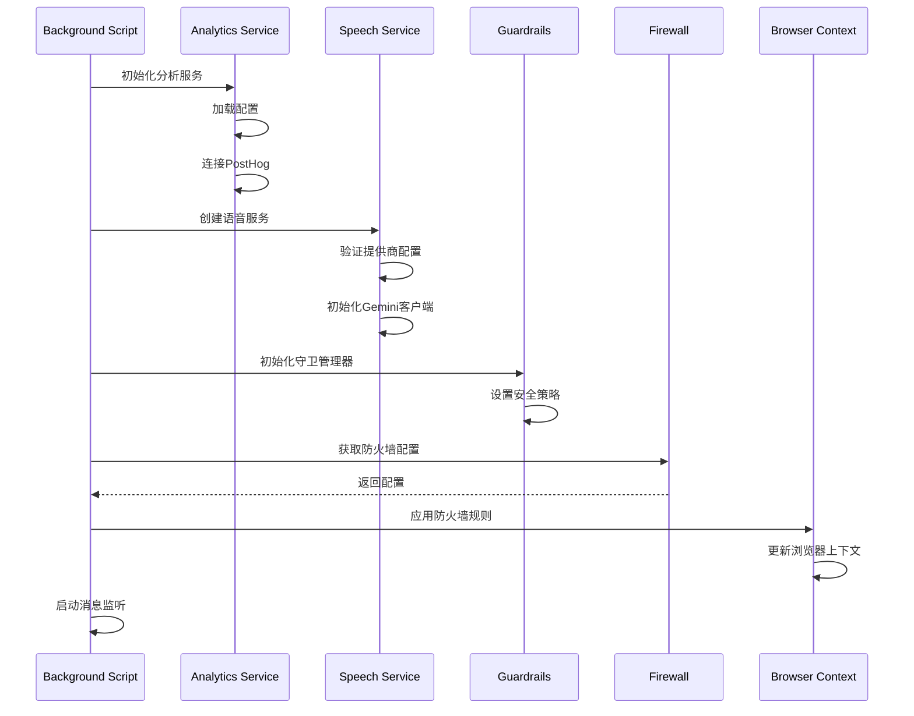

**图表来源**
- [index.ts](file://chrome-extension/src/background/index.ts#L40-L60)

**章节来源**
- [index.ts](file://chrome-extension/src/background/index.ts#L1-L352)
- [service.ts](file://chrome-extension/src/background/agent/messages/service.ts#L1-L441)

## 添加新服务集成指南

### 步骤1：定义服务接口

创建新的服务类，遵循统一的接口规范：

```typescript
// 示例：新服务接口定义
interface NewServiceConfig {
  apiKey: string;
  baseUrl?: string;
  timeout?: number;
}

interface NewServiceResult {
  success: boolean;
  data?: any;
  error?: string;
}
```

### 步骤2：实现服务类

```typescript
// 示例：新服务实现
export class NewService {
  private config: NewServiceConfig;
  
  constructor(config: NewServiceConfig) {
    this.config = config;
  }
  
  async process(data: any): Promise<NewServiceResult> {
    try {
      // 实现具体的服务逻辑
      const response = await this.makeRequest(data);
      return { success: true, data: response };
    } catch (error) {
      return { success: false, error: error.message };
    }
  }
  
  private async makeRequest(data: any): Promise<any> {
    // 实现HTTP请求逻辑
  }
}
```

### 步骤3：集成到主应用

1. **更新背景脚本**：
```typescript
// 在background/index.ts中添加
import { NewService } from './services/newService';

// 在setupExecutor中初始化
const newService = new NewService(serviceConfig);
```

2. **添加配置存储**：
```typescript
// 在storage/settings中添加新服务配置
export interface NewServiceConfig {
  // 配置字段
}
```

### 步骤4：创建用户界面

1. **添加设置组件**：
```typescript
// 在options/components中创建新组件
export const NewServiceSettings: React.FC = () => {
  // 实现设置界面
};
```

2. **注册到主设置页面**：
```typescript
// 在Options.tsx中添加新服务设置
<NewServiceSettings />
```

### 步骤5：测试与验证

1. **单元测试**：
```typescript
// 为新服务编写测试
test('NewService should process data correctly', async () => {
  // 测试逻辑
});
```

2. **集成测试**：
```typescript
// 测试服务集成
test('NewService integrates with background script', async () => {
  // 集成测试逻辑
});
```

### 最佳实践清单

- **错误处理**：实现全面的错误捕获和用户友好的错误消息
- **配置验证**：在服务初始化时验证所有必需的配置参数
- **日志记录**：添加适当的日志记录以便调试和监控
- **性能优化**：考虑异步操作和超时处理
- **安全考虑**：确保敏感数据的安全存储和传输

## 最佳实践与安全考虑

### 数据安全策略

1. **最小权限原则**：只授予服务执行任务所需的最小权限
2. **加密存储**：敏感配置信息使用浏览器提供的安全存储
3. **输入验证**：对所有外部输入进行严格验证和清理
4. **错误信息过滤**：避免向用户暴露内部错误细节

### 性能优化建议

1. **延迟加载**：按需加载非关键服务
2. **缓存机制**：对频繁访问的数据实施缓存
3. **并发控制**：限制同时运行的服务数量
4. **资源清理**：及时释放不再需要的资源

### 可维护性原则

1. **单一职责**：每个服务专注于特定的功能领域
2. **依赖注入**：通过构造函数注入依赖关系
3. **接口抽象**：使用接口而非具体实现
4. **版本兼容**：保持向后兼容的API设计

## 故障排除指南

### 常见问题诊断

| 问题类型 | 症状 | 可能原因 | 解决方案 |
|---------|------|----------|----------|
| 分析服务未工作 | 无数据发送 | API密钥无效或网络问题 | 检查PostHog配置和网络连接 |
| 语音转文本失败 | 音频处理错误 | 音频格式不支持或API限制 | 验证音频格式和API配额 |
| LLM提供商连接失败 | 模型调用超时 | 网络问题或API密钥错误 | 检查网络连接和API密钥 |
| 防火墙阻止访问 | URL被拒绝 | 防火墙规则配置错误 | 检查allow/deny列表配置 |

### 调试工具

1. **浏览器开发者工具**：查看网络请求和控制台错误
2. **扩展程序管理**：检查权限和后台脚本状态
3. **存储检查**：验证配置数据的正确性
4. **日志分析**：查看详细的错误日志和调试信息

### 性能监控

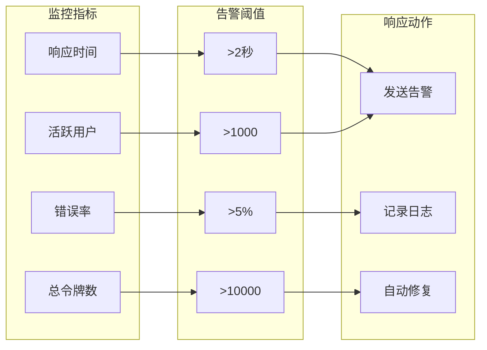

通过遵循本文档的指导原则和最佳实践，开发者可以有效地集成和维护各种外部服务，确保Nanobrowser扩展的安全性、可靠性和高性能。