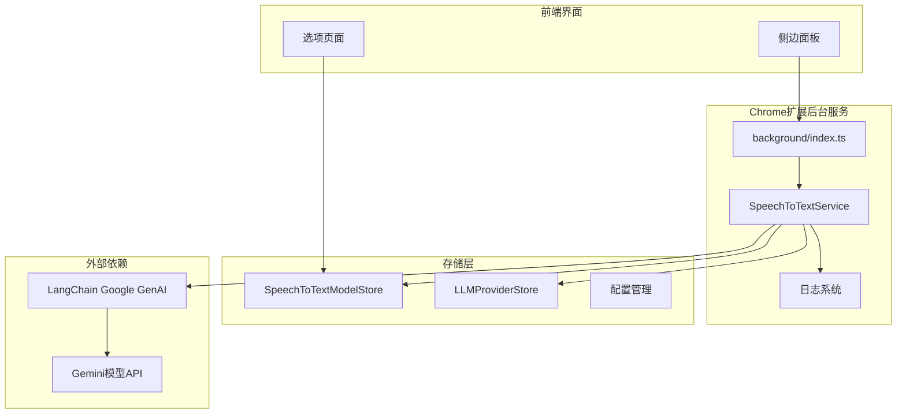
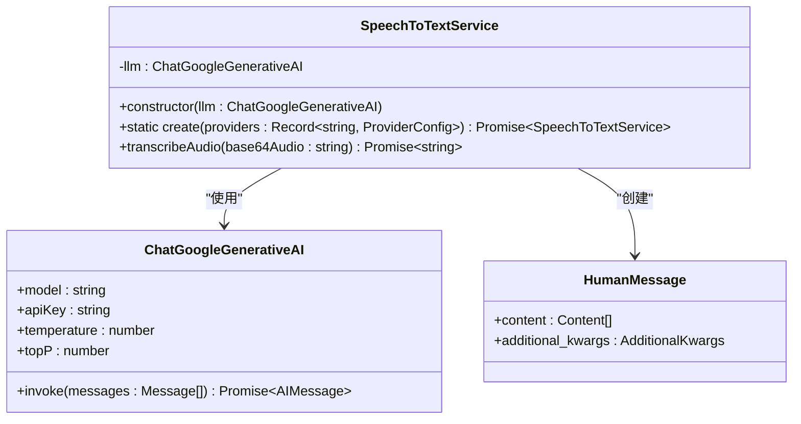
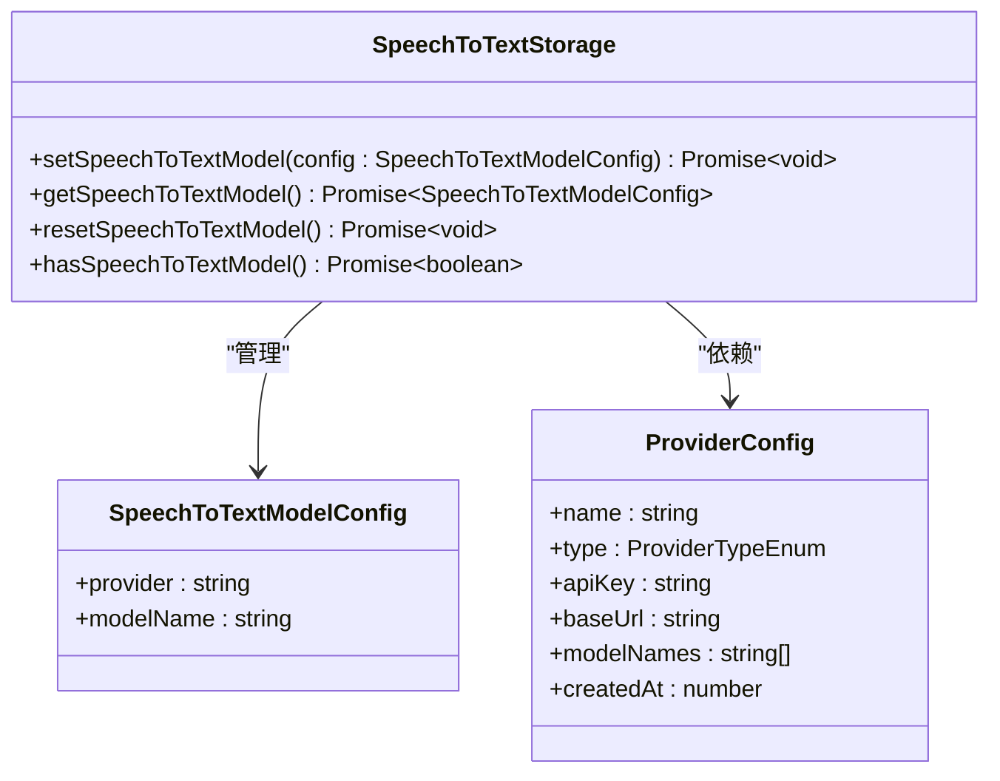
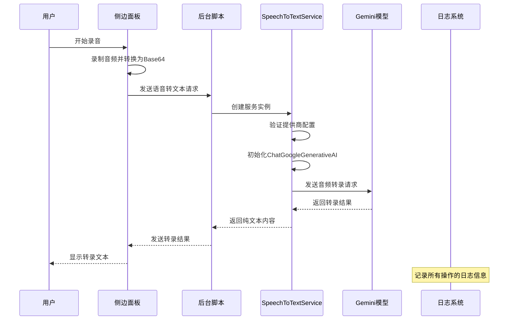
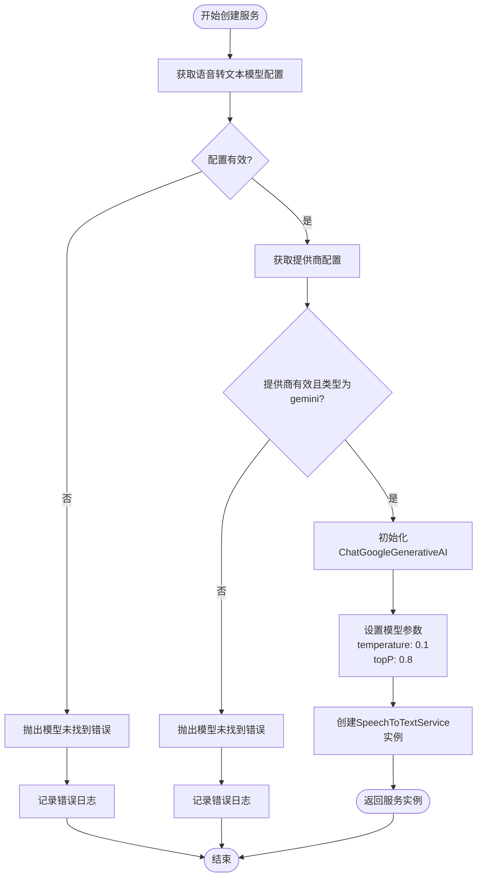
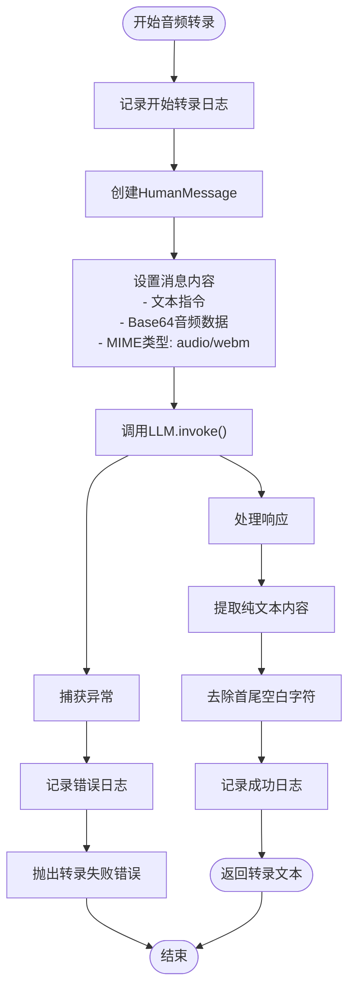
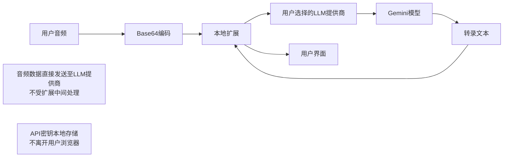
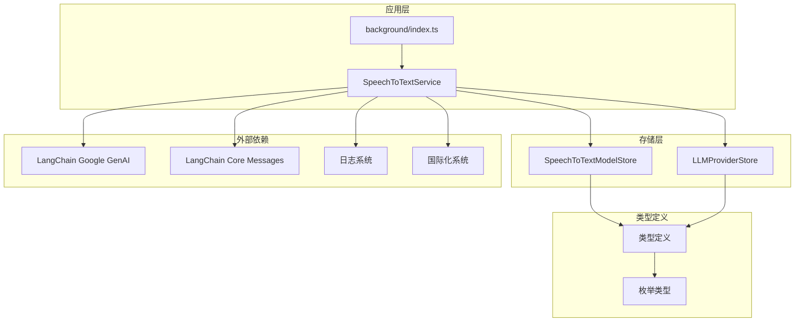

# 语音转文本服务深度文档

<cite>
**本文档中引用的文件**
- [speechToText.ts](file://chrome-extension/src/background/services/speechToText.ts)
- [speechToText.ts](file://packages/storage/lib/settings/speechToText.ts)
- [llmProviders.ts](file://packages/storage/lib/settings/llmProviders.ts)
- [types.ts](file://packages/storage/lib/settings/types.ts)
- [index.ts](file://chrome-extension/src/background/index.ts)
- [PRIVACY.md](file://PRIVACY.md)
- [ModelSettings.tsx](file://pages/options/src/components/ModelSettings.tsx)
- [SidePanel.tsx](file://pages/side-panel/src/SidePanel.tsx)
</cite>

## 目录
1. [简介](#简介)
2. [项目结构](#项目结构)
3. [核心组件](#核心组件)
4. [架构概览](#架构概览)
5. [详细组件分析](#详细组件分析)
6. [依赖关系分析](#依赖关系分析)
7. [性能考虑](#性能考虑)
8. [故障排除指南](#故障排除指南)
9. [结论](#结论)

## 简介

语音转文本服务（SpeechToTextService）是NanoBrowser Chrome扩展中的一个关键组件，专门负责将用户的音频输入转换为可编辑的文本内容。该服务基于Google的Gemini模型（ChatGoogleGenerativeAI），提供了高质量的语音识别功能，支持多种音频格式和语言。

该服务采用模块化设计，通过静态工厂方法实现依赖注入，确保了良好的可测试性和可维护性。服务的核心特性包括：
- 基于Gemini模型的高精度语音转录
- 完整的错误处理机制
- 音频数据的安全传输
- 用户配置驱动的模型选择

## 项目结构

语音转文本服务在项目中的组织结构体现了清晰的分层架构：

**图表来源**
- [speechToText.ts](file://chrome-extension/src/background/services/speechToText.ts#L1-L77)
- [index.ts](file://chrome-extension/src/background/index.ts#L1-L50)

**章节来源**
- [speechToText.ts](file://chrome-extension/src/background/services/speechToText.ts#L1-L77)
- [index.ts](file://chrome-extension/src/background/index.ts#L1-L352)

## 核心组件

### SpeechToTextService 类

SpeechToTextService 是整个语音转文本功能的核心类，实现了单例模式和工厂方法模式的结合：

**图表来源**
- [speechToText.ts](file://chrome-extension/src/background/services/speechToText.ts#L8-L77)

### 存储配置系统

语音转文本服务依赖于专门的存储配置系统来管理模型和提供商信息：

**图表来源**
- [speechToText.ts](file://packages/storage/lib/settings/speechToText.ts#L4-L12)
- [llmProviders.ts](file://packages/storage/lib/settings/llmProviders.ts#L8-L18)

**章节来源**
- [speechToText.ts](file://chrome-extension/src/background/services/speechToText.ts#L8-L77)
- [speechToText.ts](file://packages/storage/lib/settings/speechToText.ts#L1-L54)

## 架构概览

语音转文本服务采用了事件驱动的异步架构，通过消息传递机制实现前后端通信：

**图表来源**
- [index.ts](file://chrome-extension/src/background/index.ts#L163-L221)
- [SidePanel.tsx](file://pages/side-panel/src/SidePanel.tsx#L937-L979)

## 详细组件分析

### 静态工厂方法 create()

create() 方法是服务初始化的核心入口点，实现了严格的配置验证和错误处理：

**图表来源**
- [speechToText.ts](file://chrome-extension/src/background/services/speechToText.ts#L14-L42)

该方法的关键特性包括：

1. **配置验证**：严格检查模型名称和提供商ID的有效性
2. **提供商类型检查**：确保只接受Gemini类型的提供商
3. **参数优化**：为语音转录任务设置了合适的模型参数
4. **错误处理**：提供详细的错误信息和日志记录

**章节来源**
- [speechToText.ts](file://chrome-extension/src/background/services/speechToText.ts#L14-L42)

### transcribeAudio 方法

transcribeAudio 方法负责执行实际的音频转录操作，采用了LangChain的消息格式标准：

**图表来源**
- [speechToText.ts](file://chrome-extension/src/background/services/speechToText.ts#L44-L75)

该方法的设计原则：

1. **纯文本输出**：确保只返回可编辑的文本内容，不包含任何格式化或解释
2. **错误隔离**：将转录过程中的错误与外部调用者隔离
3. **日志记录**：提供完整的操作跟踪和调试信息

**章节来源**
- [speechToText.ts](file://chrome-extension/src/background/services/speechToText.ts#L44-L75)

### 错误处理机制

语音转文本服务实现了多层次的错误处理策略：

| 错误类型 | 处理策略 | 返回信息 |
|---------|---------|---------|
| 配置缺失 | 抛出明确的模型未找到错误 | `chat_stt_model_notFound` |
| 提供商无效 | 抛出相同的模型未找到错误 | `chat_stt_model_notFound` |
| API调用失败 | 记录详细错误并重新抛出 | 具体的API错误信息 |
| 音频数据无效 | 返回处理失败错误 | `Speech transcription failed` |

**章节来源**
- [speechToText.ts](file://chrome-extension/src/background/services/speechToText.ts#L14-L75)

### 数据流和隐私保护

根据PRIVACY.md文档，语音转文本服务的数据处理遵循以下原则：

**图表来源**
- [PRIVACY.md](file://PRIVACY.md#L35-L40)

**章节来源**
- [PRIVACY.md](file://PRIVACY.md#L35-L40)

## 依赖关系分析

语音转文本服务的依赖关系体现了清晰的分层架构：

**图表来源**
- [speechToText.ts](file://chrome-extension/src/background/services/speechToText.ts#L1-L7)
- [index.ts](file://chrome-extension/src/background/index.ts#L1-L20)

**章节来源**
- [speechToText.ts](file://chrome-extension/src/background/services/speechToText.ts#L1-L7)
- [llmProviders.ts](file://packages/storage/lib/settings/llmProviders.ts#L1-L50)

## 性能考虑

语音转文本服务在设计时充分考虑了性能优化：

### 模型参数优化
- **temperature: 0.1** - 保持输出的一致性和准确性
- **topP: 0.8** - 平衡多样性和质量

### 异步处理
- 所有I/O操作都采用异步模式
- 避免阻塞主线程
- 支持并发请求处理

### 内存管理
- 及时释放音频数据
- 最小化内存占用
- 避免内存泄漏

## 故障排除指南

### 常见问题及解决方案

| 问题 | 可能原因 | 解决方案 |
|-----|---------|---------|
| 模型未找到错误 | 配置缺失或无效 | 检查语音转文本模型设置 |
| 提供商类型错误 | 非Gemini提供商 | 确保选择Gemini模型 |
| API调用失败 | 网络问题或配额限制 | 检查网络连接和API配额 |
| 音频格式不支持 | 不兼容的音频格式 | 使用WebM格式的音频 |

### 调试技巧

1. **启用详细日志**：查看后台脚本的控制台输出
2. **检查配置**：确认语音转文本模型和提供商配置正确
3. **网络监控**：观察网络请求状态和响应时间
4. **错误码分析**：根据具体的错误信息定位问题

**章节来源**
- [speechToText.ts](file://chrome-extension/src/background/services/speechToText.ts#L14-L75)
- [index.ts](file://chrome-extension/src/background/index.ts#L163-L221)

## 结论

语音转文本服务（SpeechToTextService）是NanoBrowser扩展中的一个精心设计的组件，它成功地将复杂的语音识别功能封装在一个简洁、可靠的接口后面。通过基于Gemini模型的实现，该服务提供了高质量的语音转录能力，同时保持了良好的用户体验和数据安全性。

### 主要优势

1. **技术先进性**：采用最新的AI模型技术
2. **架构清晰**：模块化设计便于维护和扩展
3. **安全可靠**：严格的配置验证和错误处理
4. **用户友好**：直观的配置界面和反馈机制

### 未来发展方向

- 支持更多语音识别模型
- 增强多语言支持
- 优化移动端性能
- 扩展音频格式支持

该服务为NanoBrowser扩展提供了强大的语音交互能力，是现代AI浏览器扩展的重要组成部分。