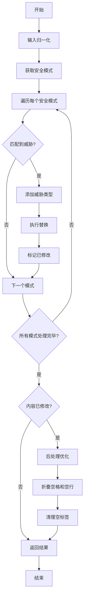
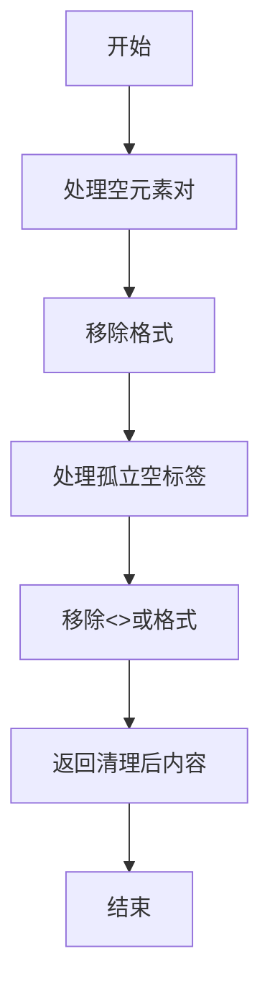
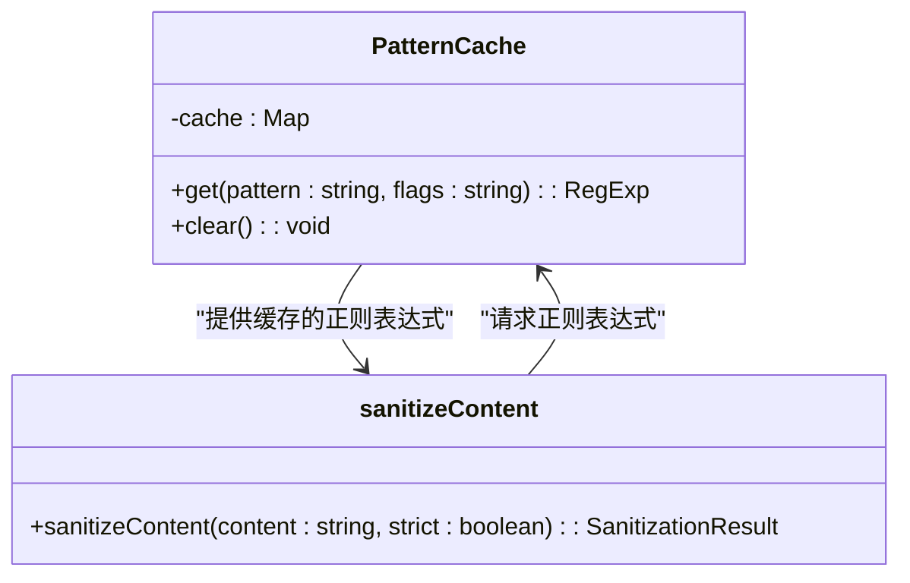
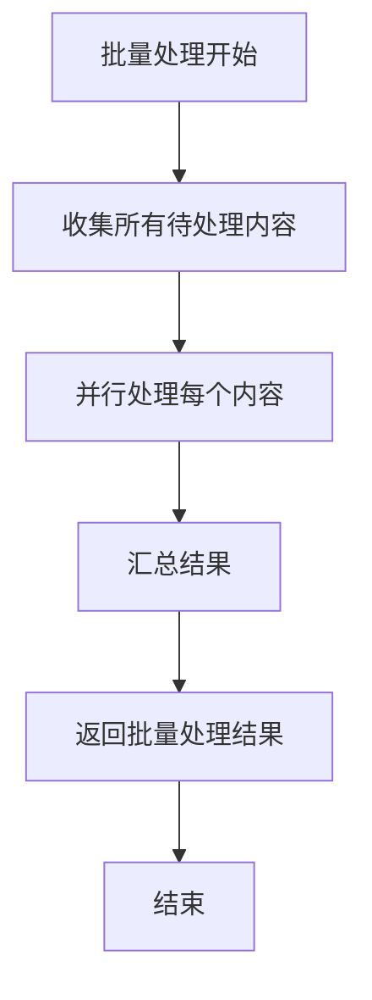

# 内容清理与净化流程

<cite>
**本文档中引用的文件**   
- [sanitizer.ts](file://chrome-extension/src/background/services/guardrails/sanitizer.ts)
- [patterns.ts](file://chrome-extension/src/background/services/guardrails/patterns.ts)
- [types.ts](file://chrome-extension/src/background/services/guardrails/types.ts)
- [index.ts](file://chrome-extension/src/background/services/guardrails/index.ts)
</cite>

## 目录
1. [简介](#简介)
2. [核心清理流程](#核心清理流程)
3. [威胁检测与内容修改的分离设计](#威胁检测与内容修改的分离设计)
4. [cleanEmptyTags辅助函数分析](#cleanemptytags辅助函数分析)
5. [性能考量与优化建议](#性能考量与优化建议)
6. [结论](#结论)

## 简介
本文档深入剖析sanitizeContent函数的完整执行流程，从输入归一化到多模式扫描，再到后处理优化的全过程。重点解释清理过程如何在移除恶意内容的同时尽量保持原始语义的完整性，并详细说明威胁检测与内容修改的分离设计。

**Section sources**
- [sanitizer.ts](file://chrome-extension/src/background/services/guardrails/sanitizer.ts#L0-L128)
- [index.ts](file://chrome-extension/src/background/services/guardrails/index.ts#L0-L176)

## 核心清理流程

sanitizeContent函数的执行流程可分为三个主要阶段：输入归一化、多模式扫描和后处理优化。

### 输入归一化阶段
在处理内容之前，函数首先对输入进行归一化处理。这包括使用NFKC（兼容性完全分解后组合）标准化来统一字符表示，并移除潜在的零宽度字符（如\u200B-\u200D\uFEFF），这些字符可能被用于绕过安全检查。

### 多模式扫描阶段
函数根据严格模式配置获取相应的安全模式集。在非严格模式下，仅应用核心安全模式；在严格模式下，还会包含额外的严格模式。每个安全模式都包含正则表达式、威胁类型、描述和替换值。函数遍历所有模式，对内容进行逐个匹配和替换。

### 后处理优化阶段
当内容被修改后，函数会进行后处理优化，包括：
- 将多个空格或制表符折叠为单个空格
- 将三个或更多的连续空行减少为两个
- 移除清理后可能残留的空标签



**Diagram sources **
- [sanitizer.ts](file://chrome-extension/src/background/services/guardrails/sanitizer.ts#L0-L128)

**Section sources**
- [sanitizer.ts](file://chrome-extension/src/background/services/guardrails/sanitizer.ts#L0-L128)
- [patterns.ts](file://chrome-extension/src/background/services/guardrails/patterns.ts#L0-L158)

## 威胁检测与内容修改的分离设计

系统采用威胁检测与内容修改分离的设计模式，通过两个独立的函数实现：sanitizeContent和detectThreats。

### 功能分离优势
这种设计提供了几个关键优势：
- **灵活性**：可以在不修改内容的情况下验证其安全性
- **性能优化**：避免不必要的内容修改操作
- **可测试性**：可以独立测试威胁检测逻辑

### 实现机制
两个函数共享相同的安全模式集，但用途不同：
- sanitizeContent函数在检测到威胁时执行替换操作
- detectThreats函数仅记录检测到的威胁类型，不修改原始内容

```mermaid
classDiagram
class sanitizeContent {
+sanitizeContent(content : string, strict : boolean) : SanitizationResult
+输入归一化()
+应用安全模式()
+执行替换()
+后处理优化()
}
class detectThreats {
+detectThreats(content : string, strict : boolean) : ThreatType[]
+输入归一化()
+应用安全模式()
+记录威胁()
}
class SecurityGuardrails {
+sanitize(content : string, options : {strict? : boolean}) : SanitizationResult
+detectThreats(content : string, options : {strict? : boolean}) : ThreatType[]
+validate(content : string, options : {strict? : boolean}) : ValidationResult
}
sanitizeContent --> SecurityGuardrails : "被调用"
detectThreats --> SecurityGuardrails : "被调用"
SecurityGuardrails --> sanitizeContent : "调用"
SecurityGuardrails --> detectThreats : "调用"
```

**Diagram sources **
- [sanitizer.ts](file://chrome-extension/src/background/services/guardrails/sanitizer.ts#L0-L128)
- [index.ts](file://chrome-extension/src/background/services/guardrails/index.ts#L0-L176)

**Section sources**
- [sanitizer.ts](file://chrome-extension/src/background/services/guardrails/sanitizer.ts#L0-L128)
- [index.ts](file://chrome-extension/src/background/services/guardrails/index.ts#L0-L176)

## cleanEmptyTags辅助函数分析

cleanEmptyTags函数专门处理清理后可能残留的空标签问题，确保输出内容的整洁性。

### 处理逻辑
该函数通过两个正则表达式模式来识别和移除不同类型的空标签：
1. **空元素对模式**：匹配像<tag></tag>这样的空元素对
2. **孤立空标签模式**：匹配像<>或</>这样的孤立空标签

### 实现细节
函数首先处理空元素对，然后处理孤立空标签，确保所有类型的空标签都被彻底清除。这种分步处理方式提高了效率，避免了复杂的正则表达式。



**Diagram sources **
- [sanitizer.ts](file://chrome-extension/src/background/services/guardrails/sanitizer.ts#L74-L127)

**Section sources**
- [sanitizer.ts](file://chrome-extension/src/background/services/guardrails/sanitizer.ts#L74-L127)

## 性能考量与优化建议

### 当前性能考量
系统在设计时已考虑了多项性能优化：
- **正则表达式实例化策略**：每次使用时创建新的正则表达式实例，避免状态污染
- **错误恢复机制**：单个模式处理失败不会中断整个清理过程
- **模式分组**：将模式分为核心模式和严格模式，按需加载

### 性能优化建议
#### 模式编译缓存
建议实现模式编译缓存机制，避免重复编译相同的正则表达式：



**Diagram sources **
- [sanitizer.ts](file://chrome-extension/src/background/services/guardrails/sanitizer.ts#L0-L128)

#### 批量处理策略
对于需要处理大量内容的场景，建议实现批量处理策略：



**Diagram sources **
- [sanitizer.ts](file://chrome-extension/src/background/services/guardrails/sanitizer.ts#L0-L128)

**Section sources**
- [sanitizer.ts](file://chrome-extension/src/background/services/guardrails/sanitizer.ts#L0-L128)
- [patterns.ts](file://chrome-extension/src/background/services/guardrails/patterns.ts#L0-L158)

## 结论
sanitizeContent函数通过精心设计的三阶段流程，有效地清理了潜在的恶意内容。其威胁检测与内容修改的分离设计提供了极大的灵活性，而cleanEmptyTags辅助函数确保了输出内容的整洁性。尽管当前实现已考虑了多项性能优化，但通过引入模式编译缓存和批量处理策略，仍有进一步提升性能的空间。