# 动态安全控制机制

<cite>
**本文档中引用的文件**  
- [index.ts](file://chrome-extension/src/background/services/guardrails/index.ts)
- [types.ts](file://chrome-extension/src/background/services/guardrails/types.ts)
- [sanitizer.ts](file://chrome-extension/src/background/services/guardrails/sanitizer.ts)
- [FirewallSettings.tsx](file://pages/options/src/components/FirewallSettings.tsx)
- [firewall.ts](file://packages/storage/lib/settings/firewall.ts)
</cite>

## 目录
1. [引言](#引言)
2. [核心组件](#核心组件)
3. [架构概述](#架构概述)
4. [详细组件分析](#详细组件分析)
5. [依赖分析](#依赖分析)
6. [性能考虑](#性能考虑)
7. [故障排除指南](#故障排除指南)
8. [结论](#结论)

## 引言
本项目实现了一套动态安全控制机制，通过 `setEnabled` 和 `setStrictMode` 方法提供运行时安全策略的灵活调整。该机制允许系统在不同安全级别之间动态切换，以适应不同的使用场景和风险需求。防护系统通过内容净化、威胁检测和验证等功能，确保用户交互的安全性。动态控制功能使得在调试模式下可以临时禁用防护，或在高风险操作时启用严格模式，从而在安全性和可用性之间取得平衡。

## 核心组件
`SecurityGuardrails` 类是安全控制的核心组件，负责管理防护系统的启用状态和严格模式。它提供了 `setEnabled` 和 `setStrictMode` 方法来动态调整运行时安全策略。当防护系统被禁用时，所有内容将被直接通过而不进行任何检查。在严格模式下，任何检测到的威胁都会导致内容被标记为无效。该组件还实现了日志记录功能，在状态切换时记录相应的操作信息。

**Section sources**
- [index.ts](file://chrome-extension/src/background/services/guardrails/index.ts#L0-L176)

## 架构概述
系统架构采用分层设计，将安全控制逻辑与用户界面分离。`SecurityGuardrails` 服务位于后台进程中，负责执行实际的安全检查和内容净化。用户界面通过存储接口与安全设置进行交互，实现了配置的持久化和实时更新。这种设计确保了安全策略的集中管理和一致性。


**Diagram sources**
- [FirewallSettings.tsx](file://pages/options/src/components/FirewallSettings.tsx#L0-L224)
- [firewall.ts](file://packages/storage/lib/settings/firewall.ts#L0-L104)
- [index.ts](file://chrome-extension/src/background/services/guardrails/index.ts#L0-L176)

## 详细组件分析

### 安全控制组件分析
`SecurityGuardrails` 类实现了两个关键方法：`setEnabled` 和 `setStrictMode`，用于动态调整安全策略。这些方法直接影响防护系统的整体行为，包括状态切换时的日志记录和副作用。

#### 对象导向组件
```mermaid
classDiagram
class SecurityGuardrails {
-strictMode : boolean
-enabled : boolean
+setEnabled(enabled : boolean) : void
+setStrictMode(strict : boolean) : void
+sanitize(content : string, options? : {strict? : boolean}) : SanitizationResult
+detectThreats(content : string, options? : {strict? : boolean}) : ThreatType[]
+validate(content : string, options? : {strict? : boolean}) : ValidationResult
+sanitizeStrict(content : string | undefined) : SanitizationResult
+detectThreatsStrict(content : string) : ThreatType[]
+validateStrict(content : string) : ValidationResult
}
class ThreatType {
+TASK_OVERRIDE : 'task_override'
+PROMPT_INJECTION : 'prompt_injection'
+SENSITIVE_DATA : 'sensitive_data'
+DANGEROUS_ACTION : 'dangerous_action'
}
SecurityGuardrails --> ThreatType : "使用"
```

**Diagram sources**
- [index.ts](file://chrome-extension/src/background/services/guardrails/index.ts#L0-L176)
- [types.ts](file://chrome-extension/src/background/services/guardrails/types.ts#L0-L43)

#### API/服务组件


**Diagram sources**
- [index.ts](file://chrome-extension/src/background/services/guardrails/index.ts#L123-L135)
- [FirewallSettings.tsx](file://pages/options/src/components/FirewallSettings.tsx#L0-L224)

#### 复杂逻辑组件

```mermaid
flowchart TD
Start([开始]) --> CheckEnabled["检查防护系统是否启用"]
CheckEnabled --> |已启用| CheckStrictMode["检查是否为严格模式"]
CheckEnabled --> |已禁用| ReturnSafe["返回安全结果"]
CheckStrictMode --> |严格模式| AnyThreats["任何威胁都视为无效"]
CheckStrictMode --> |普通模式| CriticalThreats["仅关键威胁视为无效"]
AnyThreats --> ReturnInvalid["返回无效结果"]
CriticalThreats --> FilterCritical["过滤关键威胁"]
FilterCritical --> |存在关键威胁| ReturnInvalid
FilterCritical --> |无关键威胁| ReturnValid["返回有效结果"]
ReturnSafe --> End([结束])
ReturnInvalid --> End
ReturnValid --> End
```


**Diagram sources**
- [index.ts](file://chrome-extension/src/background/services/guardrails/index.ts#L46-L85)
- [sanitizer.ts](file://chrome-extension/src/background/services/guardrails/sanitizer.ts#L0-L128)

**Section sources**
- [index.ts](file://chrome-extension/src/background/services/guardrails/index.ts#L0-L176)
- [sanitizer.ts](file://chrome-extension/src/background/services/guardrails/sanitizer.ts#L0-L128)

### 动态控制价值分析
动态控制机制在实际使用场景中具有重要价值。在调试模式下，开发者可以临时禁用防护以测试特定功能，这有助于快速定位和解决问题。在高风险操作时，系统可以自动启用严格模式，加强对敏感数据和危险操作的检测。这种灵活性使得系统能够在保证安全性的同时，不影响正常的开发和使用流程。

## 依赖分析
系统各组件之间存在明确的依赖关系。`SecurityGuardrails` 服务依赖于日志服务进行操作记录，同时依赖于模式定义和净化逻辑来执行安全检查。用户界面组件通过存储接口间接依赖于安全控制服务，实现了配置的持久化和跨会话保持。这种依赖结构确保了系统的模块化和可维护性。


**Diagram sources**
- [FirewallSettings.tsx](file://pages/options/src/components/FirewallSettings.tsx#L0-L224)
- [firewall.ts](file://packages/storage/lib/settings/firewall.ts#L0-L104)
- [index.ts](file://chrome-extension/src/background/services/guardrails/index.ts#L0-L176)

**Section sources**
- [firewall.ts](file://packages/storage/lib/settings/firewall.ts#L0-L104)
- [index.ts](file://chrome-extension/src/background/services/guardrails/index.ts#L0-L176)

## 性能考虑
动态安全控制机制对系统性能的影响主要体现在内容净化和威胁检测过程中。由于这些操作需要对输入内容进行正则表达式匹配和字符串处理，可能会引入一定的延迟。然而，通过合理的缓存策略和高效的算法实现，可以将性能影响降到最低。在非严格模式下，系统仅检测关键威胁，进一步优化了性能表现。

## 故障排除指南
当遇到安全控制相关问题时，首先应检查日志输出以确定当前的安全策略状态。如果防护系统未按预期工作，需要验证 `setEnabled` 和 `setStrictMode` 方法是否被正确调用。对于特定威胁未被检测到的情况，应检查相应的正则表达式模式是否正确配置。此外，还需要确认存储接口是否正常工作，以确保安全设置能够持久化。

**Section sources**
- [index.ts](file://chrome-extension/src/background/services/guardrails/index.ts#L123-L135)
- [firewall.ts](file://packages/storage/lib/settings/firewall.ts#L0-L104)

## 结论
`setEnabled` 和 `setStrictMode` 方法为系统提供了强大的动态安全控制能力。通过这些方法，系统可以在运行时灵活调整安全策略，适应不同的使用场景。这种设计不仅提高了系统的安全性，还增强了其可用性和可维护性。未来可以通过引入更多安全级别和细粒度控制来进一步完善这一机制。