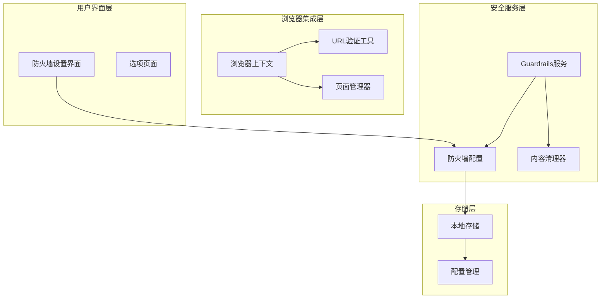
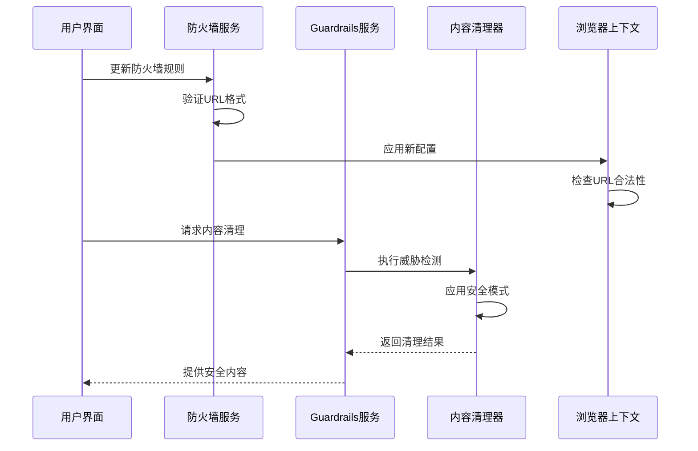
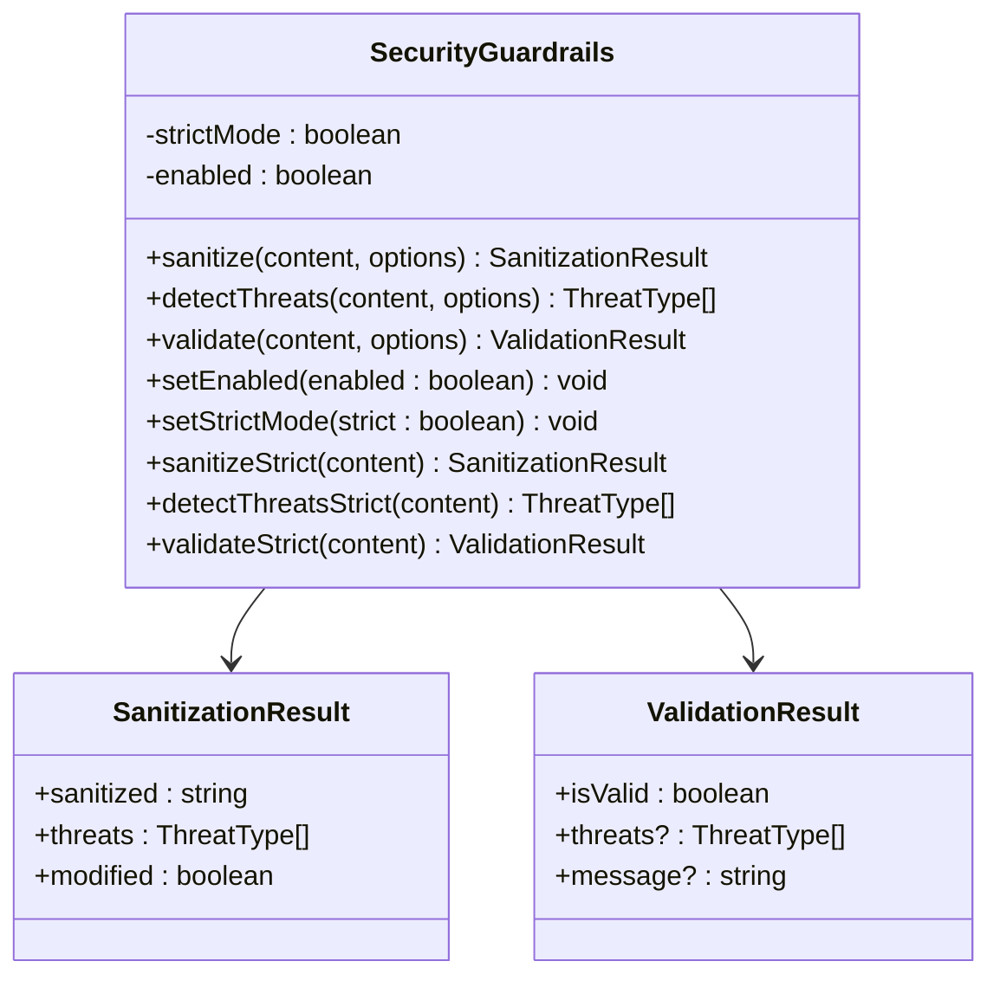
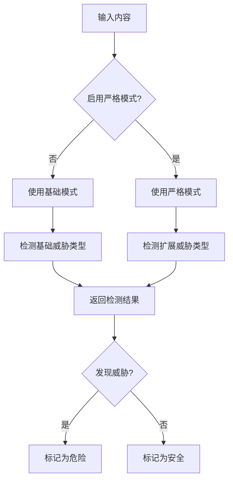
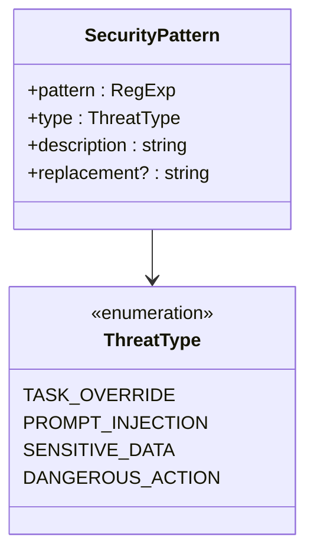
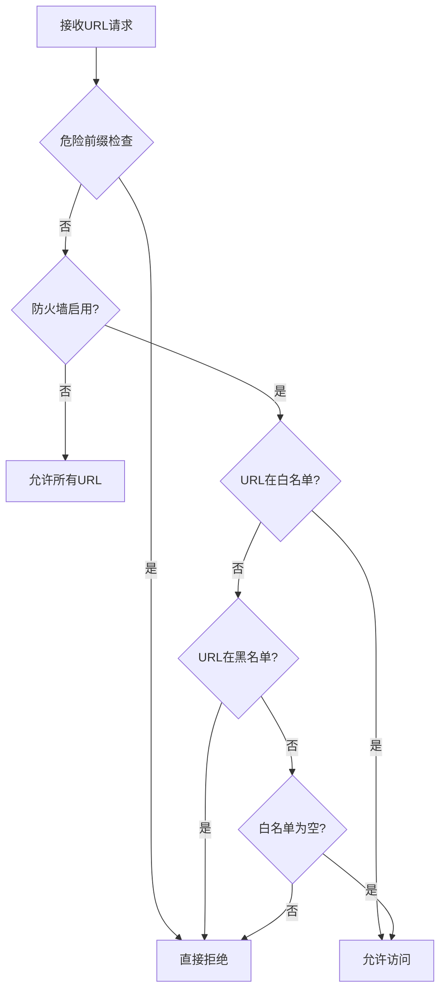
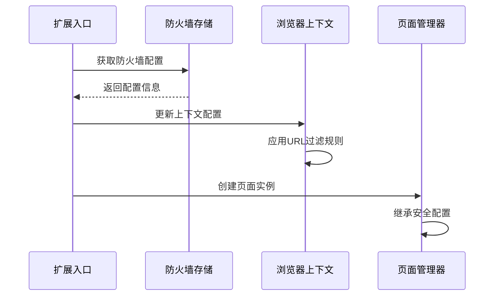
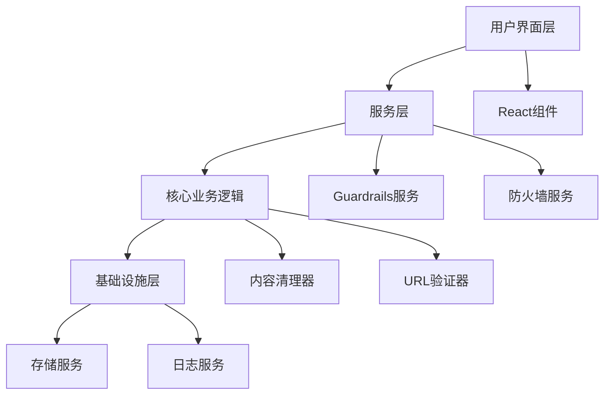

# 安全策略与应用

<cite>
**本文档中引用的文件**
- [index.ts](file://chrome-extension/src/background/services/guardrails/index.ts)
- [types.ts](file://chrome-extension/src/background/services/guardrails/types.ts)
- [sanitizer.ts](file://chrome-extension/src/background/services/guardrails/sanitizer.ts)
- [patterns.ts](file://chrome-extension/src/background/services/guardrails/patterns.ts)
- [firewall.ts](file://packages/storage/lib/settings/firewall.ts)
- [FirewallSettings.tsx](file://pages/options/src/components/FirewallSettings.tsx)
- [util.ts](file://chrome-extension/src/background/browser/util.ts)
- [context.ts](file://chrome-extension/src/background/browser/context.ts)
- [index.ts](file://chrome-extension/src/background/index.ts)
- [guardrails.test.ts](file://chrome-extension/src/background/services/guardrails/__tests__/guardrails.test.ts)
</cite>

## 目录
1. [引言](#引言)
2. [项目结构概览](#项目结构概览)
3. [核心安全组件](#核心安全组件)
4. [架构概览](#架构概览)
5. [详细组件分析](#详细组件分析)
6. [依赖关系分析](#依赖关系分析)
7. [性能考虑](#性能考虑)
8. [故障排除指南](#故障排除指南)
9. [结论](#结论)

## 引言

NanoBrowser是一个基于Chrome扩展的安全智能代理系统，其核心安全架构围绕防火墙机制和内容安全防护展开。该系统通过多层次的安全策略，包括动态防护级别控制、严格模式威胁检测、内容清理机制等，构建了一个完整的纵深防御体系，有效防止恶意网站滥用扩展功能并保护用户隐私数据。

## 项目结构概览

该项目采用模块化架构设计，主要分为以下几个核心模块：

**图表来源**
- [index.ts](file://chrome-extension/src/background/services/guardrails/index.ts#L1-L20)
- [firewall.ts](file://packages/storage/lib/settings/firewall.ts#L1-L30)
- [context.ts](file://chrome-extension/src/background/browser/context.ts#L1-L40)

**章节来源**
- [index.ts](file://chrome-extension/src/background/services/guardrails/index.ts#L1-L50)
- [firewall.ts](file://packages/storage/lib/settings/firewall.ts#L1-L50)

## 核心安全组件

### 防火墙机制

防火墙机制是整个安全架构的基础，提供了基于URL列表的访问控制功能。该机制支持白名单和黑名单两种模式，并具有实时更新能力。

#### 主要特性：
- **双重列表控制**：支持allowList和denyList同时存在
- **实时配置更新**：支持运行时动态修改规则
- **危险URL过滤**：自动阻止恶意协议前缀
- **域名级控制**：支持精确到子域名的规则匹配

### 内容安全防护

内容安全防护系统通过多层检测机制，识别和阻止潜在的威胁内容：

#### 威胁类型分类：
- **任务重写威胁**：检测试图覆盖先前指令的行为
- **提示注入威胁**：识别系统提示注入尝试  
- **敏感数据泄露**：自动识别并脱敏个人信息
- **危险操作威胁**：阻止恶意命令执行

**章节来源**
- [index.ts](file://chrome-extension/src/background/services/guardrails/index.ts#L15-L50)
- [types.ts](file://chrome-extension/src/background/services/guardrails/types.ts#L8-L20)

## 架构概览

整个安全架构采用分层设计，从底层的威胁检测到顶层的用户界面，形成了完整的安全防护链：

**图表来源**
- [FirewallSettings.tsx](file://pages/options/src/components/FirewallSettings.tsx#L30-L60)
- [index.ts](file://chrome-extension/src/background/services/guardrails/index.ts#L25-L50)
- [context.ts](file://chrome-extension/src/background/browser/context.ts#L280-L320)

## 详细组件分析

### Guardrails安全服务

Guardrails服务是内容安全防护的核心组件，提供了灵活的威胁检测和内容清理功能。

#### 动态防护级别控制

**图表来源**
- [index.ts](file://chrome-extension/src/background/services/guardrails/index.ts#L15-L177)
- [types.ts](file://chrome-extension/src/background/services/guardrails/types.ts#L25-L43)

#### setEnabled和setStrictMode方法的作用机制

这两个方法提供了动态的安全策略调整能力：

1. **setEnabled方法**：
   - 控制整个Guardrails服务的启用状态
   - 在禁用状态下，所有安全检查都会跳过
   - 提供快速的安全开关功能

2. **setStrictMode方法**：
   - 调整威胁检测的严格程度
   - 影响敏感数据识别和提示注入检测
   - 支持临时性的严格模式调用

#### 严格模式对威胁检测的影响

严格模式通过启用额外的安全模式来增强检测能力：

**图表来源**
- [patterns.ts](file://chrome-extension/src/background/services/guardrails/patterns.ts#L120-L140)
- [index.ts](file://chrome-extension/src/background/services/guardrails/index.ts#L81-L110)

**章节来源**
- [index.ts](file://chrome-extension/src/background/services/guardrails/index.ts#L110-L177)
- [patterns.ts](file://chrome-extension/src/background/services/guardrails/patterns.ts#L120-L159)

### 内容清理机制

内容清理机制通过正则表达式模式匹配，识别并移除潜在的威胁内容：

#### 安全模式配置

**图表来源**
- [types.ts](file://chrome-extension/src/background/services/guardrails/types.ts#L20-L30)
- [patterns.ts](file://chrome-extension/src/background/services/guardrails/patterns.ts#L10-L50)

#### 默认安全策略设计权衡

系统采用了"默认允许"的安全策略，这种设计在安全性和可用性之间取得了平衡：

1. **默认允许策略的优势**：
   - 提供更好的用户体验
   - 减少误报率
   - 适合大多数正常网站

2. **默认拒绝策略的优势**：
   - 更高的安全性
   - 更严格的威胁防护
   - 适合高安全要求的环境

**章节来源**
- [sanitizer.ts](file://chrome-extension/src/background/services/guardrails/sanitizer.ts#L10-L80)
- [patterns.ts](file://chrome-extension/src/background/services/guardrails/patterns.ts#L10-L120)

### 防火墙配置管理

防火墙配置管理提供了灵活的URL访问控制机制：

#### URL验证流程

**图表来源**
- [util.ts](file://chrome-extension/src/background/browser/util.ts#L10-L85)
- [firewall.ts](file://packages/storage/lib/settings/firewall.ts#L10-L50)

**章节来源**
- [firewall.ts](file://packages/storage/lib/settings/firewall.ts#L1-L105)
- [util.ts](file://chrome-extension/src/background/browser/util.ts#L1-L106)

### 浏览器上下文集成

浏览器上下文通过集成防火墙配置，实现了全局的安全控制：

#### 上下文配置更新

**图表来源**
- [index.ts](file://chrome-extension/src/background/index.ts#L320-L350)
- [context.ts](file://chrome-extension/src/background/browser/context.ts#L25-L50)

**章节来源**
- [index.ts](file://chrome-extension/src/background/index.ts#L320-L352)
- [context.ts](file://chrome-extension/src/background/browser/context.ts#L25-L100)

## 依赖关系分析

系统的依赖关系体现了清晰的分层架构设计：

**图表来源**
- [index.ts](file://chrome-extension/src/background/services/guardrails/index.ts#L1-L10)
- [firewall.ts](file://packages/storage/lib/settings/firewall.ts#L1-L10)

**章节来源**
- [index.ts](file://chrome-extension/src/background/services/guardrails/index.ts#L1-L20)
- [firewall.ts](file://packages/storage/lib/settings/firewall.ts#L1-L20)

## 性能考虑

### 内存优化策略

1. **正则表达式缓存**：每次使用新的正则表达式实例，避免状态污染
2. **延迟加载**：仅在需要时初始化安全组件
3. **批量处理**：对多个内容进行批量安全检查

### 计算复杂度分析

- **内容清理**：O(n × m)，其中n是内容长度，m是模式数量
- **URL验证**：O(k)，k是列表长度
- **威胁检测**：O(m)，m是模式数量

## 故障排除指南

### 常见问题诊断

#### 安全检查失效

1. **检查Guardrails状态**：确认setEnabled方法被正确调用
2. **验证严格模式设置**：检查setStrictMode配置
3. **查看日志输出**：使用内置的日志记录功能

#### 防火墙规则不生效

1. **确认配置更新**：检查firewallStore.updateFirewall调用
2. **验证URL格式**：确保URL规范化处理正确
3. **检查列表优先级**：白名单优先于黑名单

**章节来源**
- [guardrails.test.ts](file://chrome-extension/src/background/services/guardrails/__tests__/guardrails.test.ts#L1-L133)

## 结论

NanoBrowser的安全架构通过防火墙机制和Guardrails服务的协同工作，构建了一个完整的内容安全防护体系。该系统的主要优势包括：

1. **多层次防护**：从URL级别的访问控制到内容级别的威胁检测
2. **动态可配置**：支持运行时调整安全策略
3. **灵活的威胁检测**：通过严格模式提供不同级别的安全保护
4. **用户友好**：提供直观的配置界面和清晰的使用指南

该架构为浏览器扩展的安全开发提供了良好的参考范例，特别是在处理恶意网站滥用和保护用户隐私方面展现了出色的设计理念。通过持续的安全审计和策略优化，该系统能够有效应对不断演进的网络威胁。