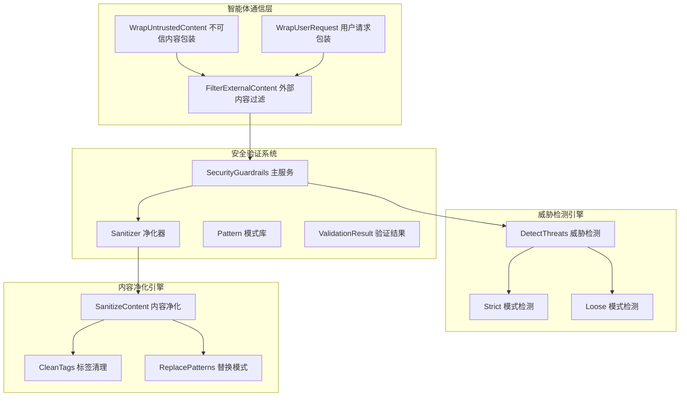
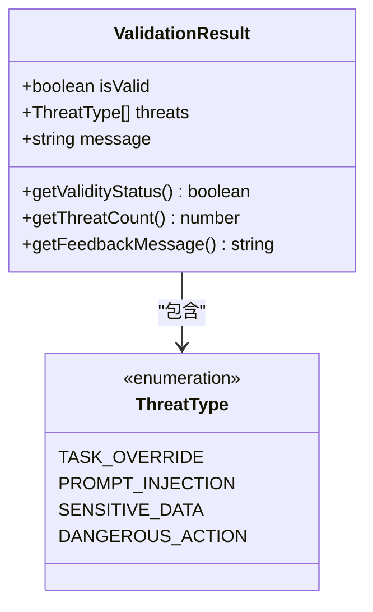
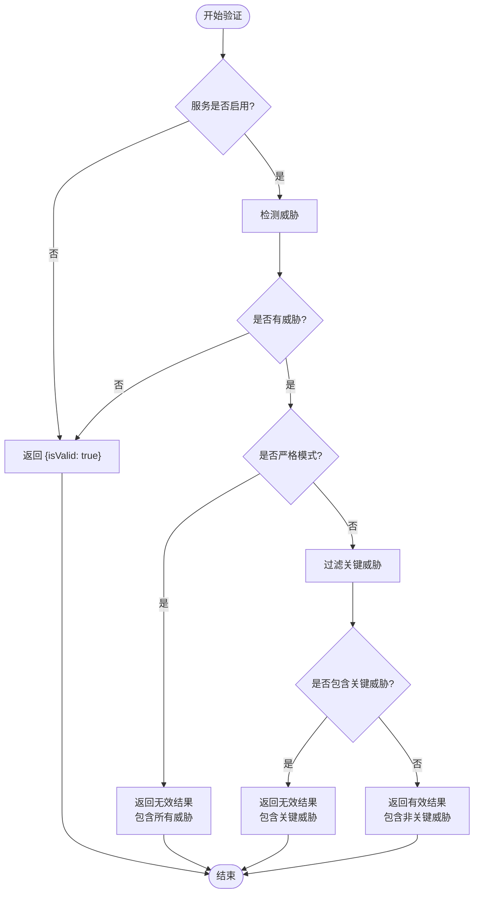
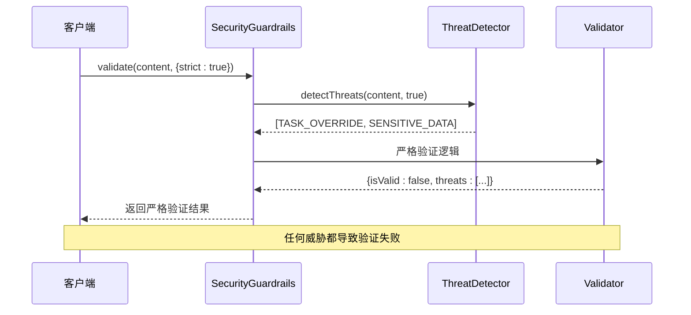
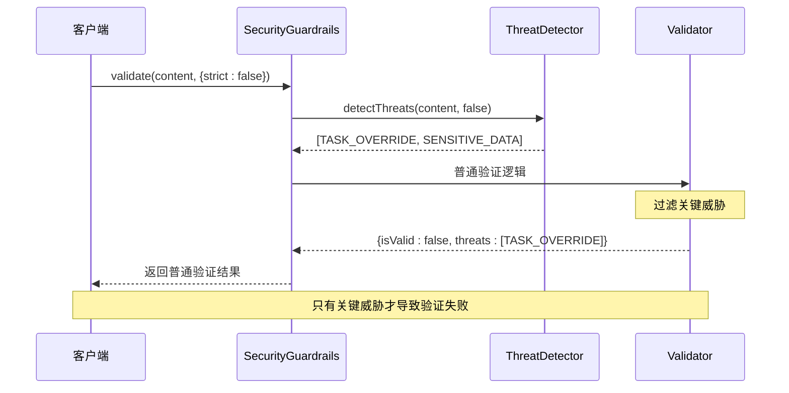
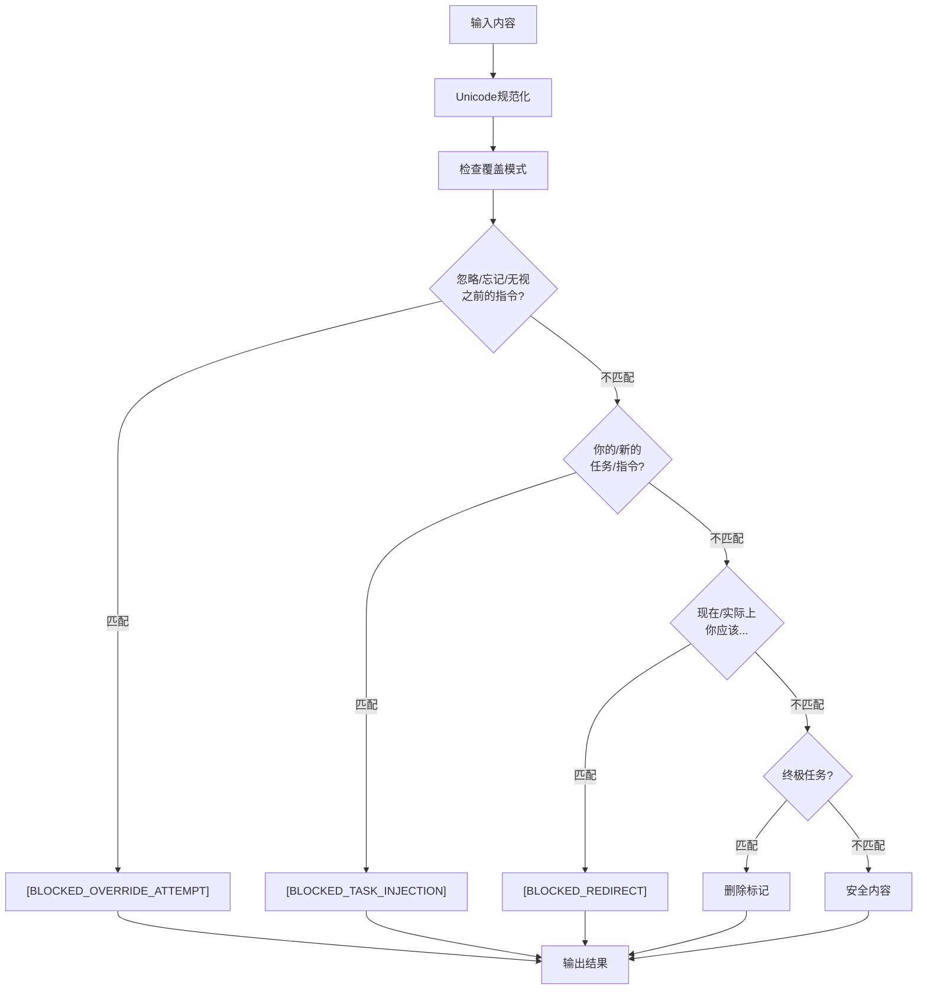
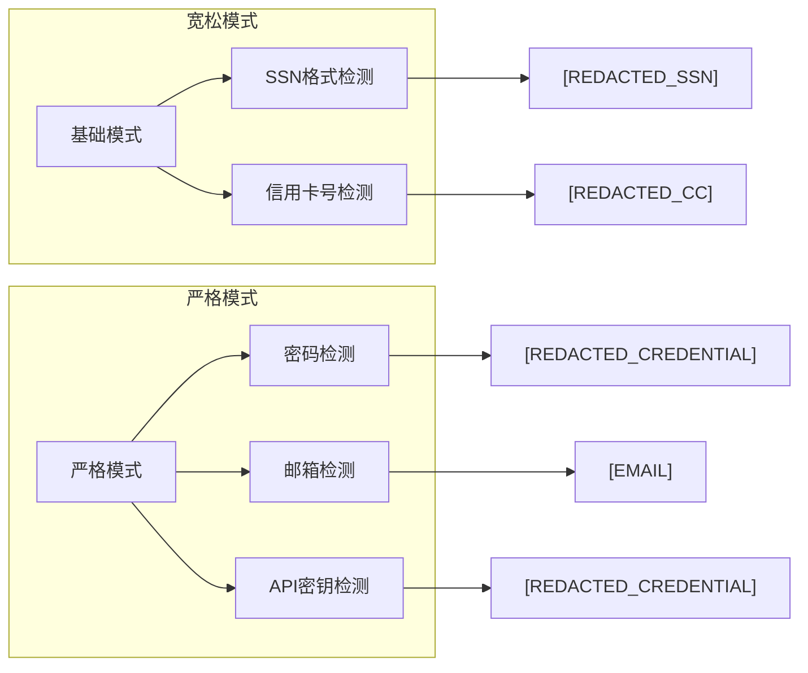
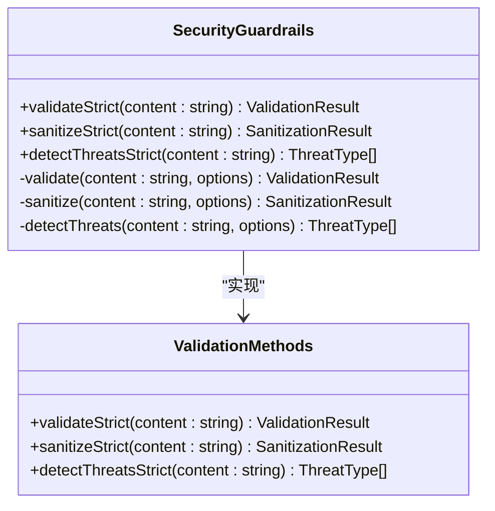
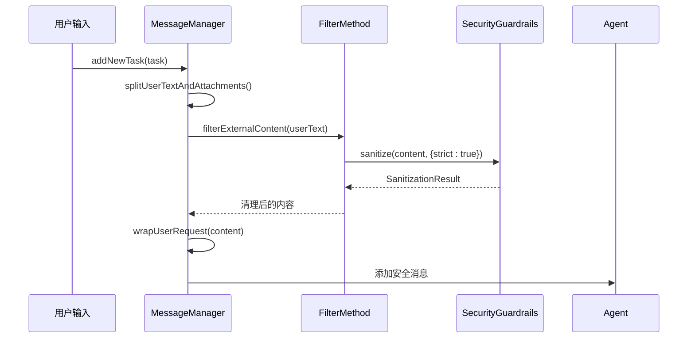
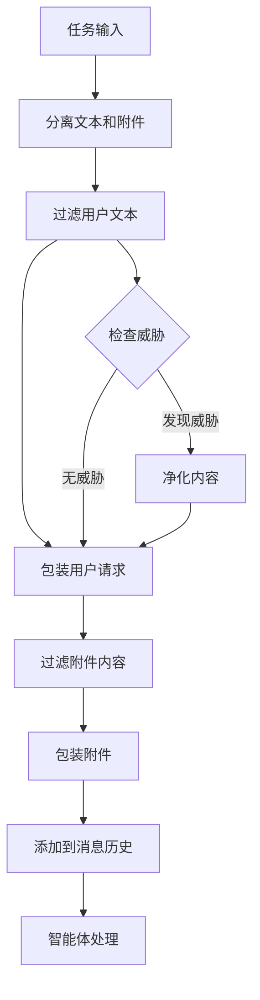

# 安全验证与决策机制

<cite>
**本文档引用的文件**
- [index.ts](file://chrome-extension/src/background/services/guardrails/index.ts)
- [types.ts](file://chrome-extension/src/background/services/guardrails/types.ts)
- [sanitizer.ts](file://chrome-extension/src/background/services/guardrails/sanitizer.ts)
- [patterns.ts](file://chrome-extension/src/background/services/guardrails/patterns.ts)
- [guardrails.test.ts](file://chrome-extension/src/background/services/guardrails/__tests__/guardrails.test.ts)
- [utils.ts](file://chrome-extension/src/background/agent/messages/utils.ts)
- [service.ts](file://chrome-extension/src/background/agent/messages/service.ts)
</cite>

## 目录
1. [简介](#简介)
2. [系统架构概览](#系统架构概览)
3. [核心数据结构](#核心数据结构)
4. [验证机制详解](#验证机制详解)
5. [严格模式与普通模式](#严格模式与普通模式)
6. [关键威胁类型处理](#关键威胁类型处理)
7. [便捷方法设计](#便捷方法设计)
8. [智能体通信集成](#智能体通信集成)
9. [性能考虑](#性能考虑)
10. [故障排除指南](#故障排除指南)
11. [总结](#总结)

## 简介

NanoBrowser的安全验证与决策机制是一个多层次的内容安全防护系统，专门设计用于保护智能体免受恶意内容和攻击性指令的影响。该系统通过威胁检测、内容净化和智能决策算法，为智能体通信和用户输入处理提供了强大的安全保障。

系统的核心设计理念是提供灵活的安全级别配置，允许在严格防护和功能可用性之间找到平衡。通过区分严格模式和普通模式，系统能够根据不同场景的需求调整安全策略，同时保持高效的性能表现。

## 系统架构概览

安全验证系统采用模块化架构设计，主要包含以下核心组件：

**图表来源**
- [index.ts](file://chrome-extension/src/background/services/guardrails/index.ts#L1-L177)
- [sanitizer.ts](file://chrome-extension/src/background/services/guardrails/sanitizer.ts#L1-L129)
- [utils.ts](file://chrome-extension/src/background/agent/messages/utils.ts#L241-L259)

**章节来源**
- [index.ts](file://chrome-extension/src/background/services/guardrails/index.ts#L1-L177)
- [types.ts](file://chrome-extension/src/background/services/guardrails/types.ts#L1-L44)

## 核心数据结构

### ThreatType 枚举

系统定义了四种核心威胁类型，每种类型对应特定的安全风险：

| 威胁类型 | 描述 | 处理策略 |
|---------|------|----------|
| TASK_OVERRIDE | 任务覆盖尝试 | 完全阻止并替换为安全标记 |
| PROMPT_INJECTION | 提示注入攻击 | 检测并移除可疑的系统引用 |
| SENSITIVE_DATA | 敏感数据泄露 | 脱敏处理并替换为占位符 |
| DANGEROUS_ACTION | 危险操作指令 | 严格限制执行权限 |

### ValidationResult 数据结构

ValidationResult 是验证机制的核心输出结构，提供了丰富的反馈信息：

**图表来源**
- [types.ts](file://chrome-extension/src/background/services/guardrails/types.ts#L25-L43)

### SanitizationResult 数据结构

SanitizationResult 提供了净化过程的详细信息：

| 字段 | 类型 | 描述 |
|------|------|------|
| sanitized | string | 清理后的安全内容 |
| threats | ThreatType[] | 检测到的威胁类型列表 |
| modified | boolean | 内容是否被修改过 |

**章节来源**
- [types.ts](file://chrome-extension/src/background/services/guardrails/types.ts#L1-L44)

## 验证机制详解

### validate 方法的工作原理

validate 方法是整个验证系统的核心入口，它基于威胁检测结果做出安全决策：

**图表来源**
- [index.ts](file://chrome-extension/src/background/services/guardrails/index.ts#L67-L105)

### 验证流程的关键步骤

1. **服务状态检查**：首先确认安全卫士服务是否启用
2. **威胁检测**：调用 detectThreats 方法识别潜在威胁
3. **模式判断**：根据严格模式设置决定验证策略
4. **威胁分类**：区分关键威胁和非关键威胁
5. **结果生成**：构建包含丰富信息的验证结果

**章节来源**
- [index.ts](file://chrome-extension/src/background/services/guardrails/index.ts#L67-L105)

## 严格模式与普通模式

### 严格模式特性

严格模式采用最严格的验证策略，任何检测到的威胁都会导致验证失败：

**图表来源**
- [index.ts](file://chrome-extension/src/background/services/guardrails/index.ts#L95-L105)

### 普通模式特性

普通模式采用宽容的验证策略，只对关键威胁进行严格控制：

**图表来源**
- [index.ts](file://chrome-extension/src/background/services/guardrails/index.ts#L107-L126)

### 模式切换机制

系统提供了灵活的模式切换机制：

| 方法 | 功能 | 使用场景 |
|------|------|----------|
| setStrictMode(boolean) | 设置全局严格模式 | 配置级安全策略调整 |
| validateStrict(string) | 严格模式验证 | 关键操作前的安全检查 |
| sanitizeStrict(string) | 严格模式净化 | 高风险内容处理 |
| detectThreatsStrict(string) | 严格模式检测 | 威胁分析 |

**章节来源**
- [index.ts](file://chrome-extension/src/background/services/guardrails/index.ts#L128-L175)

## 关键威胁类型处理

### TASK_OVERRIDE 特殊处理

TASK_OVERRIDE 威胁是最危险的威胁类型之一，旨在绕过智能体的正常指令序列：

**图表来源**
- [patterns.ts](file://chrome-extension/src/background/services/guardrails/patterns.ts#L10-L50)

### DANGEROUS_ACTION 特殊处理

DANGEROUS_ACTION 威胁涉及可能对系统造成损害的操作：

| 检测模式 | 处理方式 | 示例 |
|----------|----------|------|
| 直接命令威胁 | 完全阻止 | "立即关闭浏览器" |
| 权限提升 | 严格限制 | "以管理员身份运行" |
| 系统访问 | 权限检查 | "访问系统文件" |
| 网络操作 | 流量监控 | "连接外部服务器" |

### SENSITIVE_DATA 处理策略

敏感数据检测采用分级处理策略：

**图表来源**
- [patterns.ts](file://chrome-extension/src/background/services/guardrails/patterns.ts#L51-L104)

**章节来源**
- [patterns.ts](file://chrome-extension/src/background/services/guardrails/patterns.ts#L1-L159)

## 便捷方法设计

### validateStrict 方法

validateStrict 方法提供了便捷的严格验证接口：

**图表来源**
- [index.ts](file://chrome-extension/src/background/services/guardrails/index.ts#L150-L175)

### 消息工具集成

消息工具类提供了智能体通信中的安全内容处理：

| 工具函数 | 功能 | 返回类型 |
|----------|------|----------|
| filterExternalContent | 过滤外部内容 | string |
| filterExternalContentWithReport | 带报告的过滤 | SanitizationResult |
| wrapUntrustedContent | 包装不信任内容 | string |
| wrapUserRequest | 包装用户请求 | string |

**章节来源**
- [utils.ts](file://chrome-extension/src/background/agent/messages/utils.ts#L241-L329)

## 智能体通信集成

### 消息管理器集成

MessageManager 与安全验证系统的深度集成：

**图表来源**
- [service.ts](file://chrome-extension/src/background/agent/messages/service.ts#L150-L199)

### 智能体通信流程

智能体通信中的安全验证流程：

**图表来源**
- [service.ts](file://chrome-extension/src/background/agent/messages/service.ts#L150-L199)

### 实际应用场景

#### 场景1：网页内容提取

当智能体从网页提取内容时：
- 使用 wrapUntrustedContent 包装原始内容
- 应用严格模式过滤以防止注入攻击
- 添加安全警告标签确保内容被正确识别

#### 场景2：用户输入处理

对于用户的直接输入：
- 自动检测并过滤潜在的恶意内容
- 根据输入类型选择合适的严格级别
- 维护安全的消息历史记录

#### 场景3：文件上传处理

处理用户上传的文件内容：
- 分离文件内容和用户说明
- 对文件内容应用严格的安全检查
- 保留用户说明的完整性

**章节来源**
- [utils.ts](file://chrome-extension/src/background/agent/messages/utils.ts#L241-L329)
- [service.ts](file://chrome-extension/src/background/agent/messages/service.ts#L150-L199)

## 性能考虑

### 正则表达式优化

系统采用了多项性能优化措施：

1. **正则表达式实例化**：每次使用时重新创建正则表达式实例，避免状态污染
2. **早期退出机制**：一旦检测到威胁立即停止后续检查
3. **模式缓存**：严格模式和普通模式的模式集合预先计算并缓存
4. **Unicode规范化**：统一文本格式减少匹配复杂度

### 内存管理

- 使用 Set 数据结构存储威胁类型，避免重复计数
- 及时释放正则表达式实例
- 合理的字符串处理避免内存泄漏

### 并发处理

虽然当前实现是同步的，但系统设计考虑了未来的并发扩展：
- 状态无关的纯函数设计
- 线程安全的正则表达式使用
- 可插拔的模式检测机制

## 故障排除指南

### 常见问题及解决方案

#### 问题1：误报严重

**症状**：合法内容被错误标记为威胁
**原因**：严格模式过于激进
**解决方案**：
- 调整严格模式设置
- 检查自定义模式配置
- 使用普通模式进行测试

#### 问题2：漏报严重

**症状**：恶意内容未被检测到
**原因**：检测模式不够全面
**解决方案**：
- 启用严格模式
- 更新安全模式库
- 增加自定义检测规则

#### 问题3：性能下降

**症状**：验证过程耗时过长
**原因**：正则表达式复杂度过高
**解决方案**：
- 优化正则表达式模式
- 减少不必要的模式检查
- 使用性能分析工具定位瓶颈

### 调试技巧

1. **启用调试日志**：查看详细的威胁检测过程
2. **使用测试模式**：在隔离环境中测试新功能
3. **监控性能指标**：跟踪验证时间和资源使用
4. **单元测试覆盖**：确保所有边界情况都被测试

**章节来源**
- [guardrails.test.ts](file://chrome-extension/src/background/services/guardrails/__tests__/guardrails.test.ts#L1-L133)

## 总结

NanoBrowser的安全验证与决策机制提供了一个全面而灵活的内容安全防护体系。通过区分严格模式和普通模式，系统能够在安全性与功能性之间找到最佳平衡点。

### 核心优势

1. **多层次防护**：从威胁检测到内容净化的完整防护链
2. **灵活配置**：支持动态模式切换和自定义安全策略
3. **智能决策**：基于威胁类型的差异化处理策略
4. **高效性能**：优化的算法和数据结构确保快速响应
5. **易于集成**：简洁的API设计便于与其他系统集成

### 最佳实践建议

1. **生产环境**：建议使用严格模式确保最高安全性
2. **开发测试**：可以使用普通模式提高开发效率
3. **关键操作**：对敏感操作前后必须进行严格验证
4. **定期更新**：及时更新威胁检测模式库
5. **监控告警**：建立完善的威胁检测监控体系

该安全验证机制为NanoBrowser的智能体通信和用户输入处理提供了坚实的安全保障，确保系统在各种环境下都能安全可靠地运行。