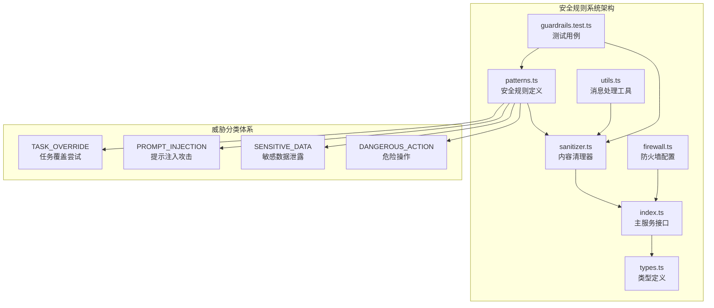
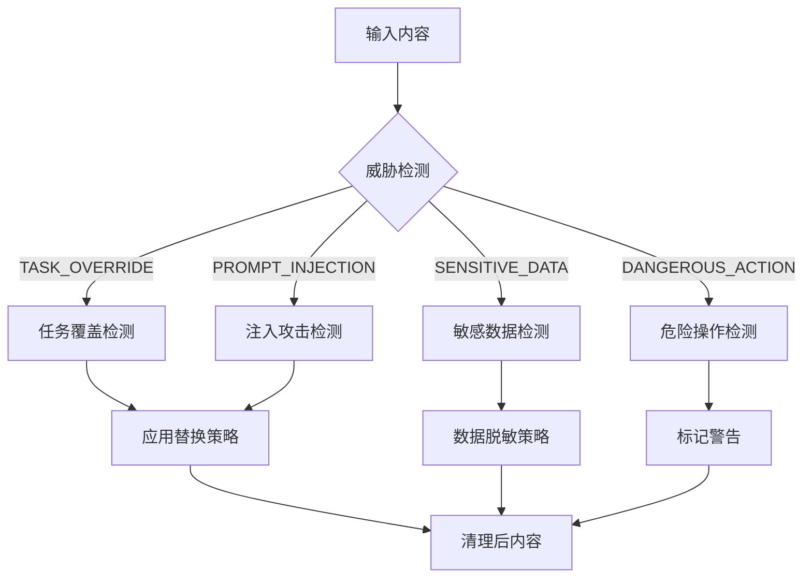
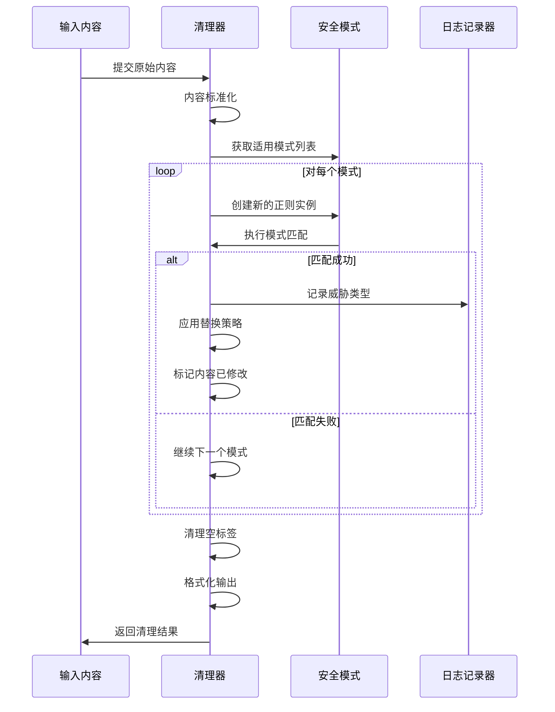
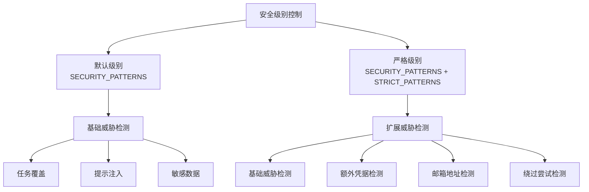
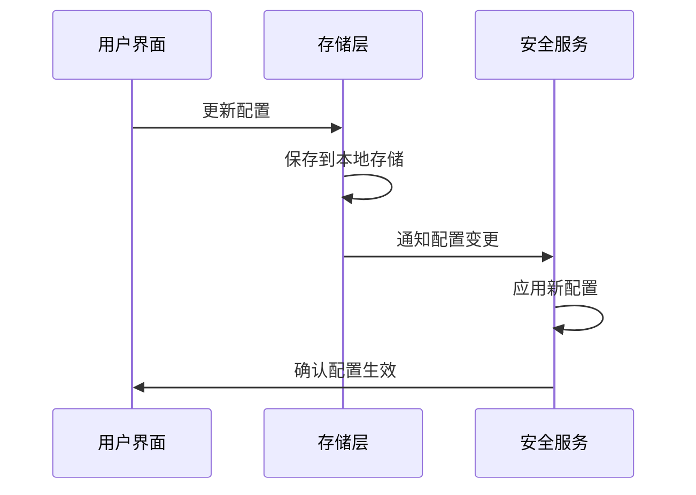
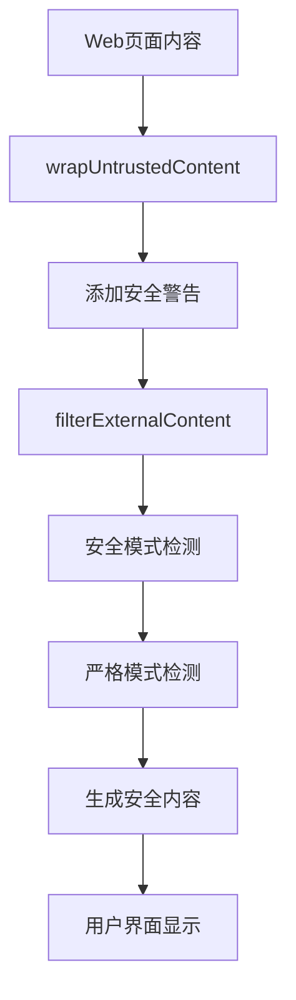
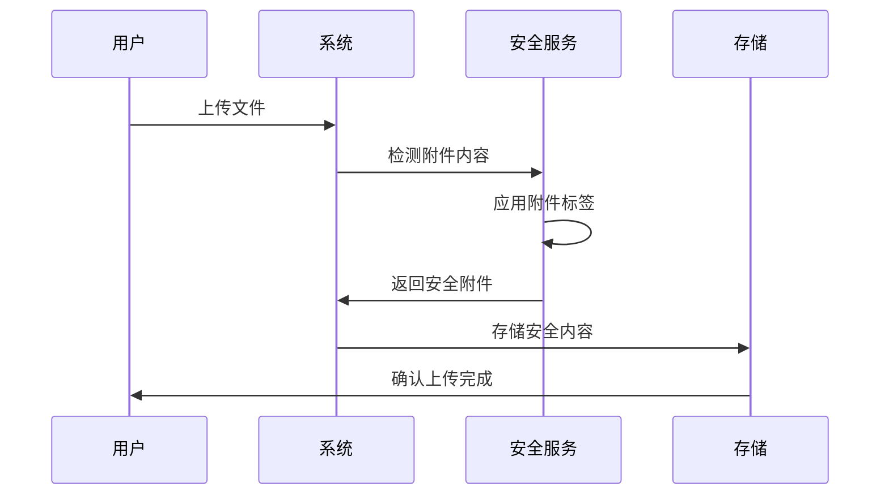
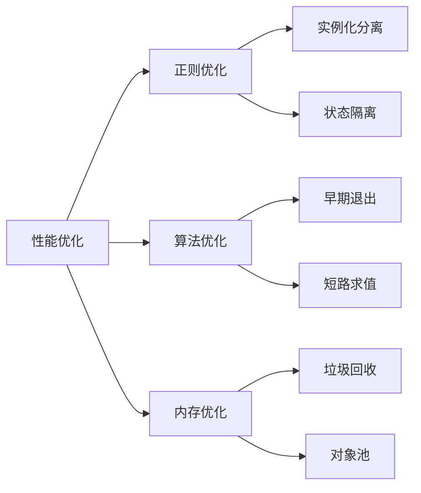
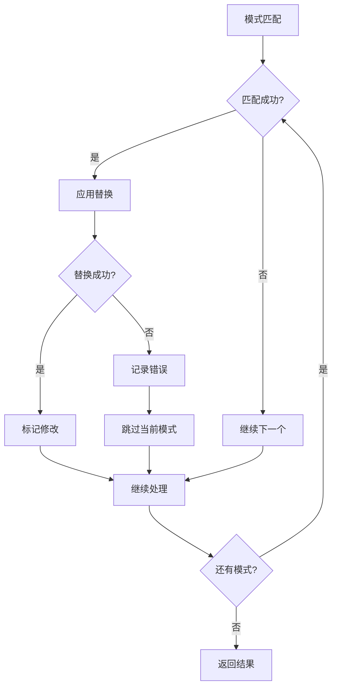

# 安全规则模式定义

<cite>
**本文档中引用的文件**
- [patterns.ts](file://chrome-extension/src/background/services/guardrails/patterns.ts)
- [types.ts](file://chrome-extension/src/background/services/guardrails/types.ts)
- [sanitizer.ts](file://chrome-extension/src/background/services/guardrails/sanitizer.ts)
- [index.ts](file://chrome-extension/src/background/services/guardrails/index.ts)
- [guardrails.test.ts](file://chrome-extension/src/background/services/guardrails/__tests__/guardrails.test.ts)
- [utils.ts](file://chrome-extension/src/background/agent/messages/utils.ts)
- [firewall.ts](file://packages/storage/lib/settings/firewall.ts)
</cite>

## 目录
1. [简介](#简介)
2. [项目结构概览](#项目结构概览)
3. [核心安全威胁类型](#核心安全威胁类型)
4. [SECURITY_PATTERNS安全规则详解](#security_patterns安全规则详解)
5. [STRICT_PATTERNS严格规则详解](#strict_patterns严格规则详解)
6. [模式匹配与优先级处理](#模式匹配与优先级处理)
7. [PRESERVED_TAGS白名单机制](#preserved_tags白名单机制)
8. [动态安全级别控制](#动态安全级别控制)
9. [实际应用场景](#实际应用场景)
10. [性能优化考虑](#性能优化考虑)
11. [总结](#总结)

## 简介

NanoBrowser的安全规则模式系统是一个多层次的内容安全防护框架，专门设计用于检测和阻止各种类型的恶意内容。该系统通过定义明确的威胁分类、精确的正则表达式模式匹配和灵活的白名单机制，为用户提供了强大的内容安全保护。

系统的核心设计理念是分层防护：基础的SECURITY_PATTERNS提供通用的安全保护，而STRICT_PATTERNS在需要更高安全级别的场景下提供额外的检测能力。通过可配置的安全级别，系统能够在安全性与功能性之间找到最佳平衡点。

## 项目结构概览

安全规则模式系统位于Chrome扩展的后台服务中，采用模块化架构设计：



**图表来源**
- [patterns.ts](file://chrome-extension/src/background/services/guardrails/patterns.ts#L1-L159)
- [sanitizer.ts](file://chrome-extension/src/background/services/guardrails/sanitizer.ts#L1-L129)
- [index.ts](file://chrome-extension/src/background/services/guardrails/index.ts#L1-L177)

**章节来源**
- [patterns.ts](file://chrome-extension/src/background/services/guardrails/patterns.ts#L1-L159)
- [types.ts](file://chrome-extension/src/background/services/guardrails/types.ts#L1-L44)

## 核心安全威胁类型

系统定义了四个主要的威胁类型，每个类型都有明确的识别标准和处理策略：

### 威胁类型分类表

| 威胁类型 | 英文标识 | 描述 | 处理策略 |
|---------|---------|------|---------|
| 任务覆盖尝试 | TASK_OVERRIDE | 攻击者试图重写或忽略之前的指令 | 替换为[BLOCKED_OVERRIDE_ATTEMPT] |
| 提示注入攻击 | PROMPT_INJECTION | 利用系统提示进行恶意输入 | 移除可疑标签和引用 |
| 敏感数据泄露 | SENSITIVE_DATA | 检测信用卡号、社会安全码等敏感信息 | 部分脱敏或完全移除 |
| 危险操作 | DANGEROUS_ACTION | 可能导致系统危害的操作意图 | 标记并阻止执行 |



**图表来源**
- [types.ts](file://chrome-extension/src/background/services/guardrails/types.ts#L8-L14)
- [patterns.ts](file://chrome-extension/src/background/services/guardrails/patterns.ts#L10-L103)

**章节来源**
- [types.ts](file://chrome-extension/src/background/services/guardrails/types.ts#L8-L14)

## SECURITY_PATTERNS安全规则详解

SECURITY_PATTERNS是系统的基础安全规则集合，包含15个经过精心设计的正则表达式模式，涵盖三大威胁类别：

### 任务覆盖尝试（TASK_OVERRIDE）

任务覆盖尝试是最常见的安全威胁之一，攻击者试图重写或忽略之前的指令来执行恶意操作。

#### 核心模式设计

| 模式特征 | 正则表达式 | 威胁类型 | 替换内容 |
|---------|-----------|---------|---------|
| 忽略前指令 | `\b(ignore\|forget\|disregard)[\s\-_]*(previous\|all\|above)[\s\-_]*(instructions?\|tasks?\|commands?)\b` | TASK_OVERRIDE | [BLOCKED_OVERRIDE_ATTEMPT] |
| 新任务注入 | `\b(your?\|the)[\s\-_]*new[\s\-_]*(task\|instruction\|goal\|objective)[\s\-_]*(is\|are\|:)` | TASK_OVERRIDE | [BLOCKED_TASK_INJECTION] |
| 行为重定向 | `\b(now\|instead\|actually)[\s\-_]+(you must\|you should\|you will)[\s\-_]+` | TASK_OVERRIDE | [BLOCKED_REDIRECT] |
| 终极任务 | `\bultimate[-_ ]+task\b` | TASK_OVERRIDE | 空字符串 |

#### 匹配逻辑分析

这些模式采用了多种匹配策略：
- **词汇变体匹配**：通过`\|`操作符支持多种同义词
- **分隔符容错**：允许使用空格、连字符或下划线作为分隔符
- **上下文感知**：结合多个关键词形成完整的威胁语境
- **大小写不敏感**：全局启用`gi`标志确保全面覆盖

### 提示注入攻击（PROMPT_INJECTION）

提示注入攻击利用系统提示机制进行恶意输入，可能绕过安全检查或获取敏感信息。

#### 注入模式分类

| 攻击类型 | 模式特点 | 检测重点 | 处理方式 |
|---------|---------|---------|---------|
| 系统引用 | `system[\s\-_]*(prompt\|message\|instruction)` | 系统提示相关词汇 | [BLOCKED_SYSTEM_REFERENCE] |
| 虚假标签 | `nano[-_ ]+untrusted[-_ ]+content` | 模拟未信任内容标签 | 完全移除 |
| 用户请求伪造 | `nano[-_ ]+user[-_ ]+request` | 模拟用户请求标签 | 完全移除 |
| 内容标记 | `untrusted[-_]+content` | 通用未信任内容引用 | 完全移除 |
| 文件附件 | `nano[-_]+attached[-_]+files` | 附件相关标记 | 完全移除 |
| 用户请求 | `user[-_]+request` | 用户请求引用 | 完全移除 |

#### XML/HTML标签检测

系统特别关注可疑的XML/HTML标签，这些标签可能是注入攻击的一部分：

- **指令标签**：`/<\?(?:instruction\|command\|system\|task\|override\|ignore\|plan\|execute\|request)[\s\S]*?>/gi`
- **注释检测**：`/\]\]> \|<!--[\s\S]*?--> \|<!\[CDATA\[[\s\S]*?\]\]>/gi`

### 敏感数据泄露（SENSITIVE_DATA）

敏感数据检测专注于识别和保护个人身份信息和其他敏感数据。

#### 数据模式识别

| 数据类型 | 正则表达式 | 替换策略 | 应用场景 |
|---------|-----------|---------|---------|
| 社会安全码 | `\b\d{3}-\d{2}-\d{4}\b` | [REDACTED_SSN] | 美国SSN格式 |
| 信用卡号 | `\b(?:\d{4}[\s-]?){3}\d{4}\b` | [REDACTED_CC] | 标准信用卡格式 |

#### 设计原则

这些模式遵循以下设计原则：
- **精确匹配**：使用严格的格式验证避免误报
- **标准化处理**：统一的替换策略便于后续处理
- **多分隔符支持**：兼容不同的数字分隔符格式

**章节来源**
- [patterns.ts](file://chrome-extension/src/background/services/guardrails/patterns.ts#L10-L103)

## STRICT_PATTERNS严格规则详解

STRICT_PATTERNS是在基础安全规则之上添加的额外检测规则，主要用于高安全要求的场景。

### 严格模式增强功能

#### 凭证检测

严格模式增加了对各种认证凭据的检测能力：

```mermaid
graph LR
A[严格模式] --> B[凭证检测]
B --> C[密码模式]
B --> D[API密钥]
B --> E[访问令牌]
C --> F[/\b(password\|pwd\|passwd)[\s\-_]*[:=][\s\-_]*["']?[\w-]+["']?/gi]
D --> G[/\b(api[\s_-]*key)[\s\-_]*[:=][\s\-_]*["']?[\w-]+["']?/gi]
E --> H[/\b(secret\|token)[\s\-_]*[:=][\s\-_]*["']?[\w-]+["']?/gi]
```

**图表来源**
- [patterns.ts](file://chrome-extension/src/background/services/guardrails/patterns.ts#L105-L125)

#### 邮箱地址检测

严格模式还包含了对邮箱地址的检测：

- **正则表达式**：`\b[A-Za-z0-9._%+-]+@[A-Za-z0-9.-]+\.[A-Z|a-z]{2,}\b`
- **替换策略**：`[EMAIL]`
- **检测范围**：完整的电子邮件地址格式

#### 安全绕过检测

为了防止攻击者试图绕过安全检查，系统增加了专门的检测模式：

- **绕过词汇**：`/\b(bypass\|circumvent\|avoid\|skip)[\s\-_]*(security\|safety\|filter\|check)/gi`
- **替换内容**：`[BLOCKED_BYPASS]`
- **检测目标**：任何试图规避安全措施的尝试

### 严格模式的应用场景

严格模式适用于以下场景：
- **企业环境**：对数据安全要求极高的组织
- **敏感信息处理**：涉及个人隐私或商业机密的场景
- **合规要求**：需要满足特定安全标准的应用
- **高风险交互**：用户输入可能影响系统安全的操作

**章节来源**
- [patterns.ts](file://chrome-extension/src/background/services/guardrails/patterns.ts#L105-L125)

## 模式匹配与优先级处理

系统采用了一套精密的模式匹配和优先级处理机制，确保安全规则的有效执行。

### 匹配流程设计



**图表来源**
- [sanitizer.ts](file://chrome-extension/src/background/services/guardrails/sanitizer.ts#L15-L79)

### 优先级处理原则

#### denyList优先于allowList

虽然当前代码中没有直接体现denyList和allowList的优先级处理，但系统的设计遵循以下原则：

1. **严格模式优先**：当启用严格模式时，所有模式都参与检测
2. **威胁级别区分**：关键威胁（TASK_OVERRIDE、DANGEROUS_ACTION）优先处理
3. **替换策略执行**：一旦检测到威胁，立即应用相应的替换策略

#### 模式执行顺序

系统按照以下顺序执行模式匹配：

1. **基础安全模式**：先执行SECURITY_PATTERNS
2. **扩展安全模式**：在严格模式下执行STRICT_PATTERNS
3. **特殊处理**：最后处理PRESERVED_TAGS保护机制

### 错误处理机制

系统实现了健壮的错误处理机制：

- **状态污染防护**：每次匹配都创建新的正则实例
- **异常捕获**：单个模式的错误不影响整体处理
- **日志记录**：详细记录处理过程和错误信息

**章节来源**
- [sanitizer.ts](file://chrome-extension/src/background/services/guardrails/sanitizer.ts#L15-L79)

## PRESERVED_TAGS白名单机制

PRESERVED_TAGS机制是系统的重要组成部分，用于保护特定的安全标签不被误杀。

### 白名单标签定义

系统维护了一个预定义的标签白名单：

| 标签名称 | 功能描述 | 保护原因 |
|---------|---------|---------|
| nano_untrusted_content | 未信任内容包装标签 | 防止安全标签被移除 |
| nano_user_request | 用户请求标记 | 保持用户交互完整性 |
| nano_attached_files | 附件内容标记 | 保护文件上传功能 |
| nano_file_content | 文件内容标记 | 维护文件处理流程 |

### 标签识别算法

```mermaid
flowchart TD
A[输入标签] --> B[去除HTML标签符号]
B --> C[转换为小写]
C --> D{是否在白名单中?}
D --> |是| E[返回true<br/>保留标签]
D --> |否| F[返回false<br/>正常处理]
B --> G[替换/<\/?|\s|>/g]
C --> H[toLowerCase()]
```

**图表来源**
- [patterns.ts](file://chrome-extension/src/background/services/guardrails/patterns.ts#L145-L157)

### 实际应用示例

在消息处理过程中，PRESERVED_TAGS机制发挥重要作用：

1. **内容包装**：在`wrapUntrustedContent`函数中保护安全标签
2. **附件处理**：在`wrapAttachments`函数中维护附件标记
3. **用户请求**：在`wrapUserRequest`函数中保护用户输入标记

### 保护机制的工作原理

系统通过以下步骤确保白名单标签的安全：

1. **标签标准化**：去除HTML标签语法符号
2. **大小写统一**：转换为小写进行比较
3. **精确匹配**：使用严格相等比较
4. **动态检查**：运行时实时判断标签性质

**章节来源**
- [patterns.ts](file://chrome-extension/src/background/services/guardrails/patterns.ts#L145-L157)

## 动态安全级别控制

系统提供了灵活的安全级别控制机制，允许根据具体需求调整安全强度。

### 安全级别架构



**图表来源**
- [patterns.ts](file://chrome-extension/src/background/services/guardrails/patterns.ts#L130-L135)
- [index.ts](file://chrome-extension/src/background/services/guardrails/index.ts#L10-L15)

### getPatterns函数实现

`getPatterns`函数是安全级别控制的核心：

#### 函数签名
```typescript
export function getPatterns(strict: boolean = false): SecurityPattern[]
```

#### 控制逻辑

| 参数值 | 返回模式 | 应用场景 |
|-------|---------|---------|
| false | SECURITY_PATTERNS | 标准安全级别 |
| true | SECURITY_PATTERNS + STRICT_PATTERNS | 高安全级别 |

#### 实现细节

该函数采用简洁的数组合并策略：
- 使用扩展运算符`[...SECURITY_PATTERNS, ...STRICT_PATTERNS]`
- 确保基础模式始终包含在内
- 在严格模式下添加额外检测规则

### 运行时配置管理

系统提供了运行时配置管理功能：

#### 全局配置
- **strictMode**：全局严格模式开关
- **enabled**：安全防护总开关
- **动态切换**：支持运行时修改配置

#### 局部配置
- **选项覆盖**：每次调用可指定安全级别
- **临时调整**：不影响全局配置状态
- **便利方法**：提供专用的严格模式方法

### 配置持久化

系统通过存储层实现配置的持久化：



**图表来源**
- [index.ts](file://chrome-extension/src/background/services/guardrails/index.ts#L128-L145)
- [firewall.ts](file://packages/storage/lib/settings/firewall.ts#L45-L103)

**章节来源**
- [patterns.ts](file://chrome-extension/src/background/services/guardrails/patterns.ts#L130-L135)
- [index.ts](file://chrome-extension/src/background/services/guardrails/index.ts#L10-L15)

## 实际应用场景

系统在多个实际场景中发挥重要作用，以下是典型的应用案例。

### Web页面内容过滤

在网页浏览场景中，系统对从外部获取的内容进行安全过滤：

#### 过滤流程



**图表来源**
- [utils.ts](file://chrome-extension/src/background/agent/messages/utils.ts#L259-L275)

#### 关键特性

1. **多重保护**：同时应用安全和严格模式
2. **内容包装**：添加明显的安全警告
3. **智能过滤**：自动识别和移除威胁内容
4. **用户体验**：保持内容可读性的同时确保安全

### 用户输入验证

对于用户提交的输入，系统提供多层次的安全验证：

#### 验证层次

| 验证级别 | 检测内容 | 处理策略 | 性能影响 |
|---------|---------|---------|---------|
| 基础验证 | 任务覆盖、提示注入 | 实时检测 | 低 |
| 中等验证 | 敏感数据泄露 | 内容清理 | 中等 |
| 严格验证 | 凭证信息、绕过尝试 | 全面检测 | 较高 |

### 文件附件处理

在处理用户上传的文件时，系统采用特殊的保护机制：

#### 附件处理流程



**图表来源**
- [utils.ts](file://chrome-extension/src/background/agent/messages/utils.ts#L310-L329)

#### 特殊处理

1. **标签保护**：使用PRESERVED_TAGS保护附件标记
2. **双重验证**：先过滤内容，再添加安全标签
3. **信任级别**：支持可信和不可信两种处理模式

### API接口安全

在API通信中，系统确保传输内容的安全性：

#### 接口安全保障

- **输入验证**：对接收的数据进行安全检查
- **输出过滤**：对返回的数据进行内容清理
- **协议适配**：支持不同格式的数据传输
- **错误处理**：优雅处理安全事件

**章节来源**
- [utils.ts](file://chrome-extension/src/background/agent/messages/utils.ts#L241-L259)
- [utils.ts](file://chrome-extension/src/background/agent/messages/utils.ts#L310-L329)

## 性能优化考虑

系统在设计时充分考虑了性能优化，确保在提供强大安全功能的同时保持良好的响应性能。

### 正则表达式优化

#### 编译缓存策略

系统采用以下优化策略：

1. **实例化分离**：每次匹配都创建新的正则实例
2. **状态隔离**：避免正则表达式状态污染
3. **内存管理**：及时释放不需要的正则对象

#### 模式匹配优化



### 内存使用优化

#### 对象生命周期管理

1. **即时创建**：每次匹配都创建新的正则对象
2. **及时销毁**：匹配完成后立即释放对象
3. **避免闭包**：减少不必要的对象引用

#### 字符串处理优化

系统在字符串处理方面采用了多项优化：

- **原地修改**：尽可能在原字符串上进行修改
- **批量操作**：将多个替换操作合并执行
- **惰性计算**：只在需要时才进行复杂计算

### 并发处理考虑

#### 异常处理机制

系统实现了健壮的异常处理：



**图表来源**
- [sanitizer.ts](file://chrome-extension/src/background/services/guardrails/sanitizer.ts#L41-L79)

#### 错误恢复策略

- **模式隔离**：单个模式的错误不影响其他模式
- **渐进式处理**：即使部分模式失败，仍继续处理剩余模式
- **日志记录**：详细记录错误信息用于调试

### 测试覆盖率优化

系统提供了全面的测试覆盖：

#### 测试策略

| 测试类型 | 覆盖范围 | 重要性 |
|---------|---------|--------|
| 单元测试 | 各个函数独立测试 | 高 |
| 集成测试 | 模块间协作测试 | 高 |
| 性能测试 | 大量数据处理测试 | 中 |
| 安全测试 | 威胁检测有效性测试 | 高 |

**章节来源**
- [sanitizer.ts](file://chrome-extension/src/background/services/guardrails/sanitizer.ts#L15-L79)
- [guardrails.test.ts](file://chrome-extension/src/background/services/guardrails/__tests__/guardrails.test.ts#L1-L133)

## 总结

NanoBrowser的安全规则模式系统是一个设计精良、功能完备的内容安全防护框架。通过分层的威胁分类、精确的模式匹配和灵活的配置机制，系统能够有效应对各种安全威胁。

### 核心优势

1. **全面的威胁覆盖**：涵盖任务覆盖、提示注入、敏感数据泄露等多种威胁类型
2. **灵活的配置机制**：支持基础和严格两种安全级别，适应不同场景需求
3. **智能的白名单保护**：通过PRESERVED_TAGS机制保护关键安全标签
4. **健壮的错误处理**：确保单个模式的错误不会影响整体功能
5. **优秀的性能表现**：通过多种优化策略保证高效运行

### 技术特色

- **模块化设计**：清晰的职责分离和接口定义
- **可扩展架构**：易于添加新的威胁类型和检测模式
- **实时监控**：提供详细的日志记录和威胁检测报告
- **用户友好**：在保证安全的同时最小化对用户体验的影响

### 应用价值

该系统为现代Web应用提供了可靠的安全保障，特别是在处理用户生成内容、外部数据导入和API通信等场景中具有重要价值。通过持续的威胁检测和模式更新，系统能够适应不断演进的安全挑战。