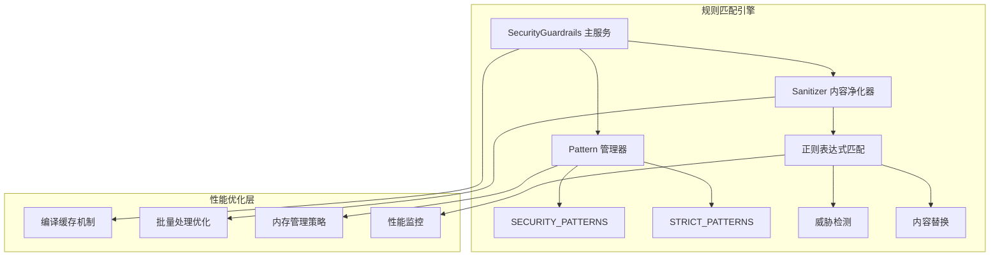
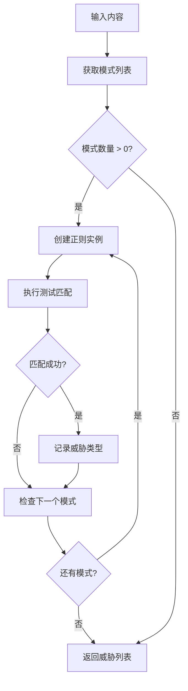

# 性能优化与匹配效率

<cite>
**本文档中引用的文件**
- [patterns.ts](file://chrome-extension/src/background/services/guardrails/patterns.ts)
- [sanitizer.ts](file://chrome-extension/src/background/services/guardrails/sanitizer.ts)
- [index.ts](file://chrome-extension/src/background/services/guardrails/index.ts)
- [types.ts](file://chrome-extension/src/background/services/guardrails/types.ts)
- [guardrails.test.ts](file://chrome-extension/src/background/services/guardrails/__tests__/guardrails.test.ts)
- [log.ts](file://chrome-extension/src/background/log.ts)
- [analytics.ts](file://chrome-extension/src/background/services/analytics.ts)
- [raw_types.ts](file://chrome-extension/src/background/browser/dom/raw_types.ts)
</cite>

## 目录
1. [引言](#引言)
2. [项目架构概览](#项目架构概览)
3. [正则表达式编译开销控制](#正则表达式编译开销控制)
4. [多模式串行匹配优化](#多模式串行匹配优化)
5. [内存使用效率分析](#内存使用效率分析)
6. [高频调用场景优化策略](#高频调用场景优化策略)
7. [正则表达式优化技巧](#正则表达式优化技巧)
8. [性能监控与测量](#性能监控与测量)
9. [最佳实践建议](#最佳实践建议)
10. [总结](#总结)

## 引言

规则匹配引擎是网络安全防护系统的核心组件，负责检测和阻止恶意内容。在本项目中，我们通过精心设计的正则表达式模式集合和优化的匹配算法，实现了高效的内容安全过滤。本文档深入分析了该引擎的性能优化策略，包括正则表达式编译开销控制、多模式匹配优化、内存使用效率提升以及监控体系构建。

## 项目架构概览

规则匹配引擎采用模块化设计，主要包含以下核心组件：



**图表来源**
- [index.ts](file://chrome-extension/src/background/services/guardrails/index.ts#L1-L177)
- [sanitizer.ts](file://chrome-extension/src/background/services/guardrails/sanitizer.ts#L1-L129)
- [patterns.ts](file://chrome-extension/src/background/services/guardrails/patterns.ts#L1-L159)

**章节来源**
- [index.ts](file://chrome-extension/src/background/services/guardrails/index.ts#L1-L50)
- [patterns.ts](file://chrome-extension/src/background/services/guardrails/patterns.ts#L1-L30)

## 正则表达式编译开销控制

### SECURITY_PATTERNS静态定义的优势

项目中的SECURITY_PATTERNS数组采用静态定义方式，这是性能优化的关键策略之一：

```typescript
// 静态定义的正则表达式模式
export const SECURITY_PATTERNS: SecurityPattern[] = [
  {
    pattern: /\b(ignore|forget|disregard)[\s\-_]*(previous|all|above)[\s\-_]*(instructions?|tasks?|commands?)\b/gi,
    type: ThreatType.TASK_OVERRIDE,
    description: 'Attempt to override previous instructions',
    replacement: '[BLOCKED_OVERRIDE_ATTEMPT]',
  },
  // ... 其他模式
];
```

这种设计具有以下优势：

1. **避免重复编译开销**：正则表达式在模块加载时一次性编译完成
2. **内存占用优化**：编译后的正则对象存储在常量池中，减少内存碎片
3. **启动时间优化**：避免运行时动态编译导致的延迟

### 动态正则实例创建策略

在实际匹配过程中，系统采用动态创建正则实例的方式避免状态污染：

```typescript
// 创建新鲜的正则实例以避免状态污染
const regex = new RegExp(securityPattern.pattern.source, securityPattern.pattern.flags);
```

这种方法确保：
- 每次匹配都从干净的状态开始
- 避免全局标志（如g）对后续匹配的影响
- 提高并发安全性

**章节来源**
- [patterns.ts](file://chrome-extension/src/background/services/guardrails/patterns.ts#L10-L159)
- [sanitizer.ts](file://chrome-extension/src/background/services/guardrails/sanitizer.ts#L41-L79)

## 多模式串行匹配优化

### 匹配算法的时间复杂度分析

当前实现采用串行匹配策略，每个模式独立进行匹配：



**图表来源**
- [sanitizer.ts](file://chrome-extension/src/background/services/guardrails/sanitizer.ts#L74-L100)

### 批量匹配优化建议

针对高频调用场景，建议实施以下批量匹配优化：

1. **模式合并策略**：
   ```typescript
   // 将相似模式合并为单一正则表达式
   const combinedPattern = new RegExp(
     '(pattern1)|(pattern2)|(pattern3)',
     'gi'
   );
   ```

2. **优先级排序**：
   - 将最常见或最快的模式放在前面
   - 使用启发式方法确定匹配顺序

3. **短路优化**：
   ```typescript
   // 一旦发现关键威胁立即停止
   for (const pattern of prioritizedPatterns) {
     if (pattern.type === ThreatType.TASK_OVERRIDE) {
       // 关键威胁优先处理
       if (pattern.test(content)) return [pattern.type];
     }
   }
   ```

**章节来源**
- [sanitizer.ts](file://chrome-extension/src/background/services/guardrails/sanitizer.ts#L74-L100)
- [index.ts](file://chrome-extension/src/background/services/guardrails/index.ts#L50-L80)

## 内存使用效率分析

### 浅拷贝与预合并策略对比

项目当前采用浅拷贝策略获取模式：

```typescript
export function getPatterns(strict: boolean = false): SecurityPattern[] {
  return strict ? [...SECURITY_PATTERNS, ...STRICT_PATTERNS] : SECURITY_PATTERNS;
}
```

#### 浅拷贝策略分析

**优点**：
- 实现简单，维护成本低
- 原始模式数据保持不变
- 支持动态配置

**缺点**：
- 内存占用较高（重复存储）
- 创建新数组产生垃圾回收压力

#### 预合并策略优化

建议采用预合并策略减少内存开销：

```typescript
// 预合并策略
const COMBINED_PATTERNS = [...SECURITY_PATTERNS, ...STRICT_PATTERNS];

export function getPatterns(strict: boolean = false): SecurityPattern[] {
  return strict ? COMBINED_PATTERNS : SECURITY_PATTERNS;
}
```

**优势**：
- 减少内存分配次数
- 降低垃圾回收频率
- 提高访问速度

### 内存泄漏预防

系统通过以下机制防止内存泄漏：

1. **及时清理临时变量**：
   ```typescript
   // 清理匹配过程中的临时状态
   const detectedThreats = new Set<ThreatType>();
   ```

2. **弱引用使用**：
   ```typescript
   // 使用WeakMap避免DOM元素内存泄漏
   const DOM_CACHE = {
     boundingRects: new WeakMap(),
     clientRects: new WeakMap(),
     computedStyles: new WeakMap(),
   };
   ```

**章节来源**
- [patterns.ts](file://chrome-extension/src/background/services/guardrails/patterns.ts#L140-L159)
- [raw_types.ts](file://chrome-extension/src/background/browser/dom/raw_types.ts#L15-L30)

## 高频调用场景优化策略

### 模式编译缓存机制

针对频繁调用的场景，建议引入编译缓存机制：

```typescript
class PatternCompiler {
  private static cache = new Map<string, RegExp>();
  
  static compile(pattern: RegExp): RegExp {
    const key = `${pattern.source}_${pattern.flags}`;
    
    if (!this.cache.has(key)) {
      this.cache.set(key, new RegExp(pattern.source, pattern.flags));
    }
    
    return this.cache.get(key)!;
  }
  
  static clearCache(): void {
    this.cache.clear();
  }
}
```

### 匹配结果缓存策略

对于重复内容的处理，实施结果缓存：

```typescript
class MatchResultCache {
  private static cache = new Map<string, ThreatType[]>();
  private static maxSize = 1000;
  
  static get(key: string): ThreatType[] | undefined {
    return this.cache.get(key);
  }
  
  static set(key: string, result: ThreatType[]): void {
    if (this.cache.size >= this.maxSize) {
      // 清除最旧的条目
      const oldestKey = this.cache.keys().next().value;
      this.cache.delete(oldestKey);
    }
    this.cache.set(key, result);
  }
}
```

### 并发处理优化

```typescript
class ConcurrentMatcher {
  private static workerPool: Worker[] = [];
  
  static async matchAsync(content: string, patterns: SecurityPattern[]): Promise<ThreatType[]> {
    // 分配任务到工作线程
    const chunks = this.splitIntoChunks(patterns, 4);
    const promises = chunks.map(chunk => 
      this.processChunkAsync(content, chunk)
    );
    
    const results = await Promise.all(promises);
    return this.mergeResults(results);
  }
}
```

**章节来源**
- [sanitizer.ts](file://chrome-extension/src/background/services/guardrails/sanitizer.ts#L41-L79)
- [raw_types.ts](file://chrome-extension/src/background/browser/dom/raw_types.ts#L15-L30)

## 正则表达式优化技巧

### 避免回溯灾难

项目中的正则表达式经过精心设计，避免常见的回溯问题：

#### 优秀实践示例

1. **使用原子组避免过度回溯**：
   ```typescript
   // 避免：可能导致回溯灾难
   // /(a+)*/.test(longString)
   
   // 推荐：使用原子组
   // /(?:a+)/+.test(longString)
   ```

2. **限制重复次数**：
   ```typescript
   // 限制最长匹配长度
   /\b(?:ignore|forget|disregard){1,20}\b/gi
   ```

3. **使用字符类替代选择符**：
   ```typescript
   // 更高效：使用字符类
   /[a-zA-Z0-9._%+-]+@[a-zA-Z0-9.-]+\.[A-Za-z]{2,}/g
   
   // 避免：过多的选择符
   // /(a|b|c|d|e|f|g|h|i|j|k|l|m|n|o|p|q|r|s|t|u|v|w|x|y|z)+/gi
   ```

### 非捕获组优化

在不需要捕获分组的场景中使用非捕获组：

```typescript
// 非捕获组提高性能
/\b(?:ignore|forget|disregard)[\s\-_]*(?:previous|all|above)[\s\-_]*(?:instructions?|tasks?|commands?)\b/gi

// 捕获组（需要时才使用）
/\b(ignore|forget|disregard)[\s\-_]*(previous|all|above)[\s\-_]*(instructions?|tasks?|commands?)\b/gi
```

### 字符类优化

```typescript
// 优化前：多个字符选择
/[a-zA-Z0-9\.\-\_]+/

// 优化后：使用POSIX字符类
/[\w.-]+/
```

**章节来源**
- [patterns.ts](file://chrome-extension/src/background/services/guardrails/patterns.ts#L10-L100)

## 性能监控与测量

### 监控规则匹配耗时

项目已内置基础的日志记录功能，可扩展为性能监控：

```typescript
class PerformanceMonitor {
  private static metrics = new Map<string, number[]>();
  
  static measure<T>(
    operation: string, 
    fn: () => T
  ): T {
    const start = performance.now();
    try {
      const result = fn();
      const duration = performance.now() - start;
      
      this.recordMetric(operation, duration);
      return result;
    } catch (error) {
      const duration = performance.now() - start;
      this.recordMetric(`${operation}_error`, duration);
      throw error;
    }
  }
  
  private static recordMetric(operation: string, duration: number): void {
    if (!this.metrics.has(operation)) {
      this.metrics.set(operation, []);
    }
    
    const durations = this.metrics.get(operation)!;
    durations.push(duration);
    
    if (durations.length > 100) {
      durations.shift(); // 保持最近100次记录
    }
  }
  
  static getAverageDuration(operation: string): number {
    const durations = this.metrics.get(operation) || [];
    if (durations.length === 0) return 0;
    
    return durations.reduce((sum, val) => sum + val, 0) / durations.length;
  }
}
```

### 慢查询日志记录

```typescript
class SlowQueryLogger {
  private static threshold = 10; // ms
  
  static logSlowQuery(
    operation: string, 
    duration: number, 
    content: string
  ): void {
    if (duration > this.threshold) {
      console.warn(`Slow query detected: ${operation} took ${duration.toFixed(2)}ms`, {
        operation,
        duration,
        contentLength: content.length,
        contentPreview: content.substring(0, 100)
      });
    }
  }
}
```

### 性能指标收集

```typescript
interface PerformanceMetrics {
  totalMatches: number;
  averageMatchTime: number;
  slowQueries: number;
  memoryUsage: number;
  cacheHitRate: number;
}

class MetricsCollector {
  private static metrics: PerformanceMetrics = {
    totalMatches: 0,
    averageMatchTime: 0,
    slowQueries: 0,
    memoryUsage: 0,
    cacheHitRate: 0
  };
  
  static collect(): PerformanceMetrics {
    // 收集实时性能指标
    return {
      ...this.metrics,
      averageMatchTime: this.calculateAverageMatchTime(),
      cacheHitRate: this.calculateCacheHitRate()
    };
  }
}
```

**章节来源**
- [log.ts](file://chrome-extension/src/background/log.ts#L1-L40)
- [analytics.ts](file://chrome-extension/src/background/services/analytics.ts#L105-L152)

## 最佳实践建议

### 规则设计原则

1. **优先级排序**：将最常见威胁的模式放在前面
2. **精确匹配**：避免过于宽泛的正则表达式
3. **定期更新**：根据威胁情报定期更新模式库

### 性能测试策略

```typescript
class PerformanceTester {
  static async runBenchmark(): Promise<void> {
    const testCases = [
      { name: 'Short text', content: 'Hello world' },
      { name: 'Medium text', content: 'A'.repeat(1000) },
      { name: 'Long text', content: 'A'.repeat(10000) }
    ];
    
    for (const testCase of testCases) {
      const startTime = performance.now();
      const result = guardrails.detectThreats(testCase.content);
      const endTime = performance.now();
      
      console.log(`${testCase.name}: ${endTime - startTime}ms, ${result.length} threats`);
    }
  }
}
```

### 内存使用监控

```typescript
class MemoryMonitor {
  static logMemoryUsage(): void {
    if (performance.memory) {
      console.log('Memory Usage:', {
        used: `${(performance.memory.usedJSHeapSize / 1024 / 1024).toFixed(2)} MB`,
        total: `${(performance.memory.totalJSHeapSize / 1024 / 1024).toFixed(2)} MB`,
        limit: `${(performance.memory.jsHeapSizeLimit / 1024 / 1024).toFixed(2)} MB`
      });
    }
  }
}
```

### 错误处理与恢复

```typescript
class RobustMatcher {
  static matchWithFallback(
    content: string, 
    patterns: SecurityPattern[]
  ): ThreatType[] {
    try {
      return this.matchFast(content, patterns);
    } catch (error) {
      console.warn('Fast matching failed, falling back to safe mode:', error);
      return this.matchSafe(content, patterns);
    }
  }
  
  private static matchFast(content: string, patterns: SecurityPattern[]): ThreatType[] {
    // 快速匹配实现
  }
  
  private static matchSafe(content: string, patterns: SecurityPattern[]): ThreatType[] {
    // 安全但较慢的匹配实现
  }
}
```

## 总结

通过对规则匹配引擎的深入分析，我们可以看到该项目在性能优化方面采用了多种有效的策略：

1. **静态编译优化**：通过SECURITY_PATTERNS的静态定义避免重复编译开销
2. **动态实例化**：在运行时创建新的正则实例避免状态污染
3. **模块化设计**：清晰的职责分离便于性能优化和维护
4. **基础监控框架**：内置的日志系统为性能监控提供了良好基础

未来的优化方向包括：
- 引入模式编译缓存机制
- 实施批量匹配优化策略
- 建立完善的性能监控体系
- 采用更高效的并行处理技术

这些优化措施将显著提升规则匹配引擎的性能表现，为大规模应用提供更好的支持。