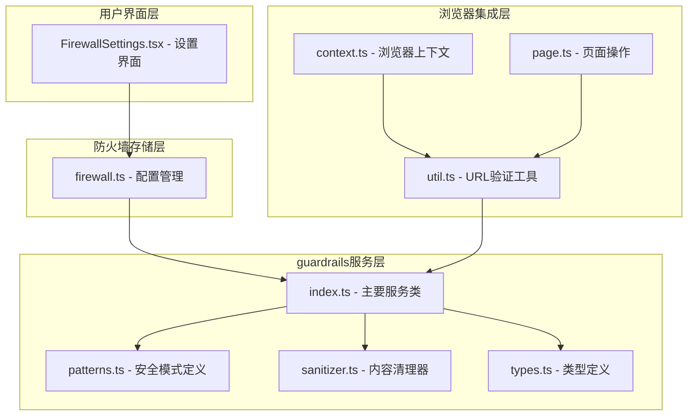
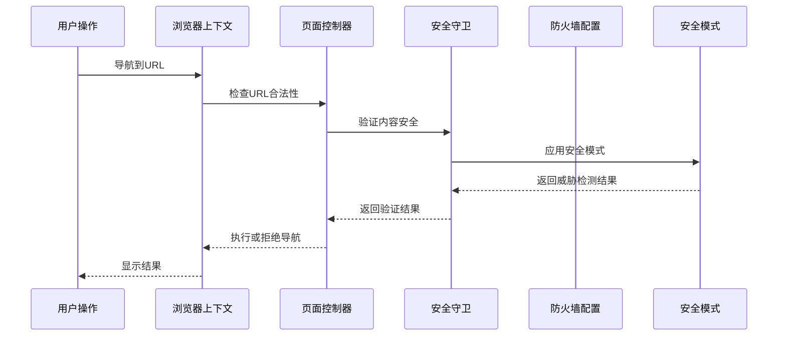
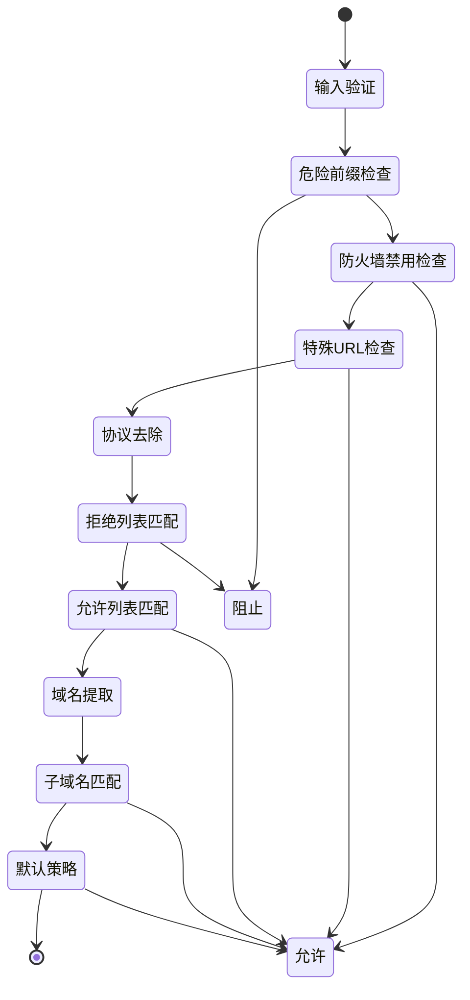
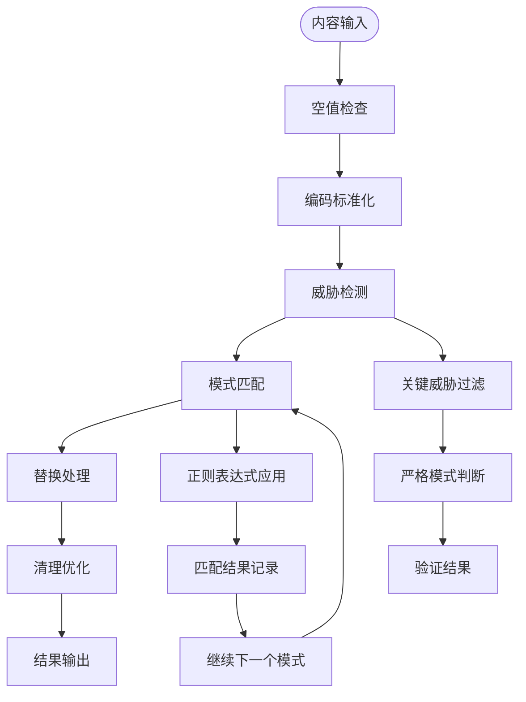
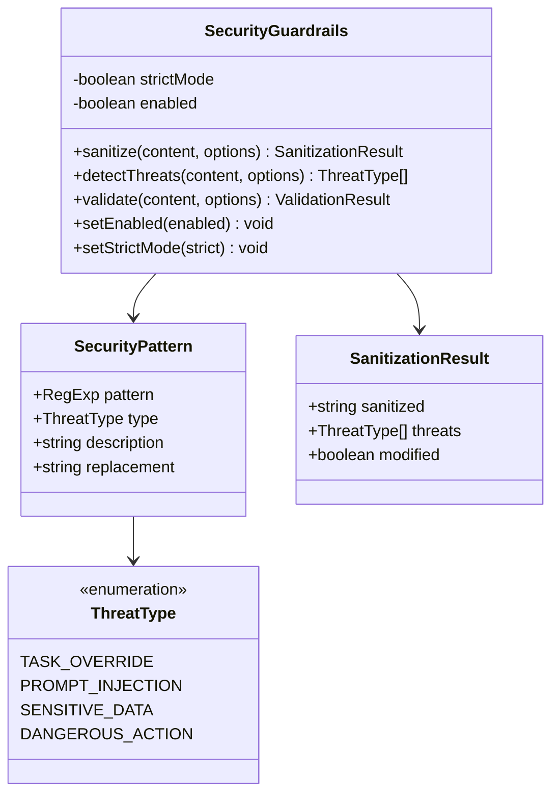
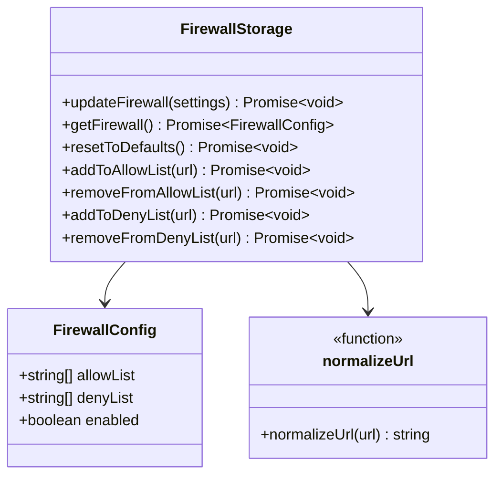
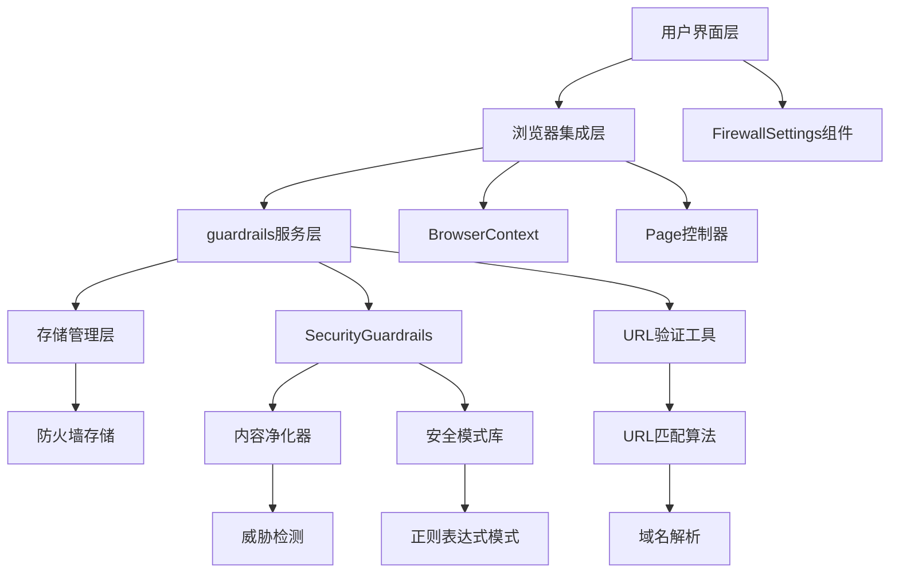

# 规则匹配引擎

<cite>
**本文档中引用的文件**
- [index.ts](file://chrome-extension/src/background/services/guardrails/index.ts)
- [patterns.ts](file://chrome-extension/src/background/services/guardrails/patterns.ts)
- [types.ts](file://chrome-extension/src/background/services/guardrails/types.ts)
- [sanitizer.ts](file://chrome-extension/src/background/services/guardrails/sanitizer.ts)
- [firewall.ts](file://packages/storage/lib/settings/firewall.ts)
- [util.ts](file://chrome-extension/src/background/browser/util.ts)
- [context.ts](file://chrome-extension/src/background/browser/context.ts)
- [page.ts](file://chrome-extension/src/background/browser/page.ts)
- [guardrails.test.ts](file://chrome-extension/src/background/services/guardrails/__tests__/guardrails.test.ts)
- [FirewallSettings.tsx](file://pages/options/src/components/FirewallSettings.tsx)
</cite>

## 目录
1. [简介](#简介)
2. [项目结构](#项目结构)
3. [核心组件](#核心组件)
4. [架构概览](#架构概览)
5. [详细组件分析](#详细组件分析)
6. [依赖关系分析](#依赖关系分析)
7. [性能考虑](#性能考虑)
8. [故障排除指南](#故障排除指南)
9. [结论](#结论)

## 简介

本文档深入解析了NanoBrowser扩展程序中的防火墙规则匹配逻辑实现。该系统采用双重安全防护机制：一方面通过guardrails服务在运行时加载防火墙配置并应用严格的优先级原则（denyList优先于allowList），另一方面通过patterns.ts中的正则表达式定义实现敏感模式检测，识别潜在的安全威胁。

系统的核心设计理念是"防御性编程"，通过多层次的安全检查确保用户免受恶意网站和危险内容的侵害。当页面操作请求触发时，系统会通过guardrails的validate方法进行实时检查，阻止对未授权站点的自动化操作。

## 项目结构

防火墙规则匹配引擎的核心文件分布在以下目录结构中：

**图表来源**
- [index.ts](file://chrome-extension/src/background/services/guardrails/index.ts#L1-L177)
- [patterns.ts](file://chrome-extension/src/background/services/guardrails/patterns.ts#L1-L159)
- [firewall.ts](file://packages/storage/lib/settings/firewall.ts#L1-L105)

**章节来源**
- [index.ts](file://chrome-extension/src/background/services/guardrails/index.ts#L1-L177)
- [patterns.ts](file://chrome-extension/src/background/services/guardrails/patterns.ts#L1-L159)
- [firewall.ts](file://packages/storage/lib/settings/firewall.ts#L1-L105)

## 核心组件

### SecurityGuardrails主服务类

SecurityGuardrails是整个防火墙系统的核心控制器，负责协调所有安全检查和内容过滤功能。该类提供了简洁而强大的API接口，支持严格模式和正常模式两种不同的安全级别。

主要功能包括：
- 内容净化和威胁检测
- 实时安全验证
- 动态配置管理
- 多层次威胁识别

### 安全模式定义系统

patterns.ts模块定义了全面的安全模式集合，涵盖以下威胁类型：

| 威胁类型 | 描述 | 检测模式 |
|---------|------|----------|
| TASK_OVERRIDE | 任务覆盖尝试 | 指令重写、新任务注入等 |
| PROMPT_INJECTION | 提示注入攻击 | 系统提示引用、XML标签等 |
| SENSITIVE_DATA | 敏感数据泄露 | 社保号、信用卡号、邮箱地址等 |
| DANGEROUS_ACTION | 危险操作 | 安全绕过尝试等 |

### URL匹配算法

URL匹配算法实现了复杂的域名和路径匹配逻辑，支持以下特性：

- **协议无关匹配**：自动移除http/https前缀
- **子域名支持**：支持通配符匹配如`.example.com`
- **精确匹配**：完全相同的URL匹配
- **默认策略**：空列表时允许所有访问

**章节来源**
- [index.ts](file://chrome-extension/src/background/services/guardrails/index.ts#L15-L177)
- [patterns.ts](file://chrome-extension/src/background/services/guardrails/patterns.ts#L9-L159)
- [util.ts](file://chrome-extension/src/background/browser/util.ts#L1-L104)

## 架构概览

防火墙规则匹配引擎采用分层架构设计，确保安全性和可维护性：

**图表来源**
- [context.ts](file://chrome-extension/src/background/browser/context.ts#L232-L273)
- [page.ts](file://chrome-extension/src/background/browser/page.ts#L507-L514)
- [index.ts](file://chrome-extension/src/background/services/guardrails/index.ts#L81-L110)

## 详细组件分析

### URL匹配状态机

URL匹配过程遵循严格的优先级顺序，形成了一个清晰的状态机：

**图表来源**
- [util.ts](file://chrome-extension/src/background/browser/util.ts#L1-L104)

### 内容安全验证流程

内容安全验证采用了多阶段的检查机制：

**图表来源**
- [sanitizer.ts](file://chrome-extension/src/background/services/guardrails/sanitizer.ts#L15-L85)
- [index.ts](file://chrome-extension/src/background/services/guardrails/index.ts#L81-L110)

### 敏感模式检测机制

敏感模式检测基于预定义的正则表达式集合，实现了智能的威胁识别：

**图表来源**
- [types.ts](file://chrome-extension/src/background/services/guardrails/types.ts#L1-L44)
- [index.ts](file://chrome-extension/src/background/services/guardrails/index.ts#L15-L177)

**章节来源**
- [util.ts](file://chrome-extension/src/background/browser/util.ts#L1-L104)
- [sanitizer.ts](file://chrome-extension/src/background/services/guardrails/sanitizer.ts#L15-L129)
- [index.ts](file://chrome-extension/src/background/services/guardrails/index.ts#L81-L110)

### 防火墙配置管理系统

防火墙配置管理系统提供了灵活的URL黑白名单管理功能：

**图表来源**
- [firewall.ts](file://packages/storage/lib/settings/firewall.ts#L5-L105)

**章节来源**
- [firewall.ts](file://packages/storage/lib/settings/firewall.ts#L45-L105)

## 依赖关系分析

系统的依赖关系呈现清晰的分层结构：

**图表来源**
- [context.ts](file://chrome-extension/src/background/browser/context.ts#L1-L361)
- [index.ts](file://chrome-extension/src/background/services/guardrails/index.ts#L1-L177)
- [firewall.ts](file://packages/storage/lib/settings/firewall.ts#L1-L105)

**章节来源**
- [context.ts](file://chrome-extension/src/background/browser/context.ts#L1-L361)
- [index.ts](file://chrome-extension/src/background/services/guardrails/index.ts#L1-L177)
- [firewall.ts](file://packages/storage/lib/settings/firewall.ts#L1-L105)

## 性能考虑

### 匹配算法优化

1. **正则表达式缓存**：每次匹配都创建新的RegExp实例，避免状态污染
2. **早期退出机制**：一旦发现危险内容立即停止处理
3. **批量处理**：同时应用多个模式，减少循环次数
4. **内存管理**：及时释放不再需要的正则表达式实例

### URL匹配优化策略

1. **字符串预处理**：统一转换为小写并去除协议前缀
2. **索引优化**：使用Set数据结构加速查找
3. **分支预测**：根据常见情况调整检查顺序
4. **异常处理**：优雅处理无效URL格式

### 内存使用优化

1. **惰性加载**：仅在需要时加载安全模式
2. **对象池**：重用临时对象减少GC压力
3. **流式处理**：大内容分块处理避免内存溢出

## 故障排除指南

### 常见问题诊断

| 问题类型 | 症状 | 可能原因 | 解决方案 |
|---------|------|----------|----------|
| URL被错误阻止 | 合法网站无法访问 | denyList包含误判域名 | 检查denyList配置 |
| 安全威胁误报 | 正常内容被标记为威胁 | 正则表达式过于宽泛 | 调整安全模式 |
| 性能下降 | 页面加载缓慢 | 过度的安全检查 | 启用严格模式或优化规则 |
| 配置丢失 | 设置无法保存 | 存储权限问题 | 检查浏览器存储设置 |

### 调试技巧

1. **日志分析**：启用详细日志记录跟踪匹配过程
2. **模式测试**：使用在线正则表达式工具验证模式有效性
3. **单元测试**：运行完整的测试套件确保功能正确性
4. **性能监控**：监控匹配时间和内存使用情况

**章节来源**
- [guardrails.test.ts](file://chrome-extension/src/background/services/guardrails/__tests__/guardrails.test.ts#L1-L133)

## 结论

NanoBrowser的规则匹配引擎展现了现代Web扩展程序在安全性方面的最佳实践。通过精心设计的分层架构、严格的优先级控制和智能的威胁检测机制，系统能够在保证用户体验的同时提供强大的安全保障。

关键优势包括：
- **双重防护机制**：防火墙规则与内容安全检查相结合
- **灵活的配置系统**：支持动态更新和细粒度控制
- **高性能匹配算法**：优化的URL匹配和正则表达式处理
- **完善的错误处理**：优雅降级和故障恢复机制

该系统为其他类似项目提供了宝贵的参考价值，特别是在处理大规模URL匹配和内容安全检查方面积累了丰富的经验。随着网络威胁的不断演进，这套规则匹配引擎将继续发挥重要作用，保护用户免受各种安全威胁的侵害。