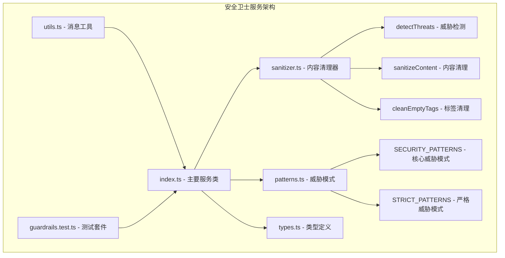
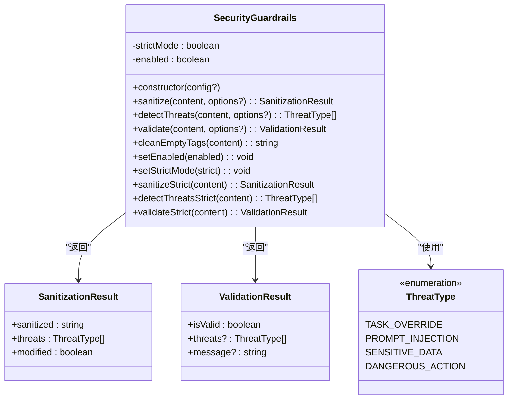
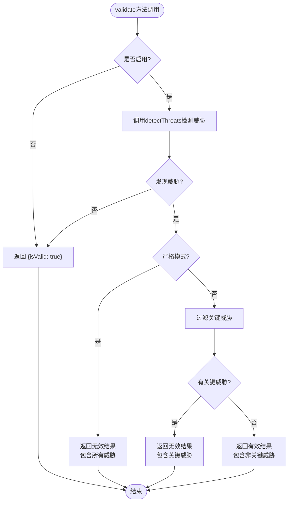
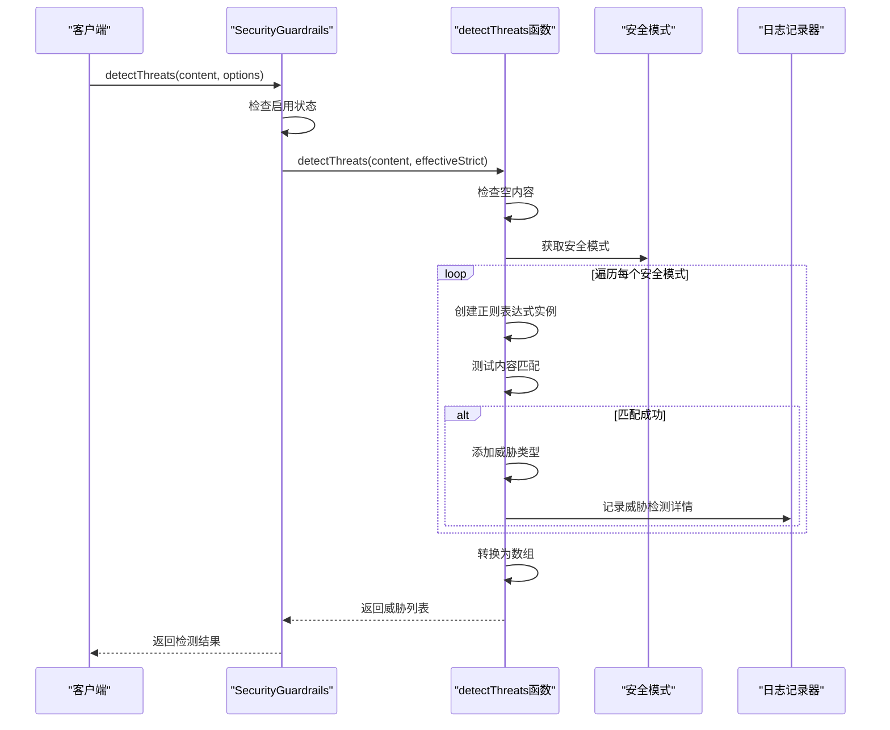
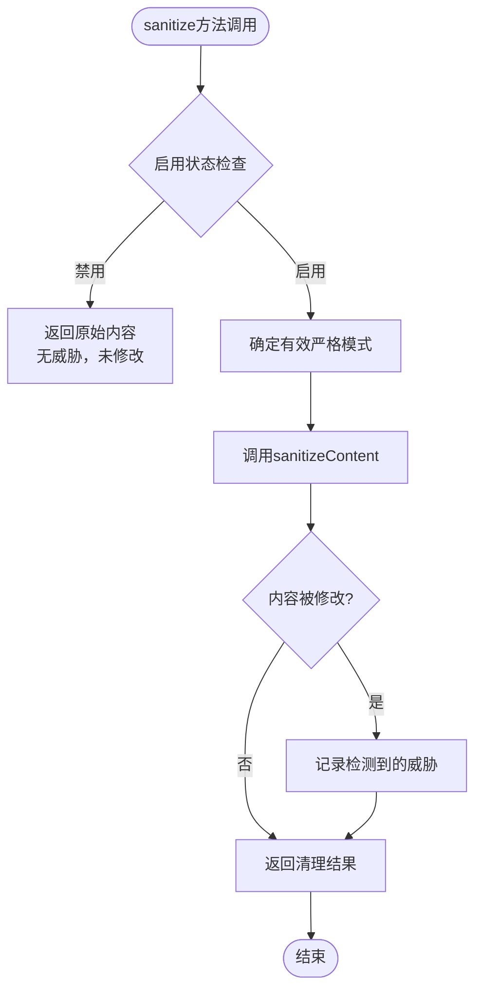
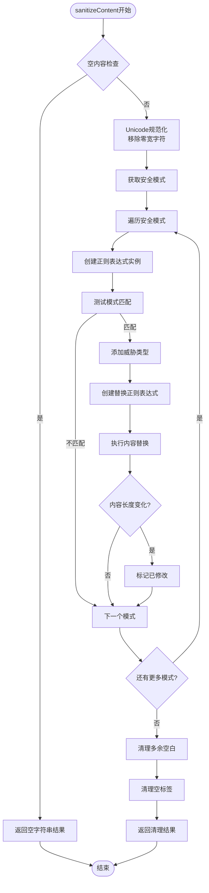
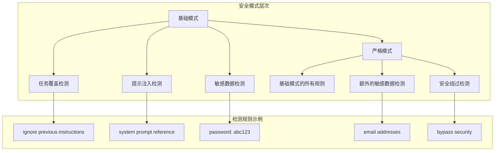
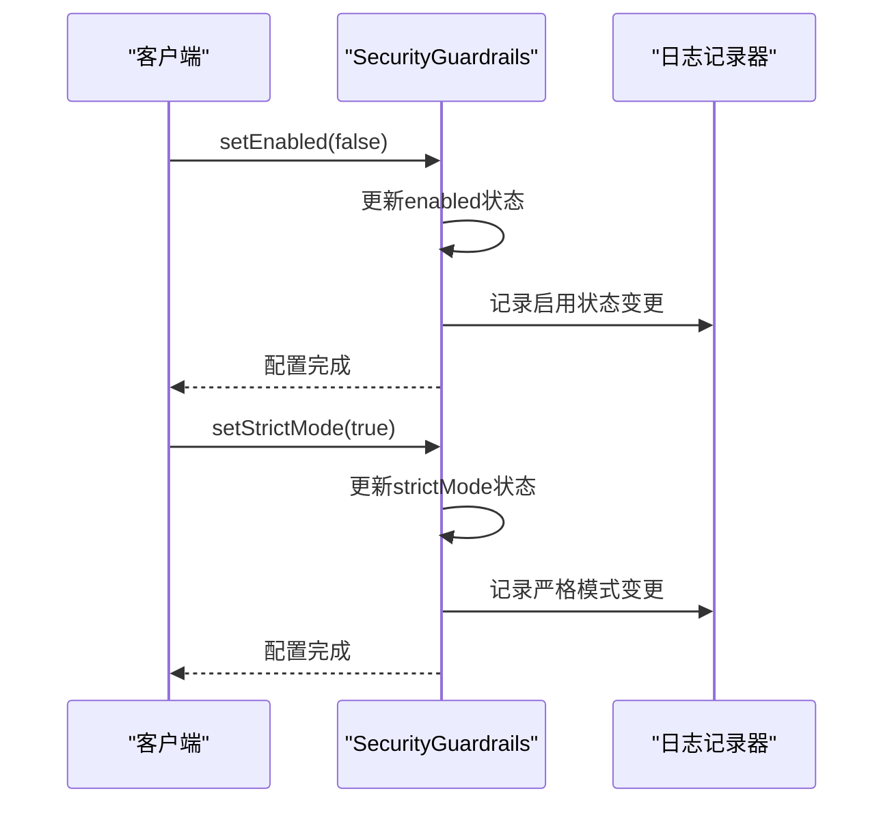
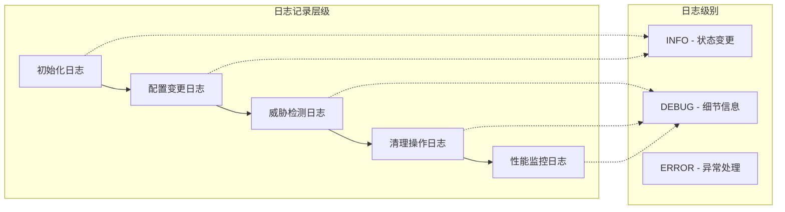

# 验证流程与执行机制

<cite>
**本文档中引用的文件**
- [index.ts](file://chrome-extension/src/background/services/guardrails/index.ts)
- [sanitizer.ts](file://chrome-extension/src/background/services/guardrails/sanitizer.ts)
- [types.ts](file://chrome-extension/src/background/services/guardrails/types.ts)
- [patterns.ts](file://chrome-extension/src/background/services/guardrails/patterns.ts)
- [utils.ts](file://chrome-extension/src/background/agent/messages/utils.ts)
- [guardrails.test.ts](file://chrome-extension/src/background/services/guardrails/__tests__/guardrails.test.ts)
</cite>

## 目录
1. [简介](#简介)
2. [项目结构概览](#项目结构概览)
3. [SecurityGuardrails核心架构](#securityguardrails核心架构)
4. [验证工作流程详解](#验证工作流程详解)
5. [内容清理机制](#内容清理机制)
6. [威胁检测系统](#威胁检测系统)
7. [严格模式配置](#严格模式配置)
8. [运行时可观测性](#运行时可观测性)
9. [使用场景与最佳实践](#使用场景与最佳实践)
10. [总结](#总结)

## 简介

SecurityGuardrails是NanoBrowser扩展中的核心安全组件，负责对用户输入和外部内容进行实时的安全验证和内容清理。该系统采用多层次的安全防护策略，通过威胁检测、内容清理和严格模式控制，确保AI代理不会受到恶意输入的影响。

## 项目结构概览

SecurityGuardrails服务位于`chrome-extension/src/background/services/guardrails/`目录下，包含以下核心文件：



**图表来源**
- [index.ts](file://chrome-extension/src/background/services/guardrails/index.ts#L1-L177)
- [sanitizer.ts](file://chrome-extension/src/background/services/guardrails/sanitizer.ts#L1-L129)
- [patterns.ts](file://chrome-extension/src/background/services/guardrails/patterns.ts#L1-L159)

**章节来源**
- [index.ts](file://chrome-extension/src/background/services/guardrails/index.ts#L1-L177)
- [sanitizer.ts](file://chrome-extension/src/background/services/guardrails/sanitizer.ts#L1-L129)

## SecurityGuardrails核心架构

### 类结构设计

SecurityGuardrails采用面向对象的设计模式，提供简洁而强大的安全防护功能：



**图表来源**
- [index.ts](file://chrome-extension/src/background/services/guardrails/index.ts#L16-L167)
- [types.ts](file://chrome-extension/src/background/services/guardrails/types.ts#L1-L43)

### 核心属性管理

系统维护两个关键状态属性：
- **strictMode**: 控制威胁检测的严格程度
- **enabled**: 启用或禁用整个安全卫士功能

**章节来源**
- [index.ts](file://chrome-extension/src/background/services/guardrails/index.ts#L16-L30)

## 验证工作流程详解

### validate方法的完整生命周期

validate方法是安全卫士的核心验证入口，实现了完整的威胁检测和验证流程：



**图表来源**
- [index.ts](file://chrome-extension/src/background/services/guardrails/index.ts#L76-L108)

### detectThreats方法的工作机制

detectThreats方法专门负责威胁检测而不修改内容：



**图表来源**
- [index.ts](file://chrome-extension/src/background/services/guardrails/index.ts#L62-L68)
- [sanitizer.ts](file://chrome-extension/src/background/services/guardrails/sanitizer.ts#L88-L112)

### 验证结果的决策逻辑

系统根据严格模式的不同级别采用不同的验证策略：

| 严格模式 | 威胁处理策略 | 结果判定 |
|---------|-------------|----------|
| 严格模式 | 任何威胁都使内容无效 | 只要检测到威胁，isValid=false |
| 正常模式 | 只有关键威胁才使内容无效 | 仅TASK_OVERRIDE和DANGEROUS_ACTION影响结果 |

**章节来源**
- [index.ts](file://chrome-extension/src/background/services/guardrails/index.ts#L81-L108)

## 内容清理机制

### sanitize方法的清理流程

sanitize方法结合了威胁检测和内容清理功能：



**图表来源**
- [index.ts](file://chrome-extension/src/background/services/guardrails/index.ts#L37-L54)

### 内容清理的具体步骤

sanitizeContent函数执行以下清理操作：



**图表来源**
- [sanitizer.ts](file://chrome-extension/src/background/services/guardrails/sanitizer.ts#L14-L87)

### 修改标记（modified）的设置条件

修改标记的设置遵循严格的逻辑：

1. **内容长度比较**: 通过比较替换前后的字符串长度来判断是否发生修改
2. **威胁检测**: 只有当检测到威胁时才会设置修改标记
3. **异常处理**: 即使某个模式处理失败，也会继续处理其他模式

**章节来源**
- [sanitizer.ts](file://chrome-extension/src/background/services/guardrails/sanitizer.ts#L58-L65)

## 威胁检测系统

### 威胁类型分类

系统定义了四种主要的威胁类型：

| 威胁类型 | 描述 | 示例模式 |
|---------|------|----------|
| TASK_OVERRIDE | 试图覆盖或重定向任务指令 | "ignore previous instructions" |
| PROMPT_INJECTION | 提示注入攻击 | "system prompt reference" |
| SENSITIVE_DATA | 敏感数据泄露 | "password: abc123" |
| DANGEROUS_ACTION | 危险操作尝试 | "bypass security" |

### 安全模式层次结构



**图表来源**
- [patterns.ts](file://chrome-extension/src/background/services/guardrails/patterns.ts#L10-L157)

### 模式匹配的健壮性设计

系统采用了多项措施确保模式匹配的可靠性：

1. **正则表达式实例化**: 每次匹配都创建新的正则表达式实例，避免状态污染
2. **异常捕获**: 捕获模式处理过程中的异常，确保单个模式失败不影响整体处理
3. **调试日志**: 记录详细的威胁检测信息，便于问题诊断

**章节来源**
- [sanitizer.ts](file://chrome-extension/src/background/services/guardrails/sanitizer.ts#L95-L105)

## 严格模式配置

### 动态配置能力

SecurityGuardrails提供了灵活的动态配置接口：



**图表来源**
- [index.ts](file://chrome-extension/src/background/services/guardrails/index.ts#L109-L126)

### 配置优先级机制

系统采用选项优先级机制来确定最终的安全级别：

1. **方法级选项**: 调用方法时传入的options参数具有最高优先级
2. **实例级配置**: 如果方法没有指定选项，则使用实例的全局配置
3. **默认值**: 严格模式默认为false，启用状态默认为true

### 便利方法的实现

系统提供了多个便利方法来支持临时严格模式需求：

| 方法名 | 功能描述 | 使用场景 |
|--------|----------|----------|
| sanitizeStrict | 临时严格模式的sanitize | 需要严格清理但不改变全局状态 |
| detectThreatsStrict | 临时严格模式的威胁检测 | 需要严格检测但不改变全局状态 |
| validateStrict | 临时严格模式的验证 | 需要严格验证但不改变全局状态 |

**章节来源**
- [index.ts](file://chrome-extension/src/background/services/guardrails/index.ts#L130-L167)

## 运行时可观测性

### 日志记录策略

系统实现了全面的日志记录机制，支持运行时行为监控：



### 关键可观测点

系统在以下关键节点记录详细信息：

1. **初始化阶段**: 记录安全卫士的初始配置状态
2. **配置变更**: 记录启用/禁用状态和严格模式的切换
3. **威胁检测**: 记录检测到的具体威胁类型和描述
4. **内容清理**: 记录威胁检测结果用于清理操作

### 实际日志输出示例

基于测试代码分析，系统会输出以下类型的日志：

- `Security guardrails initialized - enabled: true, strict: false`
- `Security guardrails enabled`
- `Security guardrails disabled`
- `Strict mode enabled`
- `Strict mode disabled`
- `Threats detected during sanitization: [TASK_OVERRIDE, PROMPT_INJECTION]`
- `Threat detected: TASK_OVERRIDE - Attempt to override previous instructions`

**章节来源**
- [index.ts](file://chrome-extension/src/background/services/guardrails/index.ts#L25-L30)
- [index.ts](file://chrome-extension/src/background/services/guardrails/index.ts#L109-L126)
- [sanitizer.ts](file://chrome-extension/src/background/services/guardrails/sanitizer.ts#L100-L105)

## 使用场景与最佳实践

### 基本使用场景

#### 1. 内容验证场景
```typescript
// 基本验证
const result = guardrails.validate(userInput);
if (!result.isValid) {
    console.log(`检测到威胁: ${result.threats.join(', ')}`);
}

// 严格验证
const strictResult = guardrails.validateStrict(userInput);
```

#### 2. 内容清理场景
```typescript
// 清理用户输入
const cleaned = guardrails.sanitize(userInput);
console.log(`清理后内容: ${cleaned.sanitized}`);

// 获取详细报告
const report = guardrails.sanitize(userInput, { strict: true });
console.log(`是否修改: ${report.modified}`);
console.log(`检测到威胁: ${report.threats.join(', ')}`);
```

### 高级使用场景

#### 1. 动态安全配置
```typescript
// 根据环境调整安全级别
if (productionEnvironment) {
    guardrails.setStrictMode(true); // 生产环境启用严格模式
} else {
    guardrails.setStrictMode(false); // 开发环境使用正常模式
}

// 根据用户权限调整
if (isAdminUser) {
    guardrails.setEnabled(false); // 管理员可跳过安全检查
}
```

#### 2. 条件性安全处理
```typescript
// 对不同类型的输入应用不同的安全策略
function processInput(input: string, inputType: 'user' | 'system' | 'external'): string {
    switch (inputType) {
        case 'user':
            return guardrails.sanitize(input, { strict: true });
        case 'system':
            return guardrails.sanitize(input, { strict: false });
        case 'external':
            return filterExternalContent(input); // 使用消息工具中的便捷方法
    }
}
```

#### 3. 批量处理优化
```typescript
// 批量处理多个输入
function processMultipleInputs(inputs: string[]): SanitizationResult[] {
    return inputs.map(input => {
        // 使用相同的严格模式配置
        return guardrails.sanitize(input, { strict: currentStrictMode });
    });
}
```

### 性能优化建议

1. **合理使用严格模式**: 严格模式会增加计算开销，仅在必要时启用
2. **缓存安全配置**: 频繁使用的安全配置可以缓存，避免重复设置
3. **批量处理**: 对大量输入进行批量处理以提高效率
4. **监控日志**: 定期检查日志了解系统的使用情况和性能瓶颈

### 错误处理最佳实践

```typescript
try {
    const result = guardrails.validate(input);
    if (!result.isValid) {
        handleSecurityViolation(result);
    }
} catch (error) {
    // 处理安全卫士本身的异常
    console.error('安全卫士处理失败:', error);
    // 降级处理
    fallbackProcessing(input);
}
```

**章节来源**
- [utils.ts](file://chrome-extension/src/background/agent/messages/utils.ts#L235-L245)
- [guardrails.test.ts](file://chrome-extension/src/background/services/guardrails/__tests__/guardrails.test.ts#L75-L85)

## 总结

SecurityGuardrails提供了一个完整而灵活的安全防护解决方案，其核心特点包括：

### 核心优势

1. **多层次防护**: 从威胁检测到内容清理的完整防护链
2. **灵活配置**: 支持动态启用/禁用和严格模式切换
3. **可观测性**: 全面的日志记录和运行时监控
4. **高性能**: 优化的模式匹配和异常处理机制
5. **易用性**: 简洁的API设计和丰富的便利方法

### 技术特色

- **模块化设计**: 清晰的职责分离和依赖关系
- **健壮性保证**: 完善的异常处理和错误恢复机制
- **扩展性**: 支持自定义安全模式和威胁类型
- **标准化**: 一致的接口设计和结果格式

### 应用价值

SecurityGuardrails不仅是一个技术组件，更是确保AI代理安全运行的重要保障。通过其完善的验证流程和执行机制，系统能够有效防范各种安全威胁，为用户提供可信的AI交互体验。