# 防火墙安全机制

<cite>
**本文档中引用的文件**
- [firewall.ts](file://packages/storage/lib/settings/firewall.ts)
- [index.ts](file://chrome-extension/src/background/services/guardrails/index.ts)
- [patterns.ts](file://chrome-extension/src/background/services/guardrails/patterns.ts)
- [sanitizer.ts](file://chrome-extension/src/background/services/guardrails/sanitizer.ts)
- [types.ts](file://chrome-extension/src/background/services/guardrails/types.ts)
- [FirewallSettings.tsx](file://pages/options/src/components/FirewallSettings.tsx)
- [util.ts](file://chrome-extension/src/background/browser/util.ts)
- [context.ts](file://chrome-extension/src/background/browser/context.ts)
- [page.ts](file://chrome-extension/src/background/browser/page.ts)
- [views.ts](file://chrome-extension/src/background/browser/views.ts)
</cite>

## 目录
1. [简介](#简介)
2. [系统架构概览](#系统架构概览)
3. [核心组件分析](#核心组件分析)
4. [配置规则与匹配逻辑](#配置规则与匹配逻辑)
5. [运行时验证机制](#运行时验证机制)
6. [用户界面与配置管理](#用户界面与配置管理)
7. [安全策略与默认行为](#安全策略与默认行为)
8. [实际应用场景](#实际应用场景)
9. [故障排除指南](#故障排除指南)
10. [总结](#总结)

## 简介

Nano Browser 的防火墙安全机制是一个多层次的安全防护系统，旨在通过精细化的 URL 访问控制来保护用户免受恶意网站的侵害。该机制通过 `allowedUrls` 和 `deniedUrls` 配置项实现对扩展访问范围的精确控制，确保用户只能访问经过授权的网站资源。

防火墙系统不仅提供了基础的 URL 过滤功能，还集成了内容安全检查、威胁检测和自动化的访问控制机制，为用户提供了一个安全可靠的浏览环境。

## 系统架构概览

防火墙安全机制采用分层架构设计，包含配置存储层、验证引擎层和用户界面层三个主要组成部分。

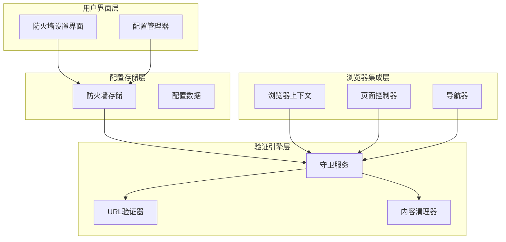

**图表来源**
- [FirewallSettings.tsx](file://pages/options/src/components/FirewallSettings.tsx#L1-L225)
- [firewall.ts](file://packages/storage/lib/settings/firewall.ts#L45-L105)
- [index.ts](file://chrome-extension/src/background/services/guardrails/index.ts#L1-L177)

## 核心组件分析

### 防火墙配置接口

防火墙系统的核心配置结构定义了允许列表、拒绝列表和启用状态等关键参数。

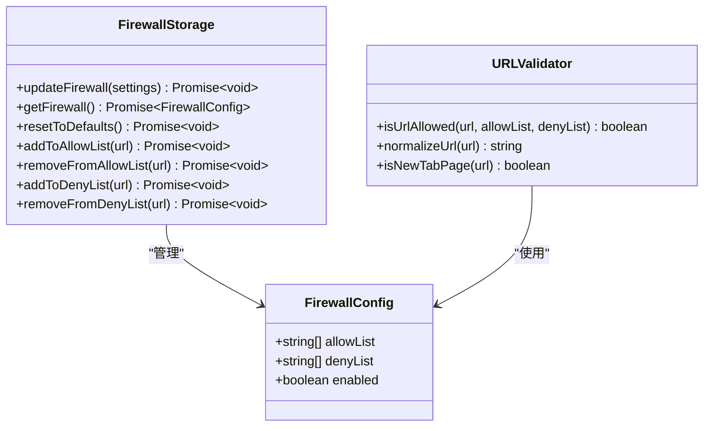

**图表来源**
- [firewall.ts](file://packages/storage/lib/settings/firewall.ts#L5-L15)
- [firewall.ts](file://packages/storage/lib/settings/firewall.ts#L20-L35)
- [util.ts](file://chrome-extension/src/background/browser/util.ts#L1-L104)

### 守卫服务架构

守卫服务是防火墙机制的核心执行引擎，负责内容安全检查和威胁检测。

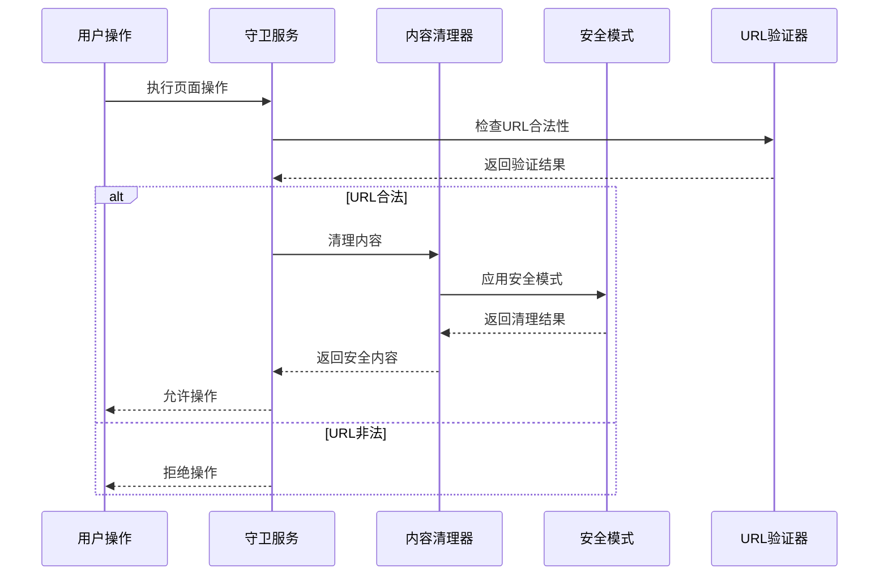

**图表来源**
- [index.ts](file://chrome-extension/src/background/services/guardrails/index.ts#L15-L177)
- [sanitizer.ts](file://chrome-extension/src/background/services/guardrails/sanitizer.ts#L15-L129)
- [util.ts](file://chrome-extension/src/background/browser/util.ts#L1-L104)

**章节来源**
- [firewall.ts](file://packages/storage/lib/settings/firewall.ts#L1-L105)
- [index.ts](file://chrome-extension/src/background/services/guardrails/index.ts#L1-L177)
- [util.ts](file://chrome-extension/src/background/browser/util.ts#L1-L104)

## 配置规则与匹配逻辑

### URL匹配算法

防火墙系统采用多层级的URL匹配算法，确保精确的访问控制。

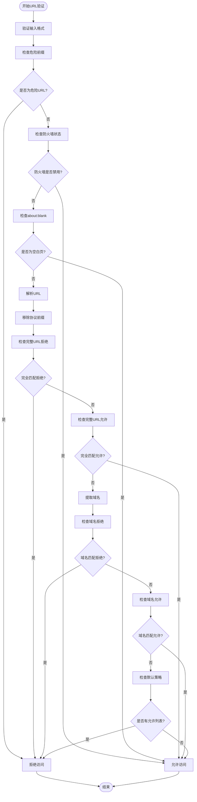

**图表来源**
- [util.ts](file://chrome-extension/src/background/browser/util.ts#L1-L104)

### 优先级处理机制

防火墙系统实现了严格的优先级处理机制，确保拒绝规则优先于允许规则：

| 匹配层级 | 规则类型 | 优先级 | 描述 |
|---------|---------|--------|------|
| 1 | 危险前缀检查 | 最高 | 永远拒绝的URL前缀（如chrome-extension://） |
| 2 | 完整URL拒绝 | 高 | 精确匹配的拒绝URL |
| 3 | 完整URL允许 | 中 | 精确匹配的允许URL |
| 4 | 域名拒绝 | 中 | 基于域名的拒绝规则 |
| 5 | 域名允许 | 低 | 基于域名的允许规则 |
| 6 | 默认策略 | 最低 | 允许列表为空时的行为 |

**章节来源**
- [util.ts](file://chrome-extension/src/background/browser/util.ts#L1-L104)

## 运行时验证机制

### 实时URL验证

在每次页面操作执行前，系统都会进行实时的URL验证：

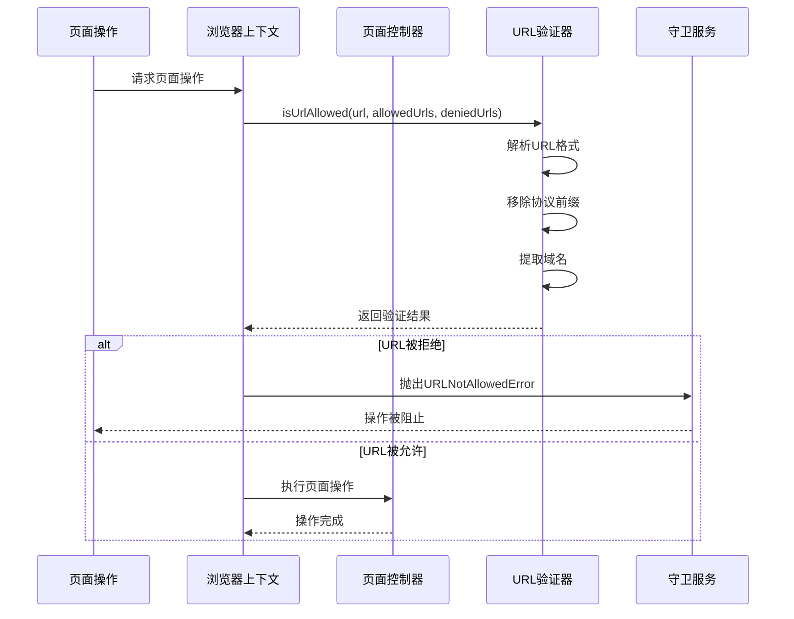

**图表来源**
- [context.ts](file://chrome-extension/src/background/browser/context.ts#L232-L273)
- [page.ts](file://chrome-extension/src/background/browser/page.ts#L480-L508)
- [util.ts](file://chrome-extension/src/background/browser/util.ts#L1-L104)

### 自动化操作拦截

对于自动化脚本的操作请求，防火墙系统会进行额外的安全检查：

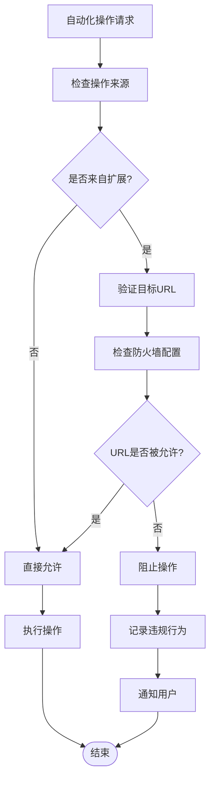

**图表来源**
- [index.ts](file://chrome-extension/src/background/services/guardrails/index.ts#L15-L177)
- [context.ts](file://chrome-extension/src/background/browser/context.ts#L232-L273)

**章节来源**
- [context.ts](file://chrome-extension/src/background/browser/context.ts#L232-L273)
- [page.ts](file://chrome-extension/src/background/browser/page.ts#L480-L508)
- [index.ts](file://chrome-extension/src/background/services/guardrails/index.ts#L15-L177)

## 用户界面与配置管理

### 防火墙设置界面

用户可以通过直观的界面管理防火墙配置：

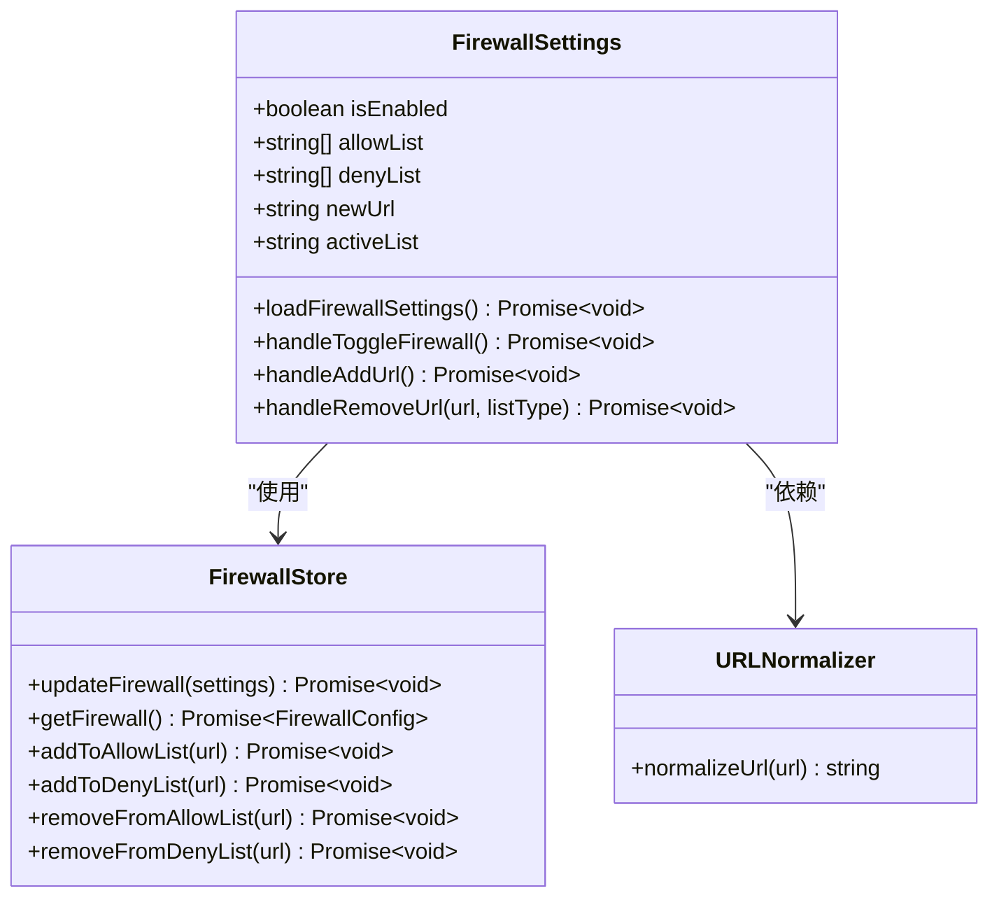

**图表来源**
- [FirewallSettings.tsx](file://pages/options/src/components/FirewallSettings.tsx#L1-L225)
- [firewall.ts](file://packages/storage/lib/settings/firewall.ts#L45-L105)

### 配置操作流程

用户可以轻松地添加、删除和管理URL规则：

| 操作类型 | 用户界面 | 后端处理 | 存储更新 |
|---------|---------|---------|---------|
| 添加允许URL | 输入框 + 添加按钮 | normalizeUrl() | 更新allowList |
| 添加拒绝URL | 输入框 + 添加按钮 | normalizeUrl() | 更新denyList |
| 删除允许URL | 列表项上的删除按钮 | 过滤allowList | 更新存储 |
| 删除拒绝URL | 列表项上的删除按钮 | 过滤denyList | 更新存储 |
| 启用/禁用防火墙 | 开关控件 | 更新enabled状态 | 立即生效 |

**章节来源**
- [FirewallSettings.tsx](file://pages/options/src/components/FirewallSettings.tsx#L1-L225)
- [firewall.ts](file://packages/storage/lib/settings/firewall.ts#L45-L105)

## 安全策略与默认行为

### 默认安全策略

防火墙系统采用"拒绝优于许可"的安全策略：

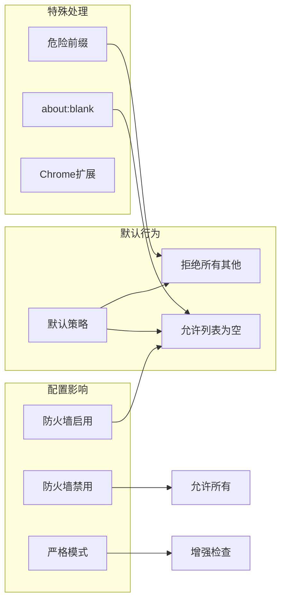

**图表来源**
- [firewall.ts](file://packages/storage/lib/settings/firewall.ts#L35-L43)
- [util.ts](file://chrome-extension/src/background/browser/util.ts#L15-L35)

### 危险URL前缀列表

系统预定义了一组危险URL前缀，这些前缀永远被拒绝：

| 前缀类型 | 示例URL | 安全考虑 |
|---------|---------|---------|
| Chrome扩展 | chrome-extension:// | 防止恶意扩展注入 |
| Chrome内部 | chrome:// | 保护系统安全 |
| JavaScript | javascript: | 防止代码注入攻击 |
| 数据URI | data: | 防止恶意数据加载 |
| 文件协议 | file: | 防止本地文件访问 |
| WebSocket | ws:, wss: | 防止不安全连接 |

**章节来源**
- [util.ts](file://chrome-extension/src/background/browser/util.ts#L15-L35)
- [firewall.ts](file://packages/storage/lib/settings/firewall.ts#L35-L43)

## 实际应用场景

### 白名单模式

适用于企业环境或需要严格控制访问的场景：

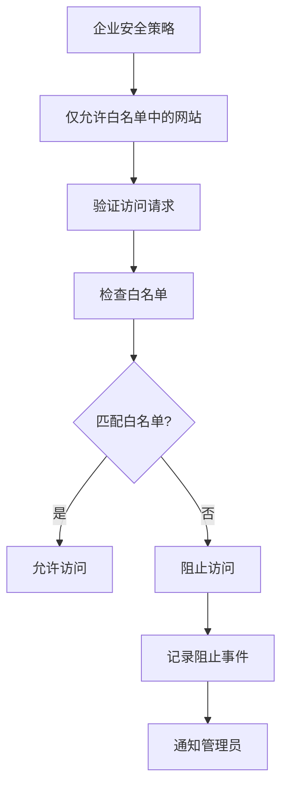

### 黑名单模式

适用于需要开放大部分网站但阻止特定危险网站的场景：

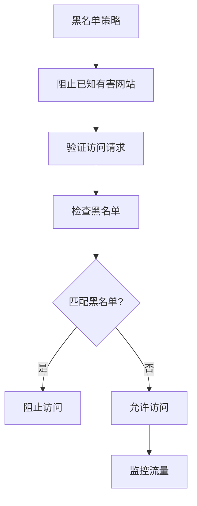

### 混合模式

结合白名单和黑名单的综合策略：

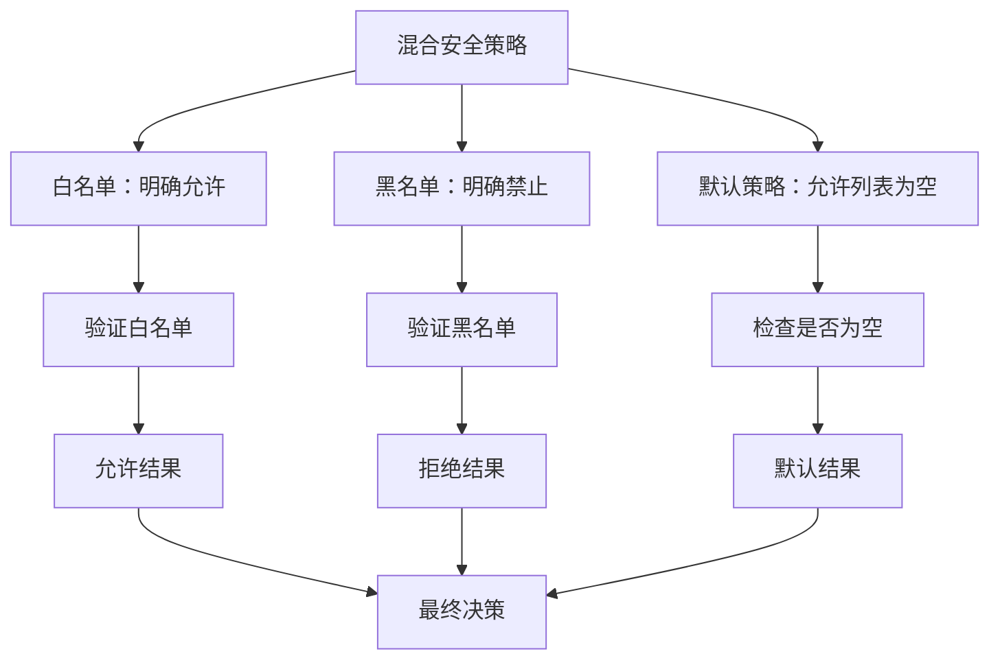

**章节来源**
- [FirewallSettings.tsx](file://pages/options/src/components/FirewallSettings.tsx#L1-L225)
- [firewall.ts](file://packages/storage/lib/settings/firewall.ts#L35-L43)

## 故障排除指南

### 常见问题诊断

| 问题症状 | 可能原因 | 解决方案 |
|---------|---------|---------|
| 页面无法加载 | URL被拒绝 | 检查防火墙配置，将URL添加到允许列表 |
| 设置无法保存 | 存储权限问题 | 检查扩展权限设置 |
| 验证失败 | URL格式错误 | 使用正确的URL格式（无需http://前缀） |
| 性能下降 | 规则过多 | 优化URL规则，减少不必要的复杂匹配 |

### 调试工具和日志

系统提供了详细的日志记录功能，帮助诊断问题：

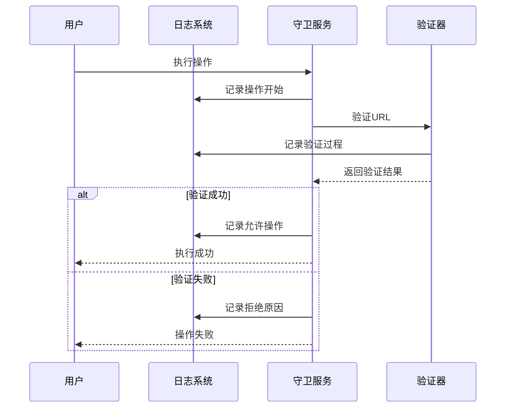

**图表来源**
- [index.ts](file://chrome-extension/src/background/services/guardrails/index.ts#L15-L177)

### 性能优化建议

为了确保防火墙系统的高效运行，建议采取以下优化措施：

1. **合理使用通配符**：避免过于复杂的正则表达式模式
2. **定期清理规则**：移除不再需要的URL规则
3. **分层过滤**：优先使用简单匹配，避免复杂的嵌套规则
4. **缓存机制**：利用URL验证结果的缓存机制

**章节来源**
- [index.ts](file://chrome-extension/src/background/services/guardrails/index.ts#L15-L177)
- [util.ts](file://chrome-extension/src/background/browser/util.ts#L1-L104)

## 总结

Nano Browser 的防火墙安全机制提供了一个全面而灵活的URL访问控制系统。通过 `allowedUrls` 和 `deniedUrls` 配置项，用户可以实现精细化的访问控制，确保只有经过授权的网站才能被访问。

该系统的主要优势包括：

1. **多层次防护**：从URL验证到内容清理的全方位安全保护
2. **灵活配置**：支持白名单、黑名单和混合模式的配置策略
3. **实时验证**：在每次页面操作前进行实时的安全检查
4. **用户友好**：提供直观的配置界面和清晰的错误提示
5. **性能优化**：高效的匹配算法和智能的缓存机制

防火墙机制在防止恶意网站滥用、保护用户隐私和维护浏览安全方面发挥着重要作用。通过合理的配置和使用，可以为用户提供一个安全可靠的网络浏览环境。