# 防火墙用户界面交互

<cite>
**本文档中引用的文件**
- [FirewallSettings.tsx](file://pages/options/src/components/FirewallSettings.tsx)
- [firewall.ts](file://packages/storage/lib/settings/firewall.ts)
- [useStorage.tsx](file://packages/shared/lib/hooks/useStorage.tsx)
- [Button.tsx](file://packages/ui/lib/components/Button.tsx)
- [base.ts](file://packages/storage/lib/base/base.ts)
- [types.ts](file://packages/storage/lib/base/types.ts)
</cite>

## 目录
1. [简介](#简介)
2. [项目结构概览](#项目结构概览)
3. [核心组件分析](#核心组件分析)
4. [架构概览](#架构概览)
5. [详细组件分析](#详细组件分析)
6. [依赖关系分析](#依赖关系分析)
7. [性能考虑](#性能考虑)
8. [故障排除指南](#故障排除指南)
9. [结论](#结论)

## 简介

FirewallSettings组件是NanoBrowser扩展程序选项页面中的核心防火墙配置界面，负责管理URL访问控制策略。该组件实现了完整的UI交互功能，包括防火墙启用/禁用、允许列表和拒绝列表的管理，以及与底层存储系统的实时同步机制。

该组件采用现代React Hooks模式，结合自定义存储抽象层，提供了流畅的用户体验和可靠的数据持久化能力。通过useCallback和useEffect的巧妙运用，确保了组件挂载时的配置加载和状态同步。

## 项目结构概览

FirewallSettings组件位于选项页面的组件层次结构中，与其他设置组件共同构成了完整的扩展配置界面。

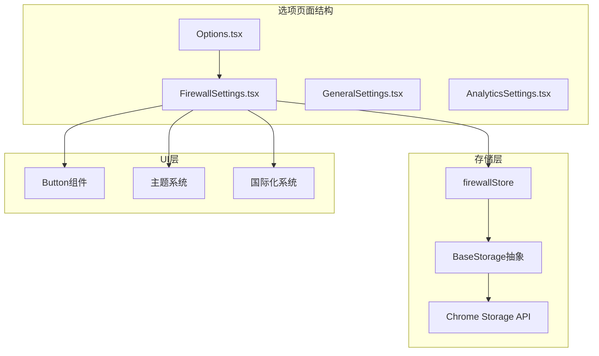

**图表来源**
- [FirewallSettings.tsx](file://pages/options/src/components/FirewallSettings.tsx#L1-L225)
- [firewall.ts](file://packages/storage/lib/settings/firewall.ts#L45-L105)

**章节来源**
- [FirewallSettings.tsx](file://pages/options/src/components/FirewallSettings.tsx#L1-L225)

## 核心组件分析

### 组件状态管理

FirewallSettings组件维护以下关键状态：

| 状态变量 | 类型 | 描述 | 默认值 |
|---------|------|------|--------|
| isEnabled | boolean | 防火墙启用状态 | true |
| allowList | string[] | 允许访问的域名列表 | [] |
| denyList | string[] | 拒绝访问的域名列表 | [] |
| newUrl | string | 新输入的URL地址 | '' |
| activeList | 'allow' \| 'deny' | 当前活跃的列表类型 | 'allow' |

### 存储同步机制

组件通过多层次的状态同步机制确保UI与存储的一致性：

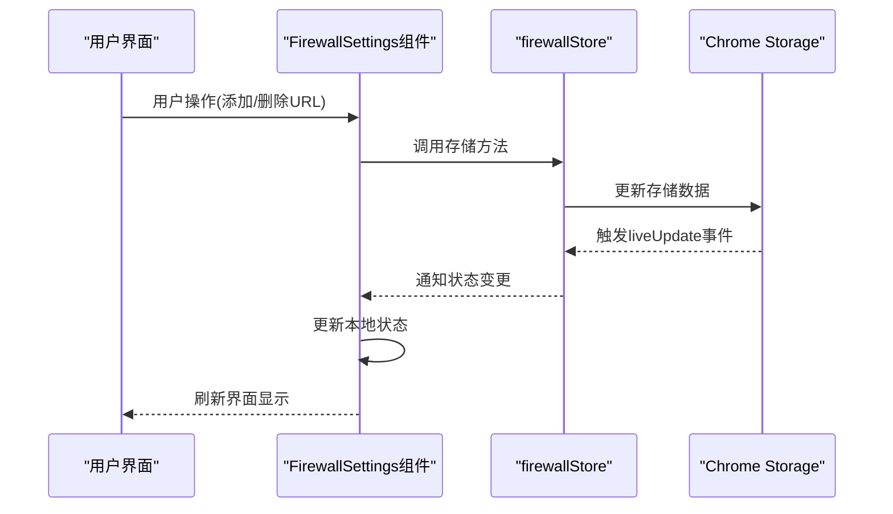

**图表来源**
- [FirewallSettings.tsx](file://pages/options/src/components/FirewallSettings.tsx#L25-L44)
- [firewall.ts](file://packages/storage/lib/settings/firewall.ts#L45-L105)

**章节来源**
- [FirewallSettings.tsx](file://pages/options/src/components/FirewallSettings.tsx#L10-L22)
- [firewall.ts](file://packages/storage/lib/settings/firewall.ts#L45-L105)

## 架构概览

FirewallSettings组件采用了分层架构设计，从底层存储到顶层UI形成了清晰的职责分离：

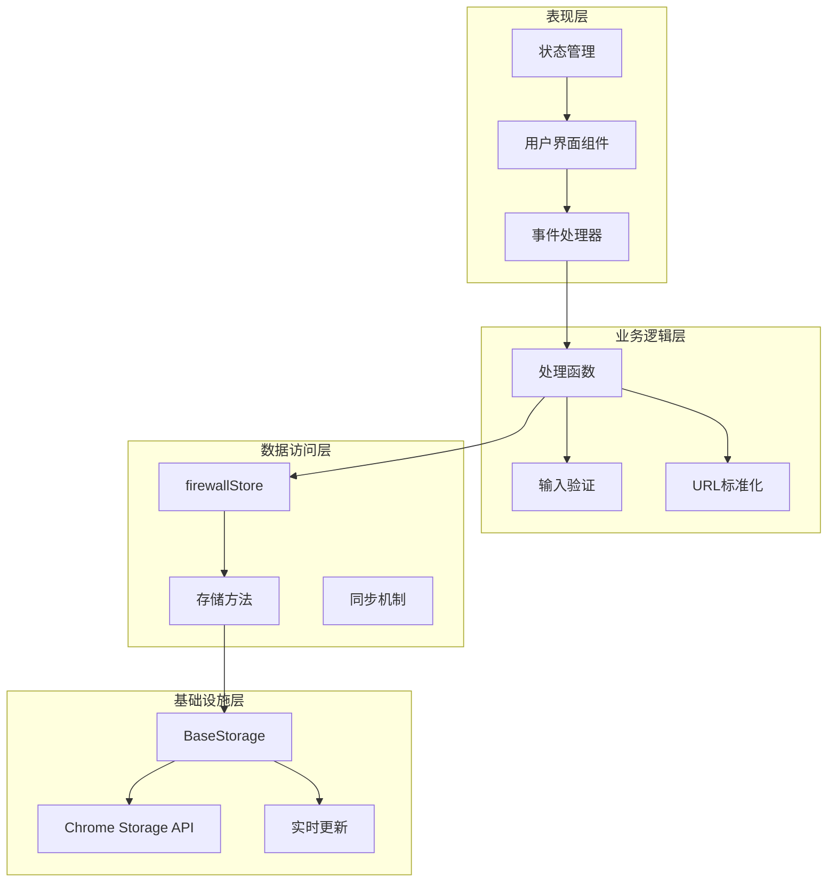

**图表来源**
- [FirewallSettings.tsx](file://pages/options/src/components/FirewallSettings.tsx#L1-L225)
- [firewall.ts](file://packages/storage/lib/settings/firewall.ts#L1-L105)
- [base.ts](file://packages/storage/lib/base/base.ts#L70-L157)

## 详细组件分析

### React状态管理实现

#### 组件初始化与配置加载

组件使用useEffect钩子确保在挂载时自动加载防火墙配置：

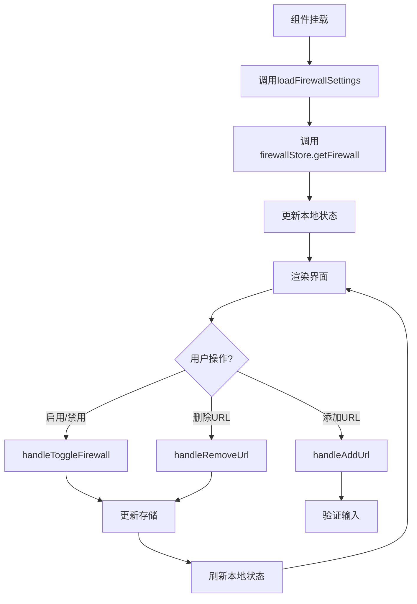

**图表来源**
- [FirewallSettings.tsx](file://pages/options/src/components/FirewallSettings.tsx#L25-L32)

#### useCallback优化策略

组件使用useCallback包装关键函数以避免不必要的重新渲染：

| 函数 | 优化原因 | 依赖项 |
|------|----------|--------|
| loadFirewallSettings | 避免每次渲染都创建新函数 | [] |
| handleToggleFirewall | 防止事件处理器重复绑定 | [] |
| handleAddUrl | 优化URL添加流程 | [newUrl, activeList] |
| handleRemoveUrl | 防止删除操作重复执行 | [activeList] |

### 底层存储同步机制

#### 异步存储操作流程

每个用户操作都会触发异步的存储更新流程：

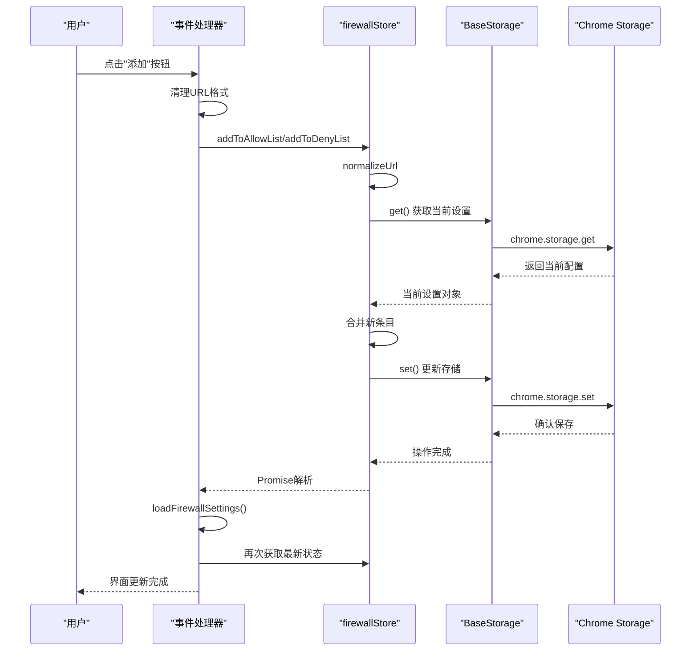

**图表来源**
- [FirewallSettings.tsx](file://pages/options/src/components/FirewallSettings.tsx#L34-L50)
- [firewall.ts](file://packages/storage/lib/settings/firewall.ts#L60-L84)

### 事件处理器详解

#### handleToggleFirewall - 防火墙开关控制

该处理器实现了防火墙状态的即时切换：

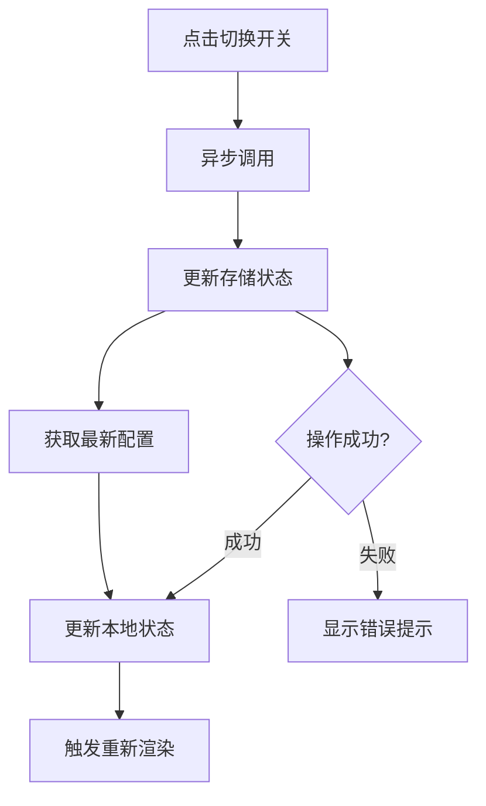

**图表来源**
- [FirewallSettings.tsx](file://pages/options/src/components/FirewallSettings.tsx#L34-L37)

#### handleAddUrl - URL添加处理

URL添加功能包含了完整的输入验证和格式化流程：

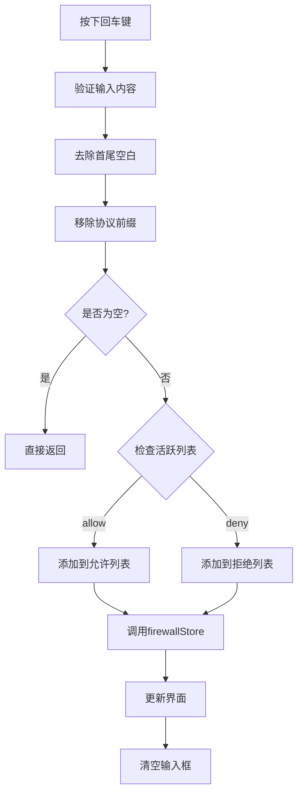

**图表来源**
- [FirewallSettings.tsx](file://pages/options/src/components/FirewallSettings.tsx#L39-L50)

#### handleRemoveUrl - URL移除处理

删除操作确保了列表的及时更新和状态同步：

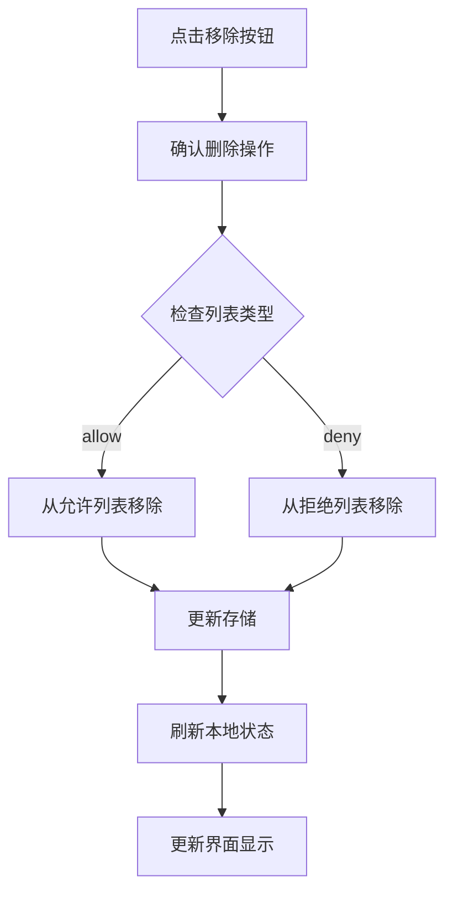

**图表来源**
- [FirewallSettings.tsx](file://pages/options/src/components/FirewallSettings.tsx#L46-L50)

### UI设计中的用户体验细节

#### 输入框交互设计

输入框实现了多项用户体验优化：

| 功能特性 | 实现方式 | 用户体验提升 |
|----------|----------|--------------|
| 回车提交 | onKeyDown监听Enter键 | 快速添加URL |
| 即时验证 | 自动清理输入格式 | 减少用户错误 |
| 占位符提示 | 国际化占位符文本 | 多语言支持 |
| 主题适配 | 条件样式应用 | 暗色模式兼容 |

#### 标签页切换机制

允许列表和拒绝列表的切换通过按钮组实现：

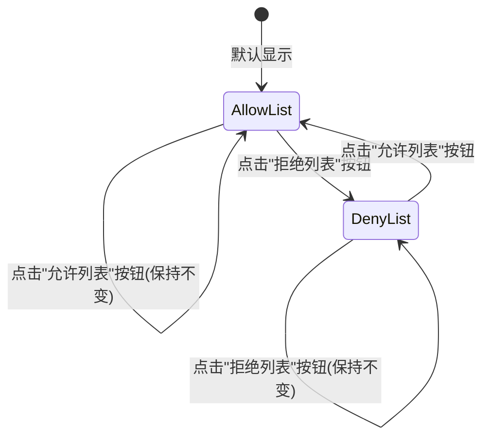

**图表来源**
- [FirewallSettings.tsx](file://pages/options/src/components/FirewallSettings.tsx#L96-L115)

#### 移除按钮的即时反馈

每个URL条目都配备了移除按钮，提供即时的操作反馈：

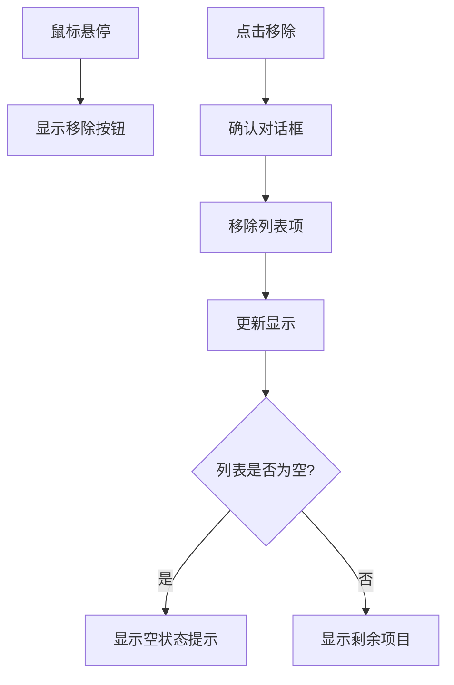

**图表来源**
- [FirewallSettings.tsx](file://pages/options/src/components/FirewallSettings.tsx#L152-L206)

### 主题适配实现

#### isDarkMode属性集成

组件通过isDarkMode属性实现完整的主题适配：

| 主题元素 | 浅色模式样式 | 深色模式样式 |
|----------|-------------|-------------|
| 容器边框 | border-blue-100 | border-slate-700 |
| 容器背景 | bg-gray-50 | bg-slate-800 |
| 文本颜色 | text-gray-800 | text-gray-200 |
| 开关状态 | bg-gray-300 | bg-gray-600 |
| 按钮颜色 | bg-blue-500 | bg-blue-600 |
| 输入框边框 | border-gray-300 | border-gray-600 |
| 输入框背景 | bg-white | bg-slate-700 |

#### 动态样式计算

组件使用条件样式表达式实现主题切换：

```typescript
// 主题适配示例结构
className={`${
  isDarkMode 
    ? 'border-slate-700 bg-slate-800 text-gray-200' 
    : 'border-blue-100 bg-gray-50 text-gray-800'
}`}
```

**图表来源**
- [FirewallSettings.tsx](file://pages/options/src/components/FirewallSettings.tsx#L48-L225)

### 国际化文本支持

#### 多语言文本资源

组件集成了完整的国际化支持，所有用户可见文本都通过翻译键获取：

| 翻译键 | 中文 | 英文 | 巴西葡萄牙语 |
|--------|------|------|-------------|
| options_firewall_header | 防火墙 | Firewall | Firewall |
| options_firewall_enableToggle | 启用防火墙 | Enable Firewall | Ativar Firewall |
| options_firewall_allowList_header | 允许列表 | Allow List | Lista de Permissões |
| options_firewall_denyList_header | 拒绝列表 | Deny List | Lista de Bloqueios |
| options_firewall_btnAdd | 添加 | Add | Adicionar |
| options_firewall_btnRemove | 移除 | Remove | Remover |

#### 国际化集成方式

```typescript
// 国际化文本获取示例
<h2 className="text-xl font-semibold">{t('options_firewall_header')}</h2>
<label className="text-base font-medium">{t('options_firewall_enableToggle')}</label>
<input placeholder={t('options_firewall_placeholders_domainUrl')} />
```

**图表来源**
- [FirewallSettings.tsx](file://pages/options/src/components/FirewallSettings.tsx#L48-L225)

**章节来源**
- [FirewallSettings.tsx](file://pages/options/src/components/FirewallSettings.tsx#L1-L225)
- [Button.tsx](file://packages/ui/lib/components/Button.tsx#L1-L44)

## 依赖关系分析

### 组件间依赖关系

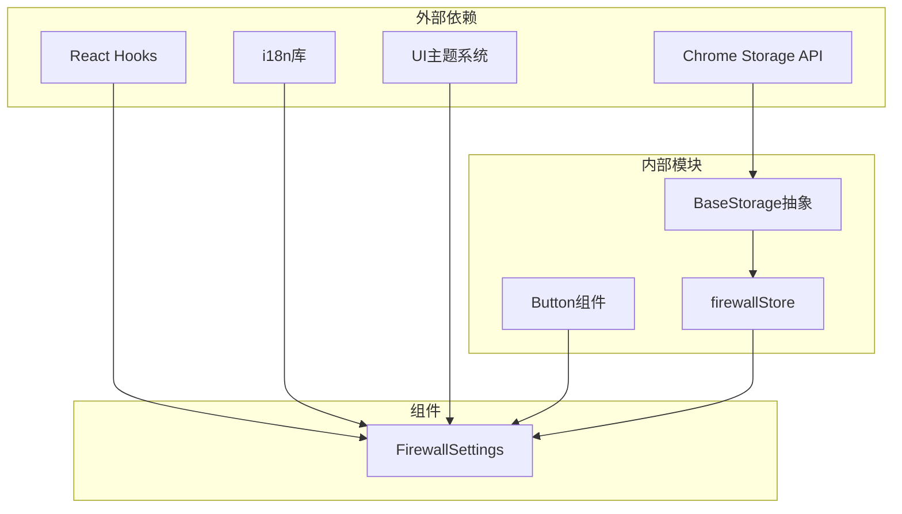

**图表来源**
- [FirewallSettings.tsx](file://pages/options/src/components/FirewallSettings.tsx#L1-L6)
- [firewall.ts](file://packages/storage/lib/settings/firewall.ts#L1-L5)

### 存储层依赖

存储层采用了分层设计，提供了灵活的数据访问抽象：

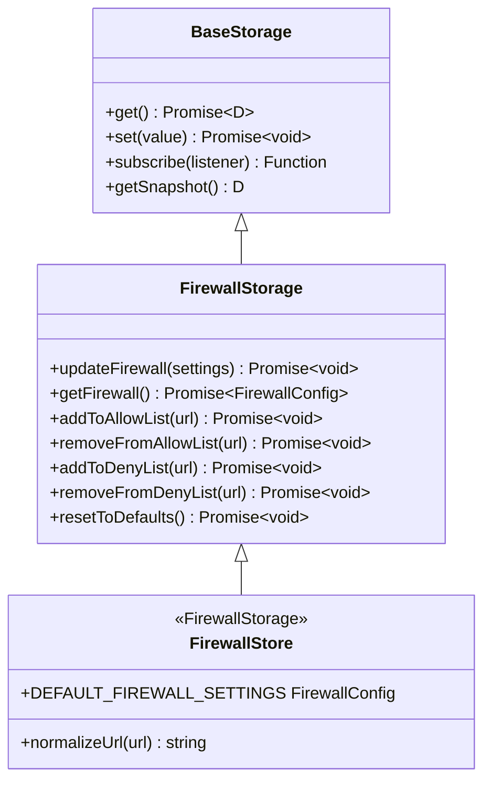

**图表来源**
- [types.ts](file://packages/storage/lib/base/types.ts#L4-L12)
- [firewall.ts](file://packages/storage/lib/settings/firewall.ts#L20-L32)

**章节来源**
- [FirewallSettings.tsx](file://pages/options/src/components/FirewallSettings.tsx#L1-L6)
- [base.ts](file://packages/storage/lib/base/base.ts#L70-L157)
- [types.ts](file://packages/storage/lib/base/types.ts#L1-L46)

## 性能考虑

### 状态更新优化

组件采用了多种性能优化策略：

1. **useCallback缓存**：避免不必要的函数重建
2. **异步操作批处理**：减少存储操作频率
3. **条件渲染**：根据列表状态动态显示内容
4. **虚拟滚动**：对于大量URL列表的性能优化

### 存储同步优化

存储层实现了智能的同步机制：

- **Live Update**：自动响应存储变化
- **缓存机制**：减少重复的存储读取
- **批量更新**：合并多个状态变更

## 故障排除指南

### 常见问题及解决方案

#### 配置无法保存

**症状**：修改防火墙设置后重启浏览器配置丢失
**原因**：Chrome存储权限不足或存储空间已满
**解决方案**：
1. 检查manifest.json中的storage权限声明
2. 清理浏览器存储空间
3. 重置为默认设置

#### 界面显示异常

**症状**：主题颜色显示错误或布局错乱
**原因**：isDarkMode属性传递错误或CSS类冲突
**解决方案**：
1. 验证主题属性的正确传递
2. 检查CSS类名的正确性
3. 清除浏览器缓存

#### URL添加失败

**症状**：输入有效URL但无法添加到列表
**原因**：URL格式验证失败或存储写入错误
**解决方案**：
1. 检查URL格式是否符合要求
2. 验证存储权限设置
3. 查看浏览器开发者工具中的错误日志

**章节来源**
- [firewall.ts](file://packages/storage/lib/settings/firewall.ts#L13-L25)
- [base.ts](file://packages/storage/lib/base/base.ts#L70-L157)

## 结论

FirewallSettings组件展现了现代Web扩展开发的最佳实践，通过精心设计的架构实现了：

1. **完整的功能覆盖**：支持防火墙启用/禁用、允许/拒绝列表管理
2. **优秀的用户体验**：即时反馈、主题适配、多语言支持
3. **可靠的架构设计**：分层架构、状态同步、错误处理
4. **高性能实现**：优化的渲染、智能的存储同步

该组件的成功实现为其他扩展功能的开发提供了宝贵的参考价值，特别是在状态管理、存储抽象和用户体验优化方面。通过深入理解其实现原理，开发者可以构建出更加稳定和用户友好的扩展功能。