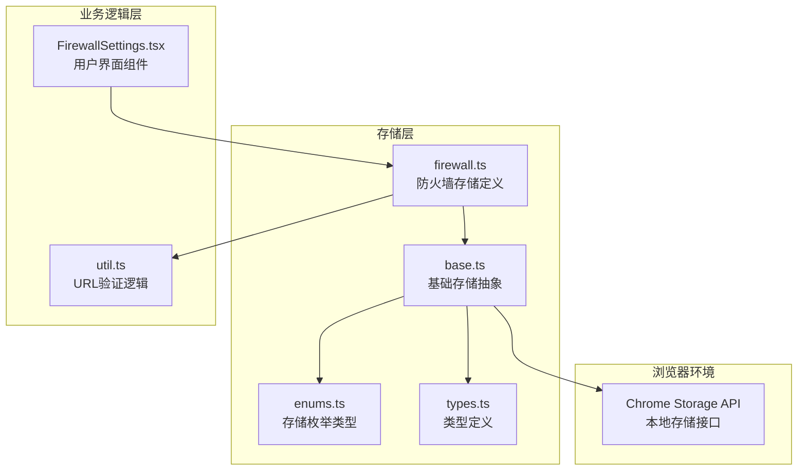
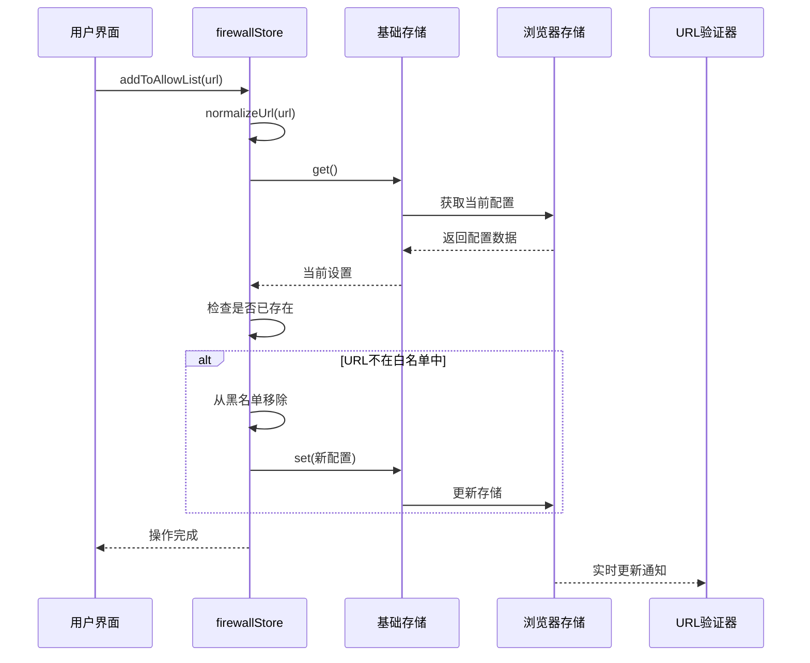
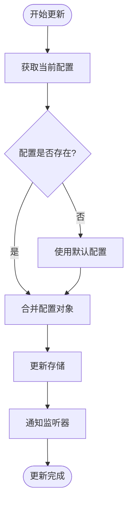
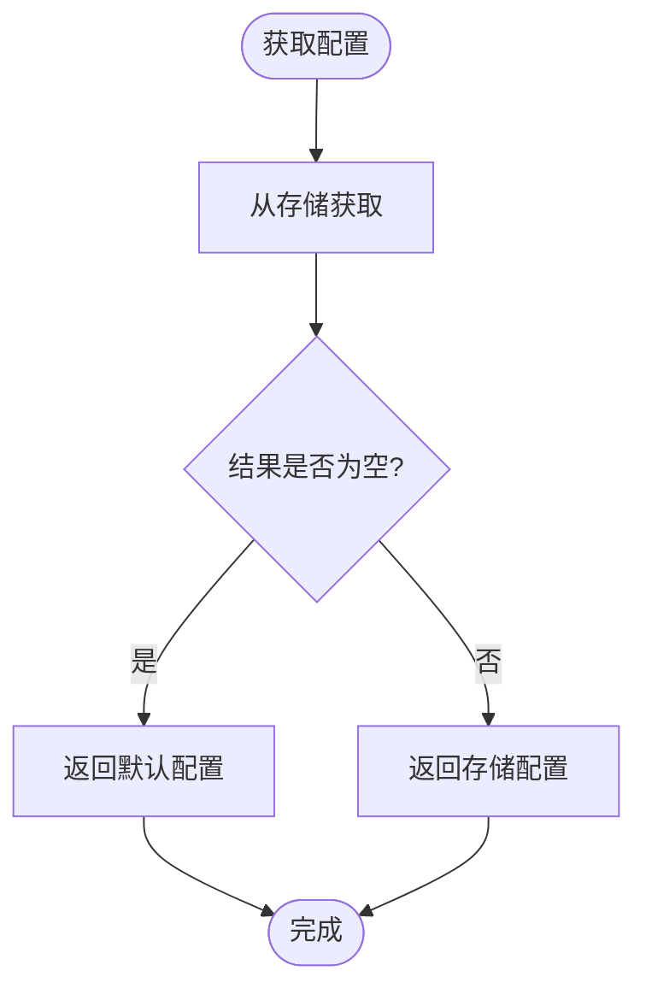
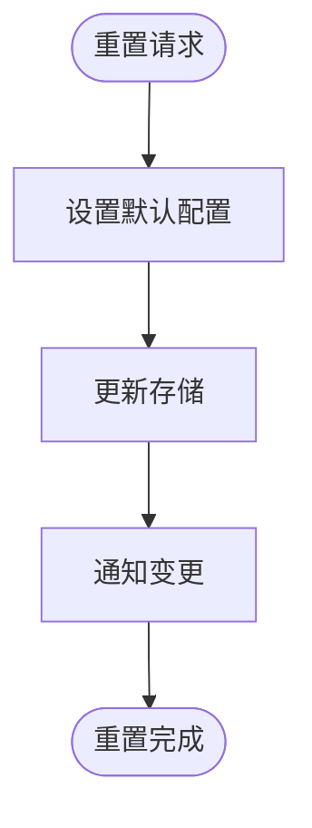
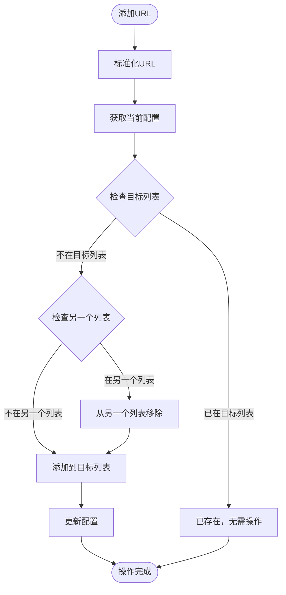
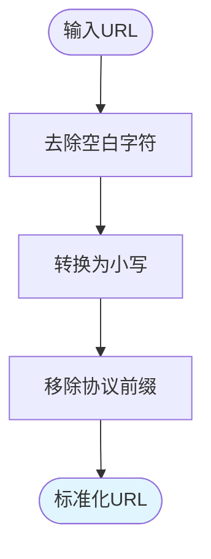
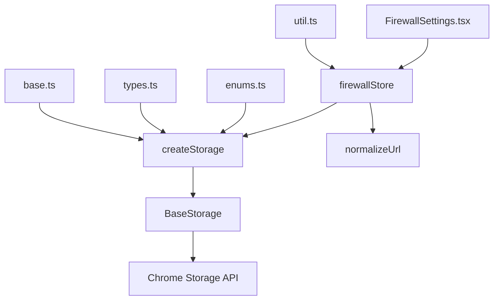

# 防火墙配置存储机制

<cite>
**本文档中引用的文件**
- [firewall.ts](file://packages/storage/lib/settings/firewall.ts)
- [base.ts](file://packages/storage/lib/base/base.ts)
- [enums.ts](file://packages/storage/lib/base/enums.ts)
- [types.ts](file://packages/storage/lib/base/types.ts)
- [util.ts](file://chrome-extension/src/background/browser/util.ts)
- [FirewallSettings.tsx](file://pages/options/src/components/FirewallSettings.tsx)
</cite>

## 目录
1. [简介](#简介)
2. [项目结构概览](#项目结构概览)
3. [核心组件分析](#核心组件分析)
4. [架构概览](#架构概览)
5. [详细组件分析](#详细组件分析)
6. [依赖关系分析](#依赖关系分析)
7. [性能考虑](#性能考虑)
8. [故障排除指南](#故障排除指南)
9. [结论](#结论)

## 简介

防火墙配置存储机制是NanoBrowser扩展的核心安全功能之一，它提供了基于浏览器本地存储的持久化配置管理。该系统通过`firewallStore`存储实例实现了对URL访问控制的灵活管理，支持白名单和黑名单的双向互斥逻辑，并提供了完整的配置重置和URL标准化处理功能。

## 项目结构概览

防火墙存储机制的实现分布在多个模块中，形成了清晰的分层架构：

**图表来源**
- [firewall.ts](file://packages/storage/lib/settings/firewall.ts#L1-L105)
- [base.ts](file://packages/storage/lib/base/base.ts#L1-L158)
- [enums.ts](file://packages/storage/lib/base/enums.ts#L1-L43)
- [types.ts](file://packages/storage/lib/base/types.ts#L1-L46)

**章节来源**
- [firewall.ts](file://packages/storage/lib/settings/firewall.ts#L1-L105)
- [base.ts](file://packages/storage/lib/base/base.ts#L1-L158)

## 核心组件分析

### FirewallConfig接口

防火墙配置接口定义了三个核心属性：
- **allowList**: 明确允许访问的URL列表
- **denyList**: 明确禁止访问的URL列表  
- **enabled**: 防火墙启用状态标志

### normalizeUrl函数

URL标准化函数是整个存储机制的关键组件，负责：
- 移除首尾空白字符
- 转换为小写格式
- 去除HTTP/HTTPS协议前缀

这种标准化确保了URL匹配的一致性和准确性。

### firewallStore存储实例

`firewallStore`是基于浏览器本地存储的持久化存储实例，具有以下特性：
- 使用`StorageEnum.Local`存储类型
- 启用实时更新功能(`liveUpdate: true`)
- 提供完整的CRUD操作接口

**章节来源**
- [firewall.ts](file://packages/storage/lib/settings/firewall.ts#L6-L43)
- [firewall.ts](file://packages/storage/lib/settings/firewall.ts#L45-L103)

## 架构概览

防火墙存储机制采用分层架构设计，确保了良好的可维护性和扩展性：

**图表来源**
- [firewall.ts](file://packages/storage/lib/settings/firewall.ts#L58-L72)
- [base.ts](file://packages/storage/lib/base/base.ts#L75-L95)

## 详细组件分析

### updateFirewall方法 - 配置合并更新机制

`updateFirewall`方法实现了配置的智能合并更新：

**图表来源**
- [firewall.ts](file://packages/storage/lib/settings/firewall.ts#L47-L53)

该方法的核心优势在于：
- 自动处理配置缺失情况
- 支持部分配置更新
- 维护配置的完整性

### getFirewall方法 - 默认回退机制

`getFirewall`方法提供了健壮的默认回退机制：

**图表来源**
- [firewall.ts](file://packages/storage/lib/settings/firewall.ts#L55-L58)

### resetToDefaults方法 - 重置逻辑

`resetToDefaults`方法提供了完整的配置重置功能：

**图表来源**
- [firewall.ts](file://packages/storage/lib/settings/firewall.ts#L60-L63)

### addToAllowList和addToDenyList方法 - 双向互斥逻辑

这两个方法实现了白名单和黑名单之间的互斥关系：

**图表来源**
- [firewall.ts](file://packages/storage/lib/settings/firewall.ts#L58-L72)
- [firewall.ts](file://packages/storage/lib/settings/firewall.ts#L74-L90)

这种设计确保了：
- 同一URL不能同时存在于两个列表中
- 添加到一个列表会自动从另一个列表移除
- 维护了配置的一致性

### URL标准化处理

`normalizeUrl`函数在存储层对输入URL进行标准化处理：

**图表来源**
- [firewall.ts](file://packages/storage/lib/settings/firewall.ts#L18-L24)

标准化处理的好处：
- 确保URL比较的一致性
- 忽略协议差异（HTTP/HTTPS）
- 处理大小写不敏感问题

**章节来源**
- [firewall.ts](file://packages/storage/lib/settings/firewall.ts#L47-L103)

## 依赖关系分析

防火墙存储机制的依赖关系展现了清晰的分层结构：

**图表来源**
- [FirewallSettings.tsx](file://pages/options/src/components/FirewallSettings.tsx#L1-L5)
- [firewall.ts](file://packages/storage/lib/settings/firewall.ts#L1-L5)
- [base.ts](file://packages/storage/lib/base/base.ts#L58-L65)

主要依赖关系：
- **用户界面层**依赖于存储层
- **存储层**依赖于基础存储抽象
- **基础存储**与浏览器存储API直接交互
- **工具函数**提供URL处理能力

**章节来源**
- [FirewallSettings.tsx](file://pages/options/src/components/FirewallSettings.tsx#L1-L225)
- [firewall.ts](file://packages/storage/lib/settings/firewall.ts#L1-L105)

## 性能考虑

防火墙存储机制在设计时充分考虑了性能优化：

### 异步操作优化
- 所有存储操作都是异步的，避免阻塞主线程
- 使用Promise链式调用提高代码可读性
- 实现了批量更新机制减少存储访问次数

### 内存管理
- 缓存机制减少了重复的存储读取
- 实时更新监听器只在需要时激活
- 清理机制防止内存泄漏

### 存储效率
- 使用本地存储而非同步存储
- 启用实时更新减少不必要的轮询
- 数据序列化优化存储空间使用

## 故障排除指南

### 常见问题及解决方案

#### 存储权限问题
**症状**: 存储操作失败或抛出异常
**原因**: Chrome扩展缺少存储权限
**解决方案**: 检查manifest.json中的storage权限配置

#### URL标准化问题
**症状**: URL匹配不准确
**原因**: URL格式不规范
**解决方案**: 确保输入URL经过normalizeUrl处理

#### 实时更新失效
**症状**: 配置更改后界面未及时更新
**原因**: liveUpdate配置错误或监听器未正确注册
**解决方案**: 检查storage配置中的liveUpdate选项

**章节来源**
- [base.ts](file://packages/storage/lib/base/base.ts#L58-L95)
- [firewall.ts](file://packages/storage/lib/settings/firewall.ts#L38-L43)

## 结论

防火墙配置存储机制展现了现代Web扩展开发的最佳实践：

### 设计优势
- **模块化架构**: 清晰的分层设计便于维护和扩展
- **数据一致性**: 双向互斥逻辑确保配置的准确性
- **用户体验**: 实时更新和默认回退提供流畅的使用体验
- **安全性**: URL标准化处理防止恶意URL绕过检测

### 技术亮点
- 基于浏览器原生存储API的可靠持久化
- 异步操作链路确保非阻塞性能
- 类型安全的设计减少运行时错误
- 完整的错误处理和边界情况处理

该存储机制为NanoBrowser扩展提供了坚实的安全基础，支持灵活的URL访问控制，同时保持了良好的性能和用户体验。