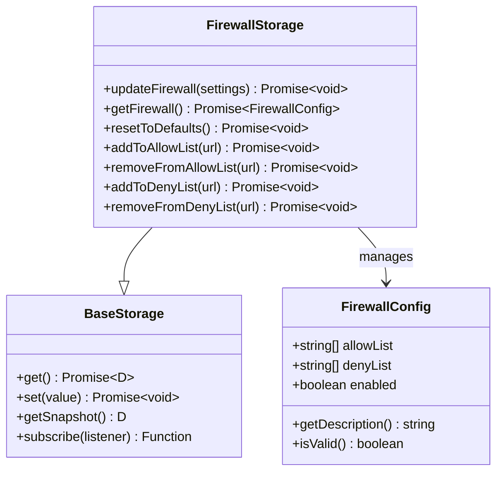
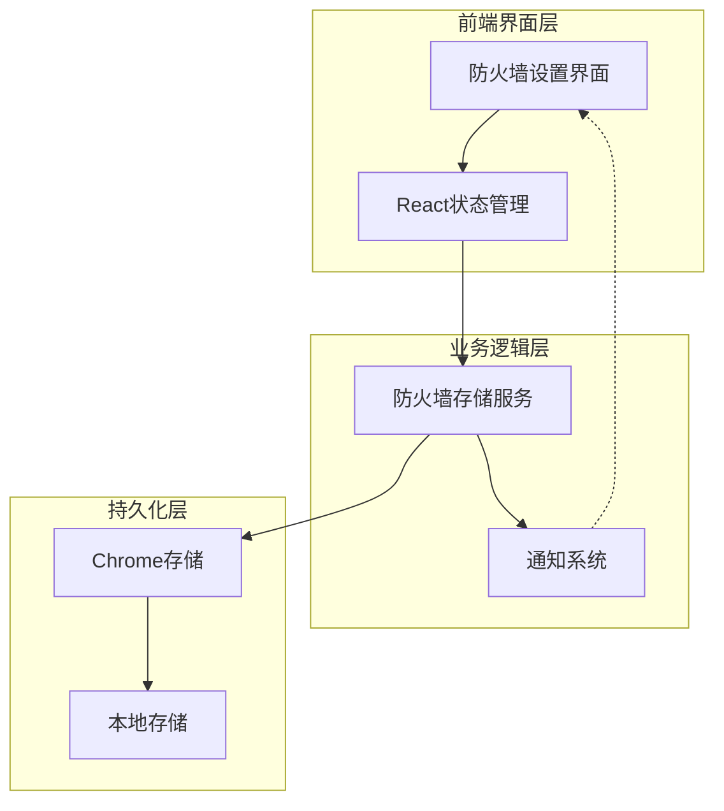
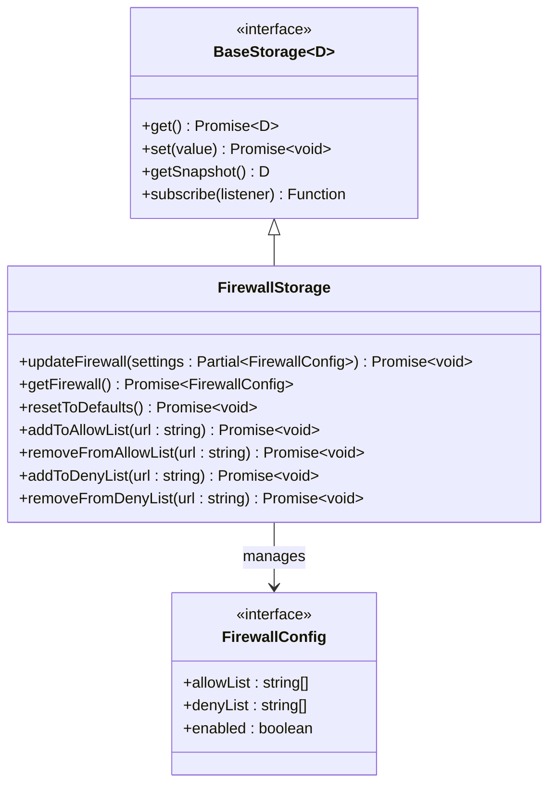
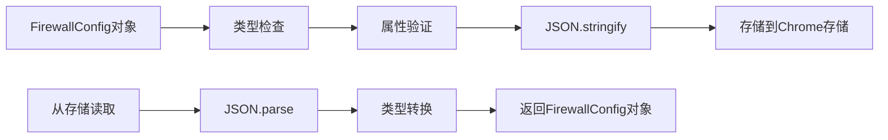

# 防火墙配置数据结构

<cite>
**本文档中引用的文件**
- [firewall.ts](file://packages/storage/lib/settings/firewall.ts)
- [FirewallSettings.tsx](file://pages/options/src/components/FirewallSettings.tsx)
- [types.ts](file://packages/storage/lib/settings/types.ts)
- [base.ts](file://packages/storage/lib/base/base.ts)
- [types.ts](file://packages/storage/lib/base/types.ts)
- [enums.ts](file://packages/storage/lib/base/enums.ts)
- [util.ts](file://chrome-extension/src/background/browser/util.ts)
- [messages.json](file://packages/i18n/locales/en/messages.json)
</cite>

## 目录
1. [简介](#简介)
2. [核心接口定义](#核心接口定义)
3. [配置字段详解](#配置字段详解)
4. [默认配置设计](#默认配置设计)
5. [存储架构](#存储架构)
6. [类型安全性保障](#类型安全性保障)
7. [JSON序列化格式](#json序列化格式)
8. [使用场景分析](#使用场景分析)
9. [最佳实践建议](#最佳实践建议)
10. [总结](#总结)

## 简介

防火墙配置数据结构是NanoBrowser扩展中的核心安全组件，通过`FirewallConfig`接口提供了域名级别的访问控制系统。该配置模型采用简洁而强大的设计，支持允许列表（allowList）和拒绝列表（denyList）的双重控制机制，配合全局启用/禁用开关，实现了灵活且安全的网络访问管理。

## 核心接口定义

### FirewallConfig接口

`FirewallConfig`接口定义了防火墙的核心配置结构：



**图表来源**
- [firewall.ts](file://packages/storage/lib/settings/firewall.ts#L6-L12)
- [firewall.ts](file://packages/storage/lib/settings/firewall.ts#L25-L33)

**章节来源**
- [firewall.ts](file://packages/storage/lib/settings/firewall.ts#L6-L12)

## 配置字段详解

### allowList字段

**设计目的：**
`allowList`是一个字符串数组，用于指定明确允许访问的域名或URL。当配置了非空的允许列表时，系统只允许列表中匹配的域名访问，其他所有域名都将被阻止。

**使用场景：**
- 企业环境中的安全策略实施
- 开发环境的受控访问
- 特定应用的白名单管理
- 敏感数据处理的权限控制

**技术实现：**
```typescript
// 允许列表的添加操作
async addToAllowList(url: string) {
  const normalizedUrl = normalizeUrl(url);
  const currentSettings = await this.getFirewall();
  
  if (!currentSettings.allowList.includes(normalizedUrl)) {
    // 从拒绝列表中移除（如果存在）
    const denyList = currentSettings.denyList.filter(item => item !== normalizedUrl);
    // 添加到允许列表
    await this.updateFirewall({
      allowList: [...currentSettings.allowList, normalizedUrl],
      denyList,
    });
  }
}
```

### denyList字段

**设计目的：**
`denyList`同样是一个字符串数组，用于指定明确禁止访问的域名或URL。拒绝列表具有最高优先级，任何匹配拒绝列表的域名都会被立即阻止访问。

**使用场景：**
- 恶意网站的黑名单管理
- 不安全内容的过滤
- 广告和跟踪服务的屏蔽
- 内容审核的负面清单

**技术实现：**
```typescript
// 拒绝列表的添加操作
async addToDenyList(url: string) {
  const normalizedUrl = normalizeUrl(url);
  const currentSettings = await this.getFirewall();
  
  if (!currentSettings.denyList.includes(normalizedUrl)) {
    // 从允许列表中移除（如果存在）
    const allowList = currentSettings.allowList.filter(item => item !== normalizedUrl);
    // 添加到拒绝列表
    await this.updateFirewall({
      denyList: [...currentSettings.denyList, normalizedUrl],
      allowList,
    });
  }
}
```

### enabled字段

**设计目的：**
`enabled`是一个布尔值，用于控制整个防火墙功能的启用状态。当设置为`false`时，防火墙将完全禁用，所有URL访问都将被允许。

**运行时作用：**
- 提供即时的安全开关
- 支持临时性的功能禁用
- 允许用户在需要时绕过限制
- 便于调试和故障排除

**章节来源**
- [firewall.ts](file://packages/storage/lib/settings/firewall.ts#L6-L12)
- [firewall.ts](file://packages/storage/lib/settings/firewall.ts#L45-L103)

## 默认配置设计

### DEFAULT_FIREWALL_SETTINGS

默认配置对象体现了安全设计的最佳实践：

```typescript
export const DEFAULT_FIREWALL_SETTINGS: FirewallConfig = {
  allowList: [],
  denyList: [],
  enabled: true,
};
```

**安全考量：**

1. **启用状态优先**：默认启用防火墙，确保新安装的用户受到保护
2. **空列表策略**：初始为空的允许和拒绝列表，提供最大的灵活性
3. **最小权限原则**：不预设任何访问限制，让用户根据需求自行配置

**设计理念：**
- **安全第一**：默认启用防止意外的不安全访问
- **用户友好**：默认行为不会影响正常浏览体验
- **可扩展性**：为空配置提供清晰的扩展路径

**章节来源**
- [firewall.ts](file://packages/storage/lib/settings/firewall.ts#L35-L40)

## 存储架构

### 存储层设计

防火墙配置采用基于Chrome扩展存储的分层架构：



**图表来源**
- [base.ts](file://packages/storage/lib/base/base.ts#L69-L157)
- [firewall.ts](file://packages/storage/lib/settings/firewall.ts#L42-L44)

### 存储配置

```typescript
const storage = createStorage<FirewallConfig>('firewall-settings', DEFAULT_FIREWALL_SETTINGS, {
  storageEnum: StorageEnum.Local,
  liveUpdate: true,
});
```

**特性说明：**
- **存储区域**：使用Local存储，确保数据持久性
- **实时更新**：启用liveUpdate，支持多窗口同步
- **类型安全**：泛型约束确保类型正确性

**章节来源**
- [base.ts](file://packages/storage/lib/base/base.ts#L69-L157)
- [firewall.ts](file://packages/storage/lib/settings/firewall.ts#L42-L44)

## 类型安全性保障

### TypeScript类型系统

防火墙配置充分利用了TypeScript的类型系统来确保类型安全：



**图表来源**
- [types.ts](file://packages/storage/lib/base/types.ts#L4-L10)
- [firewall.ts](file://packages/storage/lib/settings/firewall.ts#L25-L33)

### 类型安全保障机制

1. **泛型约束**：`BaseStorage<FirewallConfig>`确保存储的数据类型正确
2. **Partial类型**：`Partial<FirewallConfig>`允许部分更新
3. **函数签名**：每个方法都有明确的参数和返回类型
4. **枚举类型**：使用`StorageEnum`确保存储类型的正确性

**章节来源**
- [types.ts](file://packages/storage/lib/base/types.ts#L4-L10)
- [firewall.ts](file://packages/storage/lib/settings/firewall.ts#L25-L33)

## JSON序列化格式

### 序列化后的JSON结构

防火墙配置在存储时会自动转换为JSON格式：

```json
{
  "allowList": ["example.com", "api.github.com", "localhost"],
  "denyList": ["malicious-site.com", "ads.example.org"],
  "enabled": true
}
```

### 序列化过程



**图表来源**
- [base.ts](file://packages/storage/lib/base/base.ts#L69-L157)

### URL规范化

在序列化过程中，URL会经过规范化处理：

```typescript
function normalizeUrl(url: string): string {
  return url
    .trim()
    .toLowerCase()
    .replace(/^https?:\/\//, '');
}
```

**规范化规则：**
- 移除首尾空白字符
- 转换为小写
- 移除协议前缀（http://或https://）

**章节来源**
- [firewall.ts](file://packages/storage/lib/settings/firewall.ts#L14-L22)

## 使用场景分析

### 场景一：企业安全策略

```typescript
// 企业环境中的典型配置
const enterpriseFirewall: FirewallConfig = {
  allowList: [
    "company-api.internal",
    "internal-tools.company.com",
    "secure-login.company.net"
  ],
  denyList: [],
  enabled: true
};
```

**特点：**
- 明确的允许列表
- 空的拒绝列表
- 完全启用状态

### 场景二：开发环境配置

```typescript
// 开发环境的安全配置
const devFirewall: FirewallConfig = {
  allowList: [
    "localhost",
    "127.0.0.1",
    "dev-api.local",
    "test-server.internal"
  ],
  denyList: [
    "external-tracking.com",
    "analytics-provider.com"
  ],
  enabled: true
};
```

**特点：**
- 受控的本地访问
- 恶意服务的拒绝
- 安全的开发环境

### 场景三：个人隐私保护

```typescript
// 个人隐私保护配置
const privacyFirewall: FirewallConfig = {
  allowList: [],
  denyList: [
    "facebook.com",
    "twitter.com",
    "instagram.com",
    "tracking-analytics.com"
  ],
  enabled: true
};
```

**特点：**
- 空的允许列表（默认允许所有）
- 明确的拒绝列表
- 强制隐私保护

**章节来源**
- [FirewallSettings.tsx](file://pages/options/src/components/FirewallSettings.tsx#L15-L22)

## 最佳实践建议

### 配置策略

1. **优先使用允许列表**：
   - 当allowList不为空时，只有匹配的域名才被允许
   - 这种方法提供了更强的安全保证

2. **谨慎使用拒绝列表**：
   - denyList具有最高优先级
   - 适用于已知的恶意或不需要的服务

3. **定期审查配置**：
   - 定期检查allowList和denyList的有效性
   - 移除不再需要的条目

4. **备份重要配置**：
   - 在重要配置变更前进行备份
   - 考虑导出配置以便恢复

### 性能优化

1. **避免过长的列表**：
   - 过长的列表可能影响性能
   - 考虑使用域名分组策略

2. **合理使用通配符**：
   - 当前版本不支持通配符
   - 如有需要，考虑使用脚本处理

### 安全建议

1. **启用防火墙**：
   - 默认情况下防火墙已启用
   - 除非有特殊需求，否则保持启用状态

2. **监控访问日志**：
   - 记录被阻止的访问尝试
   - 分析访问模式以优化配置

3. **定期更新配置**：
   - 根据新的威胁情报更新拒绝列表
   - 适应不断变化的网络环境

**章节来源**
- [util.ts](file://chrome-extension/src/background/browser/util.ts#L1-L47)

## 总结

防火墙配置数据结构通过`FirewallConfig`接口提供了简洁而强大的域名级别访问控制能力。其设计充分体现了以下核心原则：

1. **简洁性**：三个核心字段（allowList、denyList、enabled）覆盖了所有必要的配置需求
2. **安全性**：默认启用、空列表初始化体现了安全设计的最佳实践
3. **灵活性**：支持多种使用场景，从企业安全到个人隐私保护
4. **类型安全**：完整的TypeScript类型系统确保编译时错误检测
5. **持久化**：基于Chrome扩展存储的可靠数据保存机制

该配置模型不仅满足了当前的功能需求，还为未来的扩展提供了良好的架构基础。通过合理的使用场景和最佳实践指导，可以有效提升浏览器的安全性和用户体验。