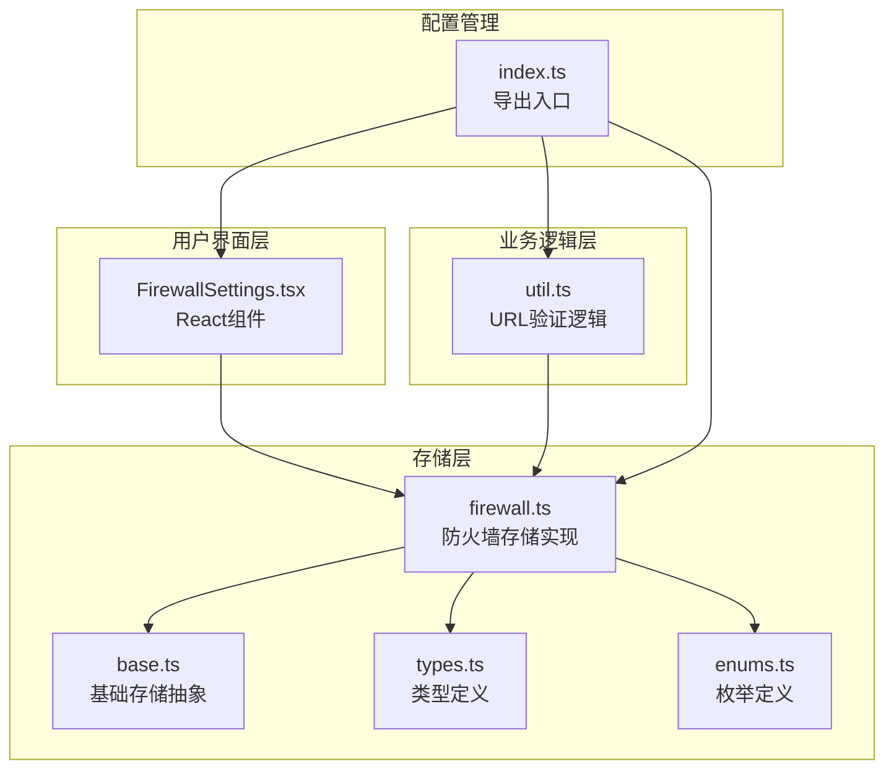
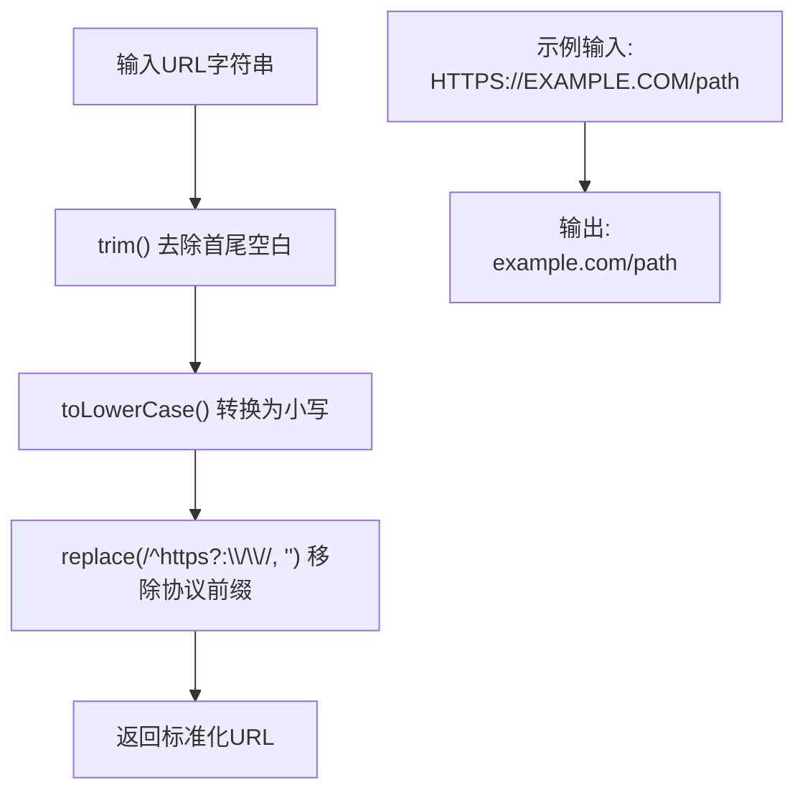
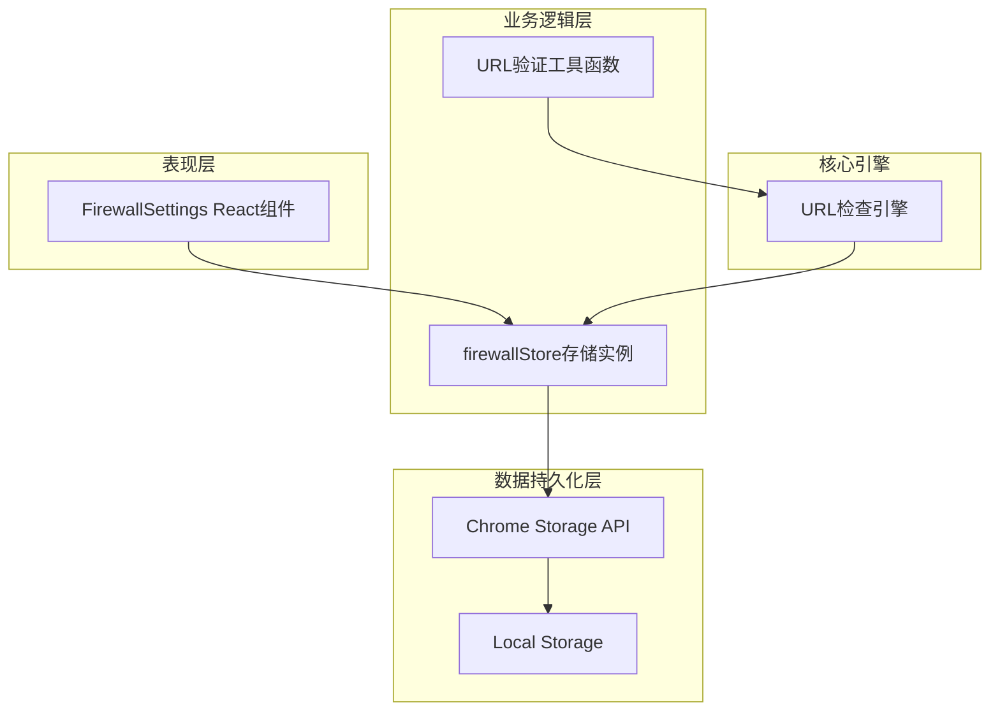
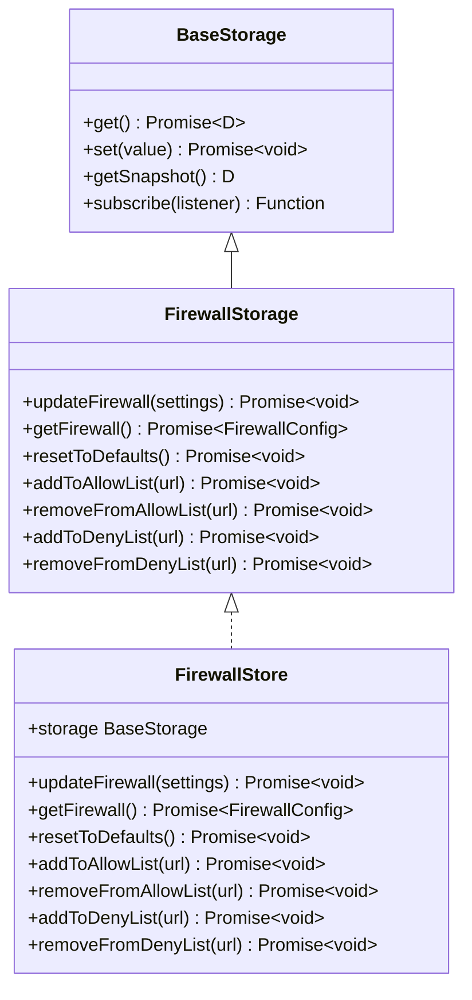
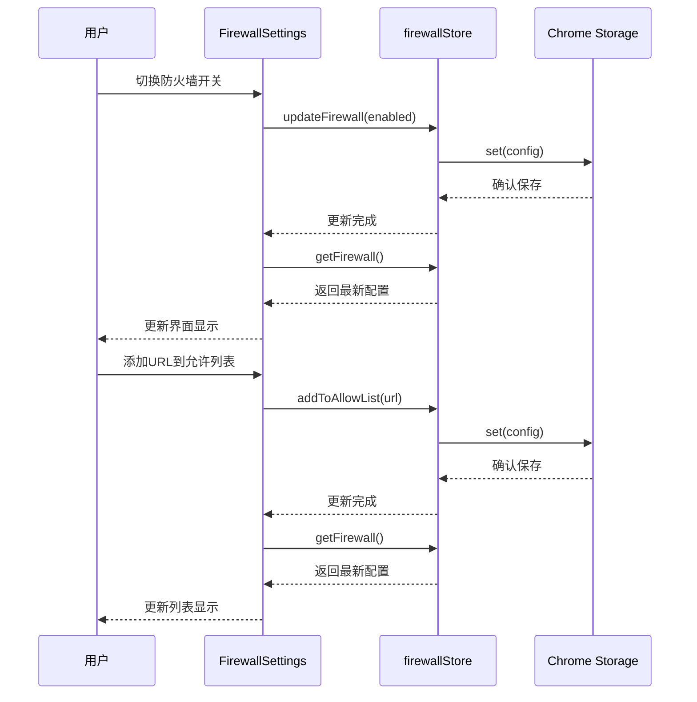
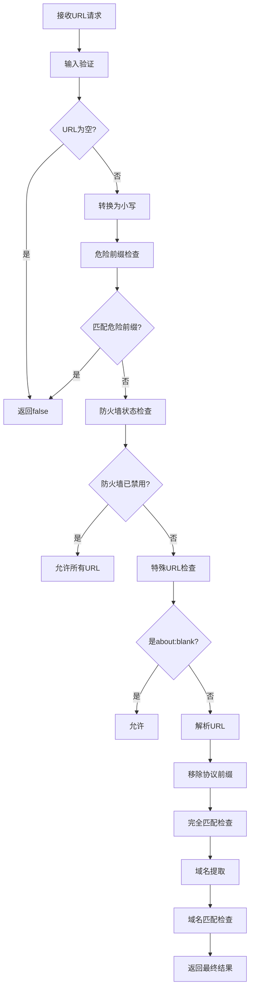
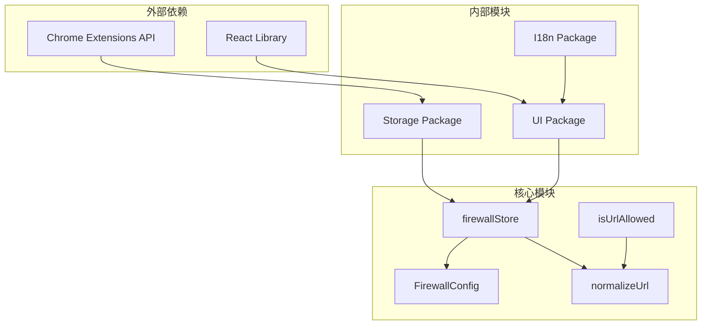

# 防火墙配置管理

<cite>
**本文档引用的文件**
- [firewall.ts](file://packages/storage/lib/settings/firewall.ts)
- [FirewallSettings.tsx](file://pages/options/src/components/FirewallSettings.tsx)
- [util.ts](file://chrome-extension/src/background/browser/util.ts)
- [base.ts](file://packages/storage/lib/base/base.ts)
- [types.ts](file://packages/storage/lib/base/types.ts)
- [enums.ts](file://packages/storage/lib/base/enums.ts)
- [index.ts](file://packages/storage/lib/settings/index.ts)
</cite>

## 目录
1. [简介](#简介)
2. [项目结构](#项目结构)
3. [核心组件](#核心组件)
4. [架构概览](#架构概览)
5. [详细组件分析](#详细组件分析)
6. [依赖关系分析](#依赖关系分析)
7. [性能考虑](#性能考虑)
8. [故障排除指南](#故障排除指南)
9. [结论](#结论)

## 简介

防火墙配置管理系统是NanoBrowser扩展中的一个核心安全组件，负责控制网页内容的访问权限。该系统通过allowList（允许列表）和denyList（拒绝列表）机制，结合URL标准化处理和持久化存储，为用户提供细粒度的网络安全控制能力。

系统设计遵循模块化原则，采用分层架构：存储层负责数据持久化，业务逻辑层处理配置管理，用户界面层提供交互体验。通过React状态管理和异步操作，实现了配置的实时更新和用户体验优化。

## 项目结构

防火墙配置管理系统的文件组织结构体现了清晰的职责分离：



**图表来源**
- [firewall.ts](file://packages/storage/lib/settings/firewall.ts#L1-L105)
- [base.ts](file://packages/storage/lib/base/base.ts#L1-L158)
- [FirewallSettings.tsx](file://pages/options/src/components/FirewallSettings.tsx#L1-L225)

**章节来源**
- [firewall.ts](file://packages/storage/lib/settings/firewall.ts#L1-L105)
- [index.ts](file://packages/storage/lib/settings/index.ts#L1-L8)

## 核心组件

### FirewallConfig接口

FirewallConfig接口定义了防火墙的核心配置结构，包含三个关键字段：

| 字段名 | 类型 | 描述 | 默认值 |
|--------|------|------|--------|
| allowList | string[] | 明确允许访问的URL列表 | [] |
| denyList | string[] | 明确禁止访问的URL列表 | [] |
| enabled | boolean | 防火墙是否启用 | true |

**allowList字段**：当设置时，只有列表中明确指定的URL才能被访问。这是最严格的访问控制模式，适用于需要精确控制的场景。

**denyList字段**：当设置时，所有不在列表中的URL都可以访问，除非它们匹配拒绝列表中的条目。这种模式提供了更宽松的默认访问策略。

**enabled字段**：控制整个防火墙功能的开关。当禁用时，系统会绕过所有URL检查，允许所有网络请求。

### normalizeUrl函数

normalizeUrl函数是URL标准化处理的核心组件，确保规则匹配的一致性和准确性：



**图表来源**
- [firewall.ts](file://packages/storage/lib/settings/firewall.ts#L14-L19)

标准化过程包括：
1. **空白字符处理**：移除首尾空格，避免因格式问题导致的匹配失败
2. **大小写统一**：转换为小写，确保大小写不敏感的匹配
3. **协议标准化**：移除http://和https://前缀，专注于域名和路径的匹配

### DEFAULT_FIREWALL_SETTINGS

默认配置提供了安全的初始状态，平衡了功能性与安全性：

```typescript
export const DEFAULT_FIREWALL_SETTINGS: FirewallConfig = {
  allowList: [],
  denyList: [],
  enabled: true,
};
```

**安全考量**：
- **enabled: true**：确保新安装的扩展立即具备基本的安全保护
- **空列表**：不会限制任何正常网站的访问
- **可配置性**：用户可以根据需要逐步添加特定规则

**章节来源**
- [firewall.ts](file://packages/storage/lib/settings/firewall.ts#L6-L10)
- [firewall.ts](file://packages/storage/lib/settings/firewall.ts#L14-L19)
- [firewall.ts](file://packages/storage/lib/settings/firewall.ts#L33-L37)

## 架构概览

防火墙配置管理系统采用分层架构设计，实现了关注点分离和模块化管理：



**图表来源**
- [FirewallSettings.tsx](file://pages/options/src/components/FirewallSettings.tsx#L1-L10)
- [firewall.ts](file://packages/storage/lib/settings/firewall.ts#L45-L103)
- [util.ts](file://chrome-extension/src/background/browser/util.ts#L1-L106)

系统的核心设计理念：
- **分层解耦**：每一层都有明确的职责边界
- **异步处理**：所有存储操作都是异步的，避免阻塞主线程
- **实时同步**：支持多窗口间的配置实时同步
- **错误恢复**：提供默认配置作为错误恢复机制

## 详细组件分析

### firewallStore存储实例

firewallStore是防火墙配置管理的核心存储抽象，继承自BaseStorage并扩展了专门的方法：



**图表来源**
- [firewall.ts](file://packages/storage/lib/settings/firewall.ts#L21-L31)
- [firewall.ts](file://packages/storage/lib/settings/firewall.ts#L45-L103)

#### 核心方法分析

**updateFirewall方法**：
- 实现了部分更新机制，只修改指定的配置项
- 维护了配置的原子性，防止部分更新导致的数据不一致
- 自动合并当前配置与新设置

**getFirewall方法**：
- 提供配置的完整快照
- 当存储中没有配置时，自动回退到默认设置
- 支持配置的懒加载和缓存机制

**addToAllowList/addToDenyList方法**：
- 实现了互斥逻辑：添加到一个列表时自动从另一个列表移除
- 使用normalizeUrl确保URL格式一致性
- 保持列表的唯一性，避免重复条目

### FirewallSettings React组件

FirewallSettings组件提供了完整的用户界面，支持防火墙配置的可视化管理：



**图表来源**
- [FirewallSettings.tsx](file://pages/options/src/components/FirewallSettings.tsx#L35-L44)
- [FirewallSettings.tsx](file://pages/options/src/components/FirewallSettings.tsx#L46-L52)
- [firewall.ts](file://packages/storage/lib/settings/firewall.ts#L47-L52)

#### 状态管理机制

组件使用React Hook进行状态管理：

| 状态变量 | 类型 | 用途 |
|----------|------|------|
| isEnabled | boolean | 控制防火墙的启用状态 |
| allowList | string[] | 允许访问的URL列表 |
| denyList | string[] | 拒绝访问的URL列表 |
| newUrl | string | 新输入的URL地址 |
| activeList | 'allow' \| 'deny' | 当前活跃的列表类型 |

#### 用户交互流程

**启用/禁用切换**：
1. 用户点击开关按钮
2. 触发handleToggleFirewall函数
3. 调用firewallStore.updateFirewall更新配置
4. 重新加载配置以更新界面状态

**URL管理**：
1. 用户在输入框中输入URL
2. 按下回车或点击添加按钮
3. 清理URL格式（移除协议前缀）
4. 根据当前活跃列表类型调用相应方法
5. 更新列表显示并清空输入框

**章节来源**
- [FirewallSettings.tsx](file://pages/options/src/components/FirewallSettings.tsx#L1-L225)
- [firewall.ts](file://packages/storage/lib/settings/firewall.ts#L45-L103)

### URL验证引擎

URL验证引擎位于后台脚本中，负责实际的URL访问控制：



**图表来源**
- [util.ts](file://chrome-extension/src/background/browser/util.ts#L1-L106)

#### 安全检查层次

**第一层：危险前缀过滤**
系统预先定义了一组危险URL前缀，包括：
- Chrome Web Store（防止脚本注入）
- chrome-extension://（扩展程序内部通信）
- javascript:、data:、file:（潜在的安全风险）
- ws:、wss:（WebSocket连接）

**第二层：防火墙状态检查**
当防火墙禁用时，系统采用宽松的访问策略，允许所有非危险URL。

**第三层：特殊URL处理**
对常见的特殊页面（如about:blank）进行显式允许，确保基本功能的可用性。

**第四层：域名匹配算法**
- **完全匹配**：直接比较URL字符串
- **域名后缀匹配**：支持子域名级别的匹配
- **通配符支持**：虽然文档中提到不支持通配符，但实际实现支持域名级别的模糊匹配

**章节来源**
- [util.ts](file://chrome-extension/src/background/browser/util.ts#L1-L106)

## 依赖关系分析

防火墙配置管理系统的依赖关系体现了良好的模块化设计：



**图表来源**
- [firewall.ts](file://packages/storage/lib/settings/firewall.ts#L1-L5)
- [FirewallSettings.tsx](file://pages/options/src/components/FirewallSettings.tsx#L1-L5)

### 存储层依赖

存储层依赖于Chrome的Storage API，通过createStorage函数创建持久化存储：

**StorageEnum.Local**：使用本地存储，数据不会同步到云端，适合隐私敏感的配置。

**liveUpdate: true**：启用实时更新机制，当其他窗口修改配置时，当前窗口能立即感知变化。

### React组件依赖

React组件依赖于多个包提供的功能：

**@extension/storage**：提供firewallStore实例，封装了所有的存储操作。

**@extension/ui**：提供Button组件，确保界面风格的一致性。

**@extension/i18n**：提供国际化支持，使界面文本可以本地化。

**章节来源**
- [firewall.ts](file://packages/storage/lib/settings/firewall.ts#L38-L43)
- [FirewallSettings.tsx](file://pages/options/src/components/FirewallSettings.tsx#L1-L5)

## 性能考虑

### 异步操作优化

系统大量使用异步操作来避免阻塞用户界面：

**批量更新**：addToAllowList和addToDenyList方法会同时处理两个列表的更新，减少存储操作次数。

**缓存机制**：firewallStore维护了一个内存缓存，避免频繁的存储读取操作。

**订阅模式**：使用观察者模式实现配置变更的通知，只有在配置真正改变时才触发界面更新。

### 内存管理

**状态同步**：React组件的状态与存储层保持同步，但通过useCallback和useEffect优化了不必要的重渲染。

**垃圾回收**：及时清理事件监听器和定时器，避免内存泄漏。

### 网络性能

**延迟加载**：配置信息在组件挂载时才加载，而不是在应用启动时预加载。

**防抖处理**：URL输入框的验证采用了适当的防抖机制，避免过于频繁的验证请求。

## 故障排除指南

### 常见问题及解决方案

**问题1：配置无法保存**
- **症状**：修改防火墙设置后刷新页面发现设置恢复原状
- **原因**：Chrome存储权限不足或存储空间已满
- **解决**：检查manifest.json中的storage权限声明，清理浏览器存储

**问题2：URL匹配不准确**
- **症状**：添加的URL无法正确匹配，或者误匹配其他URL
- **原因**：URL格式不规范或normalizeUrl处理异常
- **解决**：确保输入的URL格式正确，系统会自动标准化处理

**问题3：界面不同步**
- **症状**：在一个窗口修改配置后，其他窗口的界面没有更新
- **原因**：liveUpdate机制未启用或存储监听器失效
- **解决**：检查StorageConfig中的liveUpdate设置，重启扩展程序

### 调试技巧

**开发工具**：
1. 使用Chrome开发者工具的Application面板查看存储内容
2. 在Console中直接调用firewallStore的方法进行测试
3. 使用Network面板监控存储API的调用

**日志记录**：
系统在关键操作处添加了适当的日志记录，可以通过浏览器的Console查看详细的执行流程。

**章节来源**
- [base.ts](file://packages/storage/lib/base/base.ts#L120-L157)
- [firewall.ts](file://packages/storage/lib/settings/firewall.ts#L47-L52)

## 结论

防火墙配置管理系统展现了现代Web扩展开发的最佳实践，通过以下特点实现了高效、安全、易用的配置管理：

**架构优势**：
- 分层设计确保了代码的可维护性和可扩展性
- 模块化组织便于功能的独立开发和测试
- 异步操作保证了用户体验的流畅性

**安全特性**：
- 多层次的安全检查机制
- 默认安全的配置策略
- 完善的错误处理和恢复机制

**用户体验**：
- 直观的React组件界面
- 实时的配置同步
- 丰富的辅助功能和帮助信息

**技术亮点**：
- 智能的URL标准化处理
- 高效的域名匹配算法
- 灵活的配置管理接口

该系统不仅满足了基本的防火墙功能需求，还为未来的功能扩展奠定了坚实的基础。通过持续的优化和改进，可以进一步提升系统的性能和用户体验。