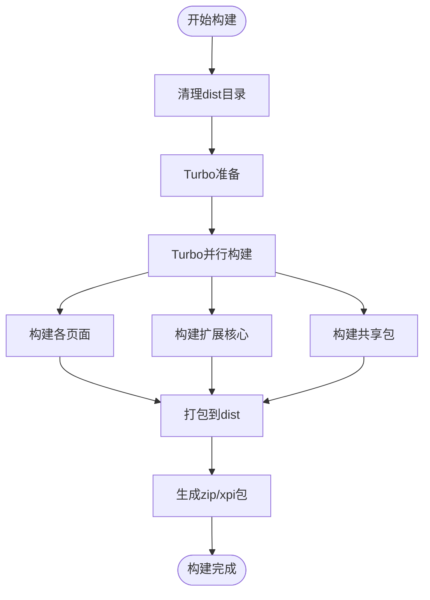
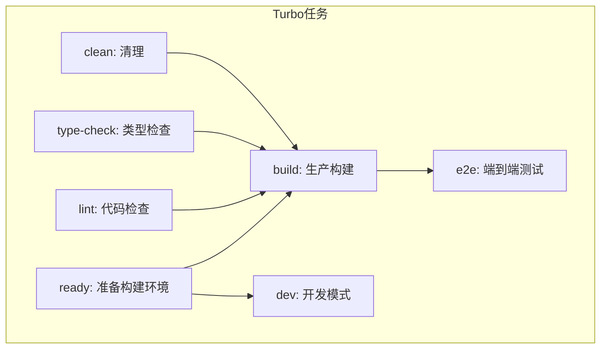
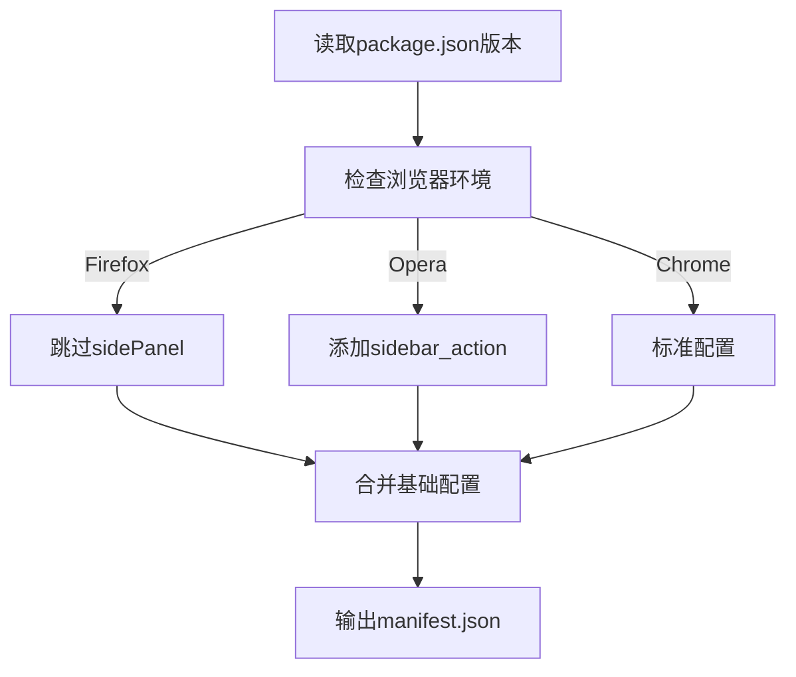
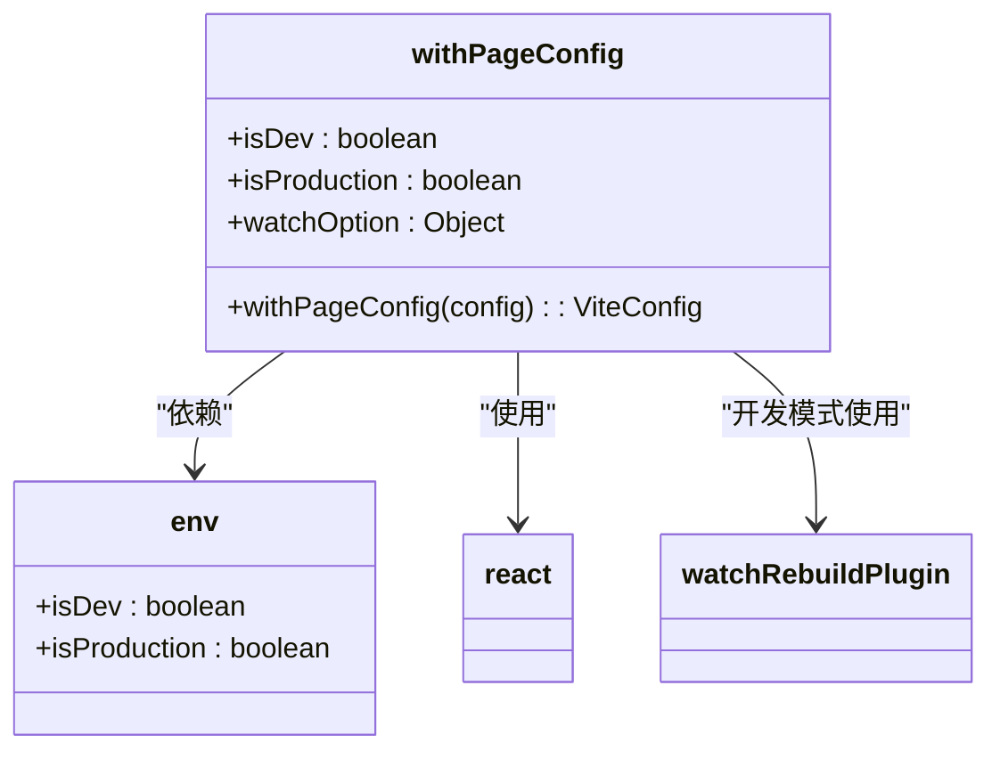
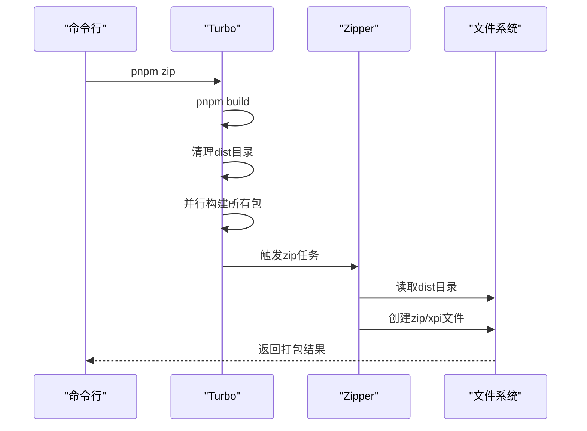

# 构建与部署

<cite>
**本文档引用的文件**  
- [package.json](file://package.json)
- [turbo.json](file://turbo.json)
- [manifest.js](file://chrome-extension/manifest.js)
- [make-manifest-plugin.ts](file://chrome-extension/utils/plugins/make-manifest-plugin.ts)
- [index.mjs](file://packages/vite-config/index.mjs)
- [withPageConfig.mjs](file://packages/vite-config/lib/withPageConfig.mjs)
- [env.mjs](file://packages/vite-config/lib/env.mjs)
- [zipper/index.ts](file://packages/zipper/index.ts)
- [build.mjs](file://packages/i18n/build.mjs)
- [update_version.sh](file://update_version.sh)
</cite>

## 目录
1. [简介](#简介)
2. [项目结构](#项目结构)
3. [核心构建流程](#核心构建流程)
4. [Turbo任务编排](#turbo任务编排)
5. [动态清单生成](#动态清单生成)
6. [Vite配置与页面构建](#vite配置与页面构建)
7. [开发、测试与生产构建命令](#开发测试与生产构建命令)
8. [打包与发布流程](#打包与发布流程)
9. [结论](#结论)

## 简介
本文档详细说明了nanobrowser项目的构建与部署流程。该Chrome扩展采用monorepo架构，使用Turbo进行高效的任务编排，Vite进行模块化构建，并通过动态生成的manifest.json实现多环境适配。文档涵盖了从开发到发布的完整生命周期。

## 项目结构
该项目采用monorepo结构，主要包含以下部分：
- `chrome-extension`: 扩展核心，包含background脚本和公共工具
- `pages`: 各个扩展页面（侧边栏、选项页、内容脚本）
- `packages`: 共享工具包和配置
- 根目录包含全局构建和包管理配置

**Section sources**
- [package.json](file://package.json#L1-L80)
- [turbo.json](file://turbo.json#L1-L54)

## 核心构建流程
构建流程以Turbo为核心驱动，通过依赖图优化任务执行。所有页面使用Vite进行构建，共享配置通过`@extension/vite-config`包统一管理。构建过程包括类型检查、代码转换、资源打包和最终压缩。

**Diagram sources**
- [package.json](file://package.json#L10-L15)
- [turbo.json](file://turbo.json#L10-L54)

## Turbo任务编排
Turbo用于高效管理monorepo中的任务依赖和执行。通过`turbo.json`配置文件定义了多个任务及其依赖关系，实现增量构建和缓存优化。

**Diagram sources**
- [turbo.json](file://turbo.json#L10-L54)
- [package.json](file://package.json#L10-L30)

**Section sources**
- [turbo.json](file://turbo.json#L1-L54)

## 动态清单生成
`manifest.js`文件动态生成Chrome扩展的manifest.json，支持多浏览器适配和条件性功能启用。

### 动态生成机制

**Diagram sources**
- [manifest.js](file://chrome-extension/manifest.js#L1-L100)

### 条件性功能
通过环境变量控制不同浏览器的功能：
- `__FIREFOX__`: 禁用不支持的sidePanel功能
- `__OPERA__`: 添加Opera特有的sidebar_action配置

**Section sources**
- [manifest.js](file://chrome-extension/manifest.js#L1-L100)

## Vite配置与页面构建
Vite配置通过`@extension/vite-config`包统一管理，确保各页面构建的一致性。

### 共享配置结构

**Diagram sources**
- [withPageConfig.mjs](file://packages/vite-config/lib/withPageConfig.mjs#L1-L48)
- [env.mjs](file://packages/vite-config/lib/env.mjs#L1-L2)

### 页面特定配置
各页面通过`vite.config.ts`继承共享配置并添加特定设置：
- `side-panel`: 侧边栏界面，使用React和Tailwind CSS
- `options`: 选项页面，包含多个设置组件
- `content`: 内容脚本，注入到网页中执行

**Section sources**
- [withPageConfig.mjs](file://packages/vite-config/lib/withPageConfig.mjs#L1-L48)
- [side-panel/package.json](file://pages/side-panel/package.json#L1-L41)
- [options/package.json](file://pages/options/package.json#L1-L41)
- [content/package.json](file://pages/content/package.json#L1-L31)

## 开发、测试与生产构建命令
### 核心构建命令
| 命令 | 描述 | 环境 | 用途 |
|------|------|------|------|
| `pnpm dev` | 启动开发服务器 | 开发 | 实时开发 |
| `pnpm build` | 生产构建 | 生产 | 发布准备 |
| `pnpm zip` | 打包扩展 | 生产 | 生成分发包 |
| `pnpm type-check` | 类型检查 | 所有 | 质量保证 |
| `pnpm lint` | 代码检查 | 所有 | 代码规范 |

### 环境变量
- `__DEV__=true`: 开发模式，启用热重载
- `__FIREFOX__=true`: Firefox构建模式
- `__OPERA__=true`: Opera构建模式

**Section sources**
- [package.json](file://package.json#L10-L30)
- [chrome-extension/package.json](file://chrome-extension/package.json#L10-L25)

## 打包与发布流程
### 打包流程

**Diagram sources**
- [package.json](file://package.json#L16-L17)
- [zipper/index.ts](file://packages/zipper/index.ts#L1-L13)

### 发布准备
1. 更新版本号：`./update_version.sh 0.1.13`
2. 执行完整构建：`pnpm zip`
3. 验证打包文件
4. 上传到Chrome Web Store

版本更新脚本会自动更新所有package.json文件中的版本号。

**Section sources**
- [zipper/index.ts](file://packages/zipper/index.ts#L1-L13)
- [update_version.sh](file://update_version.sh#L1-L17)

## 结论
nanobrowser项目通过Turbo、Vite和动态配置的组合，实现了高效的monorepo构建和部署流程。这种架构支持快速开发迭代、可靠的生产构建和灵活的多浏览器适配，为Chrome扩展的持续交付提供了坚实基础。