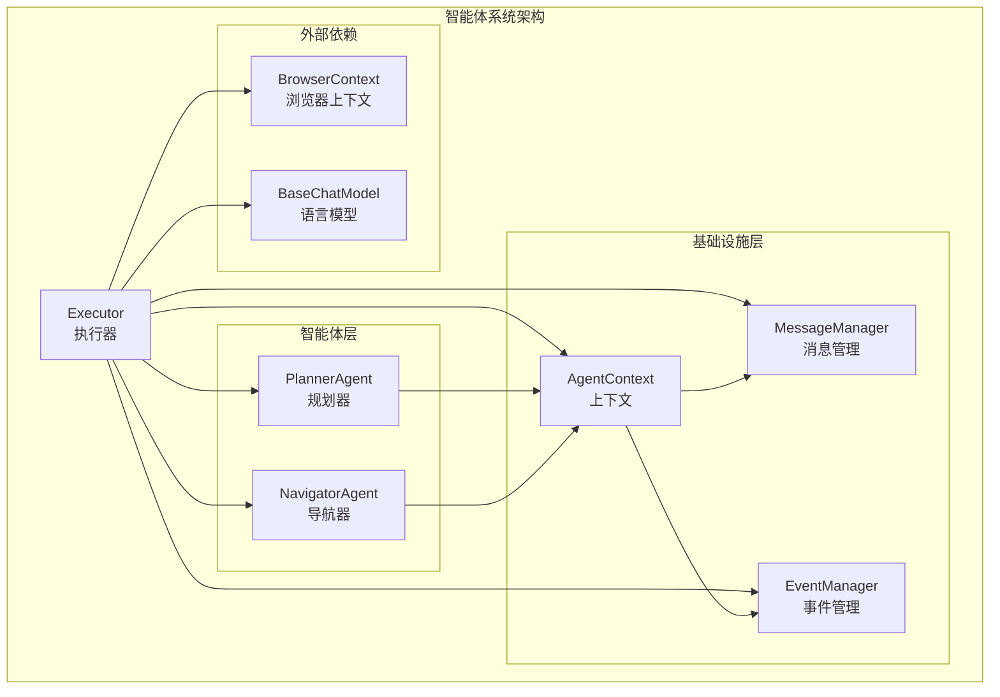
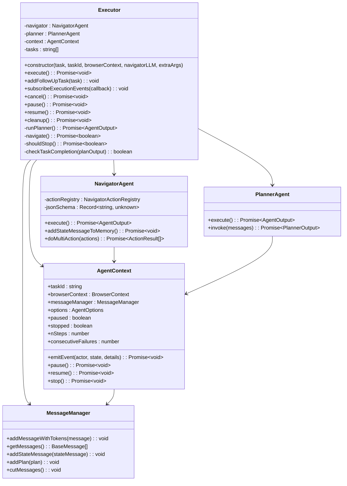
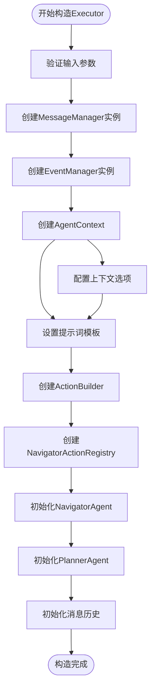
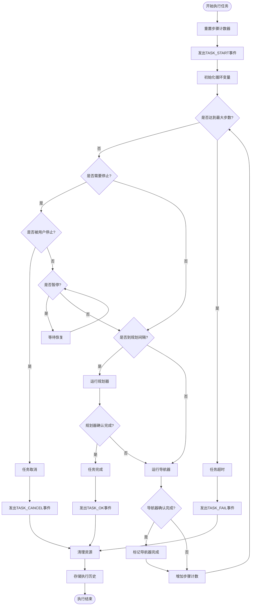
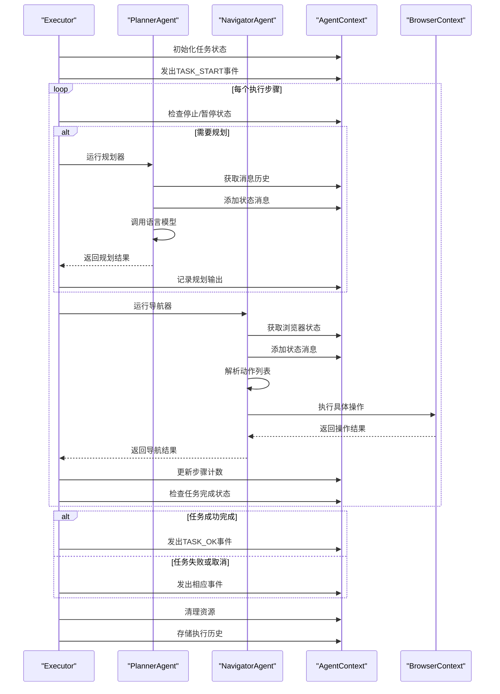
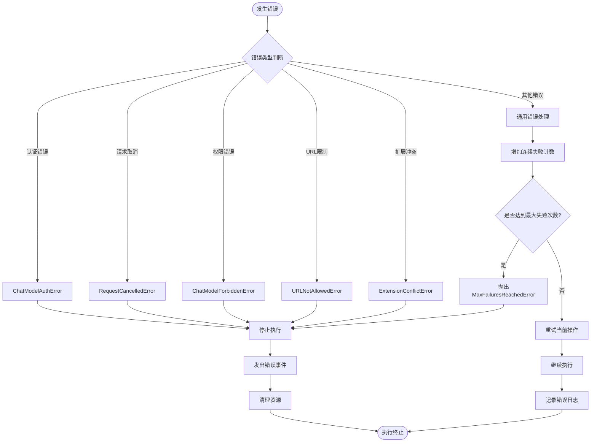
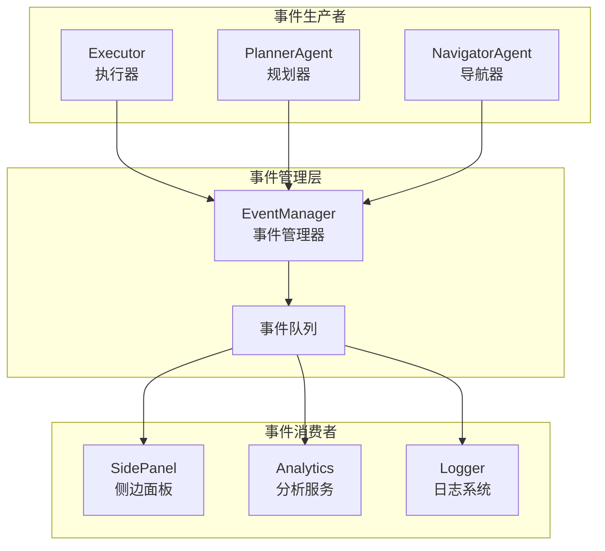

# nanobrowser执行器（Executor）技术文档

<cite>
**本文档引用的文件**
- [executor.ts](file://chrome-extension/src/background/agent/executor.ts)
- [types.ts](file://chrome-extension/src/background/agent/types.ts)
- [planner.ts](file://chrome-extension/src/background/agent/agents/planner.ts)
- [navigator.ts](file://chrome-extension/src/background/agent/agents/navigator.ts)
- [base.ts](file://chrome-extension/src/background/agent/agents/base.ts)
- [index.ts](file://chrome-extension/src/background/index.ts)
- [event/types.ts](file://chrome-extension/src/background/agent/event/types.ts)
- [messages/service.ts](file://chrome-extension/src/background/agent/messages/service.ts)
</cite>

## 目录
1. [简介](#简介)
2. [项目结构概览](#项目结构概览)
3. [Executor核心架构](#executor核心架构)
4. [构造函数详解](#构造函数详解)
5. [主执行循环分析](#主执行循环分析)
6. [智能体协调机制](#智能体协调机制)
7. [错误处理与重试机制](#错误处理与重试机制)
8. [事件系统集成](#事件系统集成)
9. [使用示例](#使用示例)
10. [性能优化考虑](#性能优化考虑)
11. [故障排除指南](#故障排除指南)
12. [总结](#总结)

## 简介

nanobrowser执行器（Executor）是整个智能体系统的核心控制器，负责协调Planner（规划器）和Navigator（导航器）两个智能体的工作流程。Executor作为任务执行的中央调度器，实现了复杂的多步骤任务执行逻辑，包括任务规划、步骤控制、状态管理、错误处理和结果输出等功能。

Executor的设计遵循了模块化和可扩展的原则，通过清晰的职责分离实现了高度的灵活性和可靠性。它不仅能够处理单一任务的完整生命周期，还支持多任务链式执行和历史重放功能。

## 项目结构概览

Executor位于nanobrowser项目的智能体系统核心位置，其组织结构体现了清晰的分层架构：



**图表来源**
- [executor.ts](file://chrome-extension/src/background/agent/executor.ts#L28-L68)
- [types.ts](file://chrome-extension/src/background/agent/types.ts#L25-L65)

**章节来源**
- [executor.ts](file://chrome-extension/src/background/agent/executor.ts#L1-L435)
- [types.ts](file://chrome-extension/src/background/agent/types.ts#L1-L181)

## Executor核心架构

Executor采用面向对象的设计模式，通过组合多个智能体和基础设施组件来实现复杂的功能。其核心架构包含以下关键组件：

### 核心组件关系图



**图表来源**
- [executor.ts](file://chrome-extension/src/background/agent/executor.ts#L28-L68)
- [navigator.ts](file://chrome-extension/src/background/agent/agents/navigator.ts#L50-L100)
- [planner.ts](file://chrome-extension/src/background/agent/agents/planner.ts#L30-L50)
- [types.ts](file://chrome-extension/src/background/agent/types.ts#L25-L85)

**章节来源**
- [executor.ts](file://chrome-extension/src/background/agent/executor.ts#L28-L68)
- [navigator.ts](file://chrome-extension/src/background/agent/agents/navigator.ts#L50-L100)
- [planner.ts](file://chrome-extension/src/background/agent/agents/planner.ts#L30-L50)

## 构造函数详解

Executor的构造函数是整个系统初始化的核心，负责建立所有依赖项之间的连接关系。构造函数的参数设计体现了灵活性和可配置性：

### 构造函数参数分析



**图表来源**
- [executor.ts](file://chrome-extension/src/background/agent/executor.ts#L40-L85)

### 关键初始化步骤

1. **消息管理器初始化**：创建MessageManager实例，负责维护对话历史和消息令牌计算
2. **事件管理器初始化**：创建EventManager实例，支持事件订阅和发布机制
3. **AgentContext创建**：构建核心上下文对象，整合所有子系统
4. **提示词模板设置**：为Navigator和Planner分别创建专用的提示词模板
5. **动作构建器初始化**：创建ActionBuilder，用于动态生成可用的动作集合
6. **导航器智能体初始化**：基于动作注册表和提示词创建NavigatorAgent
7. **规划器智能体初始化**：基于提示词创建PlannerAgent

**章节来源**
- [executor.ts](file://chrome-extension/src/background/agent/executor.ts#L40-L85)

## 主执行循环分析

Executor的execute()方法是整个系统的主控制循环，实现了复杂的任务执行逻辑。该循环包含了规划、导航、状态检查和错误处理等多个环节：

### 主执行循环流程图



**图表来源**
- [executor.ts](file://chrome-extension/src/background/agent/executor.ts#L95-L180)

### 执行循环的关键特性

1. **规划间隔控制**：通过`context.options.planningInterval`参数控制规划器的执行频率
2. **步骤限制机制**：基于`context.options.maxSteps`防止无限循环
3. **状态检查点**：在每个关键节点检查任务状态和用户干预
4. **动态决策**：根据前一步的结果决定下一步的执行策略

**章节来源**
- [executor.ts](file://chrome-extension/src/background/agent/executor.ts#L95-L180)

## 智能体协调机制

Executor作为智能体间的协调者，实现了复杂的协作模式。这种协调不仅体现在任务分配上，还包括状态同步、错误传播和结果聚合等方面：

### 智能体协作序列图



**图表来源**
- [executor.ts](file://chrome-extension/src/background/agent/executor.ts#L95-L180)
- [navigator.ts](file://chrome-extension/src/background/agent/agents/navigator.ts#L150-L250)
- [planner.ts](file://chrome-extension/src/background/agent/agents/planner.ts#L35-L85)

### 协调机制的核心要素

1. **状态同步**：确保Planner和Navigator都能访问最新的浏览器状态
2. **消息传递**：通过MessageManager维护统一的消息历史
3. **错误传播**：将智能体层面的错误正确地反映到执行器级别
4. **结果聚合**：收集和整合两个智能体的输出结果

**章节来源**
- [executor.ts](file://chrome-extension/src/background/agent/executor.ts#L95-L180)
- [navigator.ts](file://chrome-extension/src/background/agent/agents/navigator.ts#L150-L250)
- [planner.ts](file://chrome-extension/src/background/agent/agents/planner.ts#L35-L85)

## 错误处理与重试机制

Executor实现了多层次的错误处理和重试机制，确保系统的稳定性和可靠性。这种机制涵盖了从网络错误到业务逻辑错误的各种场景：

### 错误处理层次结构



**图表来源**
- [executor.ts](file://chrome-extension/src/background/agent/executor.ts#L180-L230)

### 重试策略实现

Executor采用了指数退避和最大重试次数限制的重试策略：

1. **连续失败计数**：每次操作失败时增加`consecutiveFailures`计数
2. **最大重试限制**：基于`context.options.maxFailures`设置重试上限
3. **错误分类处理**：不同类型的错误采用不同的处理策略
4. **优雅降级**：在重试失败后提供合理的回退机制

**章节来源**
- [executor.ts](file://chrome-extension/src/background/agent/executor.ts#L180-L230)
- [navigator.ts](file://chrome-extension/src/background/agent/agents/navigator.ts#L300-L400)

## 事件系统集成

Executor深度集成了事件驱动架构，通过EventManager实现松耦合的组件通信。这种设计使得系统具有良好的可扩展性和可观测性：

### 事件系统架构



**图表来源**
- [event/types.ts](file://chrome-extension/src/background/agent/event/types.ts#L1-L78)
- [executor.ts](file://chrome-extension/src/background/agent/executor.ts#L85-L95)

### 支持的事件类型

Executor支持多种类型的事件，涵盖任务执行的各个阶段：

| 事件类型 | 描述 | 触发时机 |
|---------|------|----------|
| `TASK_START` | 任务开始执行 | 执行器开始处理新任务时 |
| `TASK_OK` | 任务成功完成 | 任务按预期完成时 |
| `TASK_FAIL` | 任务执行失败 | 发生不可恢复的错误时 |
| `TASK_CANCEL` | 任务被取消 | 用户主动取消任务时 |
| `STEP_START` | 步骤开始 | 开始新的执行步骤时 |
| `STEP_OK` | 步骤成功完成 | 当前步骤成功完成时 |
| `STEP_FAIL` | 步骤执行失败 | 步骤执行过程中发生错误时 |

**章节来源**
- [event/types.ts](file://chrome-extension/src/background/agent/event/types.ts#L20-L50)
- [executor.ts](file://chrome-extension/src/background/agent/executor.ts#L85-L95)

## 使用示例

以下是Executor的实际使用示例，展示了如何正确实例化和使用执行器：

### 基本使用模式

```typescript
// 创建浏览器上下文
const browserContext = new BrowserContext();

// 设置语言模型
const navigatorLLM = new OpenAIChatModel();
const plannerLLM = new OpenAIChatModel();

// 创建执行器实例
const executor = new Executor(
  "在电商网站上找到价格最低的笔记本电脑",
  "task_001",
  browserContext,
  navigatorLLM,
  {
    plannerLLM: plannerLLM,
    agentOptions: {
      maxSteps: 50,
      maxFailures: 3,
      planningInterval: 5,
      useVision: true
    }
  }
);

// 订阅执行事件
executor.subscribeExecutionEvents(async (event) => {
  console.log(`事件: ${event.state}`, event.data);
});

// 执行任务
try {
  await executor.execute();
  console.log("任务执行完成");
} catch (error) {
  console.error("任务执行失败:", error);
}
```

### 多任务链式执行

```typescript
// 创建第一个任务
const executor1 = new Executor("搜索产品信息", "task_001", browserContext, llm);
await executor1.execute();

// 添加后续任务
executor1.addFollowUpTask("比较不同产品的价格");

// 继续执行
await executor1.execute();
```

### 控制任务执行

```typescript
// 启动任务
const executor = new Executor("复杂网页操作任务", "task_002", browserContext, llm);
const executionPromise = executor.execute();

// 在需要时暂停任务
await executor.pause();
console.log("任务已暂停");

// 恢复任务执行
await executor.resume();
console.log("任务已恢复");

// 取消任务
await executor.cancel();
console.log("任务已取消");
```

**章节来源**
- [index.ts](file://chrome-extension/src/background/index.ts#L310-L325)
- [executor.ts](file://chrome-extension/src/background/agent/executor.ts#L85-L95)

## 性能优化考虑

Executor在设计时充分考虑了性能优化，采用了多种策略来提高执行效率和资源利用率：

### 性能优化策略

1. **消息历史管理**：
   - 实现了智能的消息截断机制，避免内存溢出
   - 支持基于令牌数量的动态消息裁剪
   - 提供敏感数据过滤功能

2. **并发控制**：
   - 通过AbortController实现任务中断机制
   - 支持异步操作的优雅取消
   - 避免不必要的等待时间

3. **缓存机制**：
   - 浏览器状态缓存减少重复计算
   - 动作结果缓存支持历史重放
   - 智能的DOM元素索引更新

4. **资源管理**：
   - 自动清理浏览器上下文资源
   - 智能的内存使用监控
   - 执行历史的条件存储

### 性能监控指标

| 指标类型 | 监控内容 | 优化目标 |
|---------|----------|----------|
| 执行时间 | 任务完成总耗时 | 减少平均执行时间 |
| 内存使用 | 消息历史大小 | 控制内存增长 |
| 错误率 | 失败操作比例 | 提高成功率 |
| 并发度 | 同时执行的任务数 | 优化资源分配 |

## 故障排除指南

当Executor遇到问题时，可以通过以下方法进行诊断和解决：

### 常见问题及解决方案

1. **任务执行超时**
   - 检查`maxSteps`配置是否过小
   - 分析任务复杂度是否超出预期
   - 调整`planningInterval`参数

2. **智能体交互失败**
   - 验证语言模型配置是否正确
   - 检查网络连接和API密钥
   - 查看详细的错误日志

3. **内存使用过高**
   - 启用消息历史截断功能
   - 调整`maxInputTokens`参数
   - 定期清理执行历史

4. **任务意外中断**
   - 检查浏览器上下文配置
   - 验证URL白名单设置
   - 监控资源使用情况

### 调试工具和技巧

```typescript
// 启用详细日志记录
const executor = new Executor(task, taskId, browserContext, llm, {
  agentOptions: { /* 配置 */ }
});

// 访问执行历史
const history = executor.getContext().history;

// 监控执行状态
executor.subscribeExecutionEvents(event => {
  if (event.state === ExecutionState.STEP_FAIL) {
    console.warn('步骤失败:', event.data.details);
  }
});
```

## 总结

nanobrowser执行器（Executor）是一个设计精良的智能体控制系统，它成功地将复杂的多步骤任务分解为可管理的组件。通过清晰的职责分离、强大的错误处理机制和灵活的配置选项，Executor为整个智能体系统提供了稳定可靠的任务执行能力。

### 核心优势

1. **模块化设计**：清晰的组件分离使得系统易于理解和维护
2. **容错性强**：多层次的错误处理确保系统稳定性
3. **可扩展性好**：事件驱动架构支持功能扩展
4. **性能优化**：多种优化策略保证高效执行
5. **调试友好**：完善的日志和监控机制便于问题诊断

### 应用价值

Executor不仅是一个技术实现，更是现代智能体系统设计理念的体现。它展示了如何通过合理的架构设计，将复杂的AI任务转化为可执行的程序模块，为构建更智能、更可靠的自动化系统奠定了坚实基础。