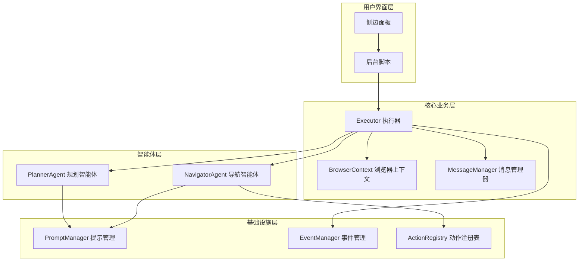
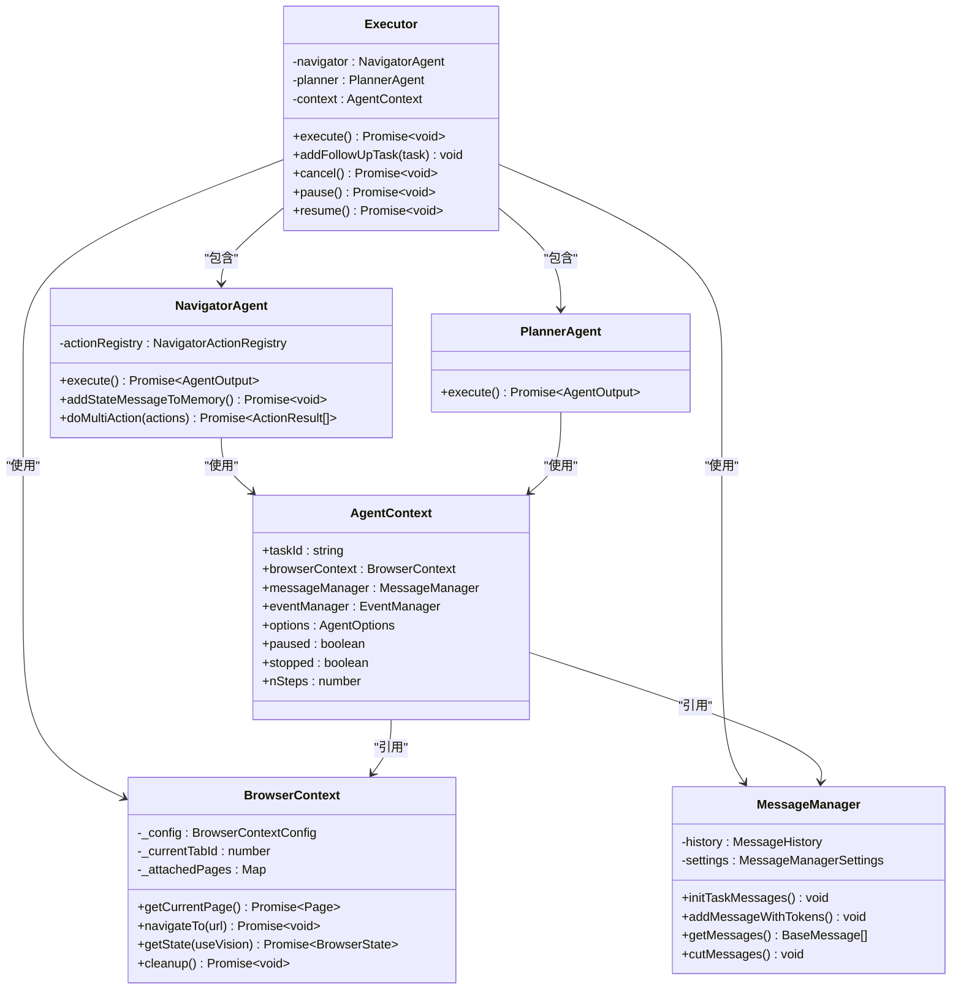
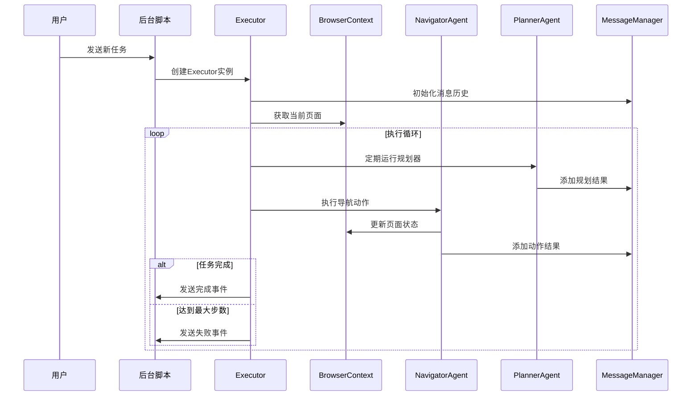
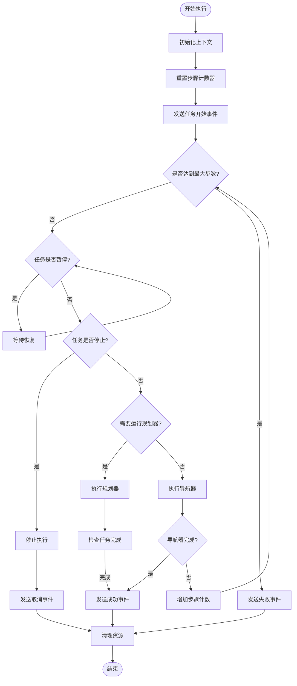
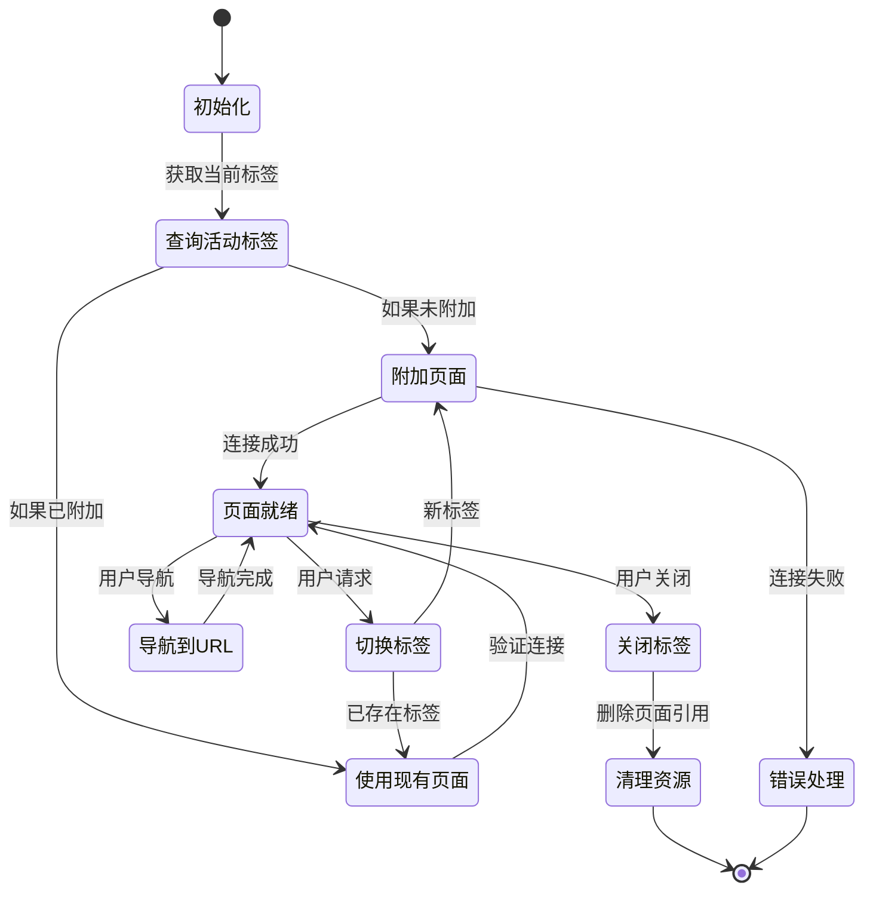
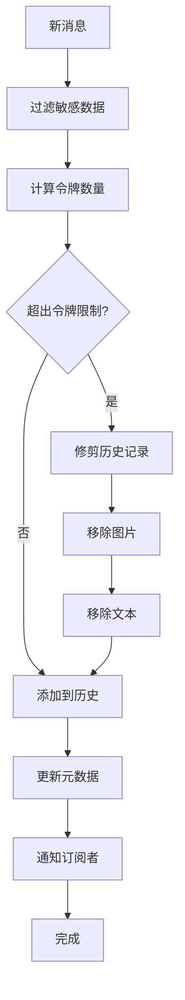
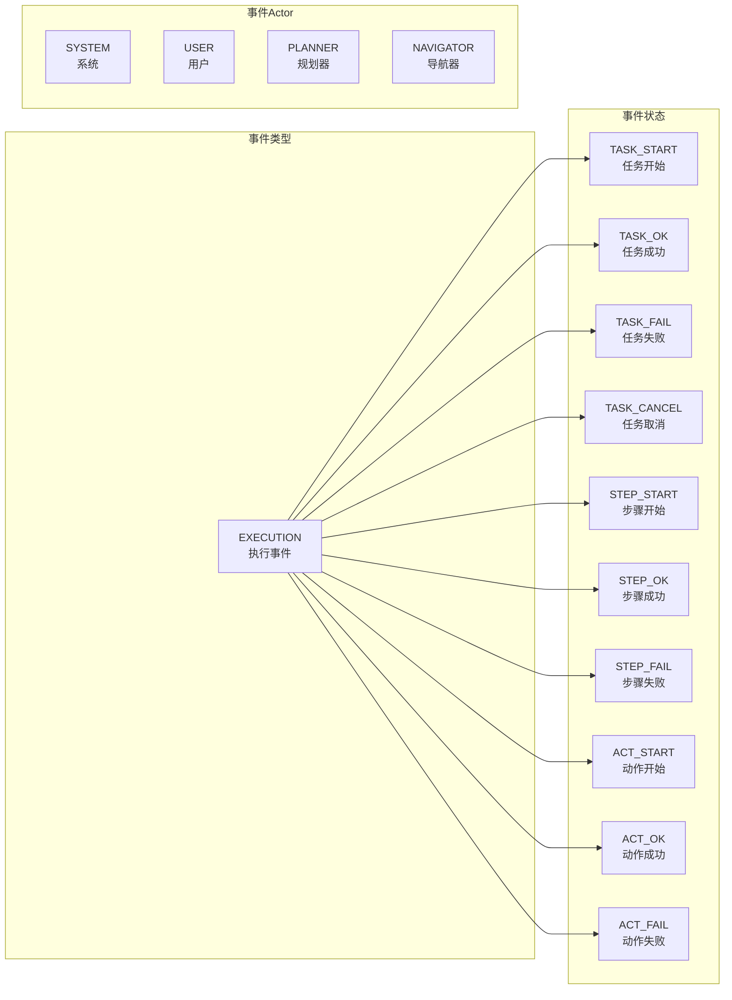
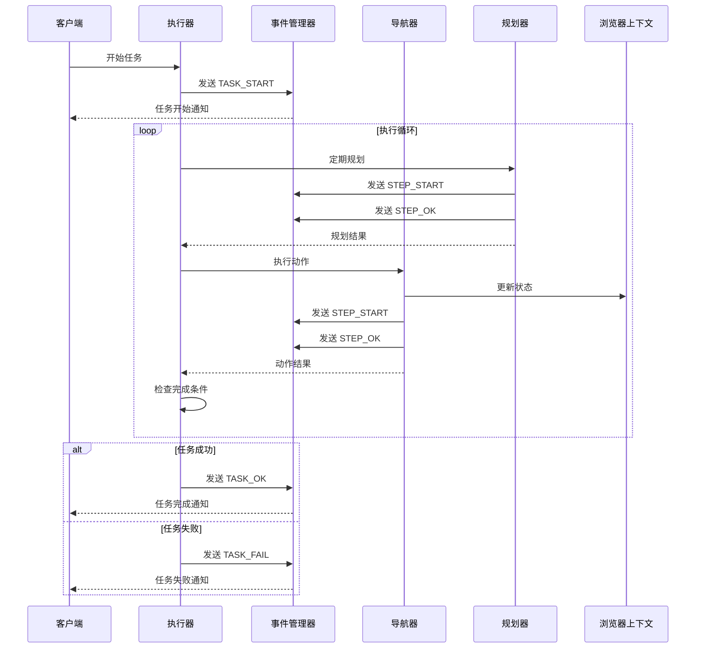
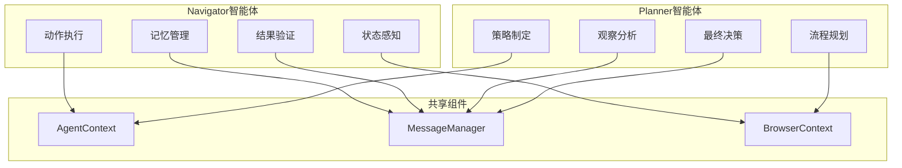
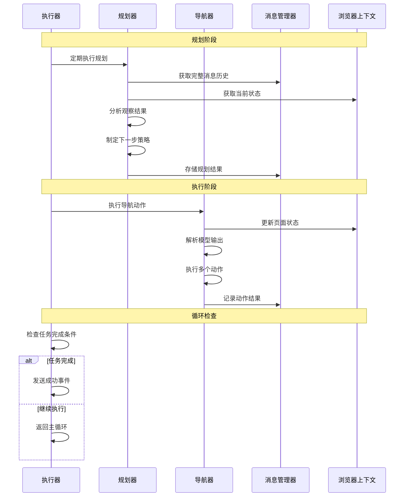

# nanobrowser核心架构技术文档

<cite>
**本文档中引用的文件**
- [index.ts](file://chrome-extension/src/background/index.ts)
- [context.ts](file://chrome-extension/src/background/browser/context.ts)
- [executor.ts](file://chrome-extension/src/background/agent/executor.ts)
- [service.ts](file://chrome-extension/src/background/agent/messages/service.ts)
- [types.ts](file://chrome-extension/src/background/agent/types.ts)
- [page.ts](file://chrome-extension/src/background/browser/page.ts)
- [manager.ts](file://chrome-extension/src/background/agent/event/manager.ts)
- [utils.ts](file://chrome-extension/src/background/agent/messages/utils.ts)
- [base.ts](file://chrome-extension/src/background/agent/prompts/base.ts)
- [navigator.ts](file://chrome-extension/src/background/agent/agents/navigator.ts)
- [planner.ts](file://chrome-extension/src/background/agent/agents/planner.ts)
- [types.ts](file://chrome-extension/src/background/agent/event/types.ts)
</cite>

## 目录
1. [简介](#简介)
2. [项目结构概览](#项目结构概览)
3. [核心组件架构](#核心组件架构)
4. [Executor类：任务执行控制器](#executor类任务执行控制器)
5. [BrowserContext类：浏览器状态管理](#browsercontext类浏览器状态管理)
6. [MessageManager类：智能体通信管理](#messagemanager类智能体通信管理)
7. [事件驱动执行流程](#事件驱动执行流程)
8. [多智能体协作机制](#多智能体协作机制)
9. [架构决策与权衡](#架构决策与权衡)
10. [总结](#总结)

## 简介

nanobrowser是一个基于Chrome扩展的智能网页自动化系统，采用事件驱动的多智能体架构设计。该系统通过三个核心组件的协同工作，实现了复杂的网页交互任务执行：Executor作为任务执行控制器，BrowserContext管理浏览器状态和标签页，MessageManager处理智能体间的通信和上下文管理。

系统的核心设计理念是将复杂的网页操作分解为导航（Navigator）和规划（Planner）两个专门化的智能体，通过事件驱动的方式实现模块化、可扩展的任务执行框架。

## 项目结构概览

nanobrowser采用分层架构设计，主要分为以下几个层次：

**图表来源**
- [index.ts](file://chrome-extension/src/background/index.ts#L1-L50)
- [executor.ts](file://chrome-extension/src/background/agent/executor.ts#L1-L50)

**章节来源**
- [index.ts](file://chrome-extension/src/background/index.ts#L1-L352)

## 核心组件架构

### 组件关系图

**图表来源**
- [executor.ts](file://chrome-extension/src/background/agent/executor.ts#L25-L80)
- [context.ts](file://chrome-extension/src/background/browser/context.ts#L15-L50)
- [service.ts](file://chrome-extension/src/background/agent/messages/service.ts#L30-L60)
- [types.ts](file://chrome-extension/src/background/agent/types.ts#L25-L80)

### 数据流架构

**图表来源**
- [executor.ts](file://chrome-extension/src/background/agent/executor.ts#L120-L200)
- [index.ts](file://chrome-extension/src/background/index.ts#L80-L150)

**章节来源**
- [executor.ts](file://chrome-extension/src/background/agent/executor.ts#L1-L435)
- [context.ts](file://chrome-extension/src/background/browser/context.ts#L1-L361)
- [service.ts](file://chrome-extension/src/background/agent/messages/service.ts#L1-L441)

## Executor类：任务执行控制器

Executor类是整个系统的核心控制器，负责协调各个组件的工作，管理任务的生命周期，并提供统一的接口供外部调用。

### 主要职责

1. **任务生命周期管理**：从任务创建到完成的全过程管理
2. **智能体协调**：协调Navigator和Planner两个智能体的工作
3. **错误处理**：统一的异常处理和恢复机制
4. **状态监控**：实时监控任务执行状态
5. **历史记录**：维护任务执行的历史记录

### 核心方法分析

**图表来源**
- [executor.ts](file://chrome-extension/src/background/agent/executor.ts#L120-L250)

### 架构特点

Executor采用了以下关键设计模式：

1. **命令模式**：每个任务都被封装为一个独立的执行单元
2. **观察者模式**：通过事件管理器实现组件间的解耦
3. **策略模式**：支持不同的执行策略和配置选项
4. **模板方法模式**：定义了标准的执行流程框架

**章节来源**
- [executor.ts](file://chrome-extension/src/background/agent/executor.ts#L25-L150)

## BrowserContext类：浏览器状态管理

BrowserContext类负责管理浏览器的状态和标签页，是连接用户界面和底层浏览器API的关键桥梁。

### 核心功能

1. **标签页管理**：创建、切换、关闭和监控标签页
2. **页面状态跟踪**：维护页面的DOM结构和交互元素
3. **浏览器配置管理**：处理防火墙设置、超时配置等
4. **状态缓存**：优化频繁的状态查询性能

### 状态管理流程

**图表来源**
- [context.ts](file://chrome-extension/src/background/browser/context.ts#L80-L150)

### 页面状态模型

BrowserContext维护了一个丰富的页面状态模型，包括：

| 属性 | 类型 | 描述 |
|------|------|------|
| elementTree | DOMElementNode | DOM树结构 |
| selectorMap | Map<number, DOMElementNode> | 元素索引映射 |
| tabId | number | 标签页标识符 |
| url | string | 当前URL |
| title | string | 页面标题 |
| screenshot | string \| null | 页面截图（Base64） |
| scrollY | number | 垂直滚动位置 |
| scrollHeight | number | 页面总高度 |
| visualViewportHeight | number | 可视区域高度 |

**章节来源**
- [context.ts](file://chrome-extension/src/background/browser/context.ts#L15-L100)
- [page.ts](file://chrome-extension/src/background/browser/page.ts#L1-L200)

## MessageManager类：智能体通信管理

MessageManager负责智能体间的通信和上下文管理，是整个系统的通信中枢。

### 设计理念

MessageManager采用了以下核心设计原则：

1. **令牌化消息管理**：自动计算和限制消息长度
2. **敏感数据过滤**：保护用户隐私和安全
3. **历史记录维护**：支持任务回放和调试
4. **动态内容处理**：支持文本和图像混合内容

### 消息处理流程

**图表来源**
- [service.ts](file://chrome-extension/src/background/agent/messages/service.ts#L350-L440)

### 内容过滤机制

MessageManager实现了多层次的内容过滤机制：

| 过滤级别 | 处理方式 | 应用场景 |
|----------|----------|----------|
| 敏感数据替换 | 将敏感值替换为占位符 | 用户输入中的密码、个人信息 |
| 外部内容标记 | 对不可信内容添加警告标签 | 网页内容、用户上传文件 |
| 代码块解析 | 提取和验证JSON格式内容 | 模型输出解析 |
| 图像令牌估算 | 基于图像大小估算令牌数量 | 视觉输入处理 |

**章节来源**
- [service.ts](file://chrome-extension/src/background/agent/messages/service.ts#L30-L150)
- [utils.ts](file://chrome-extension/src/background/agent/messages/utils.ts#L1-L100)

## 事件驱动执行流程

系统采用事件驱动架构，通过事件管理器实现组件间的松耦合通信。

### 事件类型体系

**图表来源**
- [types.ts](file://chrome-extension/src/background/agent/event/types.ts#L1-L78)

### 执行流程时序图

**图表来源**
- [executor.ts](file://chrome-extension/src/background/agent/executor.ts#L150-L250)
- [manager.ts](file://chrome-extension/src/background/agent/event/manager.ts#L1-L53)

**章节来源**
- [types.ts](file://chrome-extension/src/background/agent/event/types.ts#L1-L78)
- [manager.ts](file://chrome-extension/src/background/agent/event/manager.ts#L1-L53)

## 多智能体协作机制

系统采用多智能体架构，通过Navigator和Planner两个专门化的智能体实现分工协作。

### 智能体角色分工

**图表来源**
- [navigator.ts](file://chrome-extension/src/background/agent/agents/navigator.ts#L1-L100)
- [planner.ts](file://chrome-extension/src/background/agent/agents/planner.ts#L1-L50)

### 协作流程

**图表来源**
- [executor.ts](file://chrome-extension/src/background/agent/executor.ts#L180-L250)
- [navigator.ts](file://chrome-extension/src/background/agent/agents/navigator.ts#L100-L200)

### 智能体间通信

智能体通过以下机制进行通信：

1. **共享上下文**：通过AgentContext访问相同的状态和配置
2. **消息传递**：通过MessageManager交换信息
3. **状态同步**：通过BrowserContext保持状态一致性
4. **事件通知**：通过事件管理器实现异步通信

**章节来源**
- [navigator.ts](file://chrome-extension/src/background/agent/agents/navigator.ts#L1-L300)
- [planner.ts](file://chrome-extension/src/background/agent/agents/planner.ts#L1-L132)

## 架构决策与权衡

### 多智能体 vs 单一智能体

**选择多智能体的原因：**

1. **专业化分工**：Navigator专注于动作执行，Planner专注于策略规划
2. **模块化设计**：便于独立开发和测试各个组件
3. **容错性**：单个智能体故障不会影响整个系统
4. **可扩展性**：可以轻松添加新的智能体类型

**权衡考虑：**

| 方面 | 多智能体 | 单一智能体 |
|------|----------|------------|
| 复杂度 | 高（需要协调） | 低（简单统一） |
| 性能 | 中等（通信开销） | 高（无通信开销） |
| 可维护性 | 高（模块化） | 低（逻辑集中） |
| 可扩展性 | 高（易于添加新智能体） | 低（扩展困难） |
| 容错性 | 高（部分故障不影响） | 低（单点故障） |

### 事件驱动 vs 轮询机制

**事件驱动的优势：**

1. **响应性**：即时响应状态变化
2. **效率**：避免不必要的轮询开销
3. **解耦**：组件间松耦合
4. **可扩展性**：易于添加新的事件处理器

**权衡考虑：**

| 特性 | 事件驱动 | 轮询机制 |
|------|----------|----------|
| 实时性 | 高 | 低（取决于轮询间隔） |
| 资源消耗 | 低（按需触发） | 高（持续监控） |
| 实现复杂度 | 高（需要事件管理） | 低（简单定时器） |
| 调试难度 | 中等（异步流程） | 低（线性流程） |

### 状态管理策略

系统采用了多层次的状态管理策略：

1. **内存缓存**：快速访问常用状态
2. **持久化存储**：保存历史记录和配置
3. **增量更新**：只更新变化的部分
4. **版本控制**：支持状态回滚和比较

**章节来源**
- [executor.ts](file://chrome-extension/src/background/agent/executor.ts#L1-L100)
- [context.ts](file://chrome-extension/src/background/browser/context.ts#L1-L100)

## 总结

nanobrowser的核心架构体现了现代软件设计的最佳实践，通过以下关键特性实现了高效、可靠的网页自动化：

### 架构优势

1. **模块化设计**：清晰的职责分离和组件边界
2. **事件驱动**：高效的异步通信机制
3. **多智能体协作**：专业化的分工和协调
4. **可扩展性**：易于添加新功能和智能体
5. **容错性**：完善的错误处理和恢复机制

### 技术创新

1. **令牌化消息管理**：智能的内容截断和优化
2. **动态状态跟踪**：实时的DOM结构感知
3. **任务历史记录**：完整的执行轨迹追踪
4. **安全过滤机制**：多层次的内容保护

### 应用价值

该架构不仅适用于网页自动化场景，其设计理念和实现模式也为其他复杂系统提供了有价值的参考。通过合理的架构设计，系统在保证功能完整性的同时，实现了良好的性能表现和用户体验。

这种设计充分体现了软件工程中"关注点分离"和"单一职责"原则的重要性，为构建大规模、高可用的智能系统奠定了坚实的基础。