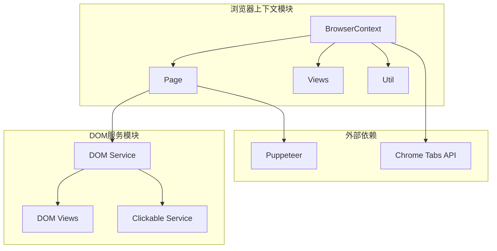
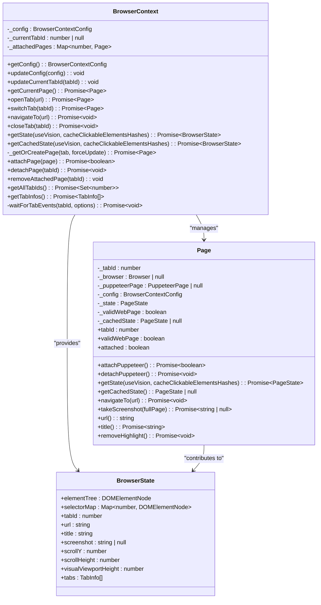
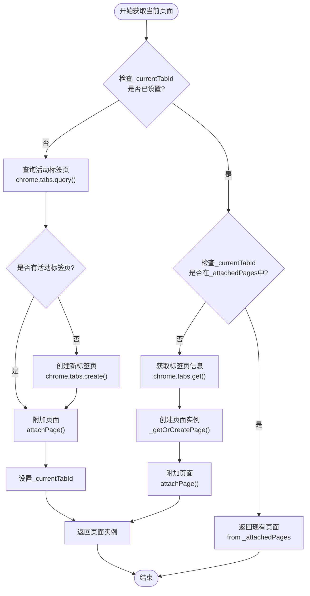
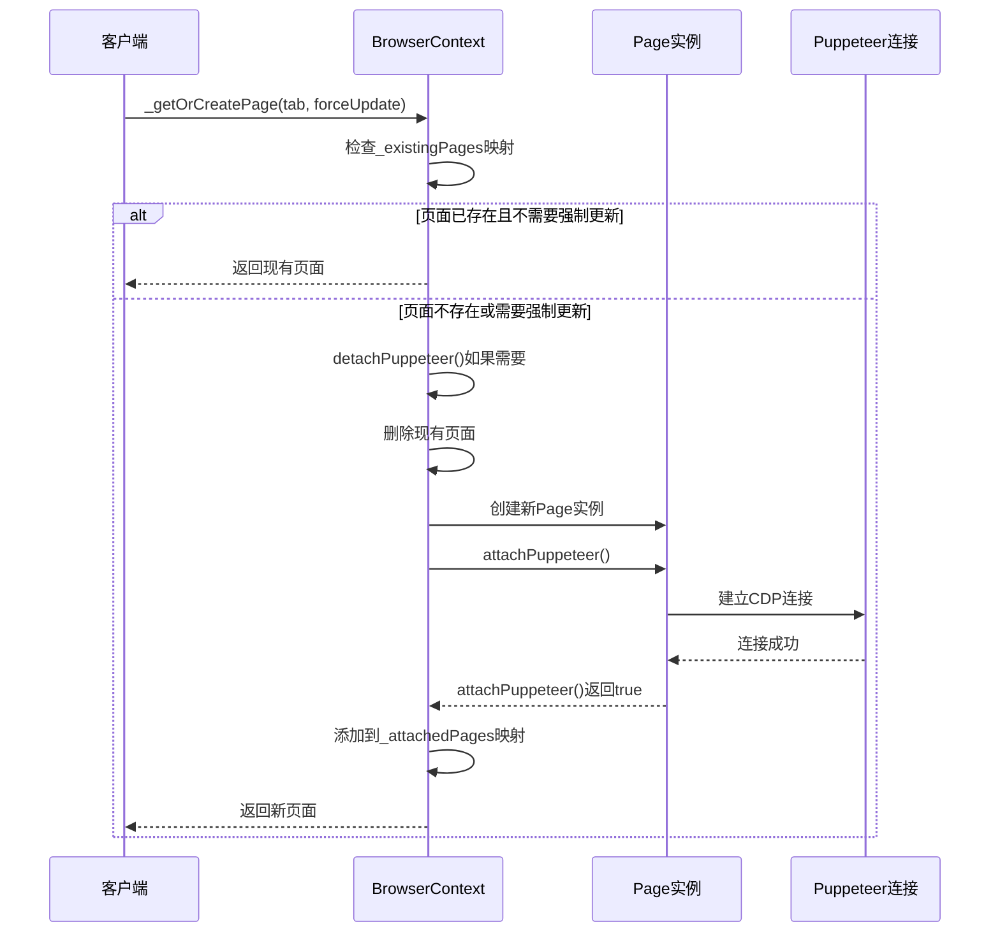
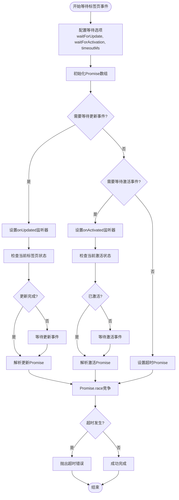
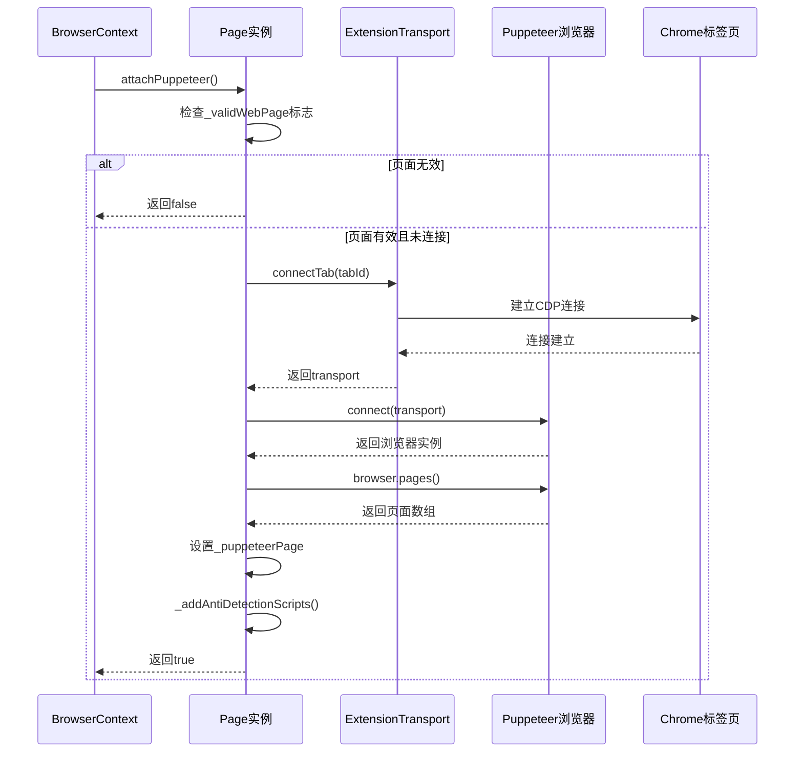
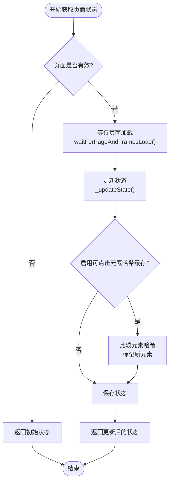
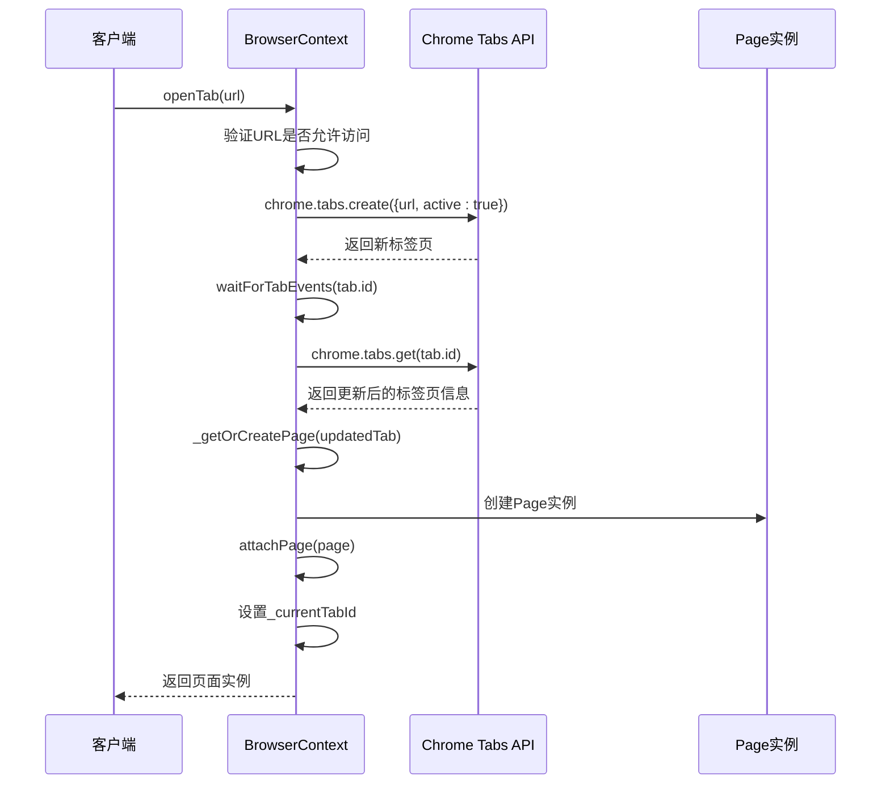
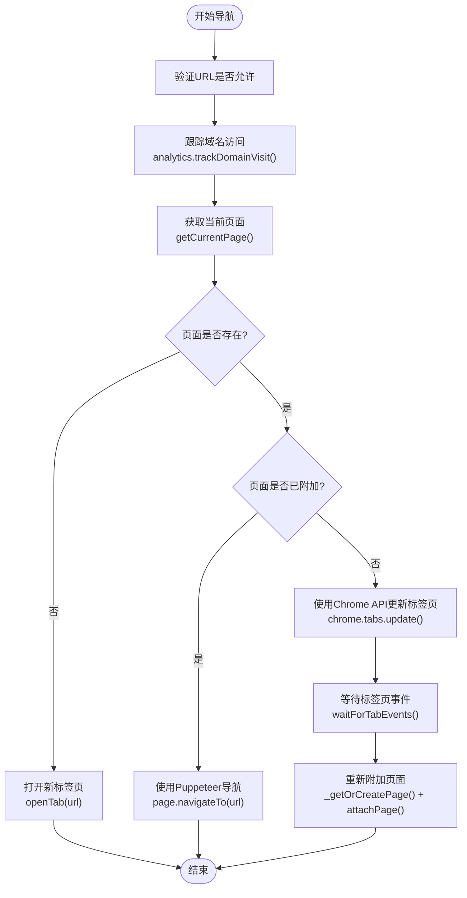
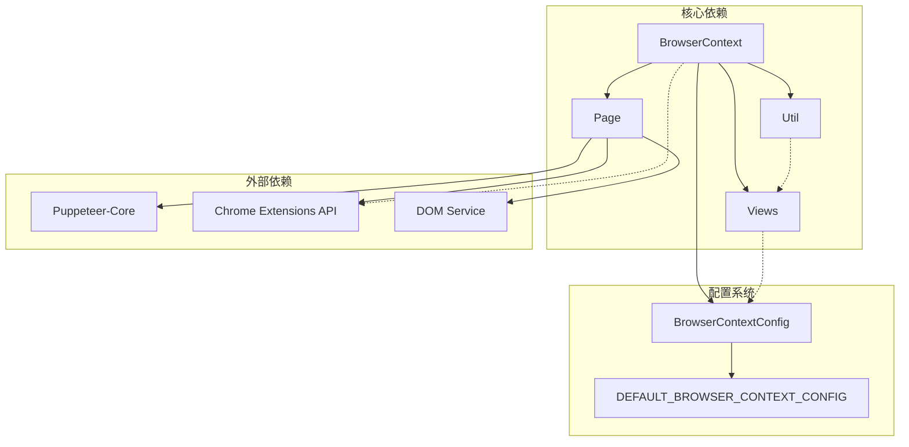

# 浏览器上下文（BrowserContext）技术文档

<cite>
**本文档引用的文件**
- [context.ts](file://chrome-extension/src/background/browser/context.ts)
- [page.ts](file://chrome-extension/src/background/browser/page.ts)
- [views.ts](file://chrome-extension/src/background/browser/views.ts)
- [util.ts](file://chrome-extension/src/background/browser/util.ts)
- [views.ts](file://chrome-extension/src/background/browser/dom/views.ts)
- [service.ts](file://chrome-extension/src/background/browser/dom/clickable/service.ts)
</cite>

## 目录
1. [简介](#简介)
2. [项目结构](#项目结构)
3. [核心组件](#核心组件)
4. [架构概览](#架构概览)
5. [详细组件分析](#详细组件分析)
6. [依赖关系分析](#依赖关系分析)
7. [性能考虑](#性能考虑)
8. [故障排除指南](#故障排除指南)
9. [结论](#结论)

## 简介

BrowserContext是nanobrowser项目中的核心类，负责管理浏览器状态、标签页和页面实例。它通过维护已附加页面的映射（_attachedPages）和实现智能的页面获取逻辑，为智能体提供了强大的浏览器自动化能力。

该类的主要职责包括：
- 管理浏览器标签页的生命周期
- 维护与Puppeteer的连接以控制页面
- 提供统一的API接口用于标签页操作
- 管理浏览器状态的缓存和同步
- 处理标签页事件和超时机制

## 项目结构

BrowserContext类位于`chrome-extension/src/background/browser/`目录下，与其他浏览器相关的核心文件共同构成了完整的浏览器自动化框架。

**图表来源**
- [context.ts](file://chrome-extension/src/background/browser/context.ts#L1-L20)
- [page.ts](file://chrome-extension/src/background/browser/page.ts#L1-L30)

**章节来源**
- [context.ts](file://chrome-extension/src/background/browser/context.ts#L1-L361)
- [views.ts](file://chrome-extension/src/background/browser/views.ts#L1-L152)

## 核心组件

BrowserContext类包含以下核心组件：

### 私有属性
- `_config`: 浏览器上下文配置对象
- `_currentTabId`: 当前活动标签页ID
- `_attachedPages`: 已附加页面的映射表

### 核心方法
- `_getOrCreatePage`: 获取或创建页面实例
- `attachPage`: 附加页面到上下文
- `detachPage`: 从上下文分离页面
- `getCurrentPage`: 获取当前页面
- `openTab`: 打开新标签页
- `switchTab`: 切换到指定标签页
- `navigateTo`: 导航到指定URL

**章节来源**
- [context.ts](file://chrome-extension/src/background/browser/context.ts#L13-L25)

## 架构概览

BrowserContext采用分层架构设计，通过清晰的职责分离实现了高效的浏览器状态管理。

**图表来源**
- [context.ts](file://chrome-extension/src/background/browser/context.ts#L13-L361)
- [page.ts](file://chrome-extension/src/background/browser/page.ts#L70-L120)
- [views.ts](file://chrome-extension/src/background/browser/views.ts#L110-L150)

## 详细组件分析

### BrowserContext类详细分析

#### 页面获取逻辑（getCurrentPage）

BrowserContext的`getCurrentPage`方法实现了智能的三步页面获取逻辑：

**图表来源**
- [context.ts](file://chrome-extension/src/background/browser/context.ts#L88-L125)

#### 页面生命周期管理

BrowserContext通过`_getOrCreatePage`方法管理页面的生命周期：

**图表来源**
- [context.ts](file://chrome-extension/src/background/browser/context.ts#L32-L50)

#### 标签页事件监听机制

BrowserContext实现了复杂的标签页事件监听机制，确保页面状态的一致性：

**图表来源**
- [context.ts](file://chrome-extension/src/background/browser/context.ts#L135-L210)

**章节来源**
- [context.ts](file://chrome-extension/src/background/browser/context.ts#L88-L210)

### Page类详细分析

#### Puppeteer集成机制

Page类通过Puppeteer实现浏览器自动化功能：

**图表来源**
- [page.ts](file://chrome-extension/src/background/browser/page.ts#L95-L120)

#### 页面状态管理

Page类实现了复杂的状态管理系统，支持缓存和增量更新：

**图表来源**
- [page.ts](file://chrome-extension/src/background/browser/page.ts#L320-L380)

**章节来源**
- [page.ts](file://chrome-extension/src/background/browser/page.ts#L70-L120)
- [page.ts](file://chrome-extension/src/background/browser/page.ts#L320-L380)

### 核心导航操作实现

#### openTab方法实现

BrowserContext的`openTab`方法实现了完整的标签页打开流程：

**图表来源**
- [context.ts](file://chrome-extension/src/background/browser/context.ts#L250-L285)

#### navigateTo方法实现

`navigateTo`方法支持多种导航场景：

**图表来源**
- [context.ts](file://chrome-extension/src/background/browser/context.ts#L212-L250)

**章节来源**
- [context.ts](file://chrome-extension/src/background/browser/context.ts#L212-L285)

### 状态管理机制

#### 浏览器状态获取

BrowserContext提供了两种状态获取方式：

| 方法 | 描述 | 缓存策略 |
|------|------|----------|
| `getState()` | 获取完整浏览器状态 | 不使用缓存，实时获取所有信息 |
| `getCachedState()` | 获取缓存的浏览器状态 | 使用缓存，仅在必要时刷新 |

#### 状态组成

浏览器状态包含以下关键信息：

| 属性 | 类型 | 描述 |
|------|------|------|
| `elementTree` | DOMElementNode | DOM树结构 |
| `selectorMap` | Map<number, DOMElementNode> | 选择器映射 |
| `tabId` | number | 当前标签页ID |
| `url` | string | 当前页面URL |
| `title` | string | 页面标题 |
| `screenshot` | string \| null | 页面截图（可选） |
| `scrollY` | number | 垂直滚动位置 |
| `scrollHeight` | number | 页面总高度 |
| `visualViewportHeight` | number | 视口高度 |
| `tabs` | TabInfo[] | 所有标签页信息 |

**章节来源**
- [context.ts](file://chrome-extension/src/background/browser/context.ts#L325-L359)
- [views.ts](file://chrome-extension/src/background/browser/views.ts#L110-L150)

## 依赖关系分析

BrowserContext类与多个模块存在复杂的依赖关系：

**图表来源**
- [context.ts](file://chrome-extension/src/background/browser/context.ts#L1-L12)
- [page.ts](file://chrome-extension/src/background/browser/page.ts#L1-L15)

**章节来源**
- [context.ts](file://chrome-extension/src/background/browser/context.ts#L1-L12)
- [page.ts](file://chrome-extension/src/background/browser/page.ts#L1-L15)

## 性能考虑

### 页面缓存策略

BrowserContext实现了多层次的缓存机制：

1. **页面级缓存**: 通过`_attachedPages`映射避免重复创建页面实例
2. **状态级缓存**: Page类的`_cachedState`属性缓存DOM状态
3. **元素级缓存**: 可点击元素的哈希值缓存用于增量更新

### 异步操作优化

- 使用Promise.race处理超时和竞态条件
- 实现非阻塞的标签页事件监听
- 支持并行的页面状态更新

### 内存管理

- 自动清理断开连接的页面
- 及时释放Puppeteer资源
- 控制DOM树的深度和广度

## 故障排除指南

### 常见问题及解决方案

#### 页面无法附加到Puppeteer

**症状**: `attachPuppeteer()`返回false或抛出异常

**原因**: 
- 页面不是有效的Web页面（如chrome://扩展页面）
- CDP连接失败
- 页面已被关闭

**解决方案**:
- 检查页面URL是否在允许列表中
- 验证页面是否仍然存在
- 重新创建页面实例

#### 标签页事件超时

**症状**: `waitForTabEvents()`抛出超时错误

**原因**:
- 页面加载时间过长
- 网络连接不稳定
- 页面JavaScript执行缓慢

**解决方案**:
- 调整超时时间配置
- 检查网络连接
- 优化页面加载性能

#### 状态获取不一致

**症状**: `getState()`返回的状态与实际页面不匹配

**原因**:
- 页面状态更新延迟
- 并发操作冲突
- 缓存失效

**解决方案**:
- 增加等待时间
- 使用同步锁机制
- 清除相关缓存

**章节来源**
- [context.ts](file://chrome-extension/src/background/browser/context.ts#L135-L210)
- [page.ts](file://chrome-extension/src/background/browser/page.ts#L95-L120)

## 结论

BrowserContext类是nanobrowser项目的核心组件，通过精心设计的架构实现了高效、可靠的浏览器状态管理。其主要优势包括：

1. **智能页面管理**: 通过三步获取逻辑和缓存机制优化性能
2. **强大的事件处理**: 完善的标签页事件监听和超时处理
3. **灵活的导航控制**: 支持多种导航场景和回退机制
4. **完善的状态管理**: 分层缓存和增量更新策略
5. **健壮的错误处理**: 全面的异常捕获和恢复机制

该设计为智能体提供了稳定可靠的浏览器自动化基础，支持复杂的网页交互和状态监控需求。通过合理的抽象和封装，BrowserContext成功地将底层的Chrome扩展API和Puppeteer功能整合为统一的高级接口。