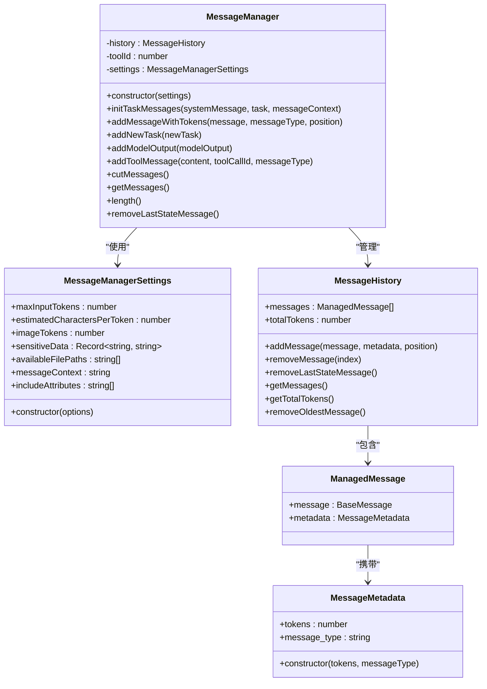
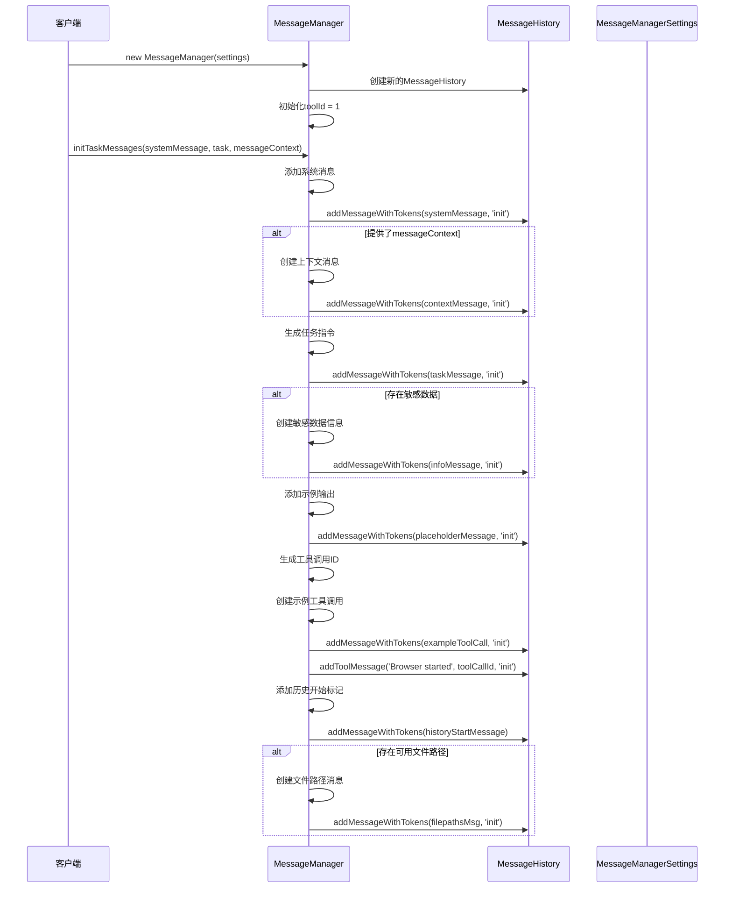
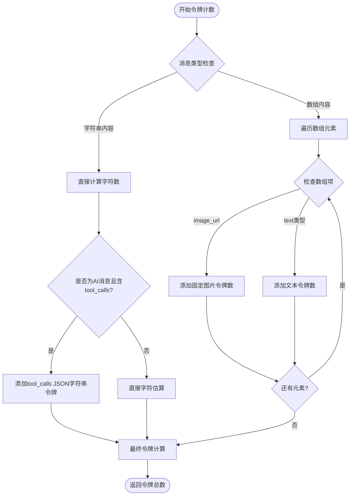
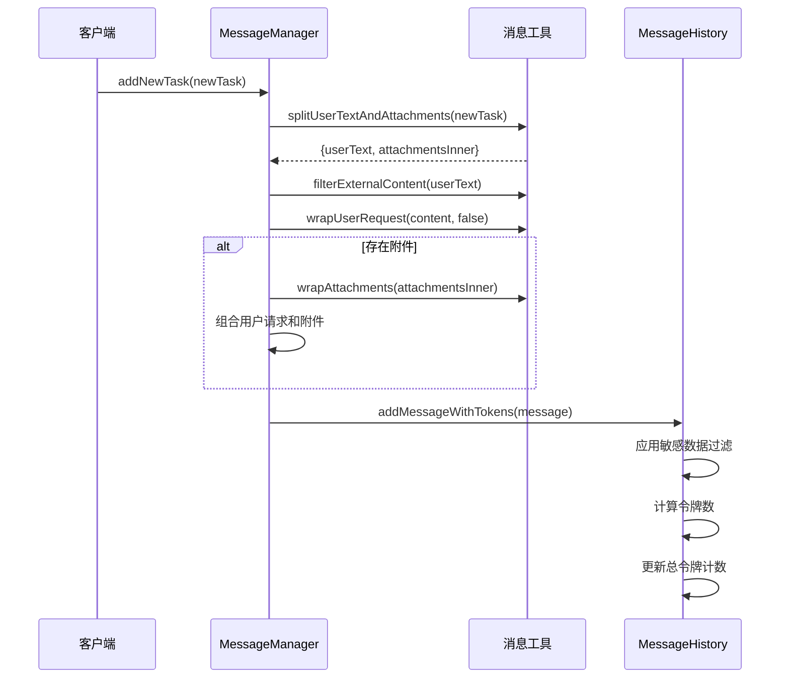
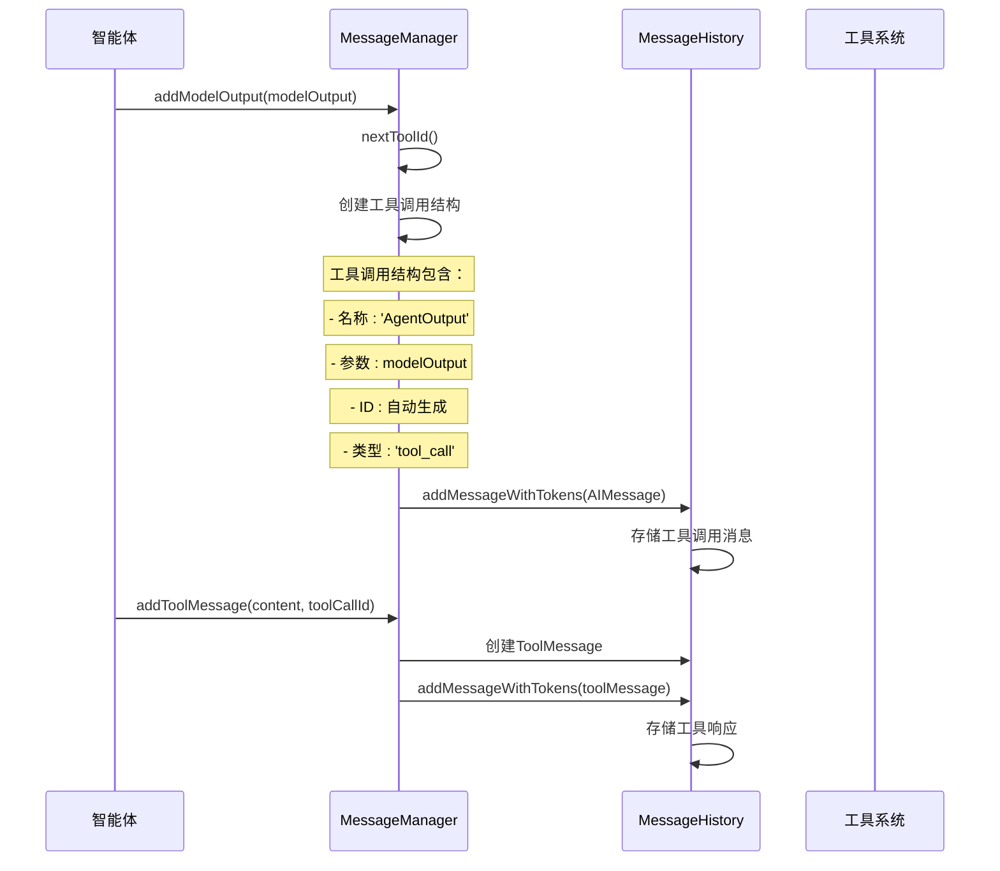
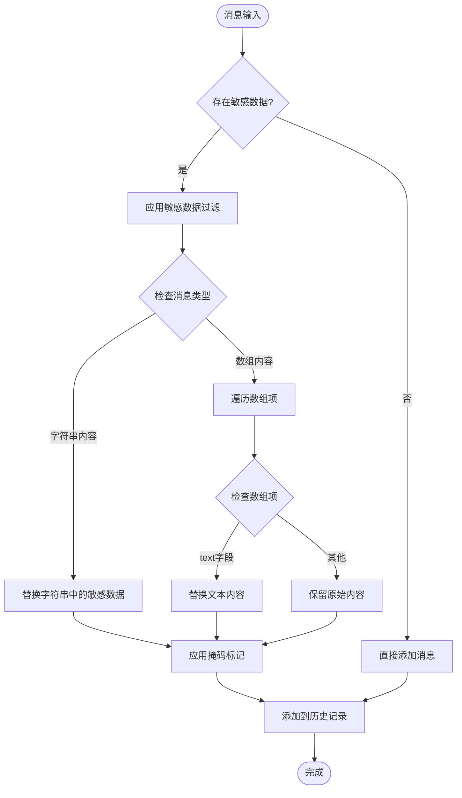

# nanobrowser消息管理器（MessageManager）技术文档

<cite>
**本文档引用的文件**
- [service.ts](file://chrome-extension/src/background/agent/messages/service.ts)
- [utils.ts](file://chrome-extension/src/background/agent/messages/utils.ts)
- [views.ts](file://chrome-extension/src/background/agent/messages/views.ts)
- [executor.ts](file://chrome-extension/src/background/agent/executor.ts)
- [navigator.ts](file://chrome-extension/src/background/agent/agents/navigator.ts)
- [planner.ts](file://chrome-extension/src/background/agent/agents/planner.ts)
</cite>

## 目录
1. [简介](#简介)
2. [架构概览](#架构概览)
3. [核心组件](#核心组件)
4. [初始化过程](#初始化过程)
5. [令牌计数机制](#令牌计数机制)
6. [消息管理功能](#消息管理功能)
7. [工具调用支持](#工具调用支持)
8. [配置选项](#配置选项)
9. [使用示例](#使用示例)
10. [最佳实践](#最佳实践)
11. [故障排除](#故障排除)

## 简介

MessageManager是nanobrowser项目中的核心消息管理组件，负责管理智能体与大型语言模型（LLM）之间的对话历史。它提供了完整的对话上下文管理功能，包括消息的添加、删除、令牌计数、敏感数据过滤和工具调用支持。

该组件采用基于字符估算的令牌计数机制，能够动态调整对话历史以适应LLM的上下文窗口限制，同时确保对话的连贯性和安全性。

## 架构概览

MessageManager采用模块化设计，主要由以下核心部分组成：



**图表来源**
- [service.ts](file://chrome-extension/src/background/agent/messages/service.ts#L43-L439)
- [views.ts](file://chrome-extension/src/background/agent/messages/views.ts#L22-L86)

**章节来源**
- [service.ts](file://chrome-extension/src/background/agent/messages/service.ts#L43-L439)
- [views.ts](file://chrome-extension/src/background/agent/messages/views.ts#L22-L86)

## 核心组件

### MessageManager类

MessageManager是消息管理的核心控制器，负责协调所有消息操作：

- **历史管理**：维护完整的对话历史记录
- **令牌控制**：监控和管理对话的令牌使用量
- **工具调用**：支持复杂的工具调用流程
- **安全过滤**：自动过滤敏感数据

### MessageManagerSettings配置类

提供灵活的配置选项，支持各种使用场景：

| 配置项 | 类型 | 默认值 | 描述 |
|--------|------|--------|------|
| maxInputTokens | number | 128000 | 最大输入令牌数限制 |
| estimatedCharactersPerToken | number | 3 | 每个令牌对应的字符估算值 |
| imageTokens | number | 800 | 单张图片的令牌数 |
| sensitiveData | Record<string, string> | undefined | 敏感数据映射表 |
| availableFilePaths | string[] | undefined | 可用文件路径列表 |
| messageContext | string | undefined | 消息上下文内容 |

### MessageHistory历史管理类

负责底层的消息存储和检索：

- **消息存储**：按顺序存储所有消息
- **令牌统计**：实时计算总令牌数
- **位置管理**：支持指定位置插入消息
- **清理功能**：提供多种消息清理策略

**章节来源**
- [service.ts](file://chrome-extension/src/background/agent/messages/service.ts#L12-L41)
- [views.ts](file://chrome-extension/src/background/agent/messages/views.ts#L22-L86)

## 初始化过程

MessageManager的初始化通过`initTaskMessages`方法完成，该方法建立完整的对话上下文：



**图表来源**
- [service.ts](file://chrome-extension/src/background/agent/messages/service.ts#L54-L130)

### 初始化步骤详解

1. **系统消息添加**：设置LLM的基本行为规范
2. **上下文消息**：提供当前任务的相关背景信息
3. **任务指令**：明确具体的执行目标
4. **敏感数据提示**：告知用户如何使用占位符
5. **示例输出**：展示期望的输出格式
6. **工具调用演示**：说明工具调用的工作方式
7. **历史标记**：标识任务历史的起始点
8. **文件路径提示**：列出可用的文件访问路径

**章节来源**
- [service.ts](file://chrome-extension/src/background/agent/messages/service.ts#L54-L130)

## 令牌计数机制

MessageManager实现了基于字符估算的令牌计数机制，这是其核心功能之一：

### 字符估算算法



**图表来源**
- [service.ts](file://chrome-extension/src/background/agent/messages/service.ts#L295-L330)

### 令牌计算规则

| 内容类型 | 计算方式 | 默认值 |
|----------|----------|--------|
| 文本内容 | 字符数 ÷ estimatedCharactersPerToken | 3字符/令牌 |
| 图片内容 | 固定值（默认800） | 800令牌 |
| 工具调用 | JSON序列化后字符数估算 | 动态计算 |
| 特殊标记 | 不计入令牌 | 忽略 |

### 基于字符的估算方法

```typescript
private _countTextTokens(text: string): number {
  return Math.floor(text.length / this.settings.estimatedCharactersPerToken);
}
```

这种方法虽然简单，但在大多数情况下足够准确，特别是在处理长对话历史时。

**章节来源**
- [service.ts](file://chrome-extension/src/background/agent/messages/service.ts#L295-L330)

## 消息管理功能

### 添加新任务

`addNewTask`方法用于添加后续任务，保持上下文连续性：



**图表来源**
- [service.ts](file://chrome-extension/src/background/agent/messages/service.ts#L170-L195)

### 状态消息管理

状态消息用于记录智能体的执行状态：

- **自动添加**：在导航过程中自动添加
- **条件移除**：当需要回滚时可移除
- **上下文保持**：确保状态信息的连续性

### 计划消息集成

计划消息允许智能体在执行前制定详细计划：

- **结构化格式**：使用XML标签包装计划内容
- **位置控制**：可指定插入位置
- **过滤处理**：自动过滤外部内容

**章节来源**
- [service.ts](file://chrome-extension/src/background/agent/messages/service.ts#L170-L205)

## 工具调用支持

MessageManager提供了完整的工具调用支持，这是现代智能体系统的关键功能：

### 工具调用流程



**图表来源**
- [service.ts](file://chrome-extension/src/background/agent/messages/service.ts#L220-L240)

### 工具调用ID管理

每个工具调用都有唯一的ID，用于关联请求和响应：

- **自动生成**：每次调用递增
- **唯一标识**：确保调用链的完整性
- **错误追踪**：便于调试和问题定位

### 工具响应处理

工具响应通过专门的方法处理：

- **内容验证**：确保响应内容的安全性
- **ID匹配**：正确关联到对应的工具调用
- **格式标准化**：统一响应格式

**章节来源**
- [service.ts](file://chrome-extension/src/background/agent/messages/service.ts#L220-L240)
- [service.ts](file://chrome-extension/src/background/agent/messages/service.ts#L420-L437)

## 配置选项

### 敏感数据过滤

MessageManager支持敏感数据的自动过滤和保护：



**图表来源**
- [service.ts](file://chrome-extension/src/background/agent/messages/service.ts#L300-L330)

### 文件路径配置

支持配置可用的文件路径，增强智能体的功能：

- **路径验证**：确保路径的有效性
- **权限控制**：限制可访问的文件范围
- **动态更新**：运行时可修改可用路径

### 上下文设置

消息上下文允许传递额外的背景信息：

- **动态内容**：根据当前状态更新
- **环境变量**：包含系统环境信息
- **用户偏好**：反映用户的个性化设置

**章节来源**
- [service.ts](file://chrome-extension/src/background/agent/messages/service.ts#L21-L52)

## 使用示例

### 基本使用模式

```typescript
// 创建MessageManager实例
const settings = new MessageManagerSettings({
  maxInputTokens: 64000,
  estimatedCharactersPerToken: 4,
  sensitiveData: {
    'api_key': 'YOUR_API_KEY_VALUE',
    'user_email': 'user@example.com'
  }
});

const messageManager = new MessageManager(settings);

// 初始化任务消息
const systemMessage = new SystemMessage({
  content: '你是一个网页浏览助手...'
});
messageManager.initTaskMessages(systemMessage, '找到最好的iPhone购买网站');

// 添加用户任务
messageManager.addNewTask('比较不同网站的价格');

// 获取当前消息列表
const messages = messageManager.getMessages();
```

### 复杂对话管理

```typescript
// 添加模型输出
const modelOutput = {
  current_state: {
    evaluation_previous_goal: '成功点击了Apple链接',
    memory: '搜索了iPhone零售商...',
    next_goal: '查看iPhone价格页面'
  },
  action: [{ click_element: { index: 127 } }]
};
messageManager.addModelOutput(modelOutput);

// 添加工具响应
messageManager.addToolMessage('成功点击了元素', toolCallId);

// 裁剪过长的历史
messageManager.cutMessages();
```

### 敏感数据处理示例

```typescript
// 配置敏感数据
const sensitiveData = {
  'credit_card': '1234-5678-9012-3456',
  'password': 'mysecretpassword',
  'api_token': 'abc123def456'
};

const settings = new MessageManagerSettings({ sensitiveData });
const mm = new MessageManager(settings);

// 输入包含敏感数据的消息
const userInput = '请使用我的信用卡1234-5678-9012-3456进行支付';
mm.addNewTask(userInput);

// 输出将显示为：
// '请使用我的信用卡<secret>credit_card>进行支付'
```

**章节来源**
- [service.ts](file://chrome-extension/src/background/agent/messages/service.ts#L54-L130)
- [service.ts](file://chrome-extension/src/background/agent/messages/service.ts#L220-L240)

## 最佳实践

### 令牌管理策略

1. **合理设置最大令牌数**：根据LLM的能力调整`maxInputTokens`
2. **监控令牌使用**：定期检查`totalTokens`统计
3. **及时裁剪**：当接近限制时主动裁剪历史

### 敏感数据保护

1. **最小化暴露**：只包含必要的敏感数据
2. **定期更新**：及时更新过期的敏感数据映射
3. **审计日志**：记录敏感数据的使用情况

### 性能优化

1. **批量操作**：对于大量消息使用批量添加
2. **缓存策略**：缓存频繁访问的消息
3. **异步处理**：对于耗时操作使用异步处理

### 错误处理

1. **边界检查**：验证所有输入参数
2. **异常捕获**：妥善处理各种异常情况
3. **降级策略**：在资源不足时的备用方案

## 故障排除

### 常见问题及解决方案

#### 令牌溢出错误

**问题**：`Max token limit reached`错误
**原因**：对话历史超过最大令牌限制
**解决方案**：
- 减少`maxInputTokens`设置
- 定期调用`cutMessages()`方法
- 优化消息内容长度

#### 敏感数据未过滤

**问题**：敏感数据未被正确替换
**原因**：`sensitiveData`配置不正确或为空
**解决方案**：
- 检查`sensitiveData`对象的键值对
- 确保敏感数据值不是空字符串
- 验证正则表达式匹配逻辑

#### 工具调用ID冲突

**问题**：工具调用ID重复或丢失
**原因**：`toolId`管理不当
**解决方案**：
- 确保每次调用都正确递增`toolId`
- 在会话重置时重新初始化`toolId`

#### 性能问题

**问题**：消息管理缓慢
**原因**：大量消息导致的性能瓶颈
**解决方案**：
- 实现消息压缩机制
- 使用索引加速查找
- 优化令牌计算算法

### 调试技巧

1. **启用日志记录**：使用内置的日志功能跟踪消息流动
2. **监控统计数据**：定期检查令牌使用和消息数量
3. **单元测试**：为关键功能编写单元测试
4. **压力测试**：模拟高负载情况下的表现

**章节来源**
- [service.ts](file://chrome-extension/src/background/agent/messages/service.ts#L369-L410)

## 结论

MessageManager作为nanobrowser项目的核心组件，提供了完整而强大的消息管理功能。通过其精心设计的架构和丰富的功能特性，它能够有效地管理智能体与LLM之间的复杂对话，确保对话的连贯性、安全性和效率。

该组件的主要优势包括：

- **灵活的配置**：支持多种使用场景的定制
- **智能的令牌管理**：自动处理上下文窗口限制
- **强大的安全功能**：内置敏感数据保护机制
- **完善的工具支持**：全面的工具调用生命周期管理

随着项目的不断发展，MessageManager将继续演进，为用户提供更加智能和高效的对话体验。