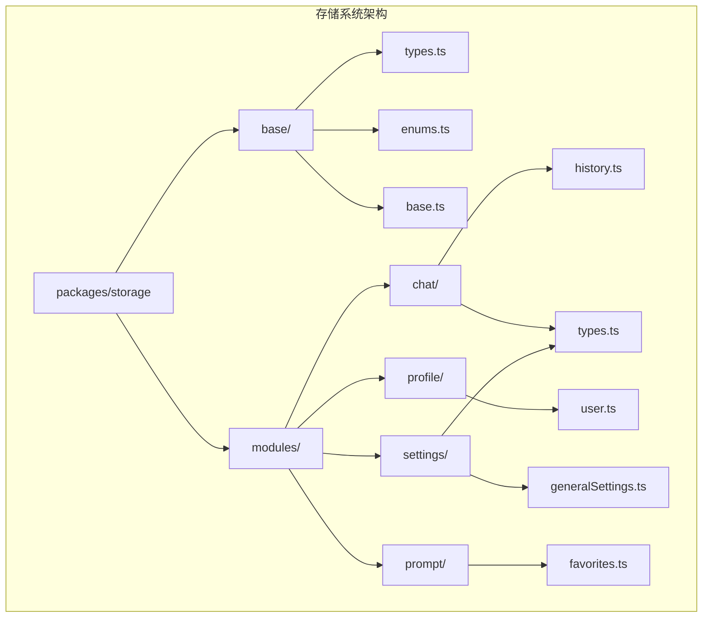
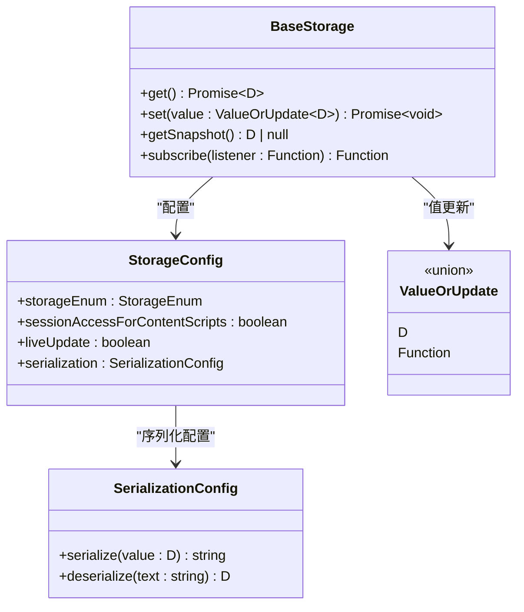
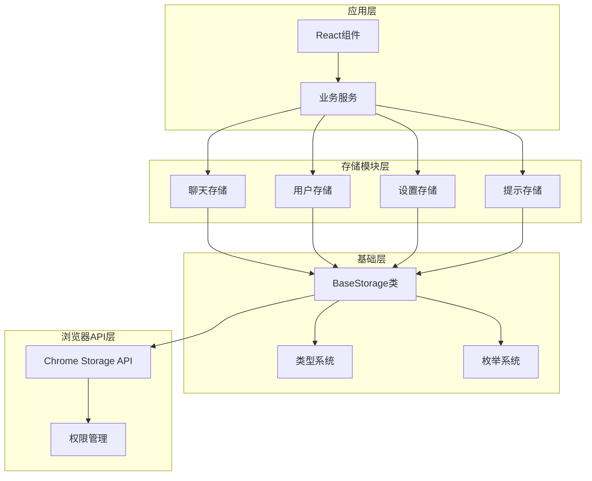
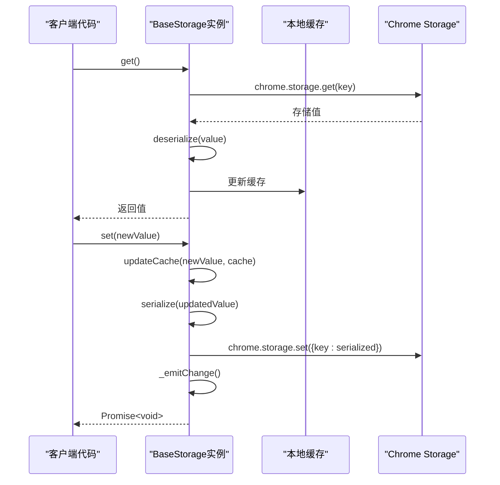
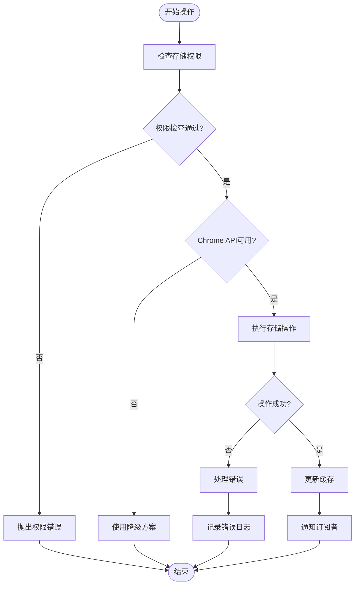
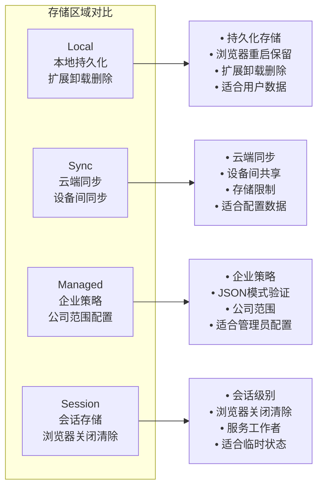
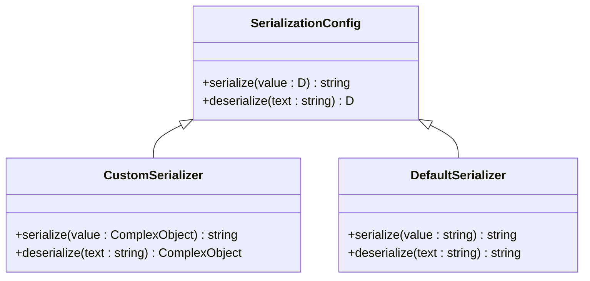
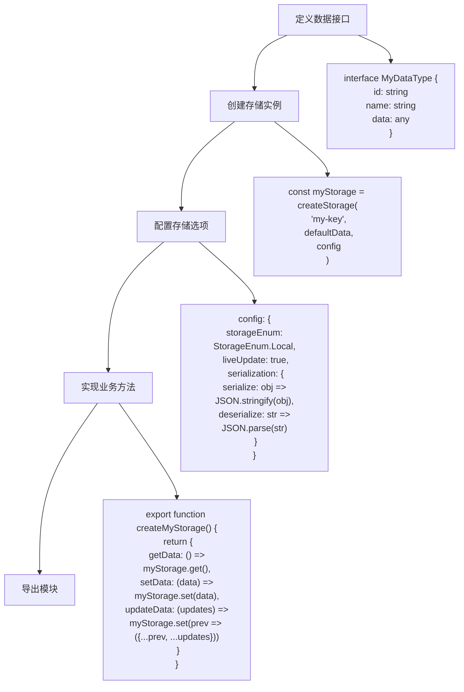
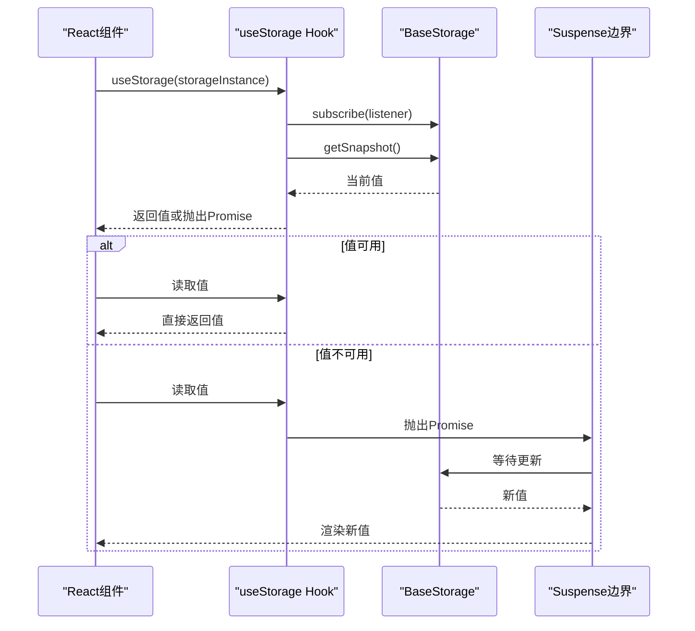
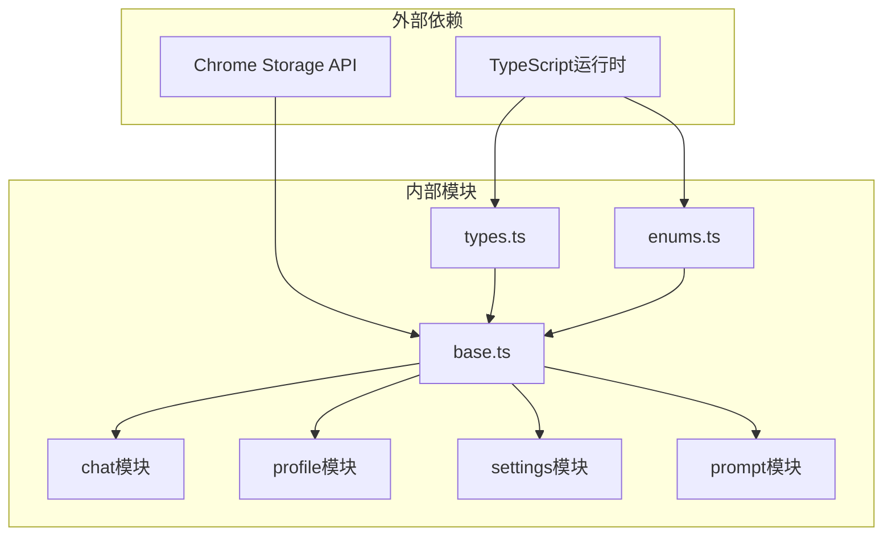

# 存储基础层

<cite>
**本文档中引用的文件**
- [base.ts](file://packages/storage/lib/base/base.ts)
- [types.ts](file://packages/storage/lib/base/types.ts)
- [enums.ts](file://packages/storage/lib/base/enums.ts)
- [index.ts](file://packages/storage/index.ts)
- [history.ts](file://packages/storage/lib/chat/history.ts)
- [user.ts](file://packages/storage/lib/profile/user.ts)
- [generalSettings.ts](file://packages/storage/lib/settings/generalSettings.ts)
- [favorites.ts](file://packages/storage/lib/prompt/favorites.ts)
- [useStorage.tsx](file://packages/shared/lib/hooks/useStorage.tsx)
</cite>

## 目录
1. [简介](#简介)
2. [项目结构](#项目结构)
3. [核心组件](#核心组件)
4. [架构概览](#架构概览)
5. [详细组件分析](#详细组件分析)
6. [依赖关系分析](#依赖关系分析)
7. [性能考虑](#性能考虑)
8. [故障排除指南](#故障排除指南)
9. [结论](#结论)

## 简介

NanoBrowser存储系统是一个专为Chrome扩展设计的统一存储抽象层，基于Chrome扩展的Storage API构建。该系统通过BaseStorage类提供了异步读写机制、类型安全保证和错误处理策略，为上层功能模块提供了可靠的数据持久化解决方案。

存储基础层的核心设计理念是：
- **统一抽象**：为不同类型的存储需求提供一致的接口
- **类型安全**：通过TypeScript确保编译时类型检查
- **异步操作**：支持现代JavaScript的异步编程模式
- **错误处理**：完善的权限检查和异常处理机制
- **性能优化**：缓存机制和批量更新策略

## 项目结构

存储系统的文件组织采用模块化设计，主要分为以下几个层次：

**图表来源**
- [index.ts](file://packages/storage/index.ts#L1-L9)
- [base.ts](file://packages/storage/lib/base/base.ts#L1-L158)

**章节来源**
- [index.ts](file://packages/storage/index.ts#L1-L9)
- [base.ts](file://packages/storage/lib/base/base.ts#L1-L158)

## 核心组件

### BaseStorage类设计

BaseStorage类是整个存储系统的核心，它封装了Chrome Storage API的功能并提供了高级抽象：

**图表来源**
- [types.ts](file://packages/storage/lib/base/types.ts#L1-L46)
- [base.ts](file://packages/storage/lib/base/base.ts#L80-L158)

### 类型定义系统

存储系统通过精心设计的类型系统确保类型安全：

| 类型名称 | 用途 | 默认值 | 描述 |
|---------|------|--------|------|
| `ValueOrUpdate<D>` | 值更新策略 | - | 支持直接赋值或函数式更新 |
| `BaseStorage<D>` | 基础存储接口 | - | 提供get、set、subscribe等方法 |
| `StorageConfig<D>` | 存储配置 | - | 包含存储区域、序列化等配置选项 |
| `StorageEnum` | 存储区域枚举 | Local | 定义四种不同的存储类型 |

**章节来源**
- [types.ts](file://packages/storage/lib/base/types.ts#L1-L46)
- [enums.ts](file://packages/storage/lib/base/enums.ts#L1-L43)

## 架构概览

存储系统采用分层架构设计，从底层到顶层依次为：

**图表来源**
- [base.ts](file://packages/storage/lib/base/base.ts#L80-L158)
- [index.ts](file://packages/storage/index.ts#L1-L9)

## 详细组件分析

### BaseStorage类实现详解

BaseStorage类是整个系统的核心，其实现包含了以下关键特性：

#### 异步读写机制

**图表来源**
- [base.ts](file://packages/storage/lib/base/base.ts#L80-L158)

#### 错误处理策略

系统实现了多层次的错误处理机制：

**图表来源**
- [base.ts](file://packages/storage/lib/base/base.ts#L42-L50)
- [base.ts](file://packages/storage/lib/base/base.ts#L120-L158)

#### 缓存和监听机制

BaseStorage实现了智能缓存和实时更新机制：

| 功能特性 | 实现方式 | 性能优势 |
|---------|----------|----------|
| 初始缓存加载 | 异步初始化时获取数据 | 减少重复读取 |
| 内存缓存 | 本地变量存储最新值 | 避免频繁API调用 |
| 实时监听 | Chrome Storage onChanged事件 | 确保多窗口同步 |
| 订阅模式 | 发布-订阅模式 | 支持组件响应式更新 |

**章节来源**
- [base.ts](file://packages/storage/lib/base/base.ts#L80-L158)

### 存储区域枚举系统

存储系统支持四种不同的存储区域，每种都有特定的用途和限制：

**图表来源**
- [enums.ts](file://packages/storage/lib/base/enums.ts#L5-L43)

### 类型安全保证

系统通过严格的类型定义确保编译时安全：

#### 序列化配置

**图表来源**
- [types.ts](file://packages/storage/lib/base/types.ts#L35-L46)

**章节来源**
- [types.ts](file://packages/storage/lib/base/types.ts#L1-L46)
- [enums.ts](file://packages/storage/lib/base/enums.ts#L1-L43)

### 自定义存储模块开发指南

#### 基本存储模块创建

以下是创建自定义存储模块的标准流程：

#### 最佳实践示例

基于现有模块的分析，以下是推荐的最佳实践：

| 实践领域 | 推荐做法 | 示例代码路径 |
|---------|----------|-------------|
| 数据结构设计 | 使用明确的接口定义 | [history.ts](file://packages/storage/lib/chat/history.ts#L1-L20) |
| 默认值处理 | 提供合理的默认值 | [generalSettings.ts](file://packages/storage/lib/settings/generalSettings.ts#L20-L30) |
| 权限检查 | 在manifest.json中声明权限 | [base.ts](file://packages/storage/lib/base/base.ts#L42-L50) |
| 错误处理 | 实现优雅的降级机制 | [favorites.ts](file://packages/storage/lib/prompt/favorites.ts#L150-L180) |
| 性能优化 | 使用批量更新和缓存 | [history.ts](file://packages/storage/lib/chat/history.ts#L80-L120) |

**章节来源**
- [history.ts](file://packages/storage/lib/chat/history.ts#L1-L256)
- [user.ts](file://packages/storage/lib/profile/user.ts#L1-L59)
- [generalSettings.ts](file://packages/storage/lib/settings/generalSettings.ts#L1-L69)
- [favorites.ts](file://packages/storage/lib/prompt/favorites.ts#L1-L209)

### React集成Hook

系统提供了专门的React Hook来简化存储与UI的集成：

**图表来源**
- [useStorage.tsx](file://packages/shared/lib/hooks/useStorage.tsx#L1-L51)

**章节来源**
- [useStorage.tsx](file://packages/shared/lib/hooks/useStorage.tsx#L1-L51)

## 依赖关系分析

存储系统的依赖关系清晰且模块化：

**图表来源**
- [base.ts](file://packages/storage/lib/base/base.ts#L1-L10)
- [index.ts](file://packages/storage/index.ts#L1-L9)

**章节来源**
- [base.ts](file://packages/storage/lib/base/base.ts#L1-L158)
- [index.ts](file://packages/storage/index.ts#L1-L9)

## 性能考虑

存储系统在设计时充分考虑了性能优化：

### 缓存策略
- **懒加载**：首次访问时才初始化缓存
- **内存缓存**：避免重复的API调用
- **智能更新**：仅在值发生变化时触发重新渲染

### 异步优化
- **并发控制**：避免同时进行多个存储操作
- **批量更新**：合并连续的更新请求
- **错误恢复**：提供降级机制确保系统稳定性

### 内存管理
- **弱引用**：使用WeakMap管理React Hook的状态
- **及时清理**：自动清理不再使用的订阅者
- **资源释放**：在组件卸载时正确清理资源

## 故障排除指南

### 常见问题及解决方案

| 问题类型 | 症状 | 可能原因 | 解决方案 |
|---------|------|----------|----------|
| 权限错误 | "Check your storage permission" | manifest.json缺少权限 | 添加storage权限声明 |
| 序列化错误 | 数据损坏或丢失 | 自定义序列化函数问题 | 检查serialize/deserialize函数 |
| 同步问题 | 多窗口数据不一致 | liveUpdate未启用 | 设置liveUpdate: true |
| 性能问题 | 页面卡顿 | 频繁的存储操作 | 使用批量更新或减少监听频率 |

### 调试技巧

1. **启用详细日志**：在开发环境中添加调试输出
2. **监控存储大小**：注意Chrome存储配额限制
3. **测试权限**：确保所有需要的权限都已正确声明
4. **验证类型**：使用TypeScript严格模式确保类型安全

**章节来源**
- [base.ts](file://packages/storage/lib/base/base.ts#L42-L50)
- [base.ts](file://packages/storage/lib/base/base.ts#L120-L158)

## 结论

NanoBrowser存储基础层提供了一个完整、类型安全且高性能的存储解决方案。通过BaseStorage类的统一抽象，开发者可以轻松地在不同存储区域之间切换，同时享受现代JavaScript的异步编程体验。

系统的主要优势包括：
- **类型安全**：完整的TypeScript类型定义确保编译时安全
- **灵活配置**：支持多种存储区域和自定义序列化
- **性能优化**：智能缓存和批量更新机制
- **易于使用**：简洁的API设计和丰富的示例
- **可扩展性**：模块化设计便于添加新的存储模块

对于开发者而言，这个存储基础层不仅提供了可靠的数据持久化能力，还为构建复杂的Chrome扩展应用奠定了坚实的基础。通过遵循本文档中的最佳实践和开发指南，可以快速构建高质量的存储模块。