# 状态管理

<cite>
**本文档中引用的文件**  
- [base.ts](file://packages/storage/lib/base/base.ts)
- [enums.ts](file://packages/storage/lib/base/enums.ts)
- [types.ts](file://packages/storage/lib/base/types.ts)
- [history.ts](file://packages/storage/lib/chat/history.ts)
- [types.ts](file://packages/storage/lib/chat/types.ts)
- [user.ts](file://packages/storage/lib/profile/user.ts)
- [generalSettings.ts](file://packages/storage/lib/settings/generalSettings.ts)
- [firewall.ts](file://packages/storage/lib/settings/firewall.ts)
- [speechToText.ts](file://packages/storage/lib/settings/speechToText.ts)
- [analyticsSettings.ts](file://packages/storage/lib/settings/analyticsSettings.ts)
- [llmProviders.ts](file://packages/storage/lib/settings/llmProviders.ts)
</cite>

## 目录
1. [简介](#简介)
2. [项目结构](#项目结构)
3. [核心组件](#核心组件)
4. [架构概述](#架构概述)
5. [详细组件分析](#详细组件分析)
6. [依赖分析](#依赖分析)
7. [性能考虑](#性能考虑)
8. [故障排除指南](#故障排除指南)
9. [结论](#结论)

## 简介
本文档全面记录了基于 `packages/storage` 包的状态管理系统。该系统为浏览器扩展提供了统一的数据持久化机制，支持聊天历史、用户配置文件、系统设置等多种数据类型的存储与检索。系统基于 Chrome 扩展的 `chrome.storage` API 构建，实现了类型安全、响应式更新和跨上下文同步等高级功能。

## 项目结构
`packages/storage` 包采用模块化设计，将不同功能领域的状态管理分离到独立的子模块中。核心基础层提供通用存储抽象，而上层模块则针对特定业务场景实现具体逻辑。

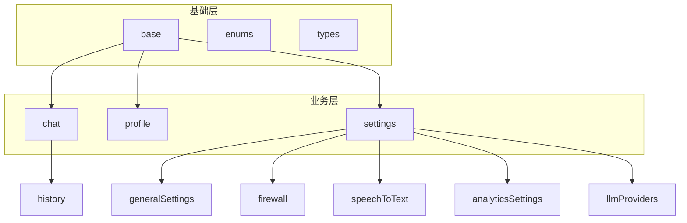

**Diagram sources**
- [base.ts](file://packages/storage/lib/base/base.ts)
- [history.ts](file://packages/storage/lib/chat/history.ts)
- [generalSettings.ts](file://packages/storage/lib/settings/generalSettings.ts)

**Section sources**
- [base.ts](file://packages/storage/lib/base/base.ts)
- [history.ts](file://packages/storage/lib/chat/history.ts)
- [generalSettings.ts](file://packages/storage/lib/settings/generalSettings.ts)

## 核心组件
本系统的核心组件包括基础存储抽象、聊天历史管理、用户配置文件和多维度设置系统。这些组件共同构成了一个完整且可扩展的状态管理解决方案，支持复杂的应用场景。

**Section sources**
- [base.ts](file://packages/storage/lib/base/base.ts)
- [history.ts](file://packages/storage/lib/chat/history.ts)
- [user.ts](file://packages/storage/lib/profile/user.ts)
- [generalSettings.ts](file://packages/storage/lib/settings/generalSettings.ts)

## 架构概述
系统采用分层架构设计，底层是通用存储抽象层，上层是领域特定的状态管理模块。这种设计实现了关注点分离，提高了代码的可维护性和可测试性。

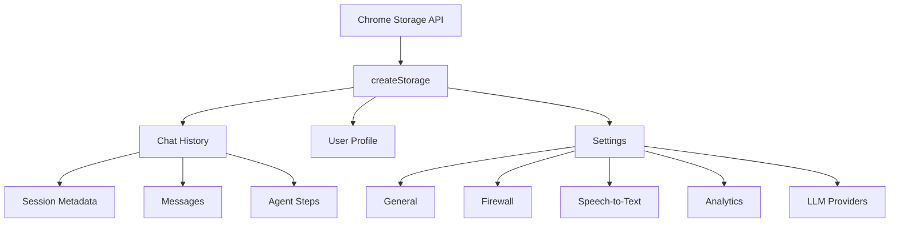

**Diagram sources**
- [base.ts](file://packages/storage/lib/base/base.ts)
- [history.ts](file://packages/storage/lib/chat/history.ts)
- [user.ts](file://packages/storage/lib/profile/user.ts)
- [llmProviders.ts](file://packages/storage/lib/settings/llmProviders.ts)

## 详细组件分析
本节深入分析各个核心组件的实现细节、数据结构和交互逻辑。

### 聊天历史管理
聊天历史模块负责存储和检索任务执行的步骤和结果。它采用优化的存储策略，将会话元数据与消息内容分离存储，以提高性能和效率。

#### 聊天历史类图
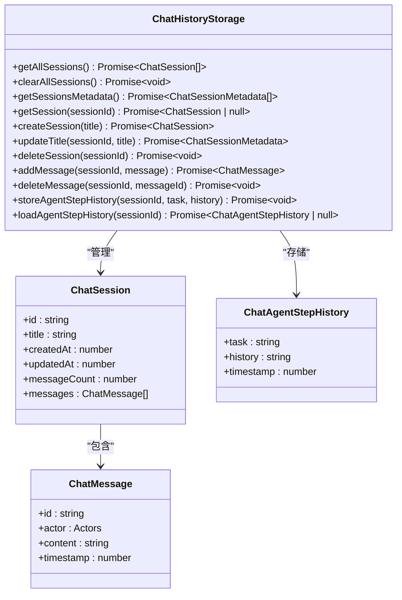

**Diagram sources**
- [history.ts](file://packages/storage/lib/chat/history.ts)
- [types.ts](file://packages/storage/lib/chat/types.ts)

**Section sources**
- [history.ts](file://packages/storage/lib/chat/history.ts)
- [types.ts](file://packages/storage/lib/chat/types.ts)

### 设置模块
设置模块管理用户配置，包括通用设置、防火墙规则、语音转文本偏好和分析设置。每个设置类别都有独立的存储实例和操作接口。

#### 设置模块序列图
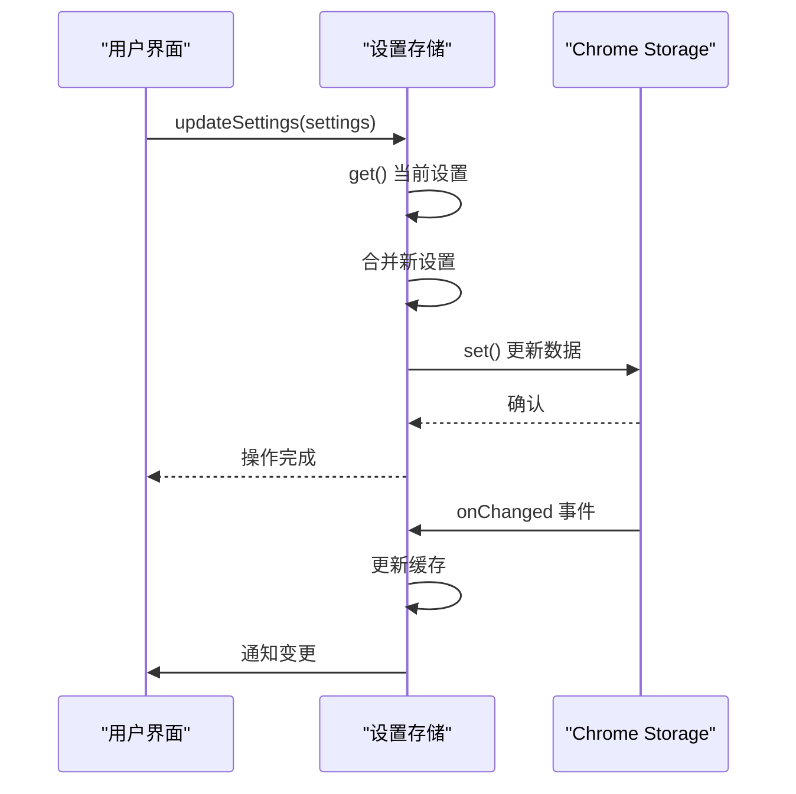

**Diagram sources**
- [generalSettings.ts](file://packages/storage/lib/settings/generalSettings.ts)
- [firewall.ts](file://packages/storage/lib/settings/firewall.ts)

#### 通用设置分析
通用设置模块管理核心行为参数，如最大步骤数、视觉功能开关和页面加载等待时间。它实现了智能默认值和约束验证。

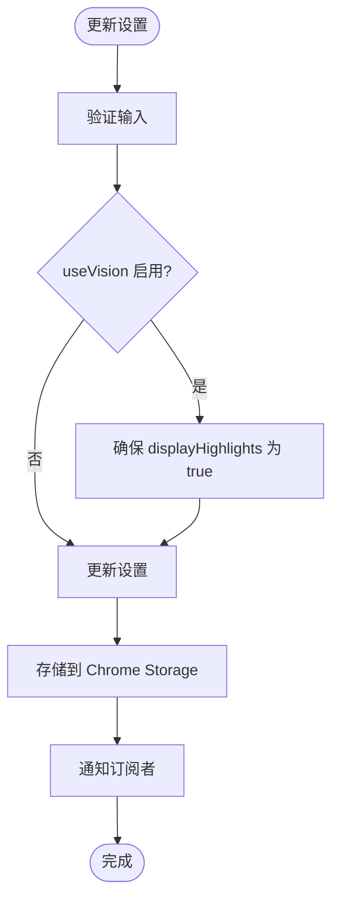

**Diagram sources**
- [generalSettings.ts](file://packages/storage/lib/settings/generalSettings.ts)

**Section sources**
- [generalSettings.ts](file://packages/storage/lib/settings/generalSettings.ts)

#### 防火墙设置分析
防火墙设置模块管理URL访问规则，支持允许列表和拒绝列表。它实现了URL规范化和列表互斥逻辑。

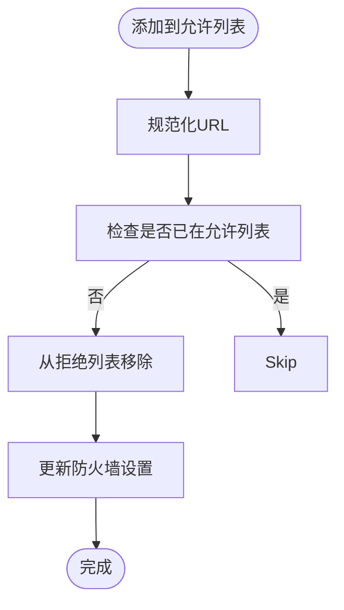

**Diagram sources**
- [firewall.ts](file://packages/storage/lib/settings/firewall.ts)

**Section sources**
- [firewall.ts](file://packages/storage/lib/settings/firewall.ts)

#### 语音转文本设置分析
语音转文本设置模块管理语音识别模型配置。它提供了类型安全的配置接口和验证机制。

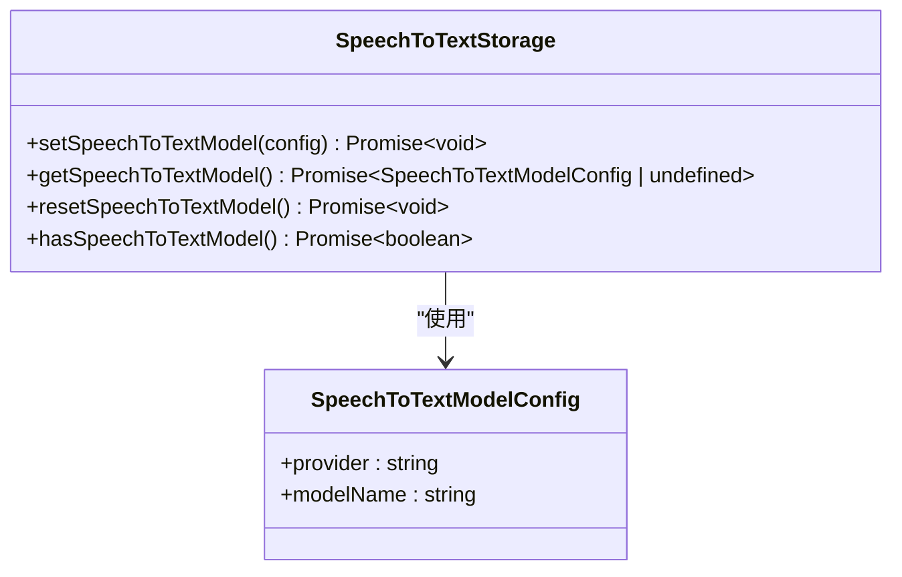

**Diagram sources**
- [speechToText.ts](file://packages/storage/lib/settings/speechToText.ts)

**Section sources**
- [speechToText.ts](file://packages/storage/lib/settings/speechToText.ts)

#### 分析设置分析
分析设置模块管理匿名用户ID和数据收集状态。它实现了用户ID的持久化和重置逻辑。

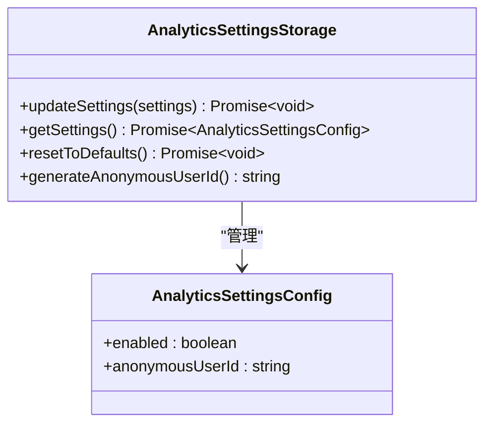

**Diagram sources**
- [analyticsSettings.ts](file://packages/storage/lib/settings/analyticsSettings.ts)

**Section sources**
- [analyticsSettings.ts](file://packages/storage/lib/settings/analyticsSettings.ts)

#### LLM提供商设置分析
LLM提供商设置模块管理多个大语言模型提供商的API密钥和配置。它支持内置提供商和自定义提供商。

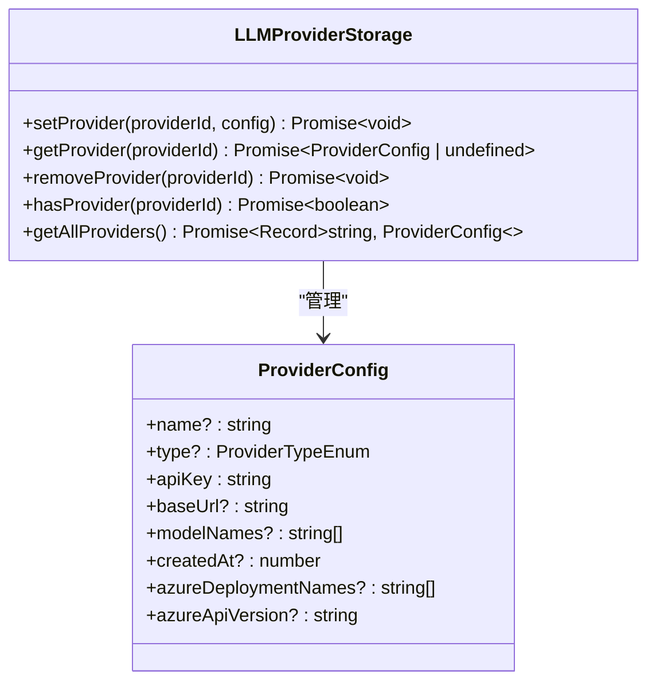

**Diagram sources**
- [llmProviders.ts](file://packages/storage/lib/settings/llmProviders.ts)

**Section sources**
- [llmProviders.ts](file://packages/storage/lib/settings/llmProviders.ts)

### 用户配置文件分析
用户配置文件模块管理用户身份信息。它实现了用户ID的自动生成和持久化。

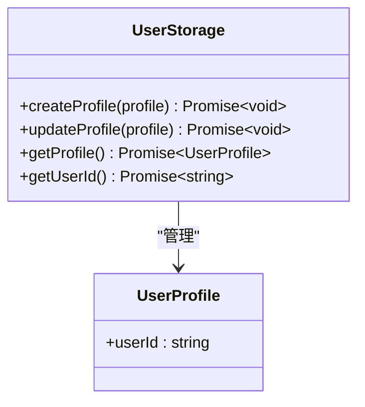

**Diagram sources**
- [user.ts](file://packages/storage/lib/profile/user.ts)

**Section sources**
- [user.ts](file://packages/storage/lib/profile/user.ts)

## 依赖分析
系统依赖于 Chrome 扩展的存储 API，并通过分层设计实现了低耦合和高内聚。各模块之间通过清晰的接口进行交互。

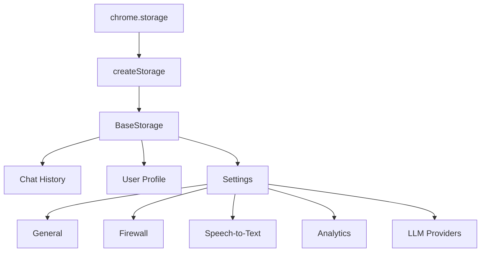

**Diagram sources**
- [base.ts](file://packages/storage/lib/base/base.ts)
- [types.ts](file://packages/storage/lib/base/types.ts)

**Section sources**
- [base.ts](file://packages/storage/lib/base/base.ts)
- [types.ts](file://packages/storage/lib/base/types.ts)

## 性能考虑
系统在设计时充分考虑了性能因素。聊天历史模块采用元数据与消息分离的存储策略，避免了在会话列表视图中加载大量消息数据。所有存储操作都支持实时更新，通过事件监听器实现跨上下文同步。

## 故障排除指南
当遇到状态管理问题时，可以检查以下方面：确保 Chrome 存储权限已在 manifest.json 中声明；验证存储键名是否唯一；检查异步操作是否正确处理了 Promise；确认数据序列化和反序列化逻辑是否正确。

**Section sources**
- [base.ts](file://packages/storage/lib/base/base.ts)
- [enums.ts](file://packages/storage/lib/base/enums.ts)

## 结论
`packages/storage` 包提供了一个健壮、可扩展的状态管理解决方案。通过分层架构和模块化设计，它有效地管理了复杂的应用状态，同时保持了良好的性能和可维护性。该系统为浏览器扩展的状态管理树立了良好的实践典范。