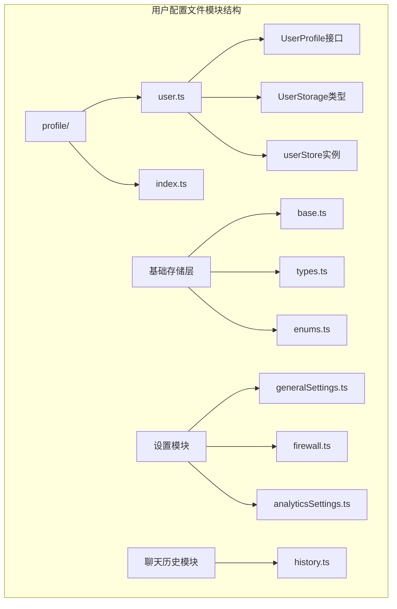
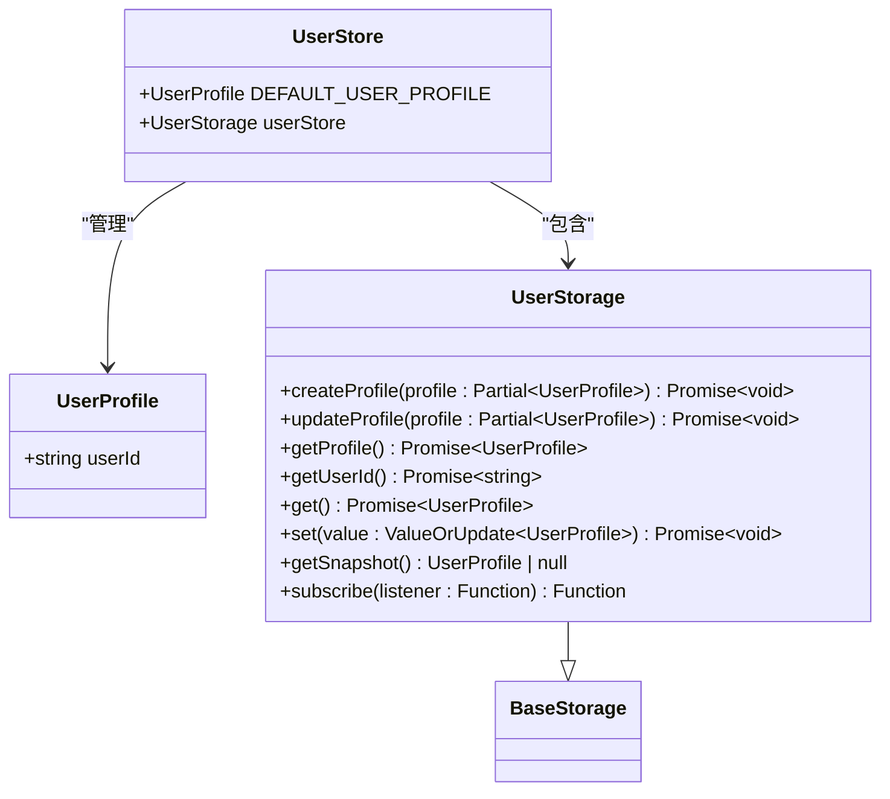
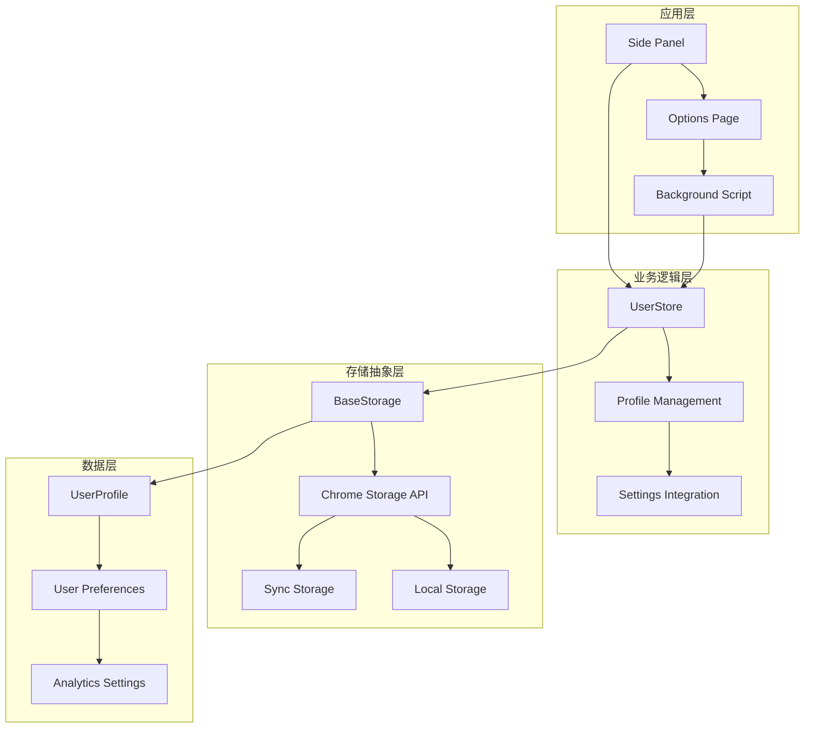
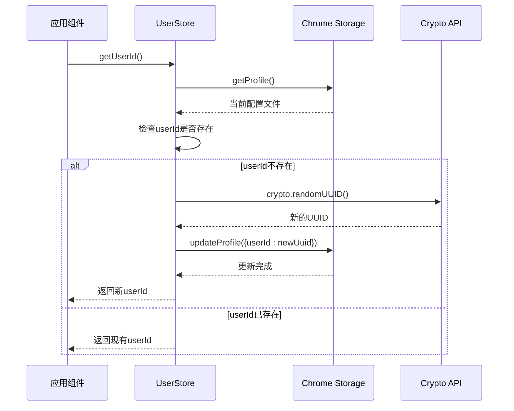
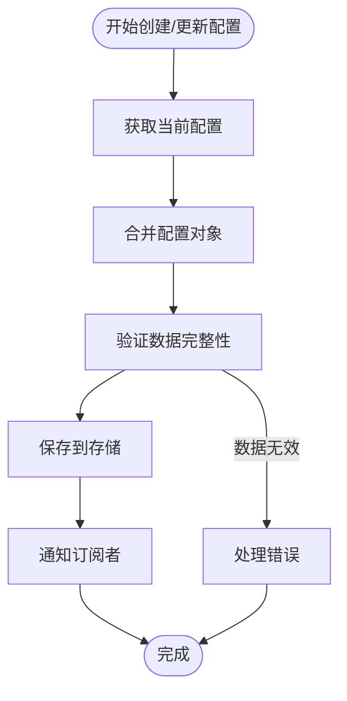
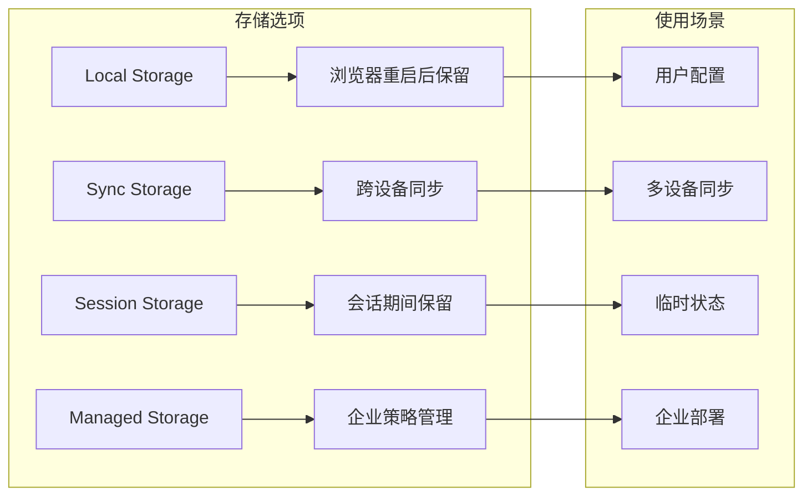
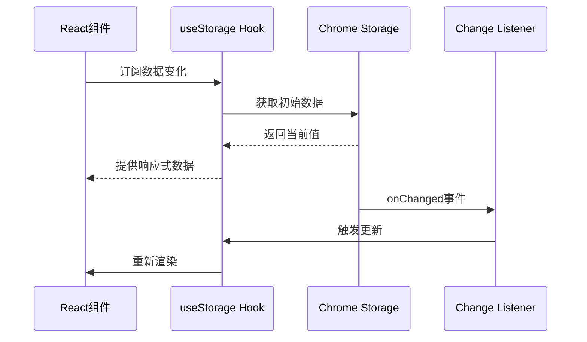
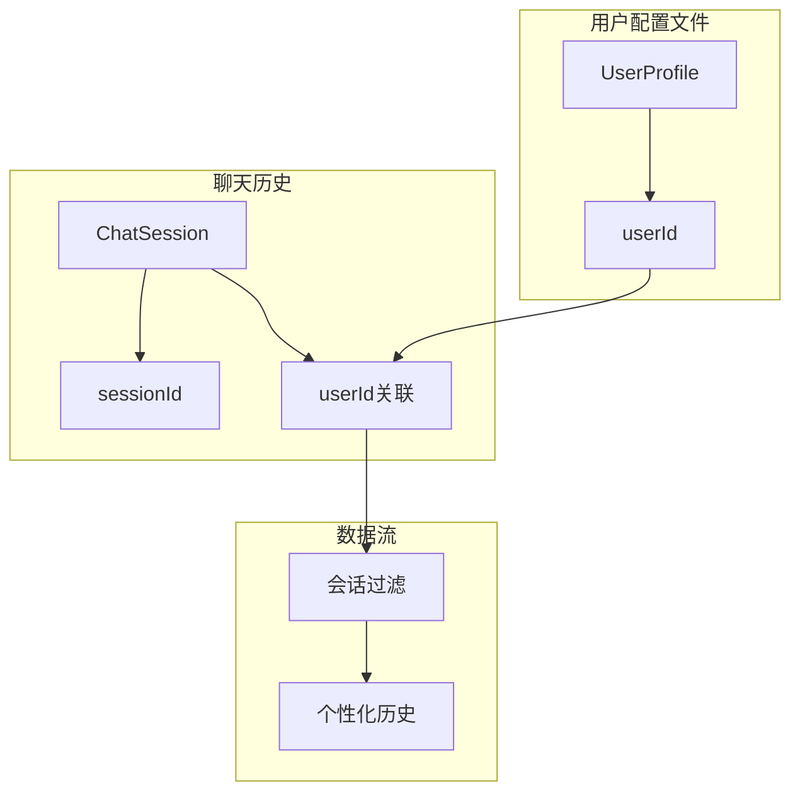
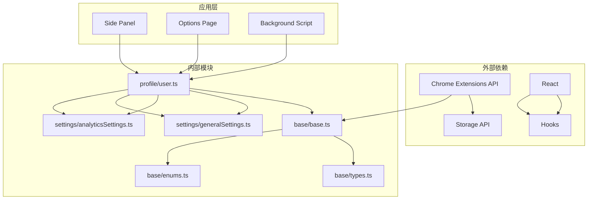

# 用户配置文件

<cite>
**本文档中引用的文件**
- [packages/storage/lib/profile/user.ts](file://packages/storage/lib/profile/user.ts)
- [packages/storage/lib/profile/index.ts](file://packages/storage/lib/profile/index.ts)
- [packages/storage/lib/base/base.ts](file://packages/storage/lib/base/base.ts)
- [packages/storage/lib/base/types.ts](file://packages/storage/lib/base/types.ts)
- [packages/storage/lib/base/enums.ts](file://packages/storage/lib/base/enums.ts)
- [packages/storage/lib/settings/types.ts](file://packages/storage/lib/settings/types.ts)
- [packages/storage/lib/settings/generalSettings.ts](file://packages/storage/lib/settings/generalSettings.ts)
- [packages/storage/lib/settings/firewall.ts](file://packages/storage/lib/settings/firewall.ts)
- [packages/storage/lib/settings/analyticsSettings.ts](file://packages/storage/lib/settings/analyticsSettings.ts)
- [packages/storage/lib/chat/history.ts](file://packages/storage/lib/chat/history.ts)
- [packages/shared/lib/hooks/useStorage.tsx](file://packages/shared/lib/hooks/useStorage.tsx)
- [chrome-extension/src/background/index.ts](file://chrome-extension/src/background/index.ts)
- [PRIVACY.md](file://PRIVACY.md)
</cite>

## 目录
1. [简介](#简介)
2. [项目结构](#项目结构)
3. [核心组件](#核心组件)
4. [架构概览](#架构概览)
5. [详细组件分析](#详细组件分析)
6. [依赖关系分析](#依赖关系分析)
7. [性能考虑](#性能考虑)
8. [故障排除指南](#故障排除指南)
9. [结论](#结论)

## 简介

Nanobrowser的用户配置文件模块是一个精心设计的数据管理系统，负责维护用户的个人标识、偏好设置和使用历史。该模块采用现代化的React Hook模式和Chrome扩展存储API，提供了完整的用户数据生命周期管理功能，包括创建、更新、查询和隐私保护等核心能力。

该模块的核心设计理念是"本地优先、隐私保护、无缝集成"，确保用户数据完全在本地处理，同时提供流畅的用户体验。通过统一的存储接口和实时同步机制，该模块能够与系统的其他部分（如聊天历史、设置管理、分析服务）进行高效的数据交互。

## 项目结构

用户配置文件模块位于`packages/storage/lib/profile/`目录下，采用清晰的分层架构设计：

**图表来源**
- [packages/storage/lib/profile/user.ts](file://packages/storage/lib/profile/user.ts#L1-L59)
- [packages/storage/lib/base/base.ts](file://packages/storage/lib/base/base.ts#L1-L158)

**章节来源**
- [packages/storage/lib/profile/user.ts](file://packages/storage/lib/profile/user.ts#L1-L59)
- [packages/storage/lib/profile/index.ts](file://packages/storage/lib/profile/index.ts#L1-L2)

## 核心组件

### User类结构定义

用户配置文件模块的核心是`UserProfile`接口和`UserStorage`类型系统，它们定义了用户数据的基本结构和操作方法：

**图表来源**
- [packages/storage/lib/profile/user.ts](file://packages/storage/lib/profile/user.ts#L6-L15)
- [packages/storage/lib/base/types.ts](file://packages/storage/lib/base/types.ts#L4-L10)

### 默认配置和常量

模块提供了完善的默认配置机制，确保在各种情况下都能提供合理的回退值：

| 配置项 | 类型 | 默认值 | 描述 |
|--------|------|--------|------|
| userId | string | 'unknown' | 用户唯一标识符 |
| storageEnum | StorageEnum | Local | 存储区域类型 |
| liveUpdate | boolean | true | 是否启用实时更新 |

**章节来源**
- [packages/storage/lib/profile/user.ts](file://packages/storage/lib/profile/user.ts#L17-L22)
- [packages/storage/lib/profile/user.ts](file://packages/storage/lib/profile/user.ts#L24-L59)

## 架构概览

用户配置文件模块采用了分层架构设计，从底层的存储抽象到顶层的应用接口，形成了完整的数据管理生态系统：

**图表来源**
- [packages/storage/lib/profile/user.ts](file://packages/storage/lib/profile/user.ts#L24-L59)
- [packages/storage/lib/base/base.ts](file://packages/storage/lib/base/base.ts#L50-L157)

## 详细组件分析

### 用户身份识别机制

用户身份识别是配置文件模块的核心功能，通过`getUserId()`方法实现了自动化的用户标识生成和管理：

**图表来源**
- [packages/storage/lib/profile/user.ts](file://packages/storage/lib/profile/user.ts#L48-L56)

### 配置文件创建和更新流程

配置文件的创建和更新采用了幂等性设计，确保操作的安全性和一致性：

**图表来源**
- [packages/storage/lib/profile/user.ts](file://packages/storage/lib/profile/user.ts#L29-L46)

### 数据持久化策略

模块支持多种存储后端，通过`StorageEnum`枚举提供了灵活的持久化选择：

**图表来源**
- [packages/storage/lib/base/enums.ts](file://packages/storage/lib/base/enums.ts#L6-L42)

### 实时同步机制

通过`useStorage` Hook和Chrome存储事件监听器，实现了高效的实时数据同步：

**图表来源**
- [packages/shared/lib/hooks/useStorage.tsx](file://packages/shared/lib/hooks/useStorage.tsx#L1-L51)
- [packages/storage/lib/base/base.ts](file://packages/storage/lib/base/base.ts#L120-L135)

**章节来源**
- [packages/storage/lib/profile/user.ts](file://packages/storage/lib/profile/user.ts#L24-L59)
- [packages/storage/lib/base/base.ts](file://packages/storage/lib/base/base.ts#L50-L157)
- [packages/shared/lib/hooks/useStorage.tsx](file://packages/shared/lib/hooks/useStorage.tsx#L1-L51)

### 设置模块集成

用户配置文件与系统设置模块紧密集成，支持个性化配置的统一管理：

| 设置类别 | 相关配置 | 影响范围 |
|----------|----------|----------|
| 通用设置 | maxSteps, useVision | 执行限制和视觉功能 |
| 防火墙设置 | allowList, denyList | 网站访问控制 |
| 分析设置 | enabled, anonymousUserId | 数据收集偏好 |

**章节来源**
- [packages/storage/lib/settings/generalSettings.ts](file://packages/storage/lib/settings/generalSettings.ts#L1-L69)
- [packages/storage/lib/settings/firewall.ts](file://packages/storage/lib/settings/firewall.ts#L1-L105)
- [packages/storage/lib/settings/analyticsSettings.ts](file://packages/storage/lib/settings/analyticsSettings.ts#L1-L73)

### 聊天历史数据交互

用户配置文件与聊天历史模块协同工作，为每个用户会话提供个性化的上下文支持：

**图表来源**
- [packages/storage/lib/chat/history.ts](file://packages/storage/lib/chat/history.ts#L1-L256)

**章节来源**
- [packages/storage/lib/chat/history.ts](file://packages/storage/lib/chat/history.ts#L1-L256)

## 依赖关系分析

用户配置文件模块的依赖关系体现了良好的分层设计原则：

**图表来源**
- [packages/storage/lib/profile/user.ts](file://packages/storage/lib/profile/user.ts#L1-L5)
- [packages/storage/lib/base/base.ts](file://packages/storage/lib/base/base.ts#L1-L10)

**章节来源**
- [packages/storage/lib/profile/user.ts](file://packages/storage/lib/profile/user.ts#L1-L5)
- [packages/storage/lib/base/base.ts](file://packages/storage/lib/base/base.ts#L1-L158)

## 性能考虑

### 内存优化策略

模块采用了多种内存优化技术来确保高性能运行：

1. **懒加载机制**：只有在需要时才加载完整的用户配置
2. **缓存策略**：本地缓存避免重复的存储读取操作
3. **批量更新**：支持批量配置更新以减少存储写入次数

### 响应式设计

通过React Hooks和Chrome存储事件监听器，实现了高效的响应式数据更新：

- **useSyncExternalStore**：提供与React生态系统的深度集成
- **实时监听**：自动检测存储变化并触发UI更新
- **防抖处理**：避免频繁的存储操作导致性能问题

### 存储效率

- **增量更新**：只更新变更的部分，而不是整个配置对象
- **序列化优化**：自定义序列化函数提高存储效率
- **压缩存储**：对大型配置对象进行适当的压缩处理

## 故障排除指南

### 常见问题及解决方案

#### 用户ID生成失败
**症状**：`getUserId()`返回undefined或抛出异常
**原因**：crypto API不可用或权限不足
**解决方案**：
1. 检查Chrome扩展权限配置
2. 验证manifest.json中的storage权限
3. 确保在安全上下文中执行

#### 存储同步延迟
**症状**：配置更新后UI未及时反映
**原因**：实时更新机制未正确初始化
**解决方案**：
1. 检查`liveUpdate`配置是否启用
2. 验证Chrome存储事件监听器注册
3. 确认订阅机制正常工作

#### 数据丢失风险
**症状**：用户配置意外重置或丢失
**原因**：存储区域配置错误或权限问题
**解决方案**：
1. 使用正确的`StorageEnum`类型
2. 实施适当的备份策略
3. 提供数据恢复机制

**章节来源**
- [packages/storage/lib/profile/user.ts](file://packages/storage/lib/profile/user.ts#L48-L56)
- [packages/storage/lib/base/base.ts](file://packages/storage/lib/base/base.ts#L120-L135)

## 结论

Nanobrowser的用户配置文件模块展现了现代Web扩展开发的最佳实践，通过精心设计的架构和完善的隐私保护机制，为用户提供了安全、可靠且高性能的个性化体验。

### 主要优势

1. **隐私优先**：所有用户数据完全本地处理，不涉及云端传输
2. **可扩展性**：模块化设计支持未来的功能扩展
3. **性能优化**：多层次缓存和响应式更新机制
4. **开发者友好**：清晰的API设计和完善的类型定义

### 未来发展方向

1. **多账户支持**：扩展用户配置文件以支持多用户场景
2. **云同步功能**：在保证隐私的前提下提供有限的云端同步
3. **高级个性化**：基于用户行为的学习算法
4. **跨平台兼容**：扩展到其他浏览器平台的支持

该模块为Nanobrowser提供了坚实的用户数据管理基础，确保了系统的整体稳定性和用户体验的一致性。