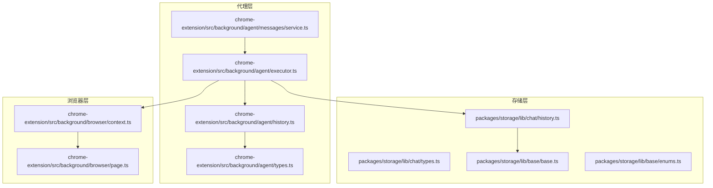
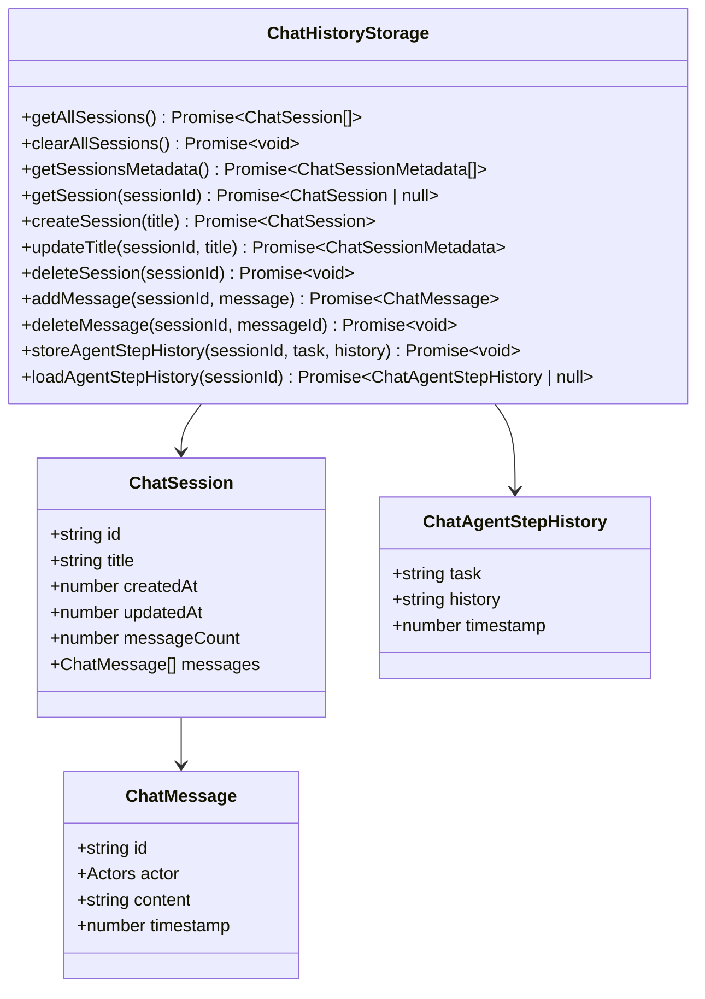
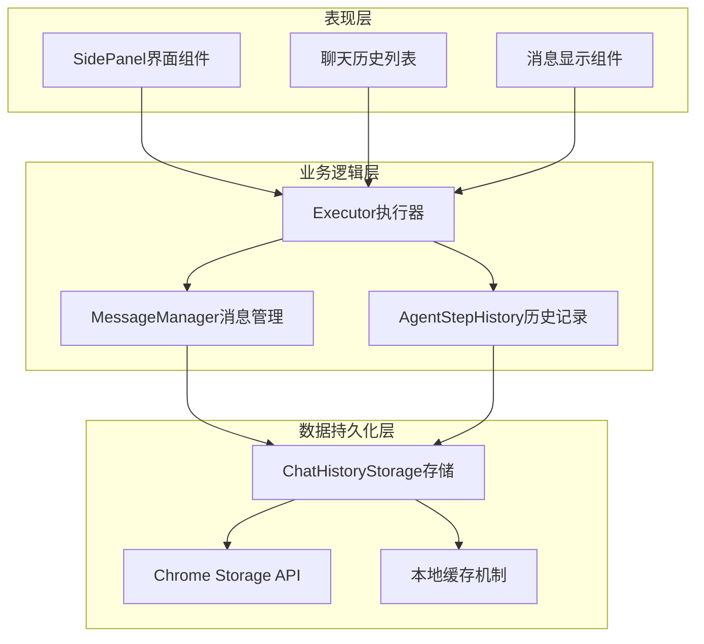
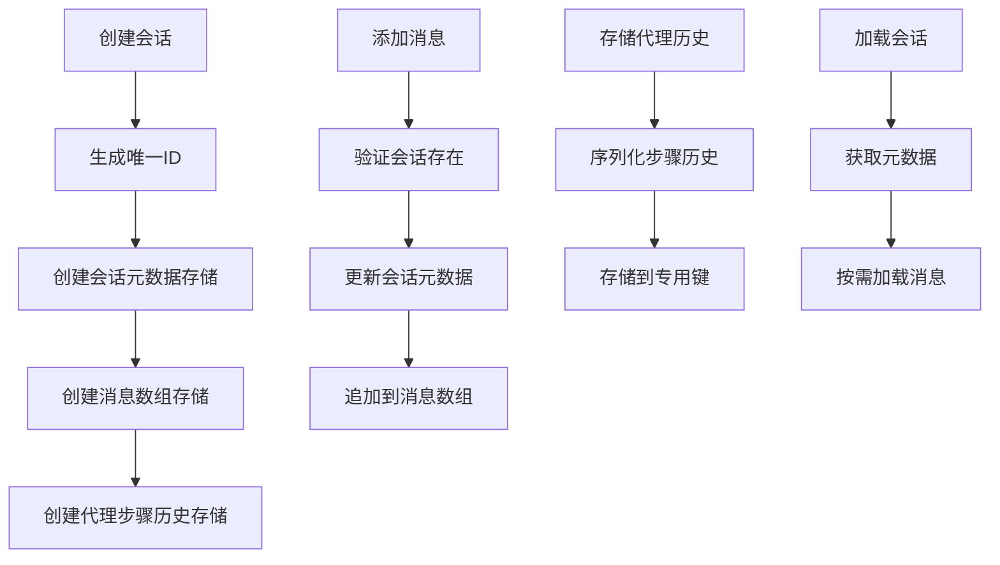
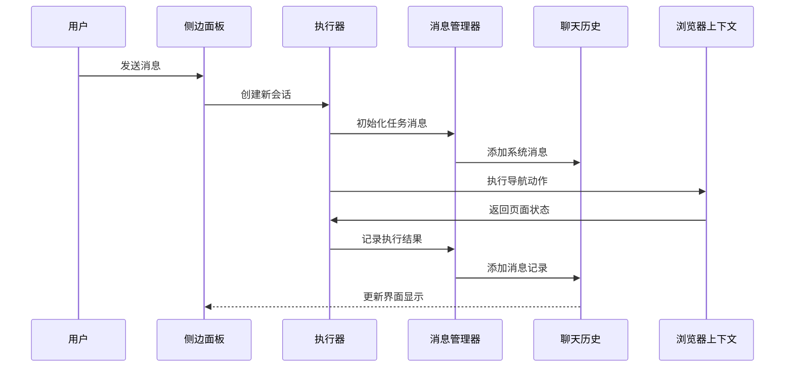
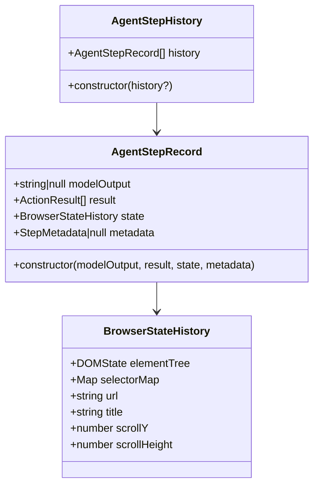
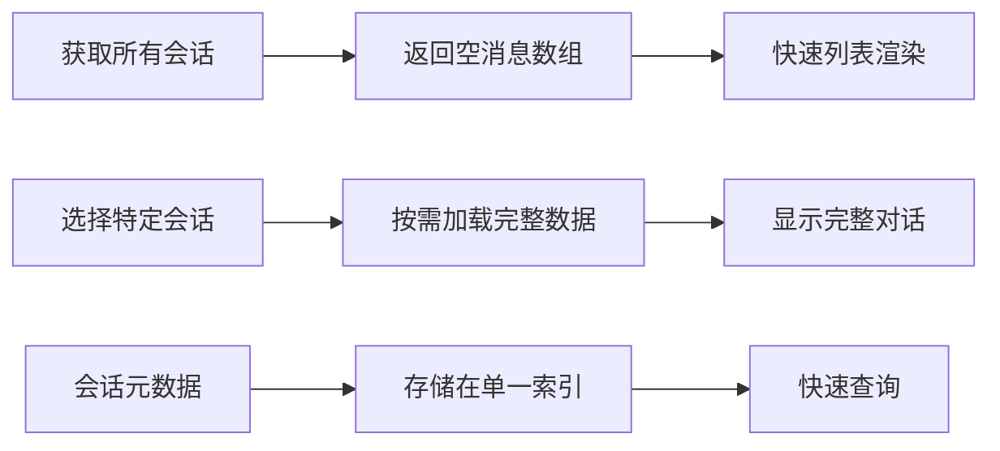
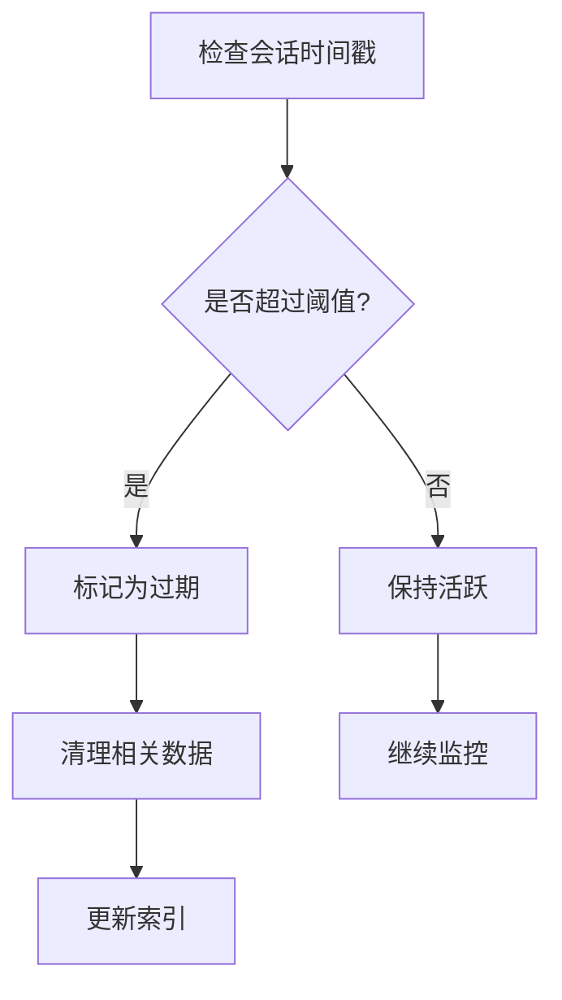
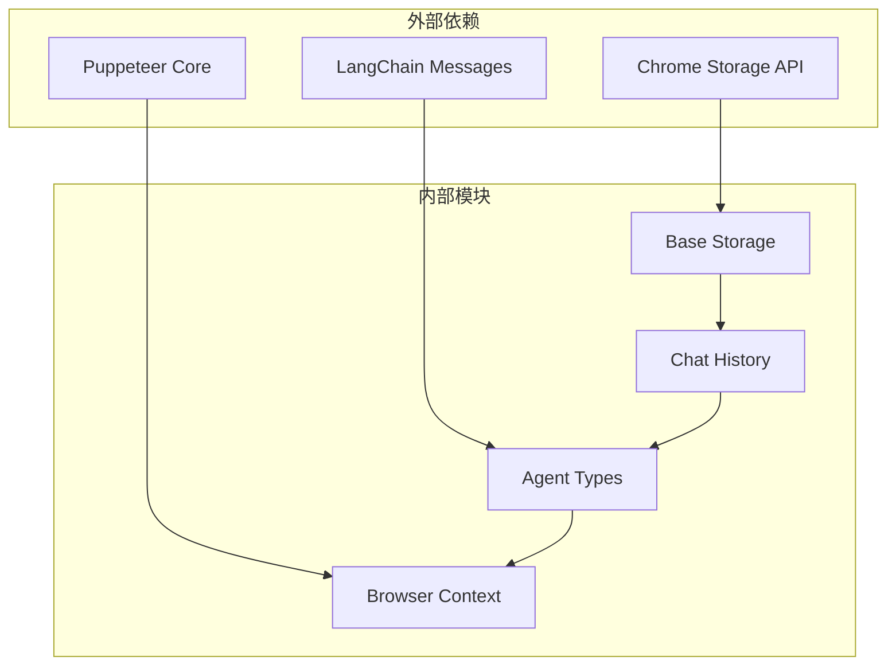

# 聊天历史模块实现机制

<cite>
**本文档引用的文件**
- [packages/storage/lib/chat/history.ts](file://packages/storage/lib/chat/history.ts)
- [packages/storage/lib/chat/types.ts](file://packages/storage/lib/chat/types.ts)
- [packages/storage/lib/base/base.ts](file://packages/storage/lib/base/base.ts)
- [packages/storage/lib/base/enums.ts](file://packages/storage/lib/base/enums.ts)
- [chrome-extension/src/background/agent/history.ts](file://chrome-extension/src/background/agent/history.ts)
- [chrome-extension/src/background/agent/types.ts](file://chrome-extension/src/background/agent/types.ts)
- [chrome-extension/src/background/agent/executor.ts](file://chrome-extension/src/background/agent/executor.ts)
- [chrome-extension/src/background/agent/messages/service.ts](file://chrome-extension/src/background/agent/messages/service.ts)
- [chrome-extension/src/background/browser/context.ts](file://chrome-extension/src/background/browser/context.ts)
- [chrome-extension/src/background/browser/page.ts](file://chrome-extension/src/background/browser/page.ts)
</cite>

## 目录
1. [简介](#简介)
2. [项目结构](#项目结构)
3. [核心组件](#核心组件)
4. [架构概览](#架构概览)
5. [详细组件分析](#详细组件分析)
6. [依赖关系分析](#依赖关系分析)
7. [性能考虑](#性能考虑)
8. [故障排除指南](#故障排除指南)
9. [结论](#结论)

## 简介

聊天历史模块是NanoBrowser扩展中的核心功能组件，负责管理用户与AI代理之间的对话历史记录。该模块实现了高效的任务执行步骤存储、检索和管理机制，支持复杂的多轮对话场景和历史重放功能。

该系统采用分层架构设计，通过专门的存储层、消息管理层和执行器层协同工作，确保对话历史的完整性、可追溯性和高性能访问。

## 项目结构

聊天历史模块的文件组织遵循清晰的分层架构：



**图表来源**
- [packages/storage/lib/chat/history.ts](file://packages/storage/lib/chat/history.ts#L1-L256)
- [packages/storage/lib/base/base.ts](file://packages/storage/lib/base/base.ts#L1-L158)
- [chrome-extension/src/background/agent/executor.ts](file://chrome-extension/src/background/agent/executor.ts#L1-L435)

**章节来源**
- [packages/storage/lib/chat/history.ts](file://packages/storage/lib/chat/history.ts#L1-L50)
- [packages/storage/lib/chat/types.ts](file://packages/storage/lib/chat/types.ts#L1-L73)

## 核心组件

### ChatHistory类结构

ChatHistory类是聊天历史模块的核心接口，提供了完整的对话管理功能：



**图表来源**
- [packages/storage/lib/chat/types.ts](file://packages/storage/lib/chat/types.ts#L48-L71)
- [packages/storage/lib/chat/types.ts](file://packages/storage/lib/chat/types.ts#L15-L47)

### 数据模型定义

系统使用强类型的数据模型确保数据完整性和类型安全：

| 类型 | 字段 | 描述 | 类型 |
|------|------|------|------|
| Message | actor | 消息发送者角色 | Actors |
| Message | content | 消息内容 | string |
| Message | timestamp | 时间戳（毫秒） | number |
| ChatMessage | id | 唯一标识符 | string |
| ChatSessionMetadata | id | 会话ID | string |
| ChatSessionMetadata | title | 会话标题 | string |
| ChatSessionMetadata | createdAt | 创建时间 | number |
| ChatSessionMetadata | updatedAt | 更新时间 | number |
| ChatSessionMetadata | messageCount | 消息数量 | number |
| ChatAgentStepHistory | task | 任务描述 | string |
| ChatAgentStepHistory | history | 步骤历史 | string |
| ChatAgentStepHistory | timestamp | 时间戳 | number |

**章节来源**
- [packages/storage/lib/chat/types.ts](file://packages/storage/lib/chat/types.ts#L1-L73)

## 架构概览

聊天历史模块采用三层架构设计，每层承担特定职责：



**图表来源**
- [chrome-extension/src/background/agent/executor.ts](file://chrome-extension/src/background/agent/executor.ts#L1-L100)
- [packages/storage/lib/chat/history.ts](file://packages/storage/lib/chat/history.ts#L40-L80)

## 详细组件分析

### 存储层实现

存储层负责数据的持久化和访问控制，采用Chrome Storage API实现跨会话数据保存。

#### 存储策略

系统使用多种存储键策略来组织不同类型的数据：



**图表来源**
- [packages/storage/lib/chat/history.ts](file://packages/storage/lib/chat/history.ts#L15-L40)
- [packages/storage/lib/chat/history.ts](file://packages/storage/lib/chat/history.ts#L159-L201)

#### 序列化和反序列化

存储系统自动处理数据的序列化和反序列化：

```typescript
// 序列化配置示例
const serialize = config?.serialization?.serialize ?? ((v: D) => v);
const deserialize = config?.serialization?.deserialize ?? (v => v as D);
```

**章节来源**
- [packages/storage/lib/base/base.ts](file://packages/storage/lib/base/base.ts#L60-L80)
- [packages/storage/lib/chat/history.ts](file://packages/storage/lib/chat/history.ts#L15-L40)

### 执行器层集成

执行器层负责协调整个对话流程，包括消息传递、状态管理和历史记录维护。

#### 消息流转过程



**图表来源**
- [chrome-extension/src/background/agent/executor.ts](file://chrome-extension/src/background/agent/executor.ts#L80-L120)
- [chrome-extension/src/background/agent/messages/service.ts](file://chrome-extension/src/background/agent/messages/service.ts#L50-L100)

#### 代理步骤历史管理

系统为每个任务维护详细的步骤历史记录：



**图表来源**
- [chrome-extension/src/background/agent/history.ts](file://chrome-extension/src/background/agent/history.ts#L1-L30)
- [chrome-extension/src/background/agent/types.ts](file://chrome-extension/src/background/agent/types.ts#L1-L50)

**章节来源**
- [chrome-extension/src/background/agent/executor.ts](file://chrome-extension/src/background/agent/executor.ts#L380-L420)
- [chrome-extension/src/background/agent/history.ts](file://chrome-extension/src/background/agent/history.ts#L1-L30)

### 性能优化策略

#### 分页加载机制

系统采用延迟加载策略，仅在需要时加载完整会话数据：



**图表来源**
- [packages/storage/lib/chat/history.ts](file://packages/storage/lib/chat/history.ts#L48-L60)

#### 本地缓存策略

存储系统实现了智能缓存机制：

```typescript
// 缓存初始化和生命周期管理
get().then(data => {
  cache = data;
  initedCache = true;
  _emitChange();
});
```

**章节来源**
- [packages/storage/lib/base/base.ts](file://packages/storage/lib/base/base.ts#L120-L140)
- [packages/storage/lib/chat/history.ts](file://packages/storage/lib/chat/history.ts#L48-L76)

### 过期处理逻辑

虽然当前实现未明确包含过期处理，但系统设计支持未来的扩展：



**章节来源**
- [packages/storage/lib/chat/history.ts](file://packages/storage/lib/chat/history.ts#L117-L140)

## 依赖关系分析

### 组件耦合度

系统采用松耦合设计，各组件间通过明确定义的接口通信：



**图表来源**
- [packages/storage/lib/base/base.ts](file://packages/storage/lib/base/base.ts#L1-L20)
- [chrome-extension/src/background/agent/executor.ts](file://chrome-extension/src/background/agent/executor.ts#L1-L30)

### 错误处理机制

系统实现了多层次的错误处理：

| 层级 | 处理策略 | 示例 |
|------|----------|------|
| 存储层 | 原子性操作 | 单次更新会话元数据 |
| 业务层 | 异常捕获 | 任务执行失败处理 |
| 表现层 | 用户反馈 | 错误状态显示 |

**章节来源**
- [packages/storage/lib/chat/history.ts](file://packages/storage/lib/chat/history.ts#L159-L180)
- [chrome-extension/src/background/agent/executor.ts](file://chrome-extension/src/background/agent/executor.ts#L200-L250)

## 性能考虑

### 内存管理

系统采用以下策略优化内存使用：

1. **延迟加载**: 只在需要时加载完整会话数据
2. **增量更新**: 使用函数式更新避免全量替换
3. **缓存策略**: 智能缓存最近访问的数据

### 并发控制

存储系统支持并发访问：

```typescript
// 并发安全的更新操作
await chatSessionsMetaStorage.set(prevSessions => {
  return prevSessions.map(session => {
    if (session.id === sessionId) {
      return {
        ...session,
        updatedAt: getCurrentTimestamp(),
        messageCount: session.messageCount + 1,
      };
    }
    return session;
  });
});
```

**章节来源**
- [packages/storage/lib/chat/history.ts](file://packages/storage/lib/chat/history.ts#L159-L180)

## 故障排除指南

### 常见问题及解决方案

#### 会话加载失败

**症状**: 无法加载历史会话
**原因**: 存储权限或数据损坏
**解决方案**: 
1. 检查Chrome存储权限配置
2. 清除并重建会话索引

#### 消息同步问题

**症状**: 新增消息不显示
**原因**: 实时更新监听器失效
**解决方案**:
1. 验证`liveUpdate`配置
2. 检查存储变更事件监听器

#### 性能问题

**症状**: 列表加载缓慢
**原因**: 全量数据加载
**解决方案**:
1. 使用`getSessionsMetadata()`替代`getAllSessions()`
2. 实现虚拟滚动

**章节来源**
- [packages/storage/lib/base/base.ts](file://packages/storage/lib/base/base.ts#L100-L130)
- [packages/storage/lib/chat/history.ts](file://packages/storage/lib/chat/history.ts#L48-L76)

## 结论

聊天历史模块展现了现代Web扩展应用中复杂数据管理的最佳实践。通过分层架构、强类型设计和性能优化策略，该系统成功实现了：

1. **可扩展性**: 支持大规模对话历史管理
2. **可靠性**: 提供原子性操作和错误恢复机制
3. **性能**: 采用延迟加载和智能缓存策略
4. **可维护性**: 清晰的职责分离和模块化设计

该模块为NanoBrowser扩展提供了坚实的对话历史基础，支持复杂的AI代理交互场景，同时为未来的功能扩展预留了充足的空间。