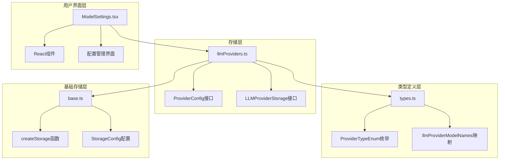
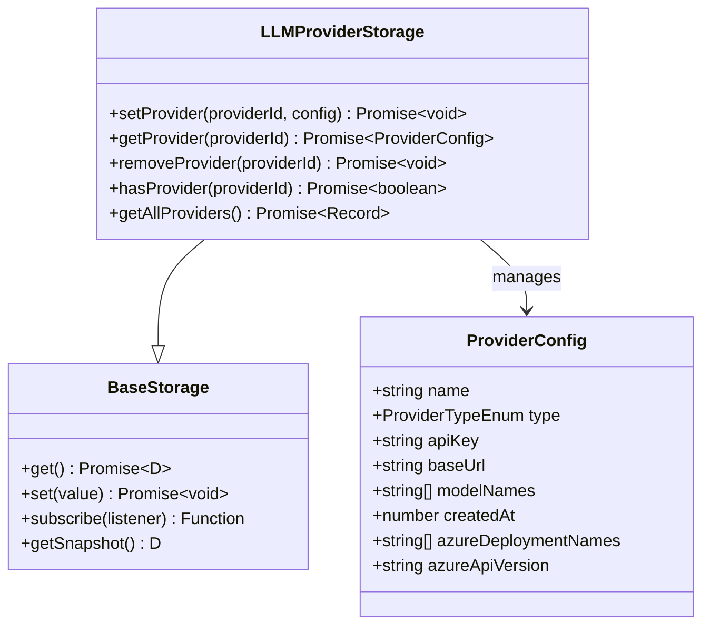
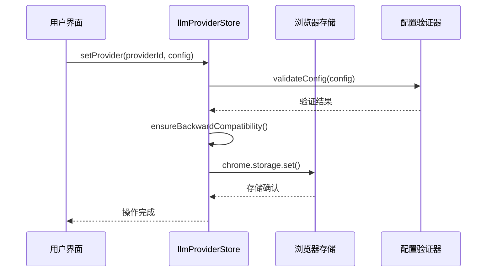
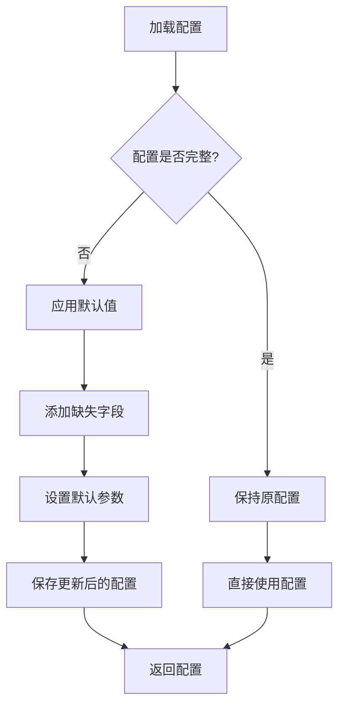
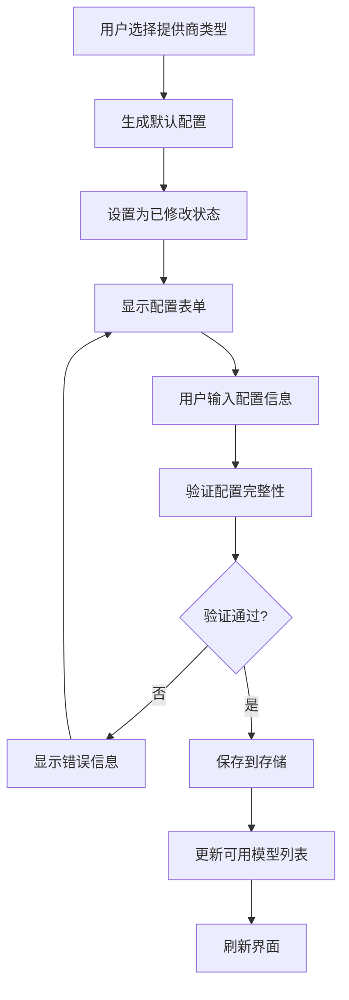
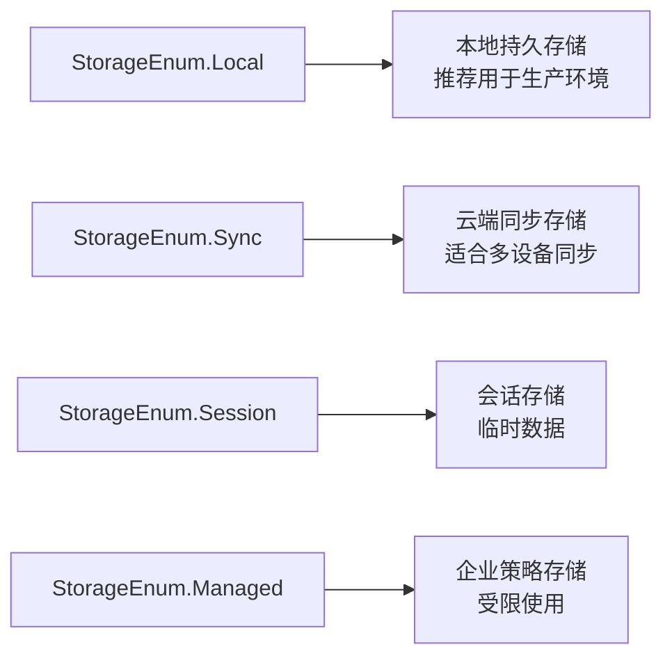
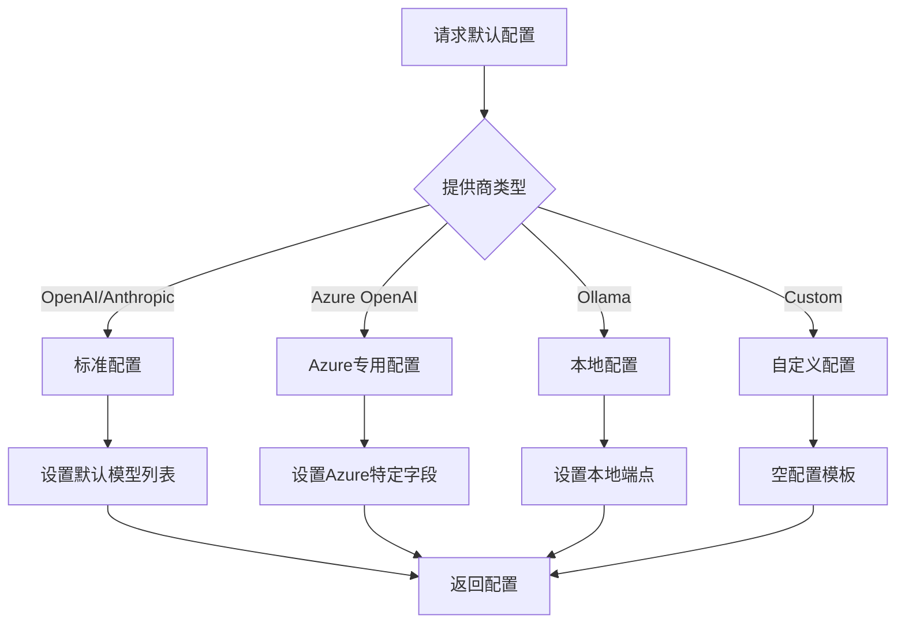
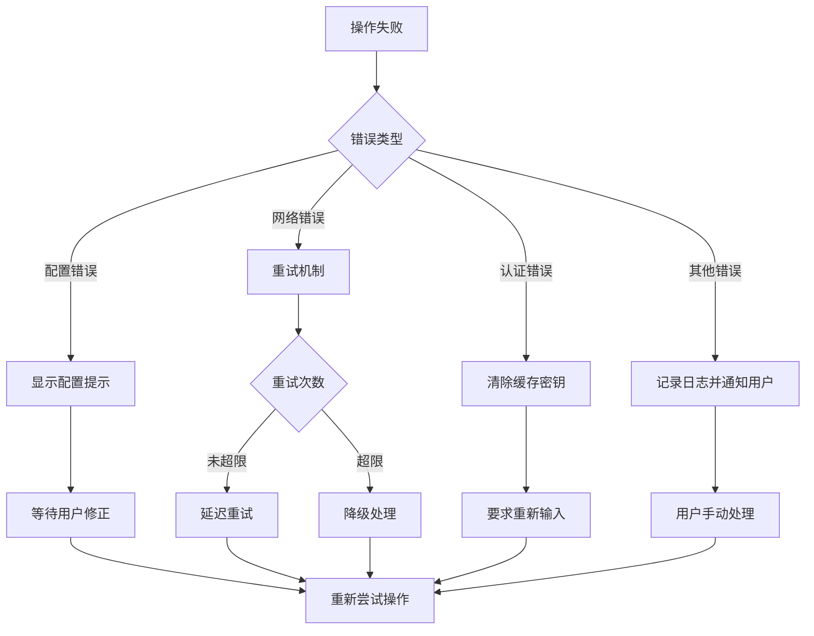
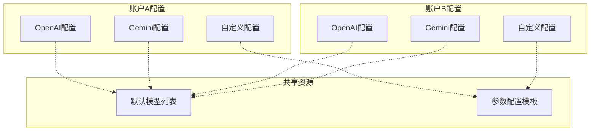

# LLM提供商配置模块设计与实现

<cite>
**本文档中引用的文件**
- [llmProviders.ts](file://packages/storage/lib/settings/llmProviders.ts)
- [types.ts](file://packages/storage/lib/settings/types.ts)
- [ModelSettings.tsx](file://pages/options/src/components/ModelSettings.tsx)
- [agentModels.ts](file://packages/storage/lib/settings/agentModels.ts)
- [base.ts](file://packages/storage/lib/base/base.ts)
- [enums.ts](file://packages/storage/lib/base/enums.ts)
- [types.ts](file://packages/storage/lib/base/types.ts)
- [index.ts](file://chrome-extension/src/background/index.ts)
</cite>

## 目录
1. [简介](#简介)
2. [项目结构概览](#项目结构概览)
3. [核心组件分析](#核心组件分析)
4. [架构设计](#架构设计)
5. [详细组件分析](#详细组件分析)
6. [安全机制与加密存储](#安全机制与加密存储)
7. [配置管理与验证](#配置管理与验证)
8. [错误处理与连接测试](#错误处理与连接测试)
9. [多账户管理策略](#多账户管理策略)
10. [最佳实践与故障排除](#最佳实践与故障排除)
11. [总结](#总结)

## 简介

LLM提供商配置模块是NanoBrowser扩展的核心组件之一，负责管理各种大型语言模型提供商的配置信息，包括OpenAI、Anthropic、Gemini、Azure OpenAI等主流AI服务。该模块提供了安全的API密钥存储、灵活的配置管理、动态提供商切换以及完善的错误处理机制。

## 项目结构概览

LLM提供商配置模块采用分层架构设计，主要包含以下核心文件：

**图表来源**
- [llmProviders.ts](file://packages/storage/lib/settings/llmProviders.ts#L1-L317)
- [types.ts](file://packages/storage/lib/settings/types.ts#L1-L154)
- [base.ts](file://packages/storage/lib/base/base.ts#L1-L158)

## 核心组件分析

### LlmProvidersSettings类设计

虽然代码库中没有直接名为`LlmProvidersSettings`的类，但整个模块通过`llmProviderStore`对象实现了类似的功能。该对象封装了所有LLM提供商的配置管理逻辑。

#### 主要特性

1. **统一配置接口**：通过`ProviderConfig`接口定义所有提供商的通用配置结构
2. **类型安全**：利用TypeScript枚举确保提供商类型的正确性
3. **向后兼容**：自动处理配置升级和迁移
4. **实时同步**：支持配置的实时更新和监听

**章节来源**
- [llmProviders.ts](file://packages/storage/lib/settings/llmProviders.ts#L7-L25)

### 支持的提供商类型

系统支持多种主流LLM提供商：

| 提供商类型 | 描述 | 特殊配置 |
|-----------|------|----------|
| OpenAI | OpenAI官方API服务 | 需要API密钥和模型名称列表 |
| Anthropic | Anthropic Claude系列 | 支持Claude-3.5 Haiku等模型 |
| Gemini | Google Gemini AI | 支持Flash和Pro版本 |
| Azure OpenAI | Microsoft Azure托管服务 | 需要端点、部署名称和API版本 |
| Ollama | 本地运行的开源模型 | 使用本地HTTP端点 |
| OpenRouter | 统一的模型路由服务 | 支持多个提供商的统一接入 |

**章节来源**
- [types.ts](file://packages/storage/lib/settings/types.ts#L8-L22)

## 架构设计

### 存储架构

**图表来源**
- [llmProviders.ts](file://packages/storage/lib/settings/llmProviders.ts#L26-L32)
- [base.ts](file://packages/storage/lib/base/base.ts#L10-L16)

### 数据流架构

**图表来源**
- [llmProviders.ts](file://packages/storage/lib/settings/llmProviders.ts#L226-L295)

## 详细组件分析

### 配置验证与标准化

系统实现了多层次的配置验证机制：

#### 基础验证规则

1. **必填字段检查**：确保API密钥、提供商类型等关键字段存在
2. **格式验证**：验证URL格式、模型名称格式等
3. **业务规则验证**：如Azure提供商需要部署名称和API版本

#### 向后兼容性处理

**图表来源**
- [llmProviders.ts](file://packages/storage/lib/settings/llmProviders.ts#L173-L225)

**章节来源**
- [llmProviders.ts](file://packages/storage/lib/settings/llmProviders.ts#L173-L225)

### 动态提供商切换实现

系统支持在运行时动态添加、修改和删除提供商配置：

#### 添加新提供商流程

**图表来源**
- [ModelSettings.tsx](file://pages/options/src/components/ModelSettings.tsx#L912-L947)

**章节来源**
- [ModelSettings.tsx](file://pages/options/src/components/ModelSettings.tsx#L912-L947)

### 模型参数管理

每个提供商都有一套默认的模型参数配置：

| 参数 | 默认值 | 用途 |
|------|--------|------|
| temperature | 0.1-0.7 | 控制输出随机性 |
| topP | 0.1-0.9 | 核采样参数 |
| reasoningEffort | minimal/low/medium/high | 推理努力程度（仅适用于O系列模型） |

**章节来源**
- [types.ts](file://packages/storage/lib/settings/types.ts#L58-L153)

## 安全机制与加密存储

### 存储安全策略

虽然当前实现没有显式的加密功能，但系统采用了以下安全措施：

1. **浏览器存储隔离**：使用Chrome扩展的存储API，确保数据隔离
2. **权限最小化**：只请求必要的存储权限
3. **敏感信息保护**：API密钥在内存中不被记录或暴露

#### 存储类型选择

**图表来源**
- [enums.ts](file://packages/storage/lib/base/enums.ts#L6-L41)

**章节来源**
- [enums.ts](file://packages/storage/lib/base/enums.ts#L6-L41)

### 敏感信息处理

系统实现了多层防护机制：

1. **API密钥可见性控制**：用户可选择隐藏/显示API密钥
2. **输入验证**：防止恶意输入注入
3. **访问控制**：限制对敏感配置的访问

**章节来源**
- [ModelSettings.tsx](file://pages/options/src/components/ModelSettings.tsx#L277-L285)

## 配置管理与验证

### 配置验证机制

系统实现了严格的配置验证流程：

#### 验证规则矩阵

| 提供商类型 | 必需字段 | 可选字段 | 特殊要求 |
|-----------|----------|----------|----------|
| OpenAI | apiKey, modelNames | baseUrl | 无 |
| Anthropic | apiKey, modelNames | baseUrl | 无 |
| Gemini | apiKey, modelNames | baseUrl | 无 |
| Azure OpenAI | apiKey, baseUrl, azureDeploymentNames, azureApiVersion | 无 | 部署名称不能为空 |
| Ollama | baseUrl, modelNames | apiKey | 默认为'ollama' |
| CustomOpenAI | baseUrl, name | apiKey, modelNames | 名称不能包含空格 |

**章节来源**
- [llmProviders.ts](file://packages/storage/lib/settings/llmProviders.ts#L235-L255)

### 默认配置生成

系统为每种提供商类型提供合理的默认配置：

**图表来源**
- [llmProviders.ts](file://packages/storage/lib/settings/llmProviders.ts#L106-L171)

**章节来源**
- [llmProviders.ts](file://packages/storage/lib/settings/llmProviders.ts#L106-L171)

## 错误处理与连接测试

### 错误分类与处理

系统实现了分层的错误处理机制：

#### 错误类型

1. **配置错误**：无效的API密钥、缺少必需字段
2. **网络错误**：连接超时、服务器不可达
3. **认证错误**：无效的API密钥、权限不足
4. **业务逻辑错误**：模型不存在、参数超出范围

#### 错误恢复策略

**章节来源**
- [ModelSettings.tsx](file://pages/options/src/components/ModelSettings.tsx#L481-L495)

### 连接测试功能

虽然代码中没有显式的连接测试函数，但系统通过以下方式确保配置的有效性：

1. **即时验证**：保存前进行配置验证
2. **回退机制**：使用默认模型列表作为备选
3. **错误边界**：捕获并处理API调用异常

**章节来源**
- [index.ts](file://chrome-extension/src/background/index.ts#L270-L290)

## 多账户管理策略

### 账户隔离机制

系统通过以下方式实现多账户间的配置隔离：

#### 存储隔离

1. **独立命名空间**：每个提供商配置使用唯一的providerId
2. **访问控制**：通过providerId区分不同账户的配置
3. **配置继承**：支持从默认配置创建新的账户配置

#### 配置管理策略

**图表来源**
- [llmProviders.ts](file://packages/storage/lib/settings/llmProviders.ts#L106-L171)

### 动态切换实现

系统支持在不同提供商配置间无缝切换：

#### 切换流程

1. **配置加载**：根据当前任务需求加载对应配置
2. **实例化**：创建相应的聊天模型实例
3. **参数适配**：调整模型参数以适应不同提供商
4. **状态同步**：确保切换过程中的状态一致性

**章节来源**
- [index.ts](file://chrome-extension/src/background/index.ts#L270-L290)

## 最佳实践与故障排除

### 配置最佳实践

1. **API密钥管理**
   - 使用环境变量而非硬编码
   - 定期轮换API密钥
   - 限制API密钥的访问权限

2. **模型选择策略**
   - 根据任务类型选择合适的模型
   - 考虑成本和性能平衡
   - 设置合理的温度和topP参数

3. **错误处理建议**
   - 实现指数退避重试机制
   - 提供清晰的错误信息
   - 记录详细的调试日志

### 常见问题排除

#### 配置无法保存

**可能原因**：
- API密钥格式不正确
- 缺少必需的配置字段
- 存储权限不足

**解决方案**：
1. 检查API密钥格式和有效性
2. 验证所有必需字段是否填写
3. 确认扩展具有正确的存储权限

#### 模型调用失败

**可能原因**：
- API密钥过期或无效
- 网络连接问题
- 模型名称拼写错误

**解决方案**：
1. 重新验证API密钥
2. 检查网络连接状态
3. 确认模型名称正确性

### 性能优化建议

1. **缓存策略**：缓存常用的模型配置
2. **批量操作**：合并多个配置更新操作
3. **异步处理**：使用异步方式处理耗时操作

## 总结

LLM提供商配置模块是一个设计精良、功能完备的系统，具备以下核心优势：

1. **架构清晰**：采用分层设计，职责分离明确
2. **类型安全**：充分利用TypeScript的类型系统
3. **扩展性强**：支持新增提供商类型和配置选项
4. **安全可靠**：实现了多层安全防护机制
5. **用户体验好**：提供直观的配置界面和错误提示

该模块为NanoBrowser扩展提供了强大的LLM服务集成能力，支持多种主流AI服务的灵活配置和管理，是构建智能浏览器助手的重要基础设施。