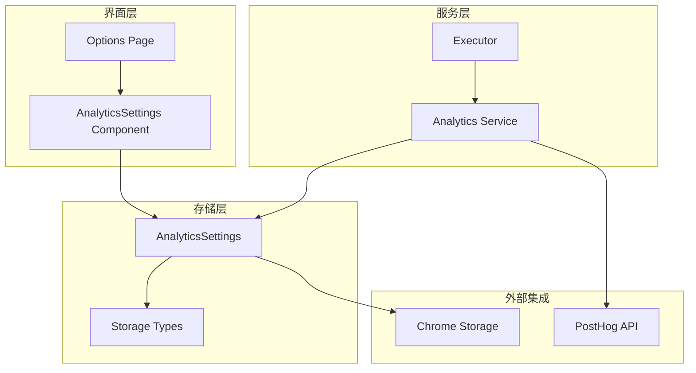
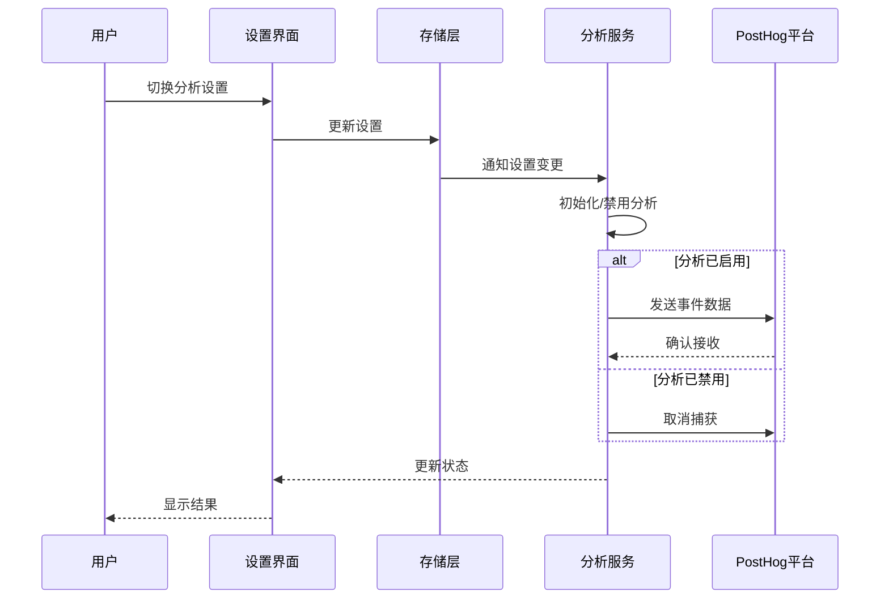
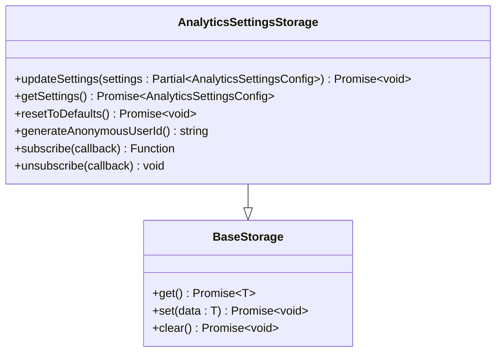
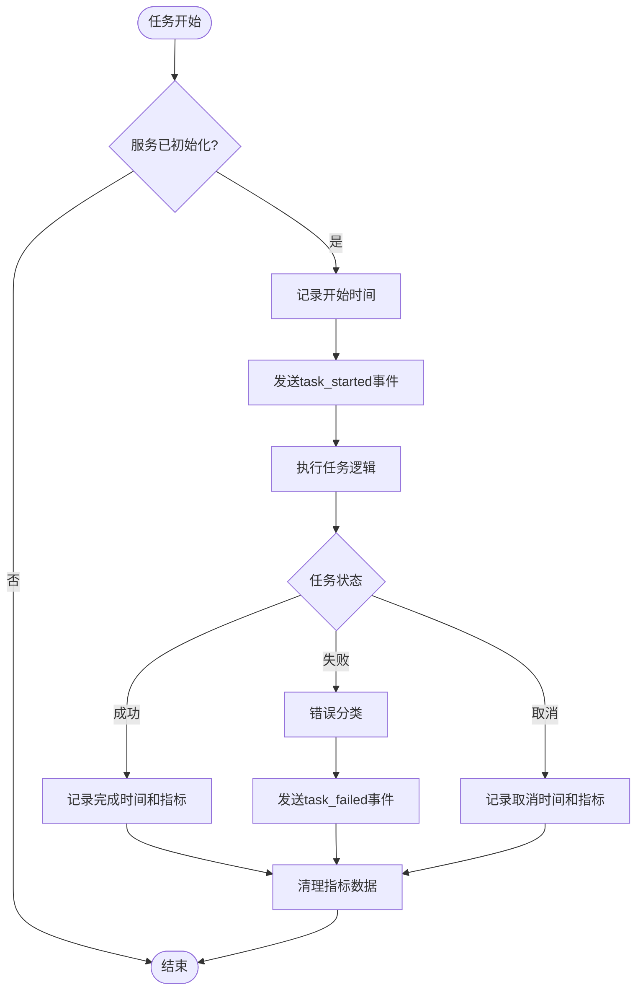
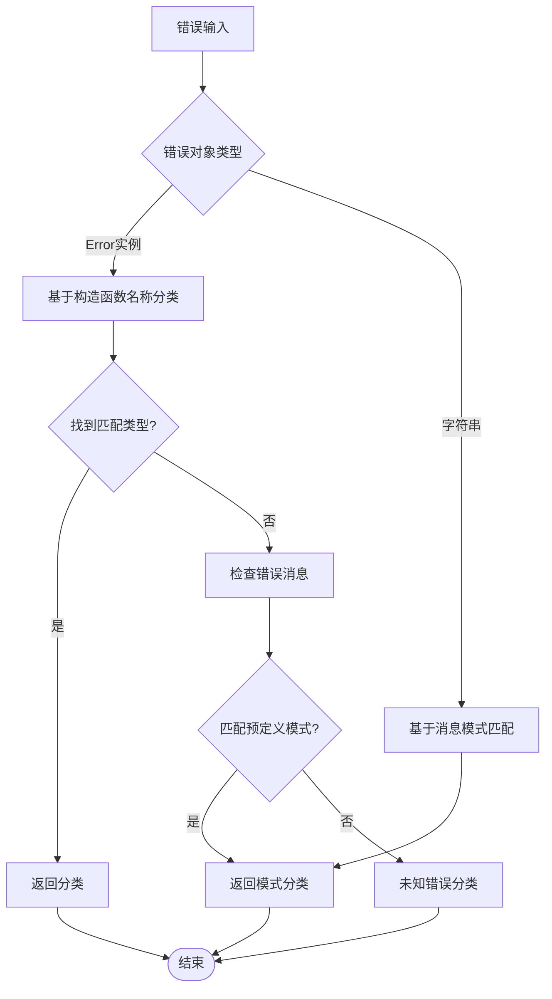
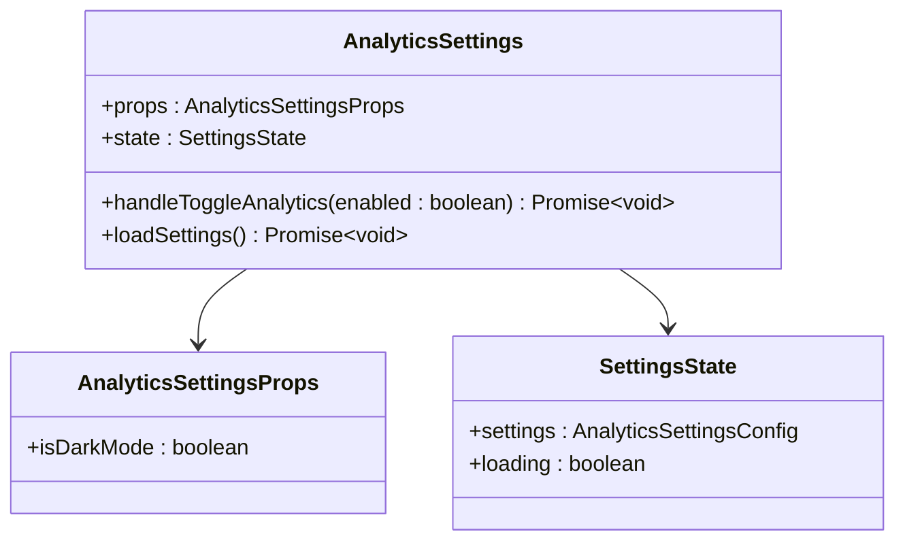
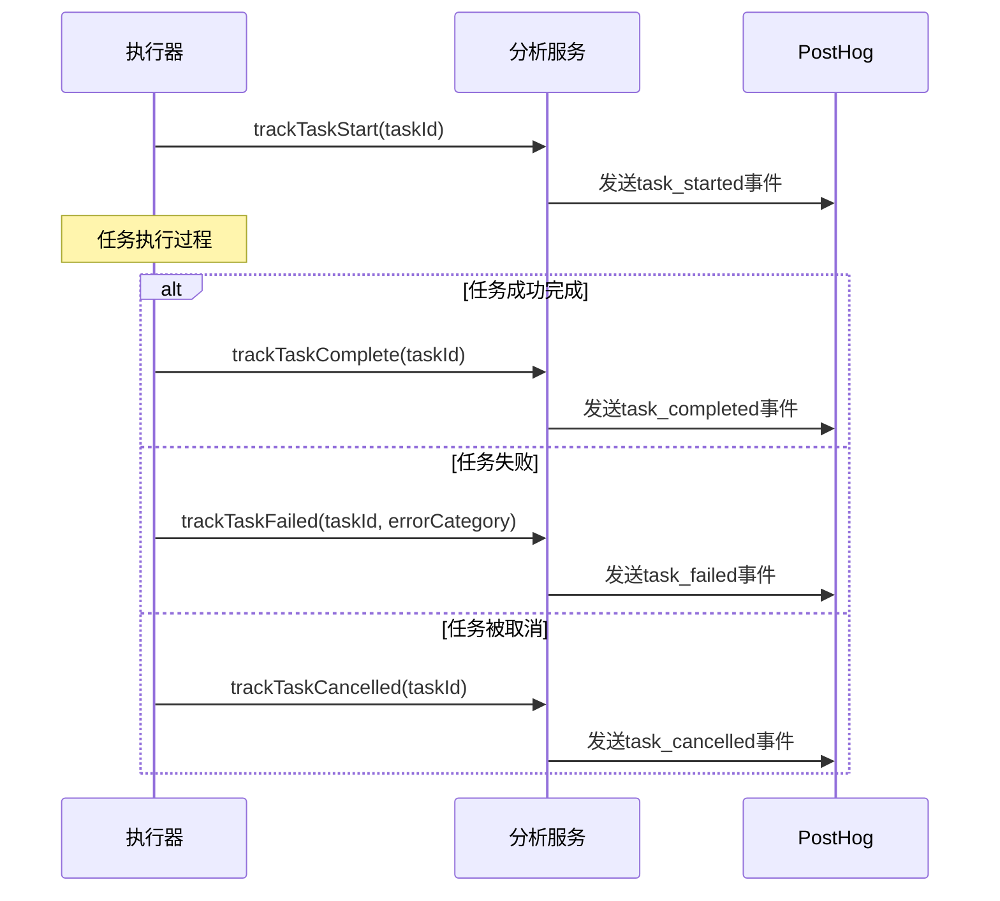
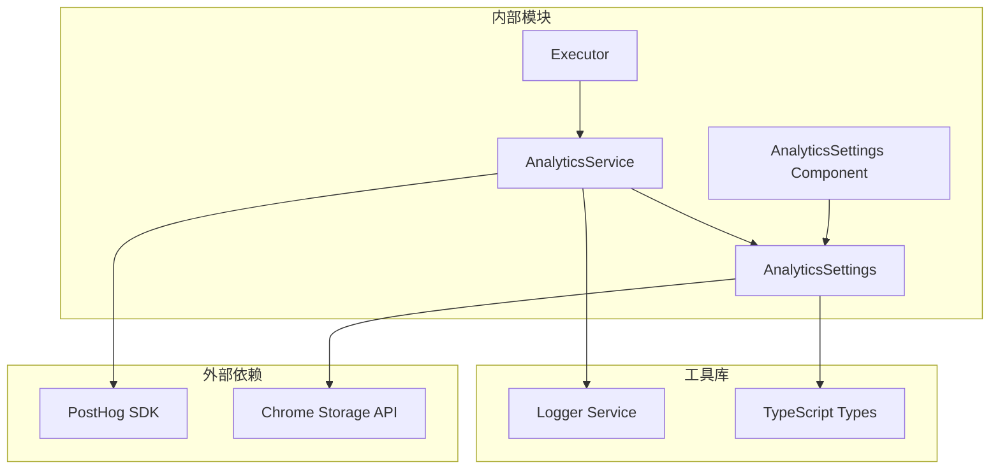

# 分析服务设置

<cite>
**本文档中引用的文件**
- [analyticsSettings.ts](file://packages/storage/lib/settings/analyticsSettings.ts)
- [analytics.ts](file://chrome-extension/src/background/services/analytics.ts)
- [AnalyticsSettings.tsx](file://pages/options/src/components/AnalyticsSettings.tsx)
- [index.ts](file://packages/storage/lib/settings/index.ts)
- [executor.ts](file://chrome-extension/src/background/agent/executor.ts)
- [PRIVACY.md](file://PRIVACY.md)
</cite>

## 目录
1. [简介](#简介)
2. [项目结构](#项目结构)
3. [核心组件](#核心组件)
4. [架构概览](#架构概览)
5. [详细组件分析](#详细组件分析)
6. [依赖关系分析](#依赖关系分析)
7. [性能考虑](#性能考虑)
8. [故障排除指南](#故障排除指南)
9. [结论](#结论)

## 简介

NanoBrowser分析服务设置模块是一个全面的用户行为追踪和性能监控系统，旨在在保护用户隐私的前提下收集匿名使用数据。该模块通过PostHog分析平台提供任务执行指标、网站访问统计和错误分类等关键信息，帮助开发团队优化扩展功能和用户体验。

该模块采用完全可选的设计原则，用户可以随时启用或禁用分析功能，并且所有收集的数据都是匿名化的，严格遵守隐私保护法规和最佳实践。

## 项目结构

分析服务设置模块分布在多个关键目录中，形成了清晰的分层架构：



**图表来源**
- [analyticsSettings.ts](file://packages/storage/lib/settings/analyticsSettings.ts#L1-L75)
- [analytics.ts](file://chrome-extension/src/background/services/analytics.ts#L1-L272)
- [AnalyticsSettings.tsx](file://pages/options/src/components/AnalyticsSettings.tsx#L1-L163)

**章节来源**
- [index.ts](file://packages/storage/lib/settings/index.ts#L1-L8)

## 核心组件

### AnalyticsSettings类

AnalyticsSettings类是整个分析服务设置模块的核心，负责管理匿名数据收集的开关状态、事件上报频率和数据保留策略。

#### 主要特性

1. **默认启用状态**：分析功能默认启用，符合要求
2. **匿名用户标识**：自动生成随机匿名用户ID
3. **实时更新支持**：支持存储变更的实时监听
4. **持久化存储**：使用Chrome本地存储进行数据持久化

#### 配置接口

```typescript
interface AnalyticsSettingsConfig {
  enabled: boolean;           // 分析功能启用状态
  anonymousUserId: string;    // 匿名用户标识符
}
```

### AnalyticsService类

AnalyticsService类提供了完整的分析功能实现，包括任务跟踪、错误分类和域名访问统计。

#### 核心功能

1. **任务生命周期跟踪**：从任务开始到完成的完整生命周期监控
2. **错误分类系统**：基于错误类型和消息模式的智能错误分类
3. **域名访问统计**：仅收集域名级别的访问统计信息
4. **PostHog集成**：与PostHog分析平台的深度集成

**章节来源**
- [analyticsSettings.ts](file://packages/storage/lib/settings/analyticsSettings.ts#L1-L75)
- [analytics.ts](file://chrome-extension/src/background/services/analytics.ts#L1-L272)

## 架构概览

分析服务设置模块采用了分层架构设计，确保了良好的可维护性和扩展性：



**图表来源**
- [AnalyticsSettings.tsx](file://pages/options/src/components/AnalyticsSettings.tsx#L35-L50)
- [analytics.ts](file://chrome-extension/src/background/services/analytics.ts#L247-L270)

## 详细组件分析

### 存储层分析

存储层负责持久化分析设置，提供了完整的CRUD操作和实时更新支持。

#### AnalyticsSettings存储实现



**图表来源**
- [analyticsSettings.ts](file://packages/storage/lib/settings/analyticsSettings.ts#L10-L18)

#### 关键方法实现

1. **getSettings()方法**：自动为新用户生成匿名ID
2. **updateSettings()方法**：支持部分更新，保持现有配置
3. **resetToDefaults()方法**：重置时保留用户的匿名标识符

### 服务层分析

服务层实现了完整的分析功能，包括事件跟踪和错误处理。

#### 任务跟踪流程



**图表来源**
- [analytics.ts](file://chrome-extension/src/background/services/analytics.ts#L105-L203)

#### 错误分类系统

服务层实现了智能的错误分类系统，能够根据错误类型和消息内容进行精确分类：



**图表来源**
- [analytics.ts](file://chrome-extension/src/background/services/analytics.ts#L205-L245)

### 界面层分析

界面层提供了直观的用户控制面板，允许用户轻松管理分析设置。

#### 设置界面组件



**图表来源**
- [AnalyticsSettings.tsx](file://pages/options/src/components/AnalyticsSettings.tsx#L8-L15)

#### 用户交互流程

1. **加载设置**：组件初始化时从存储中加载当前设置
2. **实时监听**：订阅存储变更以响应其他标签页的设置修改
3. **状态切换**：用户点击开关时更新设置并同步到服务层
4. **反馈显示**：提供清晰的状态反馈和帮助信息

**章节来源**
- [AnalyticsSettings.tsx](file://pages/options/src/components/AnalyticsSettings.tsx#L1-L163)

### 执行器集成分析

分析服务与任务执行器紧密集成，在任务生命周期的关键节点触发事件跟踪。

#### 事件触发点



**图表来源**
- [executor.ts](file://chrome-extension/src/background/agent/executor.ts#L138-L214)

**章节来源**
- [executor.ts](file://chrome-extension/src/background/agent/executor.ts#L130-L220)

## 依赖关系分析

分析服务设置模块的依赖关系体现了清晰的分层架构：



**图表来源**
- [analyticsSettings.ts](file://packages/storage/lib/settings/analyticsSettings.ts#L1-L5)
- [analytics.ts](file://chrome-extension/src/background/services/analytics.ts#L1-L10)

### 关键依赖说明

1. **PostHog SDK**：提供分析数据的远程传输能力
2. **Chrome Storage API**：确保设置的持久化和跨会话一致性
3. **日志服务**：提供详细的调试和监控信息
4. **类型定义**：确保类型安全和开发体验

**章节来源**
- [analytics.ts](file://chrome-extension/src/background/services/analytics.ts#L1-L10)
- [analyticsSettings.ts](file://packages/storage/lib/settings/analyticsSettings.ts#L1-L5)

## 性能考虑

分析服务设置模块在设计时充分考虑了性能优化：

### 内存管理
- 使用Map数据结构存储任务指标，及时清理过期数据
- 避免在内存中缓存大量分析数据
- 实现了优雅的错误处理，防止异常影响主业务流程

### 网络优化
- 异步发送分析事件，避免阻塞主线程
- 智能过滤无效的域名访问（如localhost、chrome-开头）
- 使用批量发送策略减少网络请求次数

### 存储效率
- 使用增量更新策略，只保存必要的配置信息
- 支持实时订阅，减少轮询开销
- 数据序列化优化，确保存储空间的有效利用

## 故障排除指南

### 常见问题及解决方案

#### 分析功能无法启动
**症状**：分析设置无法保存或事件无法发送
**原因**：PostHog API密钥未正确配置
**解决方案**：
1. 检查环境变量VITE_POSTHOG_API_KEY是否设置
2. 确认API密钥格式正确
3. 验证网络连接状态

#### 匿名用户ID重复
**症状**：多个用户报告相同的匿名ID
**原因**：随机数生成器种子相同
**解决方案**：
1. 检查浏览器时间设置
2. 重新安装扩展程序
3. 清除浏览器缓存

#### 事件发送失败
**症状**：控制台出现网络错误
**原因**：网络限制或防火墙阻止
**解决方案**：
1. 检查网络连接
2. 验证PostHog端点可达性
3. 调整浏览器安全设置

**章节来源**
- [analytics.ts](file://chrome-extension/src/background/services/analytics.ts#L65-L85)

## 结论

NanoBrowser分析服务设置模块展现了现代Web扩展应用中数据分析的最佳实践。通过以下关键特性，该模块成功地平衡了功能需求与用户隐私保护：

### 核心优势

1. **完全可选设计**：用户始终拥有最终控制权
2. **强隐私保护**：所有数据都是匿名化的
3. **透明度高**：开源代码确保完全可见性
4. **性能优化**：异步处理和智能过滤
5. **易于使用**：直观的用户界面和清晰的说明

### 技术亮点

- **分层架构**：清晰的职责分离和良好的可维护性
- **错误处理**：完善的异常处理和降级机制
- **实时更新**：支持多标签页间的状态同步
- **智能分类**：基于规则的错误分类系统

### 合规性保障

该模块严格遵循隐私保护原则，收集的数据仅用于改进产品功能，不涉及任何个人身份信息。通过开源透明的方式，用户可以验证数据处理的正当性。

总的来说，这个分析服务设置模块为NanoBrowser提供了一个强大而负责任的数据收集基础设施，既满足了产品改进的需求，又充分尊重了用户的隐私权利。