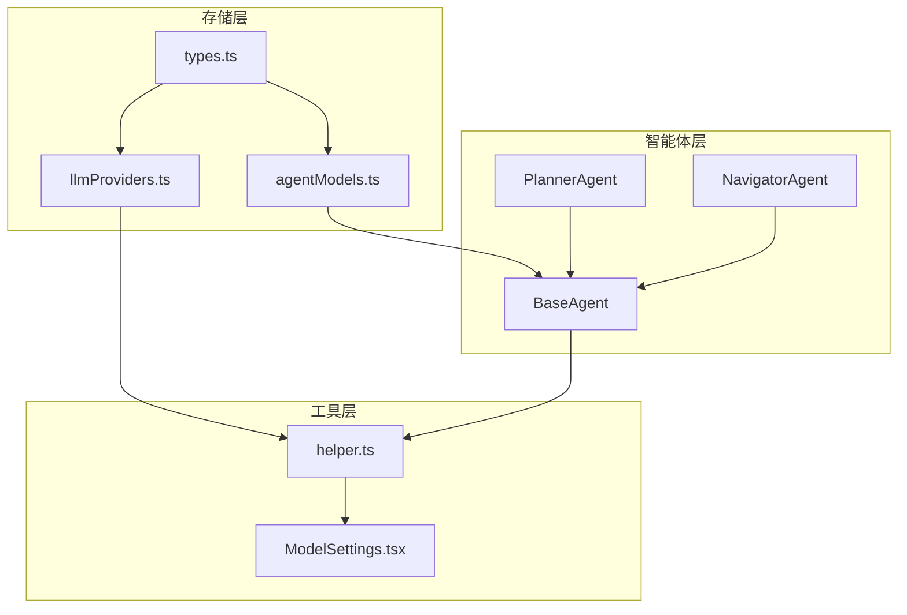
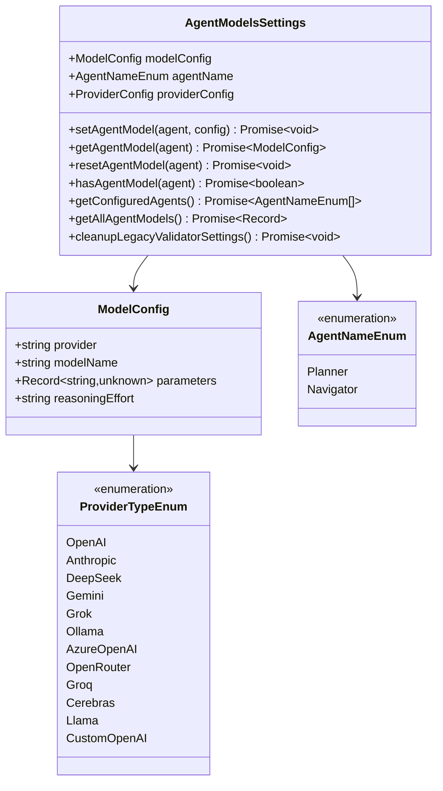
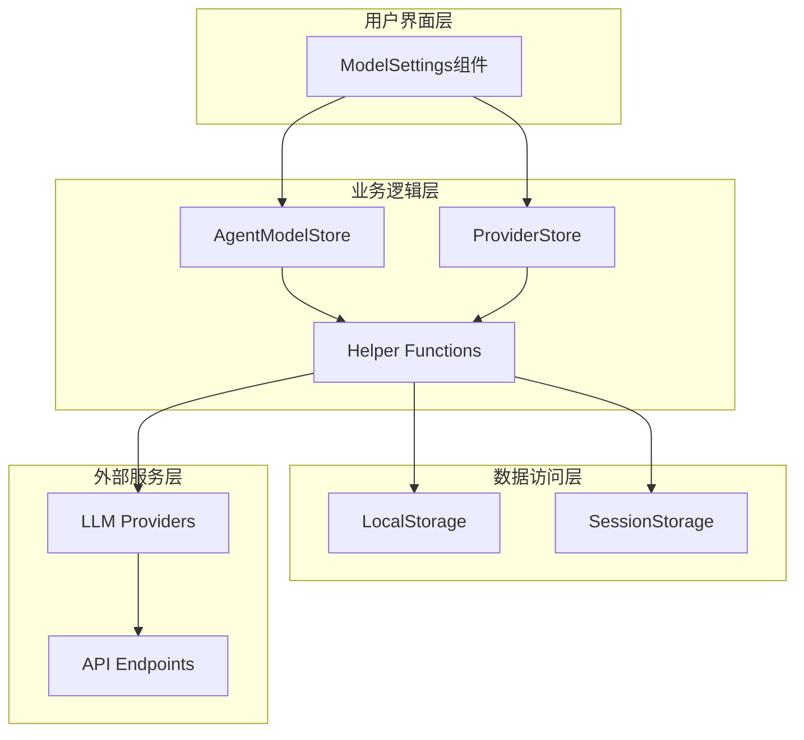
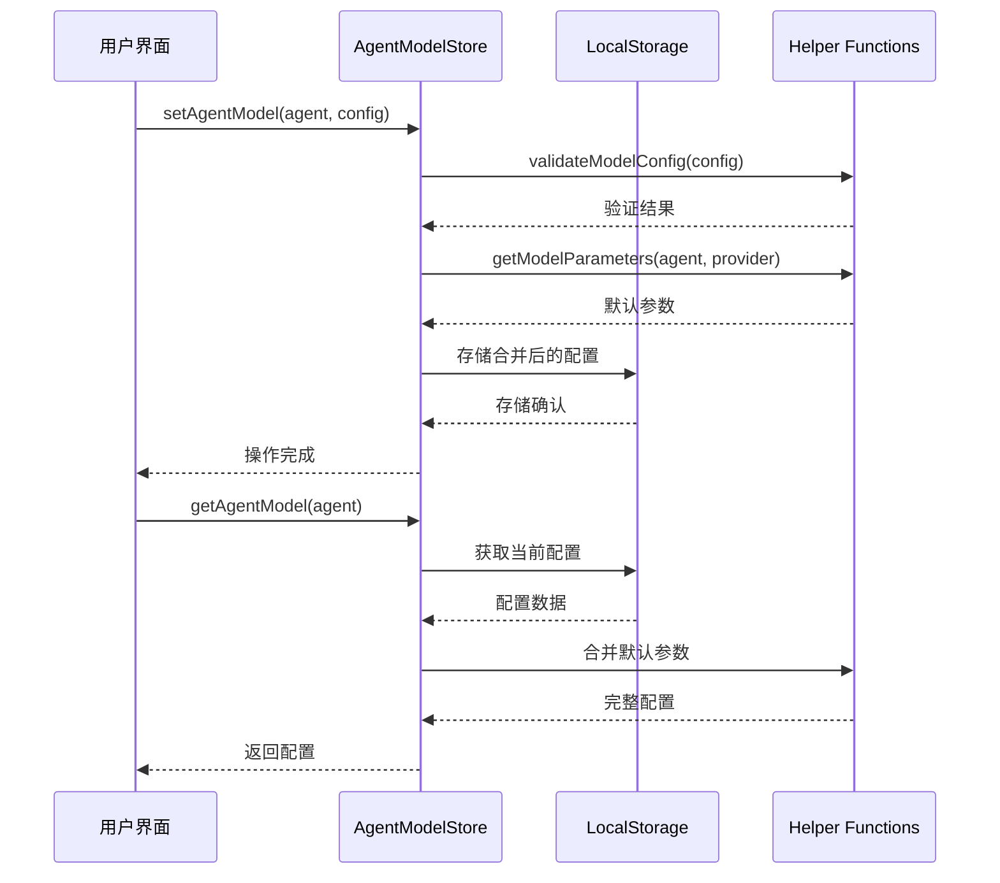
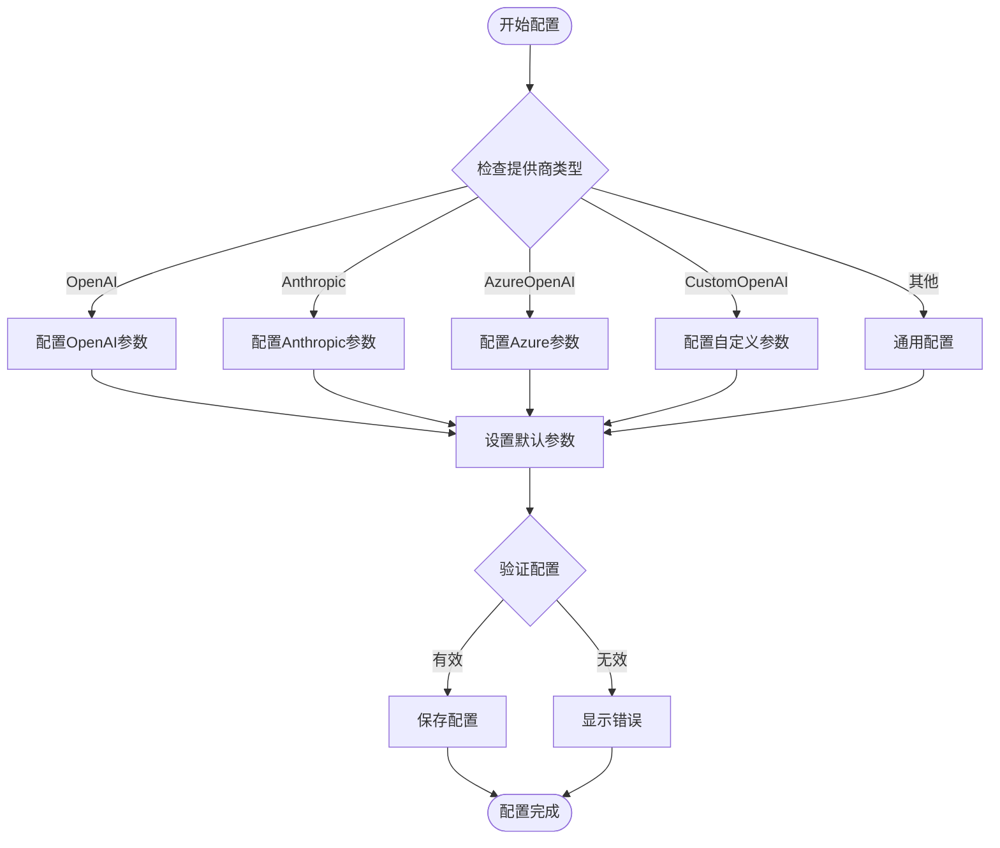
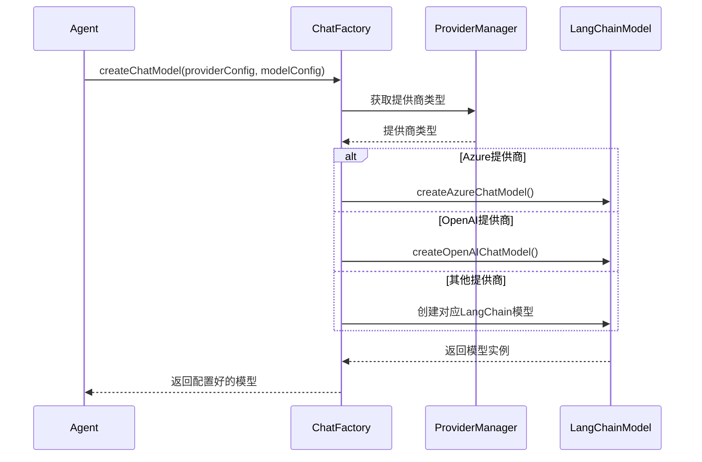
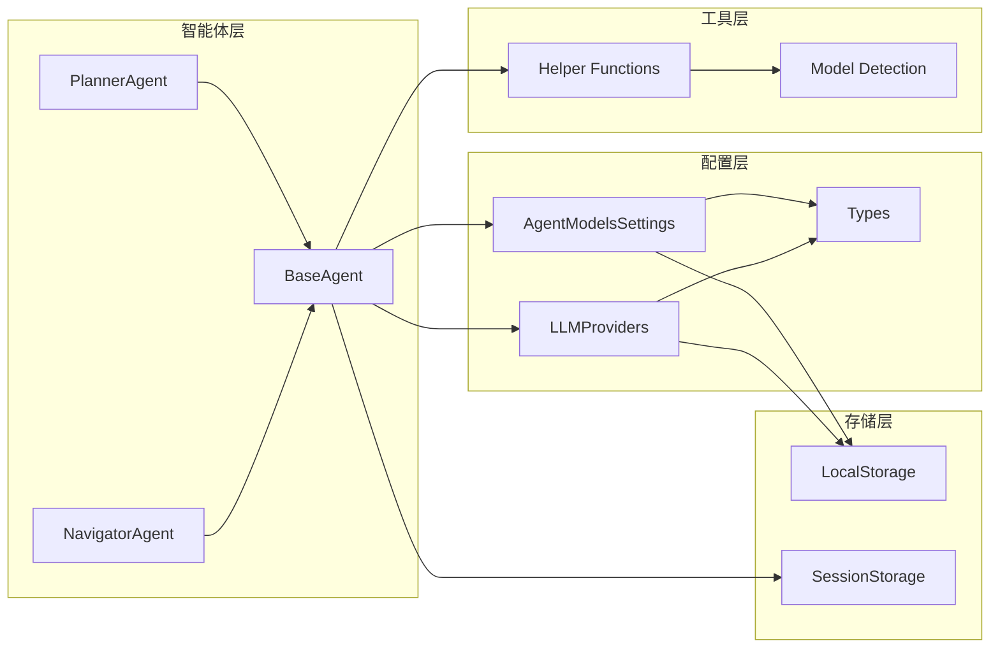

# 智能体模型配置

<cite>
**本文档中引用的文件**
- [agentModels.ts](file://packages/storage/lib/settings/agentModels.ts)
- [types.ts](file://packages/storage/lib/settings/types.ts)
- [llmProviders.ts](file://packages/storage/lib/settings/llmProviders.ts)
- [base.ts](file://chrome-extension/src/background/agent/agents/base.ts)
- [planner.ts](file://chrome-extension/src/background/agent/agents/planner.ts)
- [navigator.ts](file://chrome-extension/src/background/agent/agents/navigator.ts)
- [helper.ts](file://chrome-extension/src/background/agent/helper.ts)
- [ModelSettings.tsx](file://pages/options/src/components/ModelSettings.tsx)
</cite>

## 目录
1. [简介](#简介)
2. [项目结构概览](#项目结构概览)
3. [核心组件分析](#核心组件分析)
4. [架构概览](#架构概览)
5. [详细组件分析](#详细组件分析)
6. [依赖关系分析](#依赖关系分析)
7. [性能考虑](#性能考虑)
8. [故障排除指南](#故障排除指南)
9. [结论](#结论)

## 简介

智能体模型配置模块是NanoBrowser扩展中的核心功能之一，负责管理Planner和Navigator智能体所使用的语言模型配置。该模块提供了统一的模型选择、参数调优和性能配置接口，支持多种LLM提供商，并确保模型配置的一致性和可维护性。

该系统采用分层架构设计，通过AgentModelsSettings类定义模型版本、温度参数、上下文长度等关键属性，与LLM提供商配置建立紧密的关联关系。系统支持设置自定义模型参数，解释模型配置对智能体行为的影响机制，并提供模型兼容性验证、默认配置推荐以及高级用户的手动配置选项。

## 项目结构概览

智能体模型配置模块在项目中的组织结构如下：

**图表来源**
- [agentModels.ts](file://packages/storage/lib/settings/agentModels.ts#L1-L122)
- [base.ts](file://chrome-extension/src/background/agent/agents/base.ts#L1-L211)
- [helper.ts](file://chrome-extension/src/background/agent/helper.ts#L1-L385)

**章节来源**
- [agentModels.ts](file://packages/storage/lib/settings/agentModels.ts#L1-L122)
- [types.ts](file://packages/storage/lib/settings/types.ts#L1-L154)

## 核心组件分析

### AgentModelsSettings类

AgentModelsSettings类是模型配置的核心抽象，定义了智能体模型配置的基本结构和操作方法：

**图表来源**
- [agentModels.ts](file://packages/storage/lib/settings/agentModels.ts#L7-L15)
- [types.ts](file://packages/storage/lib/settings/types.ts#L3-L10)

### 模型配置接口

模型配置接口定义了智能体模型的核心属性：

| 属性名 | 类型 | 描述 | 默认值 |
|--------|------|------|--------|
| provider | string | 提供商标识符 | 必需 |
| modelName | string | 模型名称 | 必需 |
| parameters | Record<string, unknown> | 模型参数 | 可选 |
| reasoningEffort | 'minimal' \| 'low' \| 'medium' \| 'high' | 推理努力程度 | 可选 |

**章节来源**
- [agentModels.ts](file://packages/storage/lib/settings/agentModels.ts#L7-L15)

## 架构概览

智能体模型配置系统采用分层架构，确保配置管理的灵活性和可扩展性：

**图表来源**
- [ModelSettings.tsx](file://pages/options/src/components/ModelSettings.tsx#L1-L200)
- [agentModels.ts](file://packages/storage/lib/settings/agentModels.ts#L45-L122)

## 详细组件分析

### 模型配置存储系统

AgentModelStore提供了完整的模型配置CRUD操作：

**图表来源**
- [agentModels.ts](file://packages/storage/lib/settings/agentModels.ts#L45-L122)
- [helper.ts](file://chrome-extension/src/background/agent/helper.ts#L85-L126)

### LLM提供商配置

LLM提供商配置系统支持多种提供商类型：

**图表来源**
- [llmProviders.ts](file://packages/storage/lib/settings/llmProviders.ts#L201-L316)
- [helper.ts](file://chrome-extension/src/background/agent/helper.ts#L229-L384)

### 智能体模型创建流程

智能体模型创建遵循统一的工厂模式：

**图表来源**
- [helper.ts](file://chrome-extension/src/background/agent/helper.ts#L229-L384)
- [base.ts](file://chrome-extension/src/background/agent/agents/base.ts#L30-L60)

**章节来源**
- [helper.ts](file://chrome-extension/src/background/agent/helper.ts#L229-L384)
- [base.ts](file://chrome-extension/src/background/agent/agents/base.ts#L30-L60)

### 默认参数配置

不同提供商和智能体类型的默认参数配置：

| 提供商 | Planner温度 | Navigator温度 | TopP | 推理努力 |
|--------|-------------|---------------|------|----------|
| OpenAI | 0.7 | 0.3 | 0.9 | 支持 |
| Anthropic | 0.3 | 0.2 | 0.6 | 支持 |
| Gemini | 0.7 | 0.3 | 0.9 | 支持 |
| Grok | 0.7 | 0.3 | 0.9 | 支持 |
| Ollama | 0.3 | 0.1 | 0.9 | 不支持 |
| AzureOpenAI | 0.7 | 0.3 | 0.9 | 支持 |

**章节来源**
- [types.ts](file://packages/storage/lib/settings/types.ts#L50-L153)

## 依赖关系分析

智能体模型配置系统的依赖关系图：

**图表来源**
- [agentModels.ts](file://packages/storage/lib/settings/agentModels.ts#L1-L10)
- [llmProviders.ts](file://packages/storage/lib/settings/llmProviders.ts#L1-L20)

**章节来源**
- [agentModels.ts](file://packages/storage/lib/settings/agentModels.ts#L1-L122)
- [llmProviders.ts](file://packages/storage/lib/settings/llmProviders.ts#L1-L317)

## 性能考虑

### 模型参数优化

智能体模型配置系统在性能方面采用了多项优化策略：

1. **参数合并机制**：自动合并默认参数与用户自定义参数，避免重复配置
2. **延迟加载**：仅在需要时加载特定智能体的模型配置
3. **缓存策略**：在内存中缓存常用的模型配置，减少存储访问开销
4. **类型安全**：通过TypeScript类型系统确保参数配置的正确性

### 内存管理

系统采用渐进式内存管理模式：
- 使用LocalStorage进行持久化存储
- SessionStorage用于临时配置
- 实现配置清理机制防止内存泄漏

### 并发处理

支持并发的模型配置操作：
- 异步配置更新
- 非阻塞的配置读取
- 错误隔离机制

## 故障排除指南

### 常见配置问题

1. **模型不可用**
   - 检查提供商API密钥是否正确配置
   - 验证模型名称是否在提供商列表中
   - 确认网络连接状态

2. **参数不生效**
   - 验证参数格式是否符合要求
   - 检查是否存在参数冲突
   - 确认模型是否支持指定参数

3. **推理努力设置失败**
   - 确认模型是否为O系列或GPT-5模型
   - 检查推理努力值是否在有效范围内

### 调试技巧

1. **启用详细日志记录**
2. **使用浏览器开发者工具监控网络请求**
3. **检查本地存储中的配置数据**
4. **验证模型检测函数的返回值**

**章节来源**
- [helper.ts](file://chrome-extension/src/background/agent/helper.ts#L55-L83)
- [ModelSettings.tsx](file://pages/options/src/components/ModelSettings.tsx#L427-L457)

## 结论

智能体模型配置模块为NanoBrowser扩展提供了强大而灵活的模型管理能力。通过AgentModelsSettings类的统一接口，系统实现了以下关键功能：

1. **统一的配置管理**：通过标准化的接口管理所有智能体的模型配置
2. **多提供商支持**：无缝集成OpenAI、Anthropic、Azure等多种LLM提供商
3. **智能参数优化**：基于智能体类型和提供商特性自动优化参数配置
4. **向后兼容性**：确保新版本配置与旧版本的兼容性
5. **用户友好界面**：提供直观的配置界面和错误处理机制

该模块的设计充分考虑了可扩展性、性能和用户体验，为智能体系统的稳定运行提供了坚实的基础。通过合理的抽象层次和清晰的职责分离，系统能够适应不断变化的需求和技术发展。