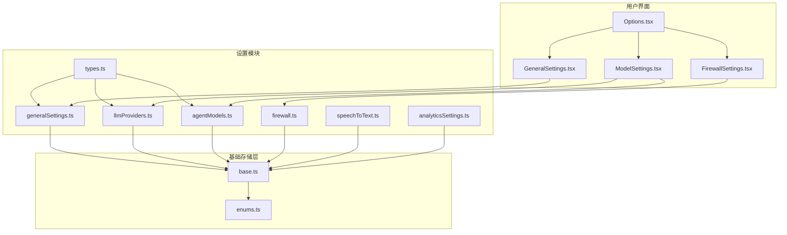
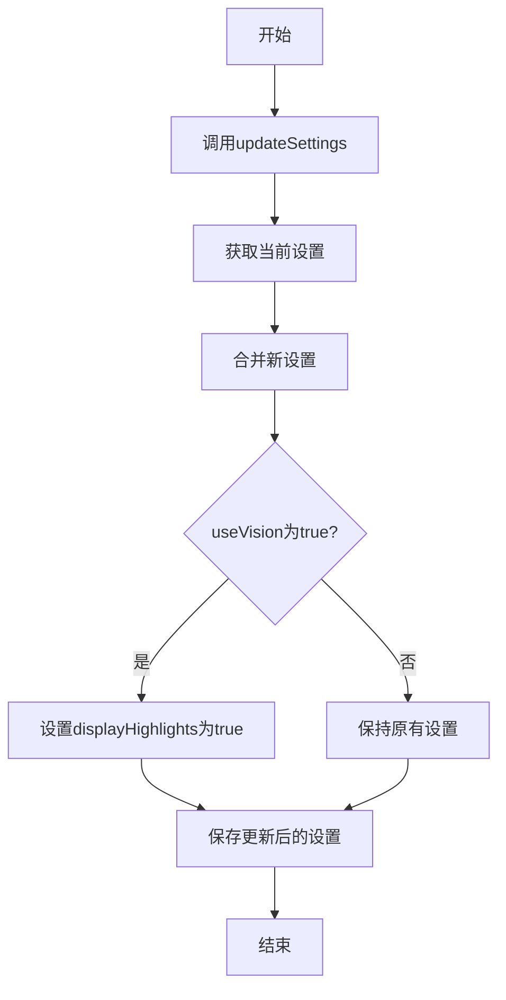
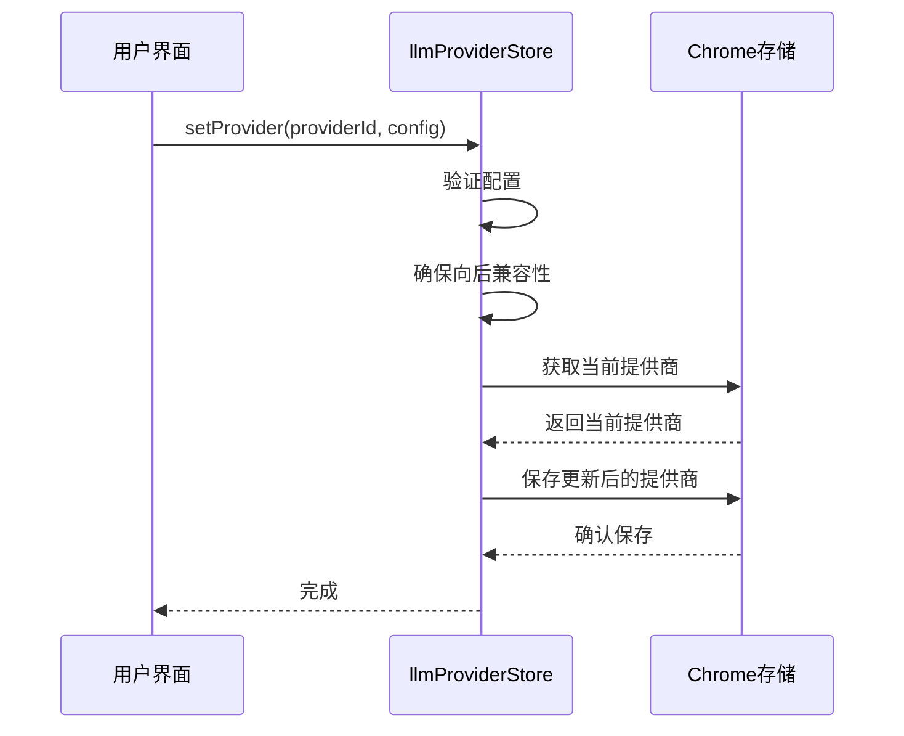
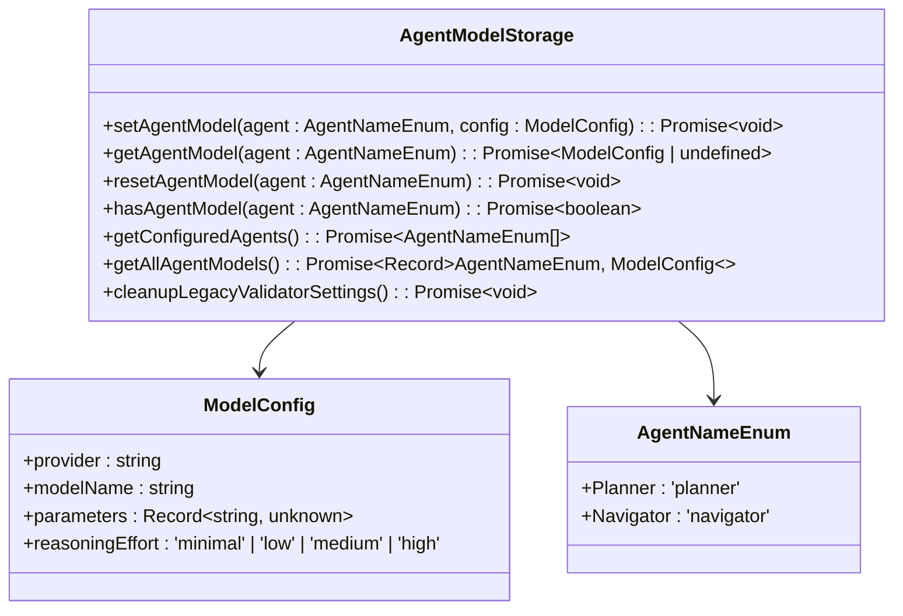
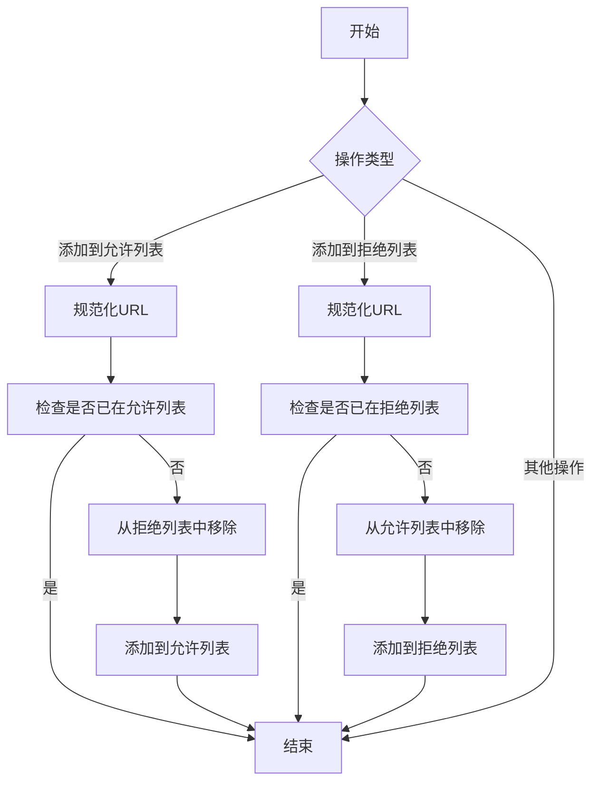
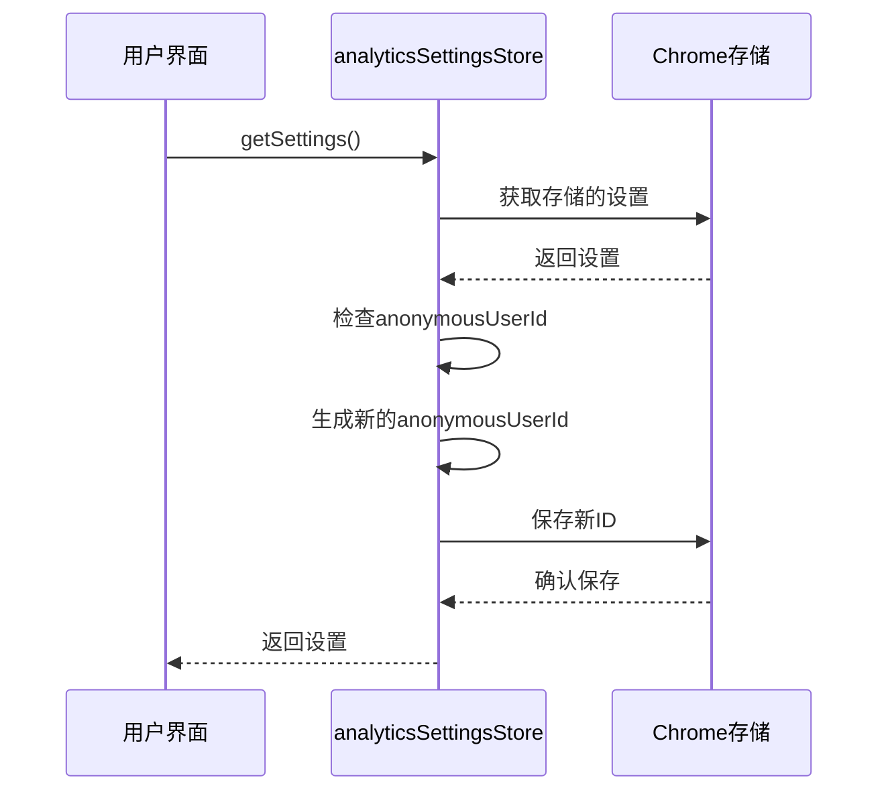
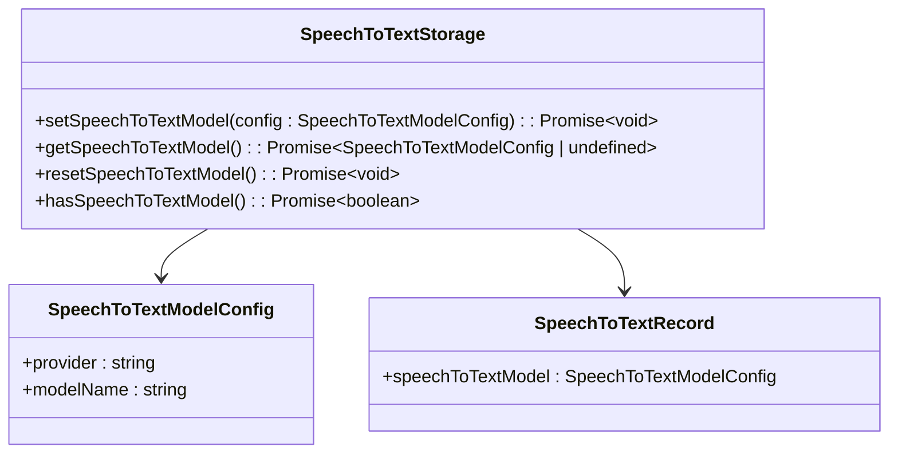
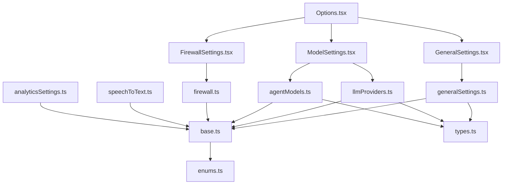

# 设置管理

<cite>
**本文档引用的文件**
- [generalSettings.ts](file://packages/storage/lib/settings/generalSettings.ts)
- [llmProviders.ts](file://packages/storage/lib/settings/llmProviders.ts)
- [agentModels.ts](file://packages/storage/lib/settings/agentModels.ts)
- [firewall.ts](file://packages/storage/lib/settings/firewall.ts)
- [speechToText.ts](file://packages/storage/lib/settings/speechToText.ts)
- [analyticsSettings.ts](file://packages/storage/lib/settings/analyticsSettings.ts)
- [types.ts](file://packages/storage/lib/settings/types.ts)
- [base.ts](file://packages/storage/lib/base/base.ts)
- [enums.ts](file://packages/storage/lib/base/enums.ts)
- [Options.tsx](file://pages/options/src/Options.tsx)
- [GeneralSettings.tsx](file://pages/options/src/components/GeneralSettings.tsx)
- [FirewallSettings.tsx](file://pages/options/src/components/FirewallSettings.tsx)
- [ModelSettings.tsx](file://pages/options/src/components/ModelSettings.tsx)
</cite>

## 目录
1. [简介](#简介)
2. [项目结构](#项目结构)
3. [核心组件](#核心组件)
4. [架构概述](#架构概述)
5. [详细组件分析](#详细组件分析)
6. [依赖分析](#依赖分析)
7. [性能考虑](#性能考虑)
8. [故障排除指南](#故障排除指南)
9. [结论](#结论)

## 简介
本项目实现了一个全面的设置管理系统，用于管理浏览器扩展的各种配置选项。系统设计遵循模块化原则，将不同类型的设置分离到独立的模块中，包括通用设置、LLM提供商配置、智能体模型选择、分析服务偏好、语音转文本选项和防火墙规则等。所有设置模块通过统一的Settings接口进行注册与读写，确保了类型安全的配置结构和一致的默认值初始化逻辑。系统利用Chrome扩展的存储API实现数据持久化，并支持实时更新和跨组件同步。

## 项目结构

**图示来源**
- [generalSettings.ts](file://packages/storage/lib/settings/generalSettings.ts)
- [llmProviders.ts](file://packages/storage/lib/settings/llmProviders.ts)
- [agentModels.ts](file://packages/storage/lib/settings/agentModels.ts)
- [firewall.ts](file://packages/storage/lib/settings/firewall.ts)
- [base.ts](file://packages/storage/lib/base/base.ts)
- [enums.ts](file://packages/storage/lib/base/enums.ts)
- [Options.tsx](file://pages/options/src/Options.tsx)
- [GeneralSettings.tsx](file://pages/options/src/components/GeneralSettings.tsx)
- [FirewallSettings.tsx](file://pages/options/src/components/FirewallSettings.tsx)
- [ModelSettings.tsx](file://pages/options/src/components/ModelSettings.tsx)

**本节来源**
- [generalSettings.ts](file://packages/storage/lib/settings/generalSettings.ts)
- [llmProviders.ts](file://packages/storage/lib/settings/llmProviders.ts)
- [agentModels.ts](file://packages/storage/lib/settings/agentModels.ts)
- [firewall.ts](file://packages/storage/lib/settings/firewall.ts)
- [speechToText.ts](file://packages/storage/lib/settings/speechToText.ts)
- [analyticsSettings.ts](file://packages/storage/lib/settings/analyticsSettings.ts)
- [types.ts](file://packages/storage/lib/settings/types.ts)
- [base.ts](file://packages/storage/lib/base/base.ts)
- [enums.ts](file://packages/storage/lib/base/enums.ts)

## 核心组件

设置管理系统由多个核心组件构成，每个组件负责特定类型的配置管理。系统采用分层架构，上层为具体的设置模块，下层为基础存储层。基础存储层提供统一的存储接口和功能，包括数据序列化、反序列化、实时更新监听等。各设置模块通过导入基础存储功能，创建特定于其配置类型的存储实例。这种设计实现了关注点分离，使得每个模块可以独立开发和维护，同时保持一致的API风格和行为。

**本节来源**
- [generalSettings.ts](file://packages/storage/lib/settings/generalSettings.ts)
- [llmProviders.ts](file://packages/storage/lib/settings/llmProviders.ts)
- [agentModels.ts](file://packages/storage/lib/settings/agentModels.ts)
- [firewall.ts](file://packages/storage/lib/settings/firewall.ts)
- [base.ts](file://packages/storage/lib/base/base.ts)

## 架构概述

```mermaid
classDiagram
class BaseStorage {
+get() : Promise~D~
+set(value : ValueOrUpdate~D~) : Promise~void~
+getSnapshot() : D | null
+subscribe(listener : () => void) : () => void
}
class StorageConfig {
+storageEnum : StorageEnum
+liveUpdate : boolean
+sessionAccessForContentScripts : boolean
+serialization : SerializationConfig
}
class GeneralSettingsStorage {
+updateSettings(settings : Partial~GeneralSettingsConfig~) : Promise~void~
+getSettings() : Promise~GeneralSettingsConfig~
+resetToDefaults() : Promise~void~
}
class LLMProviderStorage {
+setProvider(providerId : string, config : ProviderConfig) : Promise~void~
+getProvider(providerId : string) : Promise~ProviderConfig | undefined~
+removeProvider(providerId : string) : Promise~void~
+hasProvider(providerId : string) : Promise~boolean~
+getAllProviders() : Promise~Record~string, ProviderConfig~~
}
class AgentModelStorage {
+setAgentModel(agent : AgentNameEnum, config : ModelConfig) : Promise~void~
+getAgentModel(agent : AgentNameEnum) : Promise~ModelConfig | undefined~
+resetAgentModel(agent : AgentNameEnum) : Promise~void~
+hasAgentModel(agent : AgentNameEnum) : Promise~boolean~
+getConfiguredAgents() : Promise~AgentNameEnum[]~
+getAllAgentModels() : Promise~Record~AgentNameEnum, ModelConfig~~
}
class FirewallStorage {
+updateFirewall(settings : Partial~FirewallConfig~) : Promise~void~
+getFirewall() : Promise~FirewallConfig~
+resetToDefaults() : Promise~void~
+addToAllowList(url : string) : Promise~void~
+removeFromAllowList(url : string) : Promise~void~
+addToDenyList(url : string) : Promise~void~
+removeFromDenyList(url : string) : Promise~void~
}
class SpeechToTextStorage {
+setSpeechToTextModel(config : SpeechToTextModelConfig) : Promise~void~
+getSpeechToTextModel() : Promise~SpeechToTextModelConfig | undefined~
+resetSpeechToTextModel() : Promise~void~
+hasSpeechToTextModel() : Promise~boolean~
}
class AnalyticsSettingsStorage {
+updateSettings(settings : Partial~AnalyticsSettingsConfig~) : Promise~void~
+getSettings() : Promise~AnalyticsSettingsConfig~
+resetToDefaults() : Promise~void~
+generateAnonymousUserId() : string
}
BaseStorage <|-- GeneralSettingsStorage
BaseStorage <|-- LLMProviderStorage
BaseStorage <|-- AgentModelStorage
BaseStorage <|-- FirewallStorage
BaseStorage <|-- SpeechToTextStorage
BaseStorage <|-- AnalyticsSettingsStorage
StorageConfig --> BaseStorage
```

**图示来源**
- [generalSettings.ts](file://packages/storage/lib/settings/generalSettings.ts)
- [llmProviders.ts](file://packages/storage/lib/settings/llmProviders.ts)
- [agentModels.ts](file://packages/storage/lib/settings/agentModels.ts)
- [firewall.ts](file://packages/storage/lib/settings/firewall.ts)
- [speechToText.ts](file://packages/storage/lib/settings/speechToText.ts)
- [analyticsSettings.ts](file://packages/storage/lib/settings/analyticsSettings.ts)
- [base.ts](file://packages/storage/lib/base/base.ts)

## 详细组件分析

### 通用设置分析

通用设置模块管理扩展的核心行为参数，如最大步骤数、最大失败次数、视觉功能启用状态等。该模块定义了`GeneralSettingsConfig`接口来描述配置结构，并提供了默认值`DEFAULT_GENERAL_SETTINGS`。存储实例通过`createStorage`函数创建，使用"general-settings"作为存储键。模块还实现了`updateSettings`方法，该方法在更新设置时会执行特定的业务逻辑，例如当启用视觉功能时自动启用高亮显示。

**图示来源**
- [generalSettings.ts](file://packages/storage/lib/settings/generalSettings.ts)

**本节来源**
- [generalSettings.ts](file://packages/storage/lib/settings/generalSettings.ts)
- [GeneralSettings.tsx](file://pages/options/src/components/GeneralSettings.tsx)

### LLM提供商配置分析

LLM提供商配置模块管理各种语言模型提供商的API密钥和相关设置。该模块定义了`ProviderConfig`接口来描述单个提供商的配置，包括API密钥、基础URL、模型名称等。系统支持多种内置提供商，如OpenAI、Anthropic、Gemini等，每种提供商都有预定义的默认模型和参数。模块还实现了向后兼容性逻辑，确保旧版本的配置能够正确迁移到新版本。

**图示来源**
- [llmProviders.ts](file://packages/storage/lib/settings/llmProviders.ts)

**本节来源**
- [llmProviders.ts](file://packages/storage/lib/settings/llmProviders.ts)
- [ModelSettings.tsx](file://pages/options/src/components/ModelSettings.tsx)

### 智能体模型选择分析

智能体模型选择模块负责管理不同智能体（如规划器和导航器）所使用的模型配置。该模块定义了`ModelConfig`接口，包含提供商、模型名称和参数等属性。系统通过`agentModelStore`提供了一组方法来设置、获取和重置智能体模型。模块还实现了参数继承逻辑，即当获取模型配置时，会合并默认参数和存储的参数，确保即使某些参数未显式设置也能有合理的默认值。

**图示来源**
- [agentModels.ts](file://packages/storage/lib/settings/agentModels.ts)

**本节来源**
- [agentModels.ts](file://packages/storage/lib/settings/agentModels.ts)
- [ModelSettings.tsx](file://pages/options/src/components/ModelSettings.tsx)

### 防火墙规则分析

防火墙规则模块管理允许和拒绝访问的URL列表，以及防火墙的启用状态。该模块定义了`FirewallConfig`接口来描述防火墙配置，包括允许列表、拒绝列表和启用状态。系统提供了丰富的方法来操作这些列表，如添加和移除URL，并在操作时自动处理列表间的冲突（例如，当一个URL被添加到允许列表时，会自动从拒绝列表中移除）。所有URL在存储前都会被规范化处理，去除协议前缀并转换为小写。

**图示来源**
- [firewall.ts](file://packages/storage/lib/settings/firewall.ts)

**本节来源**
- [firewall.ts](file://packages/storage/lib/settings/firewall.ts)
- [FirewallSettings.tsx](file://pages/options/src/components/FirewallSettings.tsx)

### 分析服务偏好分析

分析服务偏好模块管理用户对分析服务的启用状态和匿名用户ID。该模块定义了`AnalyticsSettingsConfig`接口来描述配置结构。系统在获取设置时会检查是否存在匿名用户ID，如果不存在则生成一个新的ID并保存。重置设置时，系统会保留现有的用户ID，以确保用户跟踪的连续性。这种设计平衡了用户隐私和数据分析的需求。

**图示来源**
- [analyticsSettings.ts](file://packages/storage/lib/settings/analyticsSettings.ts)

**本节来源**
- [analyticsSettings.ts](file://packages/storage/lib/settings/analyticsSettings.ts)

### 语音转文本选项分析

语音转文本选项模块管理语音识别服务的提供商和模型选择。该模块定义了`SpeechToTextModelConfig`接口来描述配置结构。系统提供了设置、获取、重置和检查是否存在配置的方法。与其它模块类似，该模块也实现了配置验证逻辑，确保提供商和模型名称都已指定。

**图示来源**
- [speechToText.ts](file://packages/storage/lib/settings/speechToText.ts)

**本节来源**
- [speechToText.ts](file://packages/storage/lib/settings/speechToText.ts)

## 依赖分析

**图示来源**
- [generalSettings.ts](file://packages/storage/lib/settings/generalSettings.ts)
- [llmProviders.ts](file://packages/storage/lib/settings/llmProviders.ts)
- [agentModels.ts](file://packages/storage/lib/settings/agentModels.ts)
- [firewall.ts](file://packages/storage/lib/settings/firewall.ts)
- [speechToText.ts](file://packages/storage/lib/settings/speechToText.ts)
- [analyticsSettings.ts](file://packages/storage/lib/settings/analyticsSettings.ts)
- [base.ts](file://packages/storage/lib/base/base.ts)
- [enums.ts](file://packages/storage/lib/base/enums.ts)
- [Options.tsx](file://pages/options/src/Options.tsx)
- [GeneralSettings.tsx](file://pages/options/src/components/GeneralSettings.tsx)
- [FirewallSettings.tsx](file://pages/options/src/components/FirewallSettings.tsx)
- [ModelSettings.tsx](file://pages/options/src/components/ModelSettings.tsx)

**本节来源**
- [generalSettings.ts](file://packages/storage/lib/settings/generalSettings.ts)
- [llmProviders.ts](file://packages/storage/lib/settings/llmProviders.ts)
- [agentModels.ts](file://packages/storage/lib/settings/agentModels.ts)
- [firewall.ts](file://packages/storage/lib/settings/firewall.ts)
- [speechToText.ts](file://packages/storage/lib/settings/speechToText.ts)
- [analyticsSettings.ts](file://packages/storage/lib/settings/analyticsSettings.ts)
- [base.ts](file://packages/storage/lib/base/base.ts)
- [enums.ts](file://packages/storage/lib/base/enums.ts)

## 性能考虑
设置管理系统在设计时考虑了性能因素。通过使用Chrome扩展的存储API，系统能够高效地读写配置数据。所有存储实例都启用了实时更新功能，这意味着当一个组件修改了设置，其他监听该设置的组件会立即收到通知并更新，避免了频繁的轮询操作。此外，系统采用了缓存机制，在首次读取设置后会将其缓存在内存中，后续读取操作可以直接从内存中获取，减少了与存储API的交互次数。

## 故障排除指南
如果遇到设置无法保存或读取的问题，请检查以下几点：首先确认Chrome扩展的存储权限已在manifest.json中正确声明；其次检查网络连接是否正常，因为某些操作可能需要访问远程服务；最后查看浏览器控制台是否有任何错误消息，这些消息可能会提供问题的线索。对于防火墙规则不生效的情况，请确保URL已正确规范化（去除协议前缀并转换为小写），并且没有与其他规则冲突。

## 结论
本设置管理系统通过模块化设计和统一的API接口，实现了对各种配置选项的高效管理。系统不仅提供了基本的读写功能，还包含了配置验证、向后兼容性处理、实时更新等高级特性。通过将基础存储功能与具体设置逻辑分离，系统实现了良好的可维护性和可扩展性。未来可以考虑增加配置导入导出功能，以及跨设备同步能力，进一步提升用户体验。