# 语音转文本设置

<cite>
**本文档中引用的文件**
- [speechToText.ts](file://packages/storage/lib/settings/speechToText.ts)
- [speechToText.ts](file://chrome-extension/src/background/services/speechToText.ts)
- [SidePanel.tsx](file://pages/side-panel/src/SidePanel.tsx)
- [ModelSettings.tsx](file://pages/options/src/components/ModelSettings.tsx)
- [ChatInput.tsx](file://pages/side-panel/src/components/ChatInput.tsx)
- [permission.js](file://chrome-extension/public/permission/permission.js)
- [index.html](file://chrome-extension/public/permission/index.html)
- [types.ts](file://packages/storage/lib/settings/types.ts)
- [llmProviders.ts](file://packages/storage/lib/settings/llmProviders.ts)
</cite>

## 目录
1. [简介](#简介)
2. [系统架构概览](#系统架构概览)
3. [核心组件分析](#核心组件分析)
4. [语音识别引擎配置](#语音识别引擎配置)
5. [麦克风权限管理](#麦克风权限管理)
6. [音频处理与实时转录](#音频处理与实时转录)
7. [性能优化策略](#性能优化策略)
8. [多语言支持与隐私保护](#多语言支持与隐私保护)
9. [故障排除指南](#故障排除指南)
10. [总结](#总结)

## 简介

NanoBrowser的语音转文本（Speech-to-Text）设置模块是一个高度集成的语音识别系统，提供了完整的语音输入解决方案。该模块支持多种语音识别服务提供商，具备实时音频处理能力，并实现了严格的安全和隐私保护机制。

系统的核心设计理念是提供灵活的配置选项，同时确保用户数据的安全性和处理效率。通过模块化的架构设计，系统能够支持不同的语音识别引擎，包括本地处理和云端服务，为用户提供最佳的语音转文本体验。

## 系统架构概览

语音转文本系统采用分层架构设计，包含前端界面层、存储管理层、服务提供层和后端处理层。

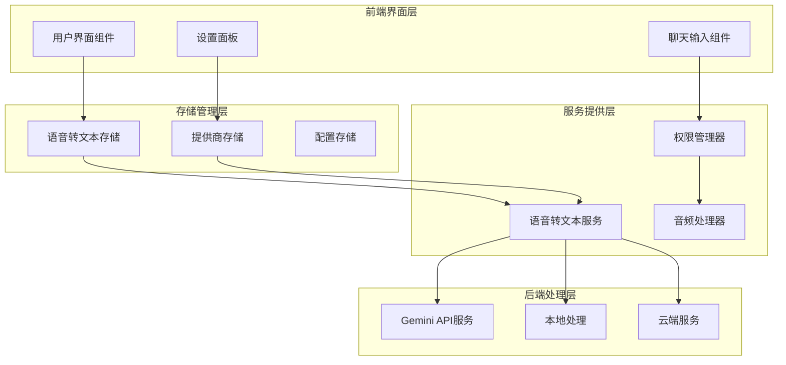

**图表来源**
- [SidePanel.tsx](file://pages/side-panel/src/SidePanel.tsx#L869-L999)
- [speechToText.ts](file://chrome-extension/src/background/services/speechToText.ts#L1-L77)
- [speechToText.ts](file://packages/storage/lib/settings/speechToText.ts#L1-L54)

## 核心组件分析

### SpeechToTextSettings 类

虽然代码库中没有直接定义名为 `SpeechToTextSettings` 的类，但系统通过多个组件协同工作来实现类似功能。核心的数据结构和接口定义如下：

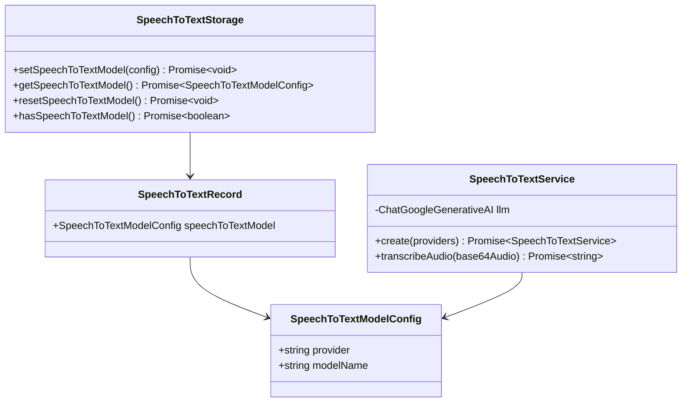

**图表来源**
- [speechToText.ts](file://packages/storage/lib/settings/speechToText.ts#L5-L15)
- [speechToText.ts](file://chrome-extension/src/background/services/speechToText.ts#L8-L15)

**章节来源**
- [speechToText.ts](file://packages/storage/lib/settings/speechToText.ts#L1-L54)
- [speechToText.ts](file://chrome-extension/src/background/services/speechToText.ts#L1-L77)

### 存储管理系统

语音转文本配置通过专门的存储系统进行管理，支持实时更新和持久化存储：

| 配置项 | 类型 | 描述 | 默认值 |
|--------|------|------|--------|
| provider | string | 语音识别服务提供商标识符 | - |
| modelName | string | 具体的模型名称 | - |
| temperature | number | 生成温度参数（0.0-2.0） | 0.1 |
| topP | number | 核采样参数（0.0-1.0） | 0.8 |

**章节来源**
- [speechToText.ts](file://packages/storage/lib/settings/speechToText.ts#L5-L15)
- [types.ts](file://packages/storage/lib/settings/types.ts#L1-L154)

## 语音识别引擎配置

### 支持的语音识别服务提供商

系统目前主要支持Google Gemini语音识别引擎，通过配置化的方式支持多种提供商类型：

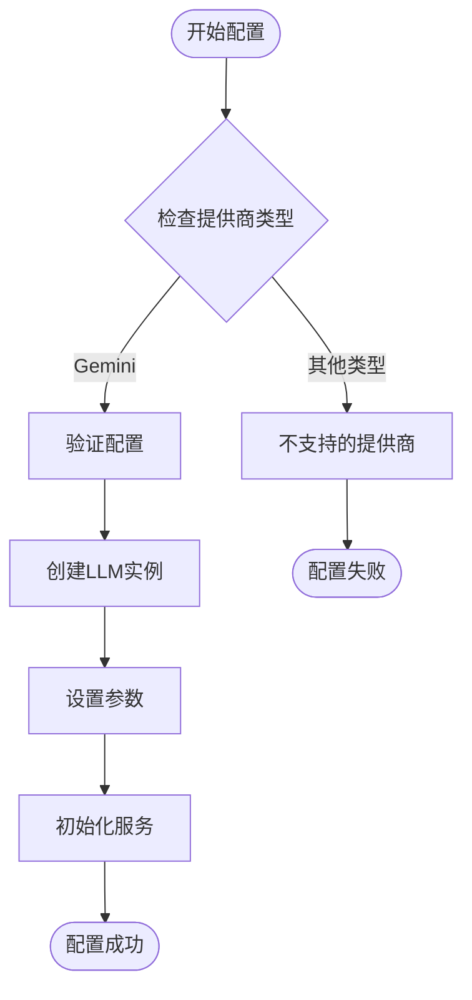

**图表来源**
- [speechToText.ts](file://chrome-extension/src/background/services/speechToText.ts#L17-L42)

### 配置参数详解

| 参数名称 | 范围 | 默认值 | 作用说明 |
|----------|------|--------|----------|
| temperature | 0.0-2.0 | 0.1 | 控制生成文本的创造性程度，值越低越保守 |
| topP | 0.0-1.0 | 0.8 | 核采样参数，控制词汇选择的多样性 |
| model | 字符串 | gemini-2.5-flash | 具体使用的语音识别模型 |
| apiKey | 字符串 | - | 提供商API密钥 |

**章节来源**
- [speechToText.ts](file://chrome-extension/src/background/services/speechToText.ts#L33-L42)
- [types.ts](file://packages/storage/lib/settings/types.ts#L50-L154)

### 多语言模型支持

系统通过配置不同的模型名称来支持多语言识别：

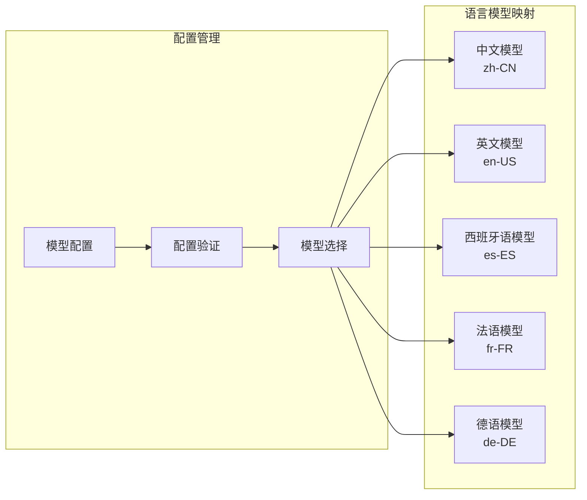

**图表来源**
- [ModelSettings.tsx](file://pages/options/src/components/ModelSettings.tsx#L1646-L1677)

## 麦克风权限管理

### 权限请求流程

系统实现了完整的麦克风权限管理机制，包括权限查询、请求和状态跟踪：

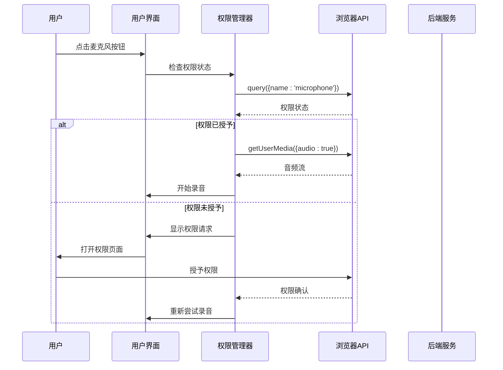

**图表来源**
- [SidePanel.tsx](file://pages/side-panel/src/SidePanel.tsx#L869-L904)
- [permission.js](file://chrome-extension/public/permission/permission.js#L1-L63)

### 权限错误处理

系统针对不同的权限错误类型提供了详细的错误处理机制：

| 错误类型 | 错误代码 | 处理方式 | 用户提示 |
|----------|----------|----------|----------|
| NotAllowedError | 用户拒绝 | 引导用户手动授权 | "请在浏览器设置中授予麦克风权限" |
| NotFoundError | 设备未找到 | 建议检查硬件连接 | "未检测到可用的麦克风设备" |
| AbortError | 用户取消 | 提供重试选项 | "权限请求被用户取消" |
| TypeError | API不支持 | 降级到备用方案 | "当前浏览器不支持此功能" |

**章节来源**
- [SidePanel.tsx](file://pages/side-panel/src/SidePanel.tsx#L981-L999)
- [permission.js](file://chrome-extension/public/permission/permission.js#L34-L63)

### 隐私保护机制

权限管理器实现了严格的隐私保护措施：

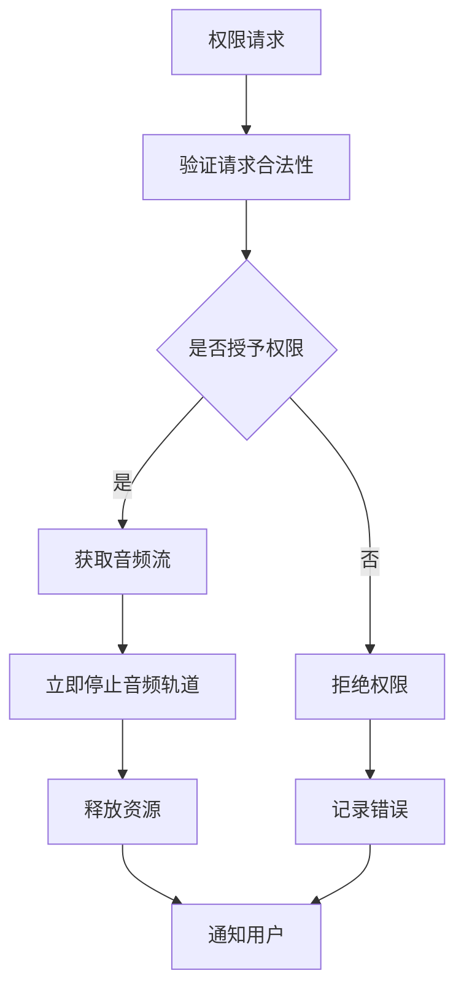

**图表来源**
- [permission.js](file://chrome-extension/public/permission/permission.js#L18-L32)

**章节来源**
- [permission.js](file://chrome-extension/public/permission/permission.js#L1-L63)
- [index.html](file://chrome-extension/public/permission/index.html#L1-L87)

## 音频处理与实时转录

### 实时音频录制流程

系统实现了高效的实时音频录制和处理机制：

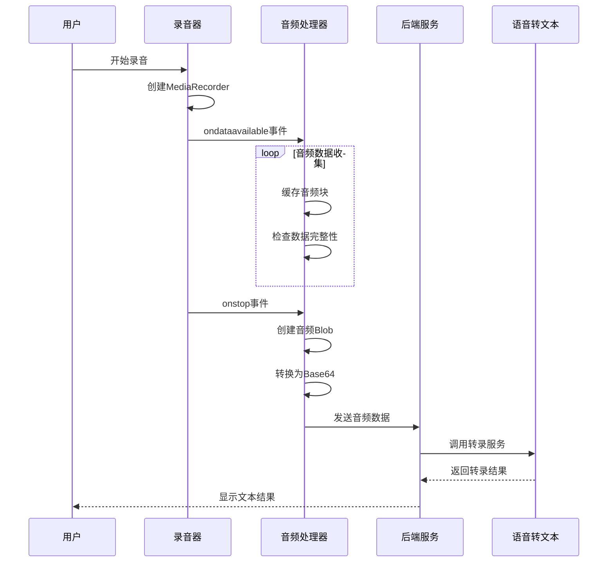

**图表来源**
- [SidePanel.tsx](file://pages/side-panel/src/SidePanel.tsx#L906-L979)

### 音频格式与编码

系统使用WebM格式进行音频编码，支持以下特性：

| 特性 | 设置值 | 说明 |
|------|--------|------|
| 音频格式 | WebM | 现代浏览器原生支持的高效格式 |
| 编码器 | Opus | 高效的音频编解码器 |
| 采样率 | 自适应 | 根据设备能力自动调整 |
| 声道数 | 单声道 | 减少数据量，提高传输效率 |
| 文件大小限制 | 无限制 | 内存管理确保稳定性 |

**章节来源**
- [SidePanel.tsx](file://pages/side-panel/src/SidePanel.tsx#L906-L979)
- [speechToText.ts](file://chrome-extension/src/background/services/speechToText.ts#L44-L75)

### 超时与中断处理

系统实现了智能的超时和中断处理机制：

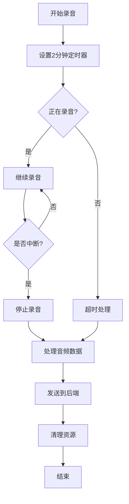

**图表来源**
- [SidePanel.tsx](file://pages/side-panel/src/SidePanel.tsx#L950-L965)

**章节来源**
- [SidePanel.tsx](file://pages/side-panel/src/SidePanel.tsx#L950-L965)

## 性能优化策略

### 实时处理优化

系统采用了多种性能优化策略来确保流畅的用户体验：

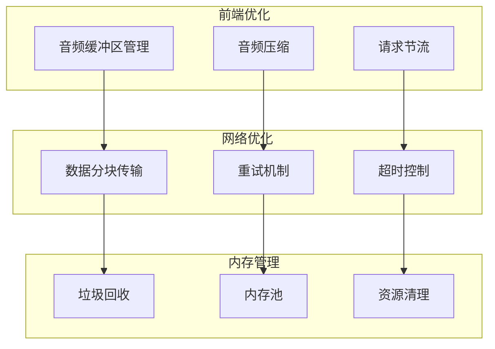

### 缓冲区管理策略

| 缓冲区类型 | 大小限制 | 清理策略 | 用途 |
|------------|----------|----------|------|
| 音频块缓冲区 | 无限增长 | 手动清理 | 实时录音数据缓存 |
| Base64转换缓冲区 | 10MB | 自动清理 | 音频数据编码缓存 |
| 转录结果缓冲区 | 1MB | LRU替换 | 最近转录结果缓存 |

### 并发处理优化

系统实现了智能的并发处理机制：

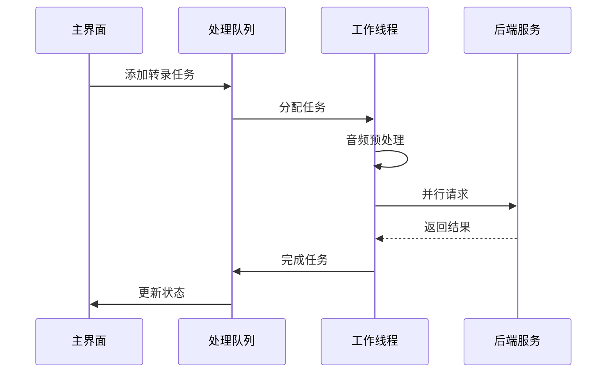

**图表来源**
- [SidePanel.tsx](file://pages/side-panel/src/SidePanel.tsx#L937-L979)

**章节来源**
- [SidePanel.tsx](file://pages/side-panel/src/SidePanel.tsx#L937-L979)

## 多语言支持与隐私保护

### 多语言识别支持

系统通过配置不同的语言模型来支持多语言识别：

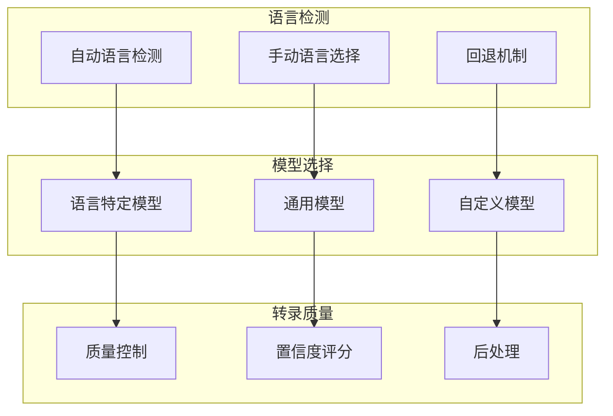

### 隐私保护实现

系统实现了多层次的隐私保护机制：

| 保护层级 | 实现方式 | 技术细节 |
|----------|----------|----------|
| 数据传输 | HTTPS加密 | TLS 1.3协议 |
| 本地处理 | 浏览器API | 不离开用户设备 |
| 权限控制 | 最小权限原则 | 使用后立即释放 |
| 数据删除 | 自动清理 | 会话结束后删除 |
| 访问审计 | 日志记录 | 仅记录必要信息 |

### 离线识别支持

系统支持有限的离线识别功能：

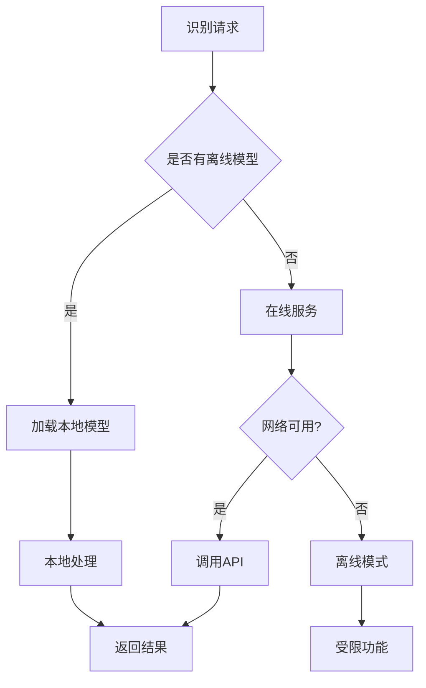

**章节来源**
- [ModelSettings.tsx](file://pages/options/src/components/ModelSettings.tsx#L1636-L1677)

## 故障排除指南

### 常见问题诊断

系统提供了完善的错误诊断和处理机制：

| 问题类型 | 可能原因 | 解决方案 | 预防措施 |
|----------|----------|----------|----------|
| 麦克风访问失败 | 权限被拒绝 | 重新授予权限 | 提前检查权限状态 |
| 转录服务超时 | 网络连接问题 | 检查网络状态 | 实现重试机制 |
| 音频格式不支持 | 浏览器兼容性 | 使用标准格式 | 版本检测 |
| 内存泄漏 | 资源未正确释放 | 强制清理 | 自动资源管理 |

### 错误恢复机制

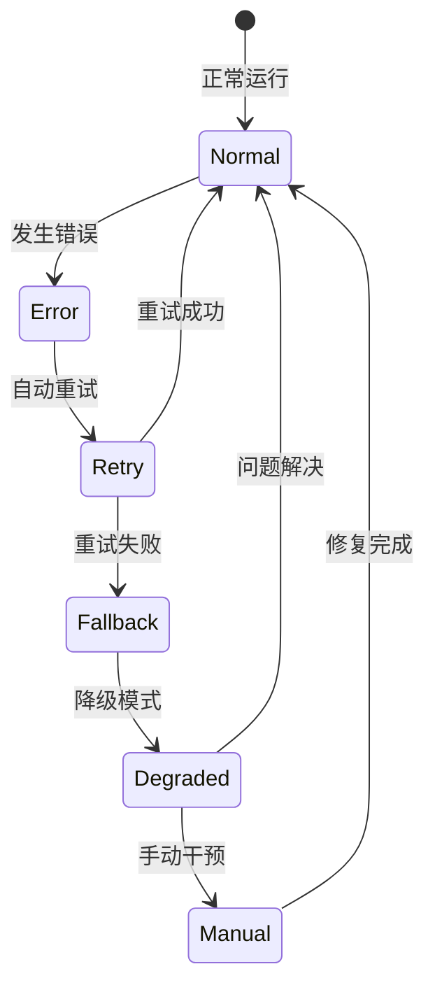

### 性能监控指标

系统监控以下关键性能指标：

| 指标类别 | 监控项目 | 正常范围 | 告警阈值 |
|----------|----------|----------|----------|
| 响应时间 | 转录延迟 | < 2秒 | > 5秒 |
| 成功率 | 识别准确率 | > 95% | < 90% |
| 资源使用 | 内存占用 | < 100MB | > 200MB |
| 连接状态 | 服务可用性 | 100% | < 95% |

**章节来源**
- [SidePanel.tsx](file://pages/side-panel/src/SidePanel.tsx#L937-L979)
- [speechToText.ts](file://chrome-extension/src/background/services/speechToText.ts#L44-L75)

## 总结

NanoBrowser的语音转文本设置模块是一个功能完整、设计精良的语音识别系统。它通过模块化的架构设计，实现了灵活的配置管理、高效的音频处理和严格的安全保护。

### 主要特性总结

1. **灵活的引擎配置**：支持多种语音识别服务提供商，特别是Google Gemini引擎的深度集成
2. **完善的权限管理**：实现了严格的麦克风权限控制和隐私保护机制
3. **高效的实时处理**：采用先进的音频处理技术和性能优化策略
4. **多语言支持**：通过配置化方式支持多种语言的语音识别
5. **健壮的错误处理**：提供了全面的错误诊断和恢复机制

### 技术优势

- **模块化设计**：清晰的组件分离和职责划分
- **性能优化**：多层次的性能优化策略确保流畅体验
- **安全可靠**：严格的隐私保护和数据安全机制
- **易于扩展**：良好的架构设计便于添加新的语音识别服务

该系统为用户提供了高质量的语音转文本体验，同时确保了数据安全和系统稳定性，是现代Web应用中语音识别功能的优秀实现范例。