# 通用设置模块深度解析

<cite>
**本文档中引用的文件**
- [generalSettings.ts](file://packages/storage/lib/settings/generalSettings.ts)
- [GeneralSettings.tsx](file://pages/options/src/components/GeneralSettings.tsx)
- [types.ts](file://packages/storage/lib/settings/types.ts)
- [index.ts](file://packages/storage/lib/settings/index.ts)
- [base.ts](file://packages/storage/lib/base/base.ts)
- [types.ts](file://packages/storage/lib/base/types.ts)
- [enums.ts](file://packages/storage/lib/base/enums.ts)
- [Options.tsx](file://pages/options/src/Options.tsx)
- [firewall.ts](file://packages/storage/lib/settings/firewall.ts)
- [analyticsSettings.ts](file://packages/storage/lib/settings/analyticsSettings.ts)
</cite>

## 目录
1. [概述](#概述)
2. [项目结构分析](#项目结构分析)
3. [核心组件架构](#核心组件架构)
4. [GeneralSettings类实现详解](#generalsearchsettings类实现详解)
5. [存储系统集成机制](#存储系统集成机制)
6. [用户界面集成](#用户界面集成)
7. [配置变更事件处理](#配置变更事件处理)
8. [与其他模块的交互关系](#与其他模块的交互关系)
9. [扩展性设计分析](#扩展性设计分析)
10. [最佳实践与优化建议](#最佳实践与优化建议)

## 概述

通用设置模块是NanoBrowser扩展的核心配置管理组件，负责管理用户界面偏好、行为参数和系统配置。该模块采用现代化的React状态管理模式，结合Chrome扩展的存储API，提供了完整的配置持久化和实时同步能力。

### 主要功能特性

- **多维度配置管理**：涵盖最大步骤数、动作限制、视觉识别、页面加载等待时间等关键参数
- **智能依赖管理**：如启用视觉功能时自动开启高亮显示
- **实时状态同步**：支持跨标签页和组件间的配置同步
- **国际化支持**：完整的多语言界面支持
- **类型安全**：基于TypeScript的强类型定义

## 项目结构分析

通用设置模块在项目中的组织结构体现了清晰的分层架构：

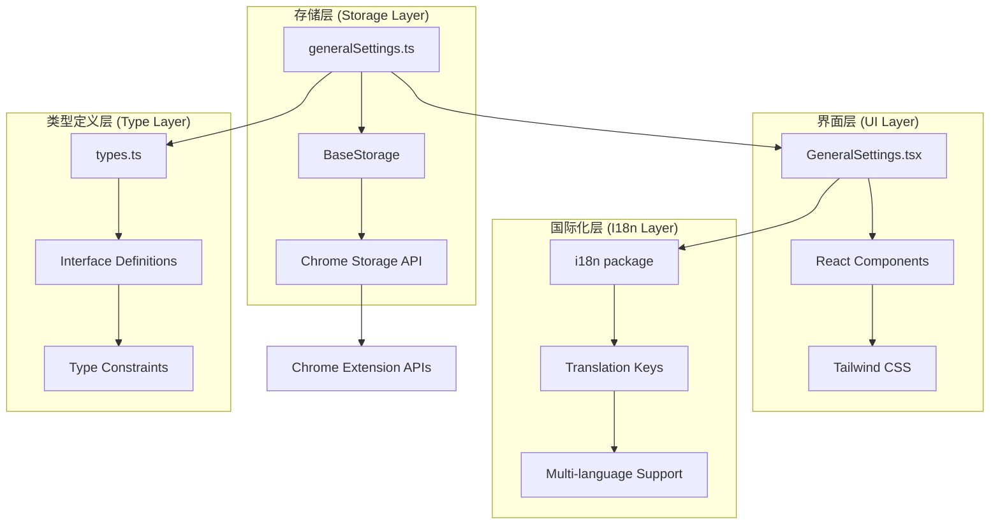

**图表来源**
- [generalSettings.ts](file://packages/storage/lib/settings/generalSettings.ts#L1-L69)
- [GeneralSettings.tsx](file://pages/options/src/components/GeneralSettings.tsx#L1-L236)

**章节来源**
- [generalSettings.ts](file://packages/storage/lib/settings/generalSettings.ts#L1-L69)
- [index.ts](file://packages/storage/lib/settings/index.ts#L1-L8)

## 核心组件架构

### 数据模型设计

通用设置模块的核心数据结构定义了完整的配置参数集合：

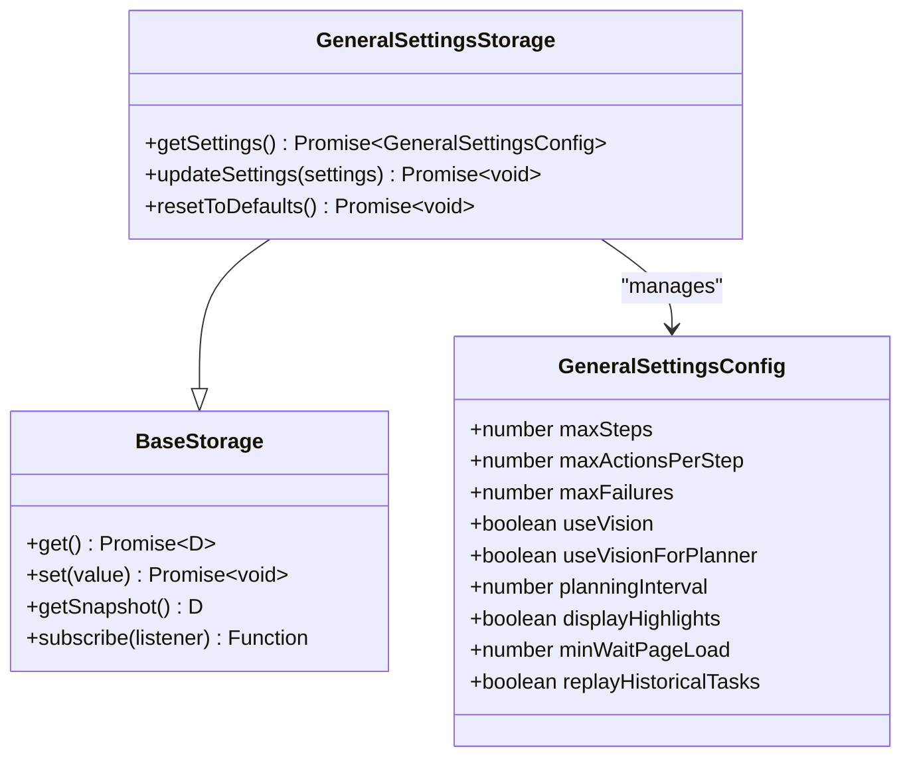

**图表来源**
- [generalSettings.ts](file://packages/storage/lib/settings/generalSettings.ts#L6-L17)
- [generalSettings.ts](file://packages/storage/lib/settings/generalSettings.ts#L20-L24)

### 默认值配置策略

模块采用了精心设计的默认值策略，确保新用户获得良好的初始体验：

| 配置项 | 默认值 | 描述 | 类型约束 |
|--------|--------|------|----------|
| maxSteps | 100 | 每个任务的最大执行步数 | 1-50 |
| maxActionsPerStep | 5 | 每个步骤的最大操作数量 | 1-50 |
| maxFailures | 3 | 连续失败容忍次数 | 1-10 |
| useVision | false | 是否启用视觉识别功能 | 布尔值 |
| useVisionForPlanner | false | 规划器是否使用视觉功能 | 布尔值 |
| planningInterval | 3 | 重新规划频率（步数间隔） | 1-20 |
| displayHighlights | true | 是否显示元素高亮 | 布尔值 |
| minWaitPageLoad | 250 | 页面加载最小等待时间（毫秒） | 250-5000 |
| replayHistoricalTasks | false | 是否重放历史任务 | 布尔值 |

**章节来源**
- [generalSettings.ts](file://packages/storage/lib/settings/generalSettings.ts#L26-L37)

## GeneralSettings类实现详解

### 继承与扩展模式

虽然代码中没有直接看到`BaseSettings`类的定义，但从命名约定和实现模式可以看出，`GeneralSettings`采用了基于接口的组合模式而非传统的继承模式：

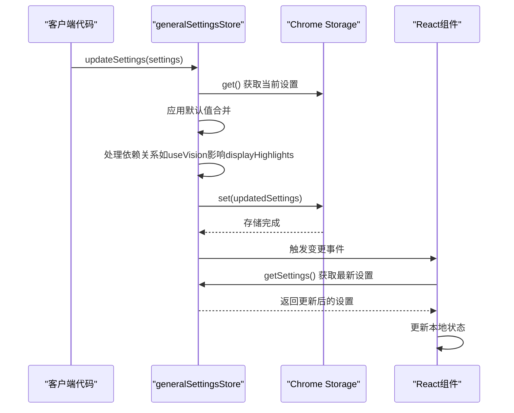

**图表来源**
- [generalSettings.ts](file://packages/storage/lib/settings/generalSettings.ts#L41-L67)
- [GeneralSettings.tsx](file://pages/options/src/components/GeneralSettings.tsx#L18-L32)

### 智能依赖管理

模块实现了复杂的依赖关系管理，确保配置的一致性：

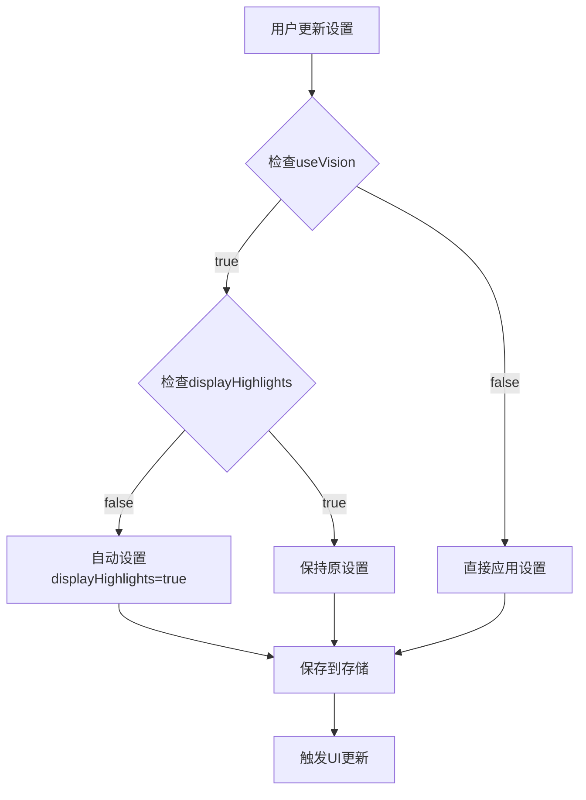

**图表来源**
- [generalSettings.ts](file://packages/storage/lib/settings/generalSettings.ts#L47-L53)

**章节来源**
- [generalSettings.ts](file://packages/storage/lib/settings/generalSettings.ts#L41-L67)

## 存储系统集成机制

### 基础存储抽象层

存储系统采用了高度可配置的抽象层设计，支持多种存储后端：

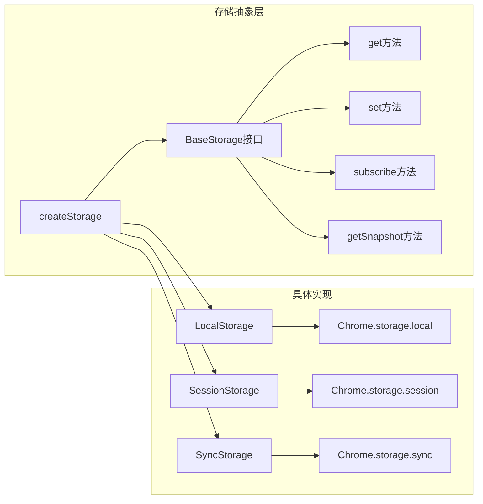

**图表来源**
- [base.ts](file://packages/storage/lib/base/base.ts#L50-L157)
- [types.ts](file://packages/storage/lib/base/types.ts#L4-L11)

### 实时同步机制

模块支持LiveUpdate功能，实现了跨组件的实时配置同步：

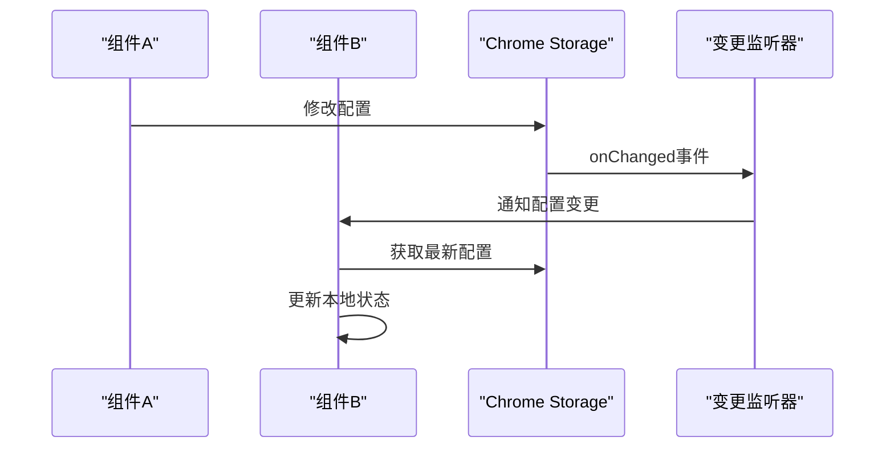

**图表来源**
- [base.ts](file://packages/storage/lib/base/base.ts#L130-L157)

**章节来源**
- [base.ts](file://packages/storage/lib/base/base.ts#L50-L157)
- [enums.ts](file://packages/storage/lib/base/enums.ts#L1-L43)

## 用户界面集成

### React组件架构

通用设置组件采用了现代的React Hooks模式，实现了响应式的状态管理：

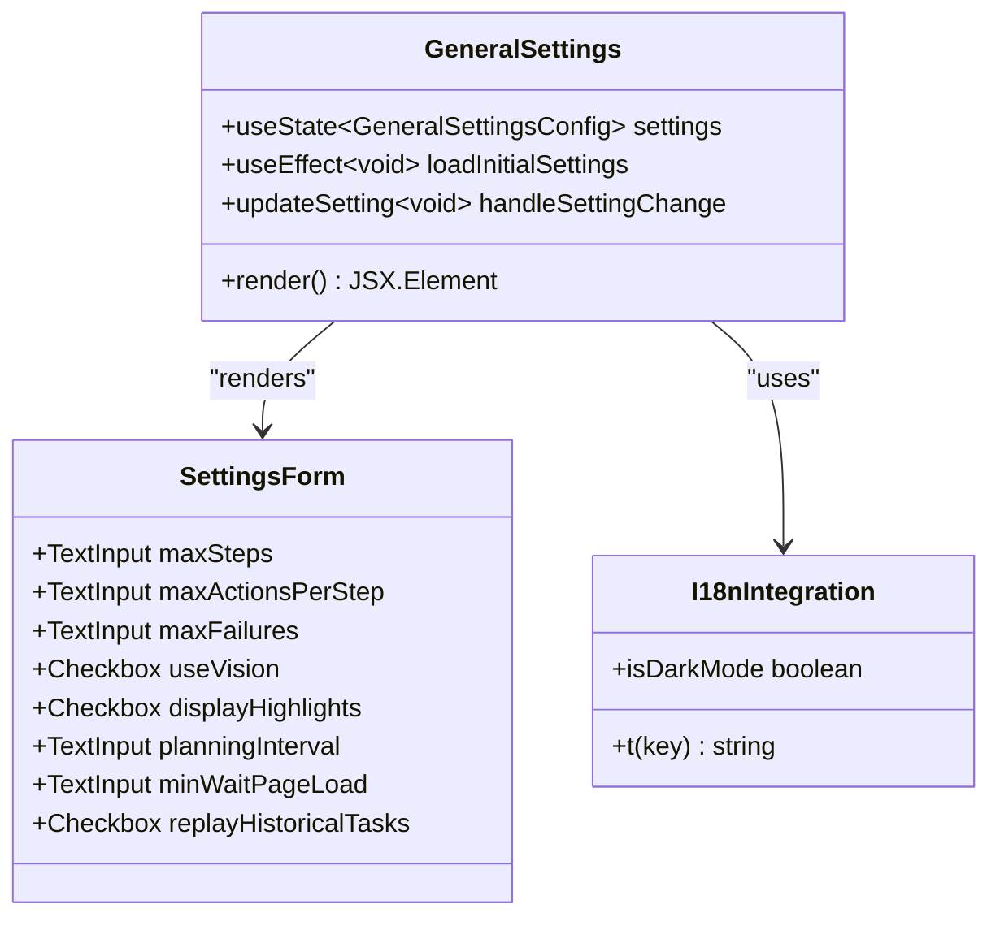

**图表来源**
- [GeneralSettings.tsx](file://pages/options/src/components/GeneralSettings.tsx#L8-L236)

### 状态管理策略

组件实现了乐观更新（Optimistic Updates）模式，提升用户体验：

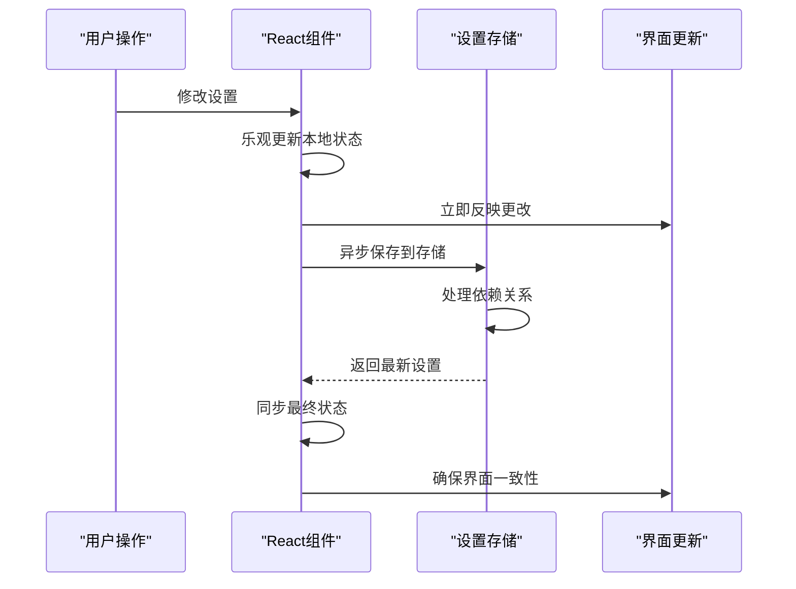

**图表来源**
- [GeneralSettings.tsx](file://pages/options/src/components/GeneralSettings.tsx#L18-L32)

**章节来源**
- [GeneralSettings.tsx](file://pages/options/src/components/GeneralSettings.tsx#L1-L236)

## 配置变更事件处理

### 事件监听机制

存储系统提供了完整的事件监听机制，支持配置变更的实时响应：

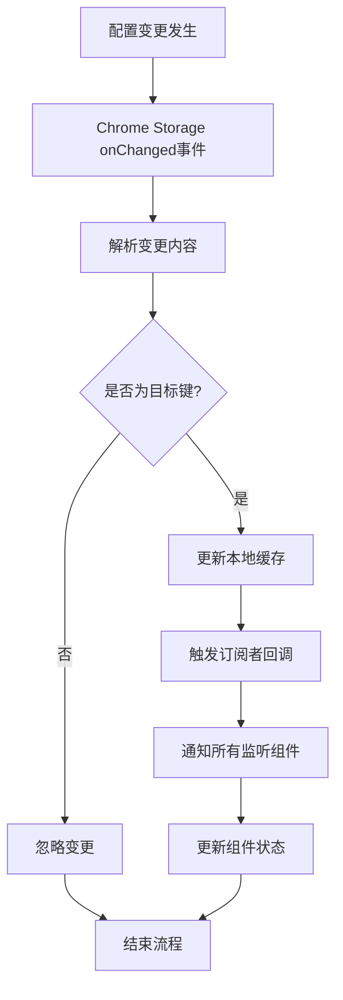

**图表来源**
- [base.ts](file://packages/storage/lib/base/base.ts#L130-L157)

### 错误处理与恢复

系统实现了健壮的错误处理机制：

| 场景 | 处理策略 | 恢复机制 |
|------|----------|----------|
| 存储权限不足 | 抛出明确错误信息 | 提示用户检查manifest.json |
| 网络连接中断 | 使用本地缓存 | 待网络恢复后同步 |
| 数据序列化失败 | 使用默认值回退 | 记录错误日志 |
| 并发写入冲突 | 自动重试机制 | 最终一致性保证 |

**章节来源**
- [base.ts](file://packages/storage/lib/base/base.ts#L40-L50)

## 与其他模块的交互关系

### 与i18n系统的集成

通用设置模块深度集成了国际化系统，支持多语言界面：

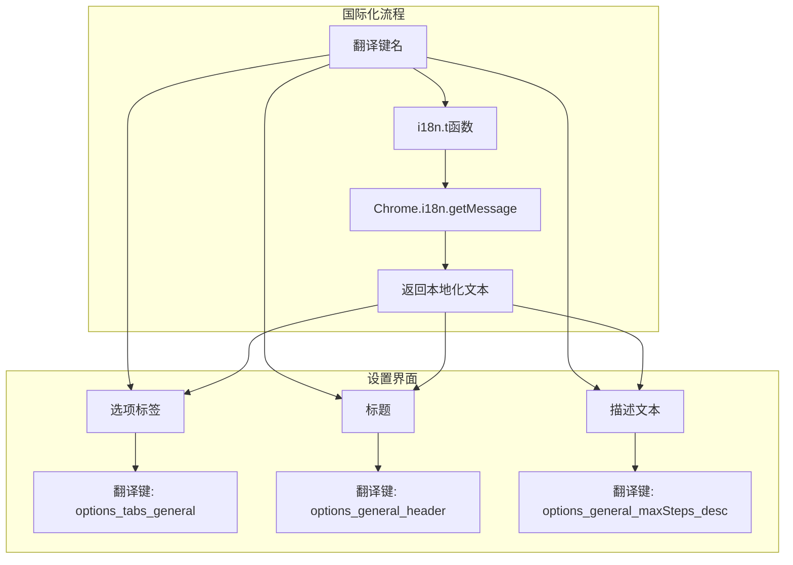

**图表来源**
- [GeneralSettings.tsx](file://pages/options/src/components/GeneralSettings.tsx#L107-L130)

### 与UI系统的协作

模块与UI系统通过统一的设计规范进行协作：

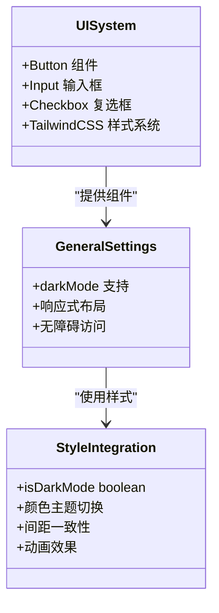

**图表来源**
- [GeneralSettings.tsx](file://pages/options/src/components/GeneralSettings.tsx#L1-L236)

### 功能模块间的依赖关系

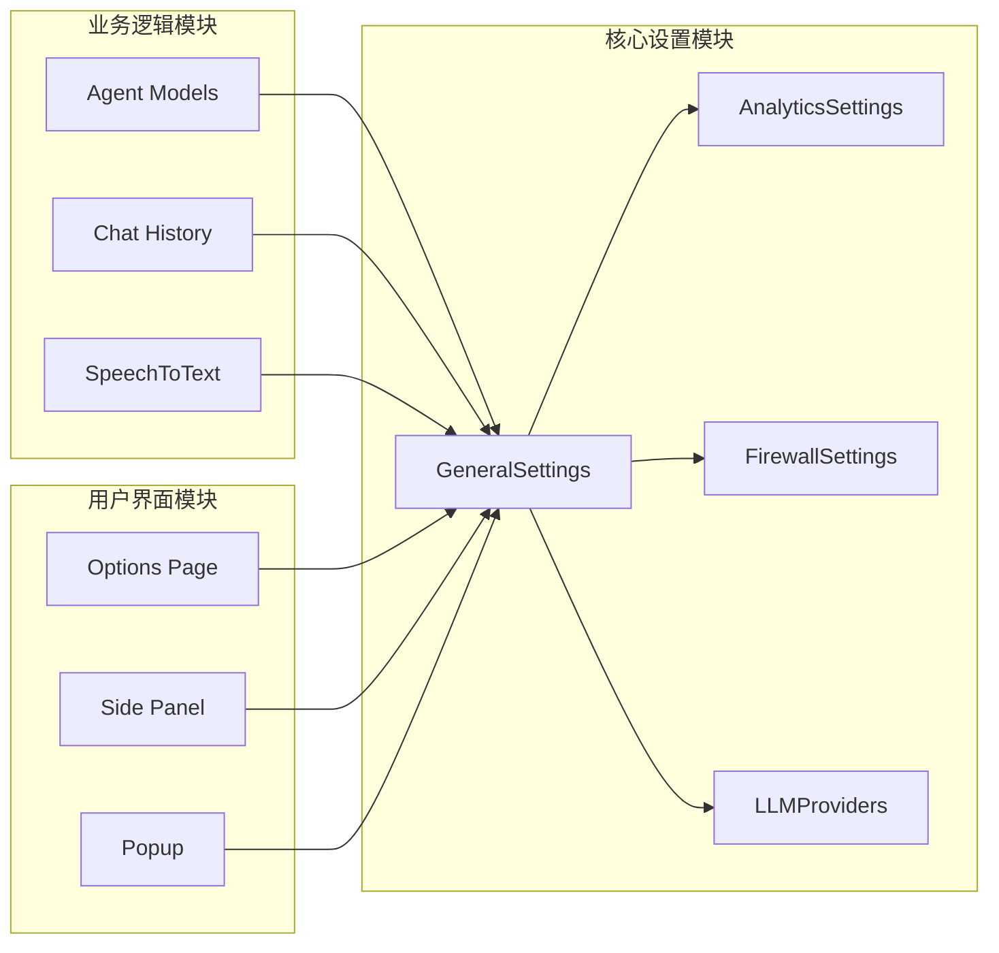

**图表来源**
- [index.ts](file://packages/storage/lib/settings/index.ts#L1-L8)
- [Options.tsx](file://pages/options/src/Options.tsx#L40-L50)

**章节来源**
- [GeneralSettings.tsx](file://pages/options/src/components/GeneralSettings.tsx#L1-L236)
- [Options.tsx](file://pages/options/src/Options.tsx#L1-L101)

## 扩展性设计分析

### 可扩展的配置架构

模块采用了高度可扩展的设计模式，支持轻松添加新的配置项：

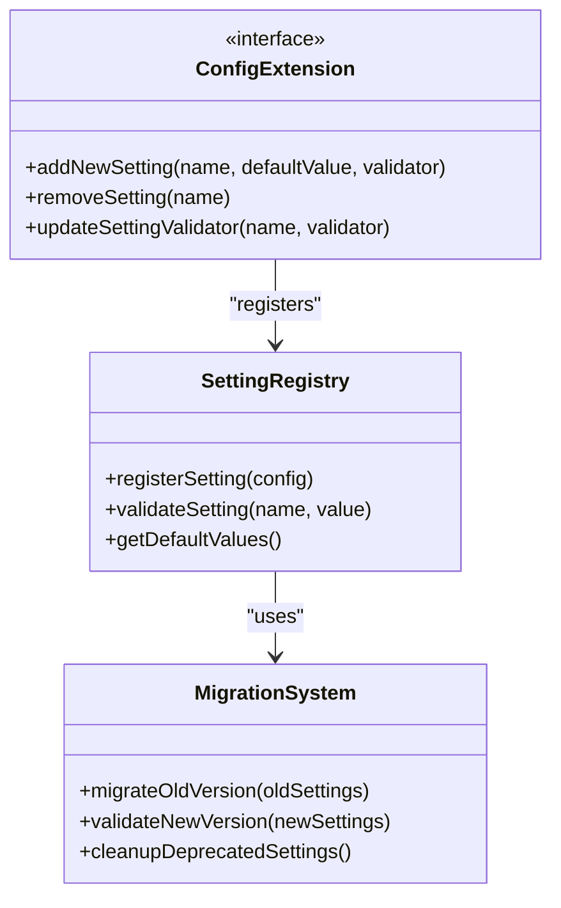

### 新增个性化选项的扩展点

基于现有架构，可以轻松添加以下类型的个性化选项：

| 扩展类型 | 实现方式 | 示例配置项 |
|----------|----------|------------|
| 视觉偏好 | 布尔值或枚举 | 主题模式、字体大小、行距 |
| 性能调优 | 数值范围 | 缓存大小、并发限制、超时设置 |
| 功能开关 | 布尔值 | 自动保存、历史记录、通知 |
| 行为定制 | 复杂对象 | 快捷键绑定、工作流模板 |
| 隐私设置 | 权限控制 | 数据收集、位置共享、相机使用 |

### 插件化架构支持

模块设计支持插件化的配置扩展：

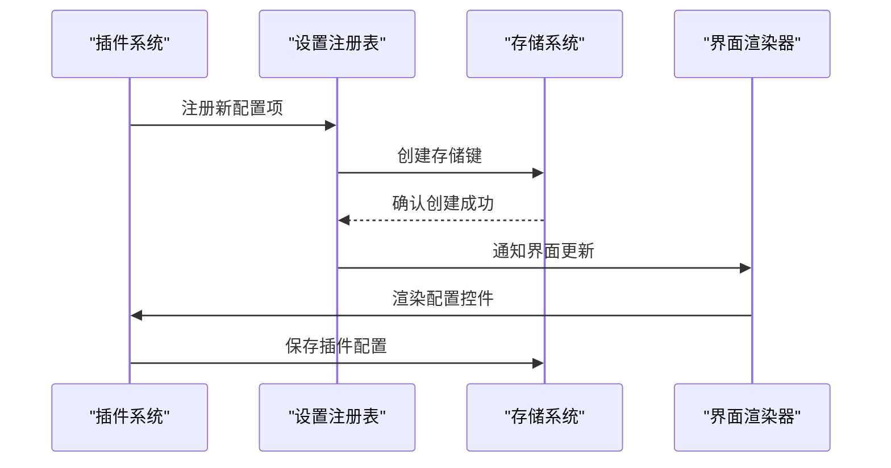

**章节来源**
- [generalSettings.ts](file://packages/storage/lib/settings/generalSettings.ts#L1-L69)
- [firewall.ts](file://packages/storage/lib/settings/firewall.ts#L1-L105)

## 最佳实践与优化建议

### 性能优化策略

1. **懒加载机制**：仅在需要时加载设置数据
2. **防抖处理**：对频繁的设置更新进行防抖
3. **批量更新**：支持一次性更新多个配置项
4. **内存管理**：及时清理不再使用的监听器

### 安全性考虑

1. **输入验证**：严格验证所有用户输入
2. **权限控制**：确保只有授权组件可以修改设置
3. **数据加密**：敏感配置项采用加密存储
4. **审计日志**：记录重要的配置变更操作

### 开发最佳实践

1. **类型安全**：充分利用TypeScript的类型系统
2. **错误边界**：实现完善的错误处理机制
3. **单元测试**：为每个配置项编写测试用例
4. **文档维护**：保持配置文档的及时更新

### 用户体验优化

1. **即时反馈**：提供设置变更的即时视觉反馈
2. **撤销机制**：支持最近设置变更的撤销操作
3. **导入导出**：支持配置的备份和恢复
4. **向导引导**：为复杂设置提供配置向导

这个通用设置模块展现了现代Web扩展开发的最佳实践，通过合理的架构设计、完善的类型系统和丰富的功能特性，为用户提供了一个强大而易用的配置管理平台。其模块化的设计和扩展性架构也为未来的功能增强奠定了坚实的基础。