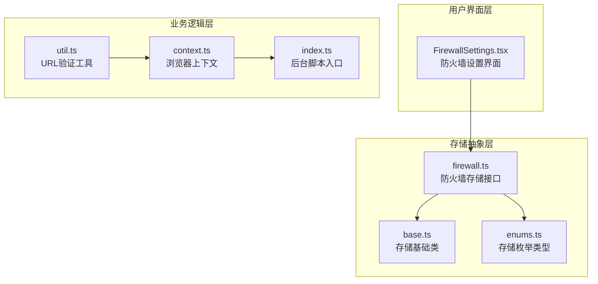
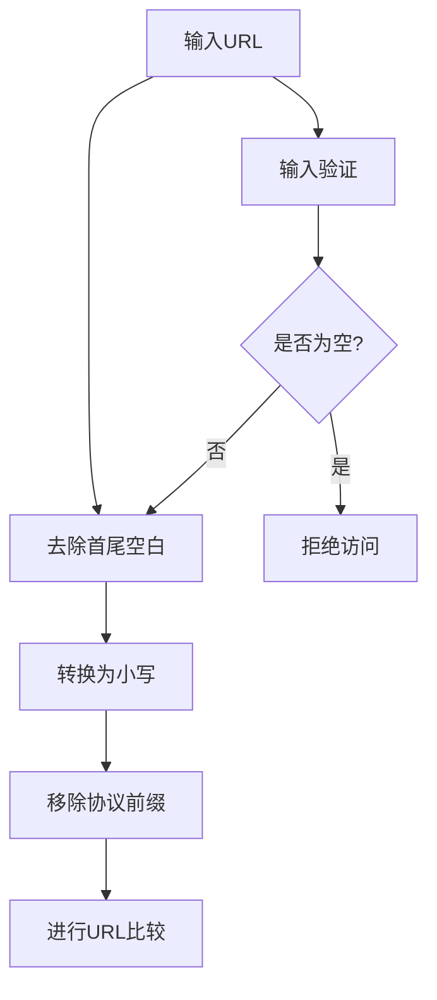
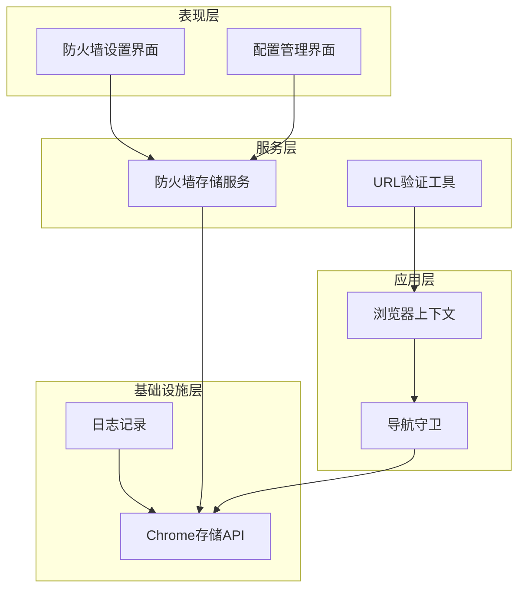
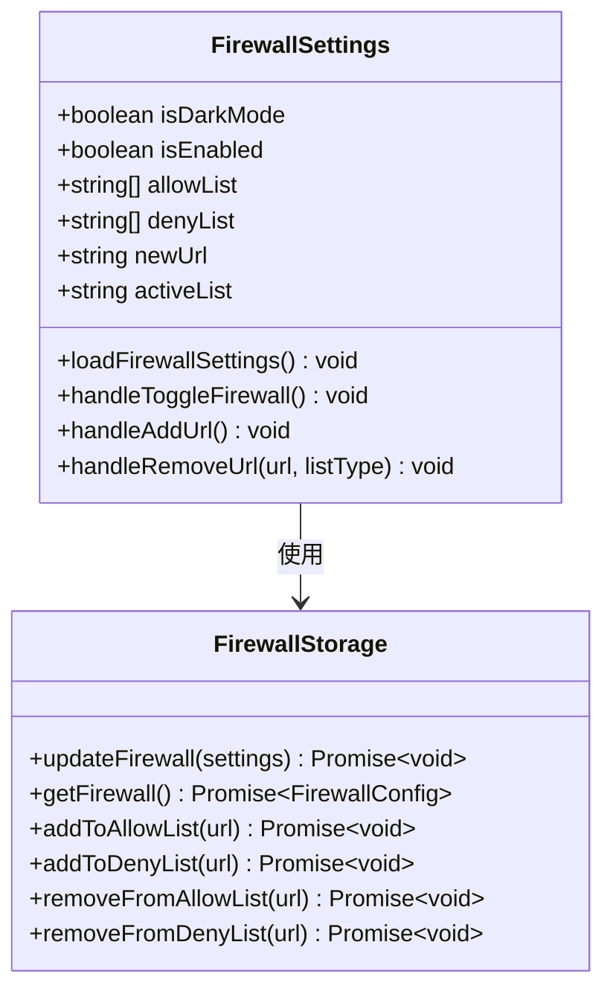
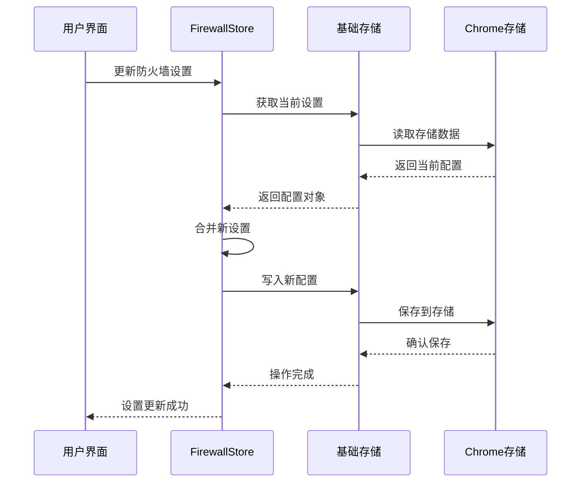
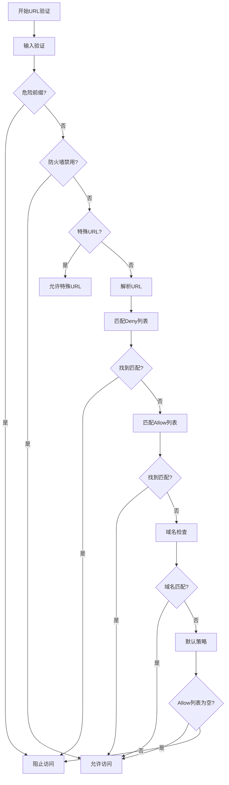
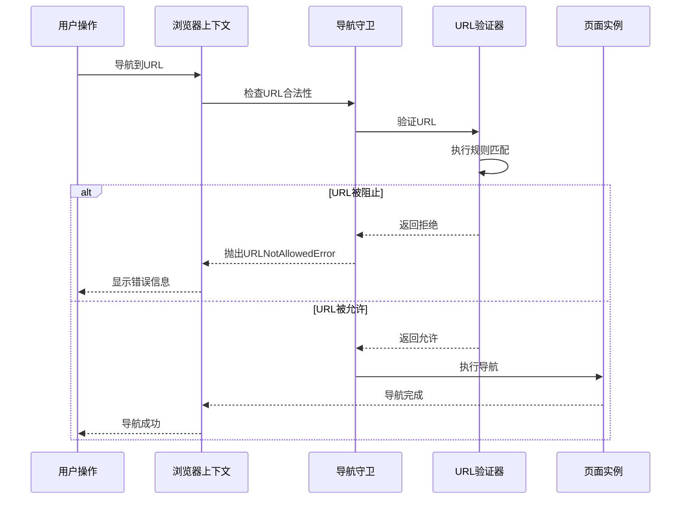
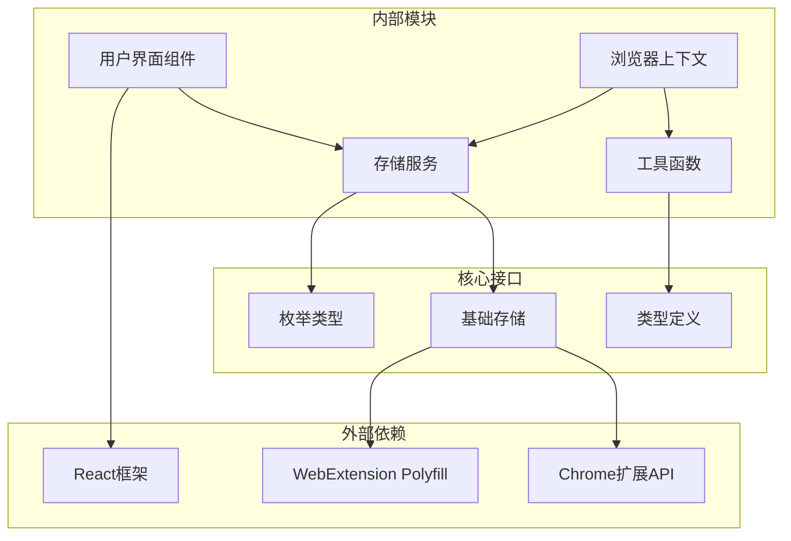

# 防火墙规则模块设计与实现

<cite>
**本文档中引用的文件**
- [FirewallSettings.tsx](file://pages/options/src/components/FirewallSettings.tsx)
- [firewall.ts](file://packages/storage/lib/settings/firewall.ts)
- [base.ts](file://packages/storage/lib/base/base.ts)
- [enums.ts](file://packages/storage/lib/base/enums.ts)
- [types.ts](file://packages/storage/lib/settings/types.ts)
- [util.ts](file://chrome-extension/src/background/browser/util.ts)
- [context.ts](file://chrome-extension/src/background/browser/context.ts)
- [index.ts](file://chrome-extension/src/background/index.ts)
</cite>

## 目录
1. [简介](#简介)
2. [项目结构概览](#项目结构概览)
3. [核心组件分析](#核心组件分析)
4. [架构概览](#架构概览)
5. [详细组件分析](#详细组件分析)
6. [依赖关系分析](#依赖关系分析)
7. [性能考虑](#性能考虑)
8. [故障排除指南](#故障排除指南)
9. [结论](#结论)

## 简介

NanoBrowser的防火墙规则模块是一个全面的网站访问控制系统，提供了细粒度的网站访问控制、敏感操作防护和安全策略执行功能。该模块通过Allow/Deny列表机制、实时URL验证和智能规则匹配引擎，为用户提供了强大的网络安全保护能力。

防火墙模块的核心设计理念是"最小权限原则"：默认情况下允许所有流量，但可以通过配置明确的Allow/Deny列表来精确控制网站访问。这种设计既保证了用户体验的流畅性，又提供了必要的安全防护。

## 项目结构概览

防火墙规则模块在项目中的组织结构体现了清晰的分层架构：

**图表来源**
- [FirewallSettings.tsx](file://pages/options/src/components/FirewallSettings.tsx#L1-L225)
- [firewall.ts](file://packages/storage/lib/settings/firewall.ts#L1-L105)
- [base.ts](file://packages/storage/lib/base/base.ts#L1-L158)

**章节来源**
- [FirewallSettings.tsx](file://pages/options/src/components/FirewallSettings.tsx#L1-L225)
- [firewall.ts](file://packages/storage/lib/settings/firewall.ts#L1-L105)

## 核心组件分析

### FirewallConfig 接口

防火墙配置接口定义了三个核心属性：

| 属性 | 类型 | 描述 | 默认值 |
|------|------|------|--------|
| allowList | string[] | 明确允许访问的URL列表 | [] |
| denyList | string[] | 明确禁止访问的URL列表 | [] |
| enabled | boolean | 防火墙启用状态 | true |

### URL规范化机制

系统实现了智能的URL规范化处理，确保URL比较的一致性和准确性：

**图表来源**
- [firewall.ts](file://packages/storage/lib/settings/firewall.ts#L15-L22)
- [util.ts](file://chrome-extension/src/background/browser/util.ts#L10-L25)

### 规则匹配引擎

URL验证采用多阶段匹配算法，优先级从高到低依次为：

1. **危险前缀检查**：严格阻止恶意或危险的URL前缀
2. **禁用状态检查**：当防火墙关闭时的默认行为
3. **完全匹配检查**：精确的URL字符串匹配
4. **域名匹配检查**：基于域名的宽松匹配

**章节来源**
- [firewall.ts](file://packages/storage/lib/settings/firewall.ts#L1-L105)
- [util.ts](file://chrome-extension/src/background/browser/util.ts#L1-L106)

## 架构概览

防火墙模块采用了分层架构设计，确保了良好的可维护性和扩展性：

**图表来源**
- [FirewallSettings.tsx](file://pages/options/src/components/FirewallSettings.tsx#L1-L50)
- [firewall.ts](file://packages/storage/lib/settings/firewall.ts#L45-L105)
- [context.ts](file://chrome-extension/src/background/browser/context.ts#L1-L50)

## 详细组件分析

### 用户界面组件

FirewallSettings组件提供了直观的防火墙配置界面：

**图表来源**
- [FirewallSettings.tsx](file://pages/options/src/components/FirewallSettings.tsx#L8-L25)
- [firewall.ts](file://packages/storage/lib/settings/firewall.ts#L25-L35)

#### 功能特性

1. **双列表管理**：支持同时管理Allow和Deny列表
2. **实时同步**：使用Chrome存储的实时更新功能
3. **URL标准化**：自动处理URL格式化和规范化
4. **状态持久化**：配置变更立即保存到本地存储

### 存储抽象层

防火墙存储服务提供了类型安全的数据访问接口：

**图表来源**
- [firewall.ts](file://packages/storage/lib/settings/firewall.ts#L45-L84)
- [base.ts](file://packages/storage/lib/base/base.ts#L80-L120)

#### 存储配置特性

- **存储类型**：使用Local存储，确保数据持久化
- **实时更新**：启用liveUpdate，配置变更即时生效
- **序列化支持**：支持复杂数据类型的序列化和反序列化
- **错误处理**：完善的异常处理和回退机制

### URL验证引擎

URL验证工具提供了高性能的访问控制逻辑：

**图表来源**
- [util.ts](file://chrome-extension/src/background/browser/util.ts#L6-L105)

#### 安全特性

1. **危险URL拦截**：严格阻止恶意前缀（如javascript:、data:等）
2. **协议无关匹配**：支持HTTP和HTTPS协议的统一处理
3. **域名层次匹配**：支持子域名的递归匹配
4. **异常容错**：无效URL格式自动拒绝

### 浏览器上下文集成

浏览器上下文负责将防火墙规则应用到实际的浏览操作中：

**图表来源**
- [context.ts](file://chrome-extension/src/background/browser/context.ts#L200-L250)
- [util.ts](file://chrome-extension/src/background/browser/util.ts#L6-L50)

**章节来源**
- [FirewallSettings.tsx](file://pages/options/src/components/FirewallSettings.tsx#L1-L225)
- [firewall.ts](file://packages/storage/lib/settings/firewall.ts#L1-L105)
- [util.ts](file://chrome-extension/src/background/browser/util.ts#L1-L106)
- [context.ts](file://chrome-extension/src/background/browser/context.ts#L1-L361)

## 依赖关系分析

防火墙模块的依赖关系体现了清晰的分层架构：

**图表来源**
- [FirewallSettings.tsx](file://pages/options/src/components/FirewallSettings.tsx#L1-L10)
- [firewall.ts](file://packages/storage/lib/settings/firewall.ts#L1-L10)
- [base.ts](file://packages/storage/lib/base/base.ts#L1-L20)

### 关键依赖说明

1. **React生态**：提供声明式UI和状态管理
2. **Chrome扩展API**：访问浏览器存储和标签页管理
3. **WebExtension Polyfill**：跨浏览器兼容性支持
4. **类型系统**：确保代码的类型安全性和可维护性

**章节来源**
- [FirewallSettings.tsx](file://pages/options/src/components/FirewallSettings.tsx#L1-L10)
- [firewall.ts](file://packages/storage/lib/settings/firewall.ts#L1-L10)
- [base.ts](file://packages/storage/lib/base/base.ts#L1-L20)

## 性能考虑

### 实时更新优化

防火墙模块采用了多种性能优化策略：

1. **缓存机制**：配置变更后立即更新内存缓存
2. **批量操作**：支持批量添加/删除URL操作
3. **异步处理**：所有I/O操作采用异步模式
4. **懒加载**：仅在需要时加载配置数据

### 内存管理

- **弱引用**：避免循环引用导致的内存泄漏
- **及时清理**：页面切换时自动清理相关资源
- **垃圾回收友好**：使用简单的数据结构减少GC压力

### 网络性能

- **本地验证**：URL验证在客户端完成，无需网络请求
- **快速匹配**：使用高效的字符串匹配算法
- **预编译规则**：规则匹配过程无需额外计算

## 故障排除指南

### 常见问题及解决方案

#### 配置不生效

**症状**：修改防火墙设置后，访问控制仍然无效

**原因分析**：
1. 配置未正确保存到Chrome存储
2. 浏览器上下文未正确加载最新配置
3. 缓存问题导致配置延迟更新

**解决方案**：
1. 检查Chrome存储权限配置
2. 重启浏览器扩展以刷新配置
3. 清除浏览器缓存重新加载

#### URL匹配失败

**症状**：预期应该被阻止的URL仍然可以访问

**原因分析**：
1. URL格式不一致（大小写、协议等）
2. 规则优先级设置错误
3. 域名匹配范围过宽

**解决方案**：
1. 使用URL规范化功能统一格式
2. 调整Allow/Deny列表的优先级
3. 缩小域名匹配范围

#### 性能问题

**症状**：浏览器响应变慢，特别是导航操作

**原因分析**：
1. 规则列表过大导致匹配时间增加
2. 频繁的配置变更触发大量重计算
3. 存储访问过于频繁

**解决方案**：
1. 限制单个列表中的URL数量
2. 批量处理配置变更
3. 优化存储访问频率

**章节来源**
- [firewall.ts](file://packages/storage/lib/settings/firewall.ts#L45-L105)
- [util.ts](file://chrome-extension/src/background/browser/util.ts#L1-L106)
- [context.ts](file://chrome-extension/src/background/browser/context.ts#L1-L361)

## 结论

NanoBrowser的防火墙规则模块展现了现代Web扩展开发的最佳实践。通过精心设计的分层架构、智能的URL验证算法和灵活的配置管理，该模块为用户提供了强大而易用的安全保护功能。

### 主要优势

1. **安全性**：多层次的URL验证确保了访问控制的有效性
2. **易用性**：直观的用户界面和智能的配置管理
3. **性能**：高效的匹配算法和优化的存储访问
4. **可扩展性**：模块化的架构便于功能扩展和维护

### 未来发展方向

1. **通配符支持**：扩展规则匹配能力
2. **正则表达式**：支持更复杂的URL匹配模式
3. **集中管理**：企业环境下的配置同步功能
4. **审计日志**：详细的访问控制审计记录

该防火墙模块不仅满足了当前的安全需求，还为未来的功能扩展奠定了坚实的基础，是Web扩展安全防护领域的优秀实现。