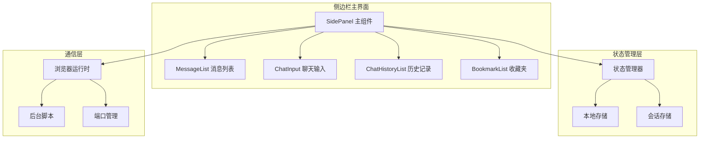
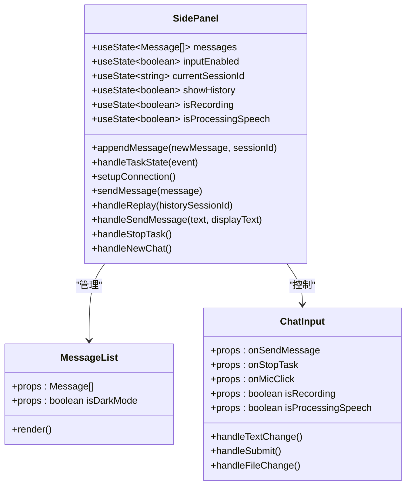
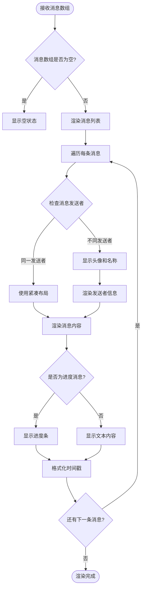
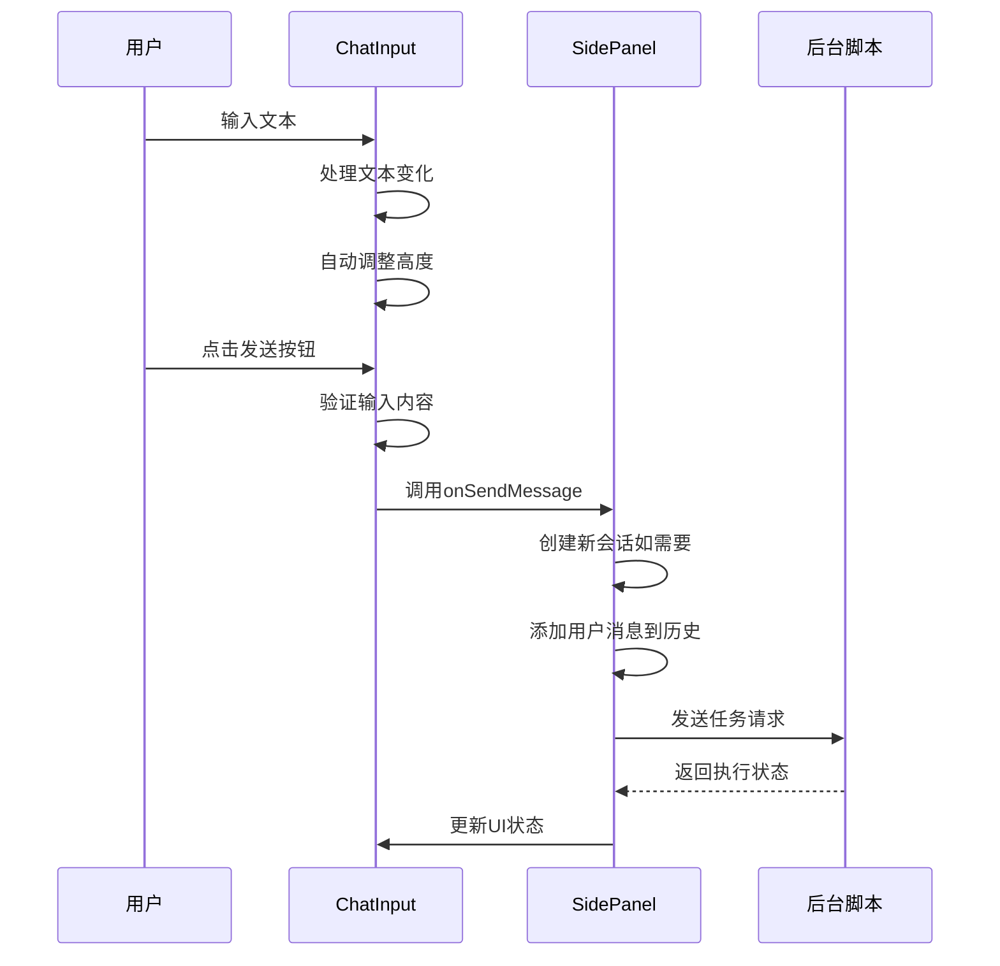
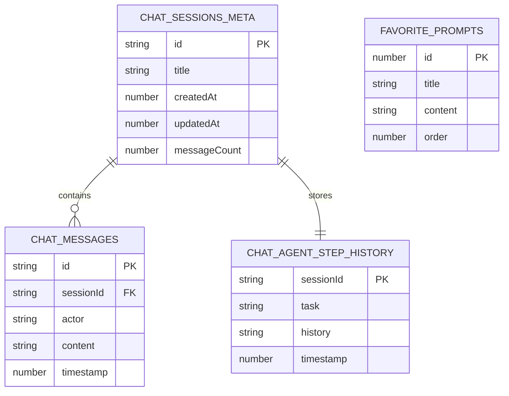
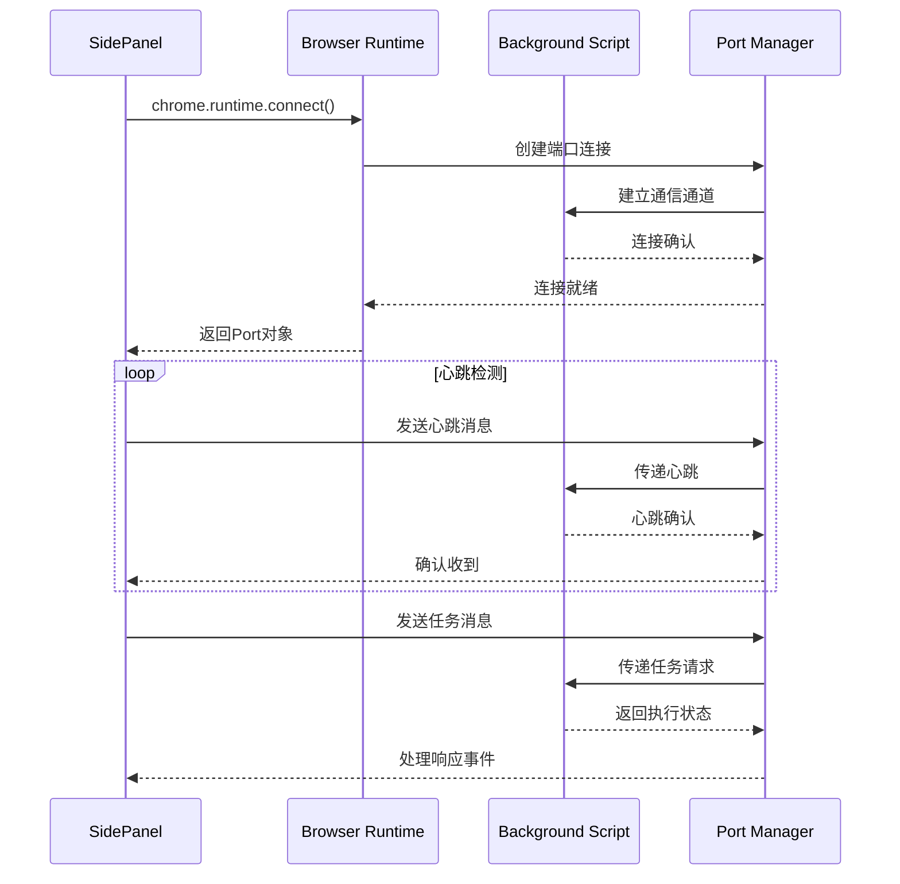
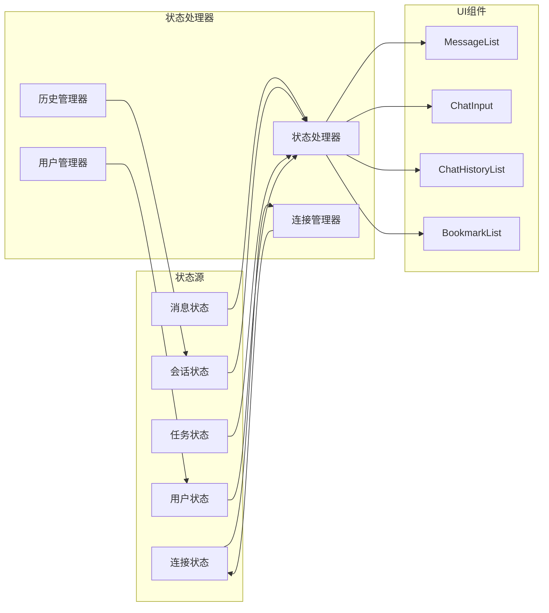
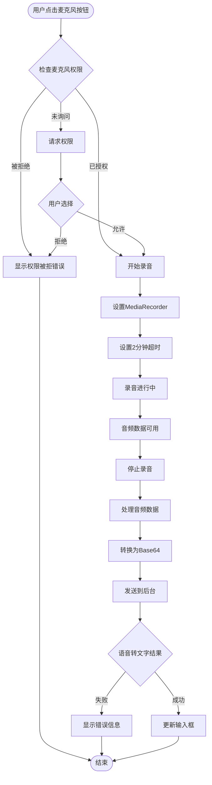

# nanobrowser侧边栏实现详细文档

<cite>
**本文档中引用的文件**
- [SidePanel.tsx](file://pages/side-panel/src/SidePanel.tsx)
- [MessageList.tsx](file://pages/side-panel/src/components/MessageList.tsx)
- [ChatInput.tsx](file://pages/side-panel/src/components/ChatInput.tsx)
- [ChatHistoryList.tsx](file://pages/side-panel/src/components/ChatHistoryList.tsx)
- [BookmarkList.tsx](file://pages/side-panel/src/components/BookmarkList.tsx)
- [message.ts](file://pages/side-panel/src/types/message.ts)
- [event.ts](file://pages/side-panel/src/types/event.ts)
- [utils.ts](file://pages/side-panel/src/utils.ts)
- [SidePanel.css](file://pages/side-panel/src/SidePanel.css)
- [history.ts](file://packages/storage/lib/chat/history.ts)
- [types.ts](file://packages/storage/lib/chat/types.ts)
</cite>

## 目录
1. [项目概述](#项目概述)
2. [整体架构](#整体架构)
3. [核心组件分析](#核心组件分析)
4. [消息系统](#消息系统)
5. [用户输入处理](#用户输入处理)
6. [历史会话管理](#历史会话管理)
7. [后台通信机制](#后台通信机制)
8. [状态管理系统](#状态管理系统)
9. [语音输入支持](#语音输入支持)
10. [错误处理与用户体验](#错误处理与用户体验)
11. [性能优化](#性能优化)
12. [总结](#总结)

## 项目概述

nanobrowser侧边栏是一个功能丰富的Chrome扩展程序界面，作为用户与AI代理交互的主要窗口。它提供了聊天消息列表、用户输入框、任务状态显示和语音输入支持等核心功能，同时具备历史会话管理和状态同步能力。

## 整体架构

侧边栏采用React组件架构，主要由以下层次组成：



**图表来源**
- [SidePanel.tsx](file://pages/side-panel/src/SidePanel.tsx#L1-L50)
- [MessageList.tsx](file://pages/side-panel/src/components/MessageList.tsx#L1-L20)
- [ChatInput.tsx](file://pages/side-panel/src/components/ChatInput.tsx#L1-L30)

## 核心组件分析

### SidePanel 主组件

SidePanel是整个侧边栏的核心控制器，负责协调各个子组件的工作。它管理着复杂的状态逻辑，包括：

- **消息状态管理**：维护聊天消息数组和当前会话状态
- **任务执行控制**：处理任务开始、暂停、取消等生命周期
- **会话管理**：创建、加载、删除和重放历史会话
- **语音输入处理**：管理麦克风权限和音频录制流程
- **连接管理**：维护与后台脚本的通信连接



**图表来源**
- [SidePanel.tsx](file://pages/side-panel/src/SidePanel.tsx#L25-L100)
- [MessageList.tsx](file://pages/side-panel/src/components/MessageList.tsx#L8-L25)
- [ChatInput.tsx](file://pages/side-panel/src/components/ChatInput.tsx#L15-L35)

**章节来源**
- [SidePanel.tsx](file://pages/side-panel/src/SidePanel.tsx#L1-L200)

### MessageList 组件

MessageList负责渲染聊天界面中的所有消息，支持多种消息类型的显示：

- **智能体消息**：包括Planner、Navigator、Validator等角色的消息
- **用户消息**：用户的输入内容
- **系统消息**：系统状态和错误信息
- **进度指示**：显示任务执行进度的特殊消息

该组件实现了智能的布局算法，根据消息发送者自动调整显示样式：



**图表来源**
- [MessageList.tsx](file://pages/side-panel/src/components/MessageList.tsx#L10-L50)

**章节来源**
- [MessageList.tsx](file://pages/side-panel/src/components/MessageList.tsx#L1-L122)

## 消息系统

### 消息类型定义

消息系统基于Actor枚举定义了不同的消息发送者：

| Actor类型 | 颜色标识 | 图标 | 功能描述 |
|-----------|----------|------|----------|
| USER | 绿色 (#4CAF50) | 用户图标 | 用户输入的消息 |
| SYSTEM | 蓝色 (#2196F3) | 系统图标 | 系统状态和错误信息 |
| PLANNER | 橙色 (#FF9800) | 规划器图标 | 任务规划和策略制定 |
| NAVIGATOR | 浅蓝 (#40A9FF) | 导航器图标 | 网页导航和操作执行 |
| VALIDATOR | 粉红 (#EC407A) | 验证器图标 | 结果验证和质量控制 |

### 消息渲染机制

MessageList组件实现了高效的渲染机制：

1. **记忆化优化**：使用React.memo防止不必要的重新渲染
2. **条件渲染**：根据消息类型和上下文动态调整显示内容
3. **时间格式化**：智能的时间戳显示，区分今天、昨天和其他日期
4. **进度指示**：特殊处理"Showing progress..."消息，显示动画进度条

**章节来源**
- [message.ts](file://pages/side-panel/src/types/message.ts#L1-L38)
- [MessageList.tsx](file://pages/side-panel/src/components/MessageList.tsx#L50-L122)

## 用户输入处理

### ChatInput 组件功能

ChatInput是用户输入的主要接口，支持多种输入方式：



**图表来源**
- [ChatInput.tsx](file://pages/side-panel/src/components/ChatInput.tsx#L50-L100)
- [SidePanel.tsx](file://pages/side-panel/src/SidePanel.tsx#L600-L700)

### 文件附件支持

ChatInput支持文件附件功能，允许用户上传文本文件：

- **支持格式**：.txt, .md, .markdown, .json, .csv, .log, .xml, .yaml, .yml
- **大小限制**：最大1MB
- **安全处理**：文件内容经过标签标记，由后台服务进行安全过滤

### 键盘快捷键支持

- **Enter键**：发送消息（Shift+Enter换行）
- **Tab键**：焦点导航
- **Esc键**：取消操作

**章节来源**
- [ChatInput.tsx](file://pages/side-panel/src/components/ChatInput.tsx#L1-L333)

## 历史会话管理

### 会话数据结构

历史会话管理基于分层的数据存储架构：



**图表来源**
- [types.ts](file://packages/storage/lib/chat/types.ts#L15-L45)
- [history.ts](file://packages/storage/lib/chat/history.ts#L15-L35)

### 会话操作功能

| 功能 | 描述 | 实现位置 |
|------|------|----------|
| 创建会话 | 新建聊天会话，自动生成唯一ID | [SidePanel.tsx](file://pages/side-panel/src/SidePanel.tsx#L100-L150) |
| 加载会话 | 从存储中恢复历史会话 | [SidePanel.tsx](file://pages/side-panel/src/SidePanel.tsx#L750-L800) |
| 删除会话 | 彻底删除指定会话及其所有消息 | [SidePanel.tsx](file://pages/side-panel/src/SidePanel.tsx#L800-L850) |
| 重放会话 | 重新执行历史任务 | [SidePanel.tsx](file://pages/side-panel/src/SidePanel.tsx#L400-L500) |
| 书签收藏 | 将会话保存为快速访问的提示 | [SidePanel.tsx](file://pages/side-panel/src/SidePanel.tsx#L850-L900) |

### 会话重放机制

会话重放功能允许用户重新执行历史任务：

1. **历史检查**：验证目标会话是否存在且包含有效任务
2. **新会话创建**：为重放任务创建独立的会话
3. **任务重建**：从历史数据中重建原始任务参数
4. **执行控制**：通过后台脚本重新启动任务执行

**章节来源**
- [SidePanel.tsx](file://pages/side-panel/src/SidePanel.tsx#L350-L500)
- [ChatHistoryList.tsx](file://pages/side-panel/src/components/ChatHistoryList.tsx#L1-L105)

## 后台通信机制

### 连接建立

SidePanel通过chrome.runtime.connect建立与后台脚本的持久连接：



**图表来源**
- [SidePanel.tsx](file://pages/side-panel/src/SidePanel.tsx#L250-L350)

### 事件处理系统

通信系统基于事件驱动架构，支持多种事件类型：

| 事件类型 | 描述 | 处理函数 |
|----------|------|----------|
| EXECUTION | 执行状态变更事件 | handleTaskState |
| ERROR | 错误消息事件 | appendMessage |
| SPEECH_TO_TEXT_RESULT | 语音转文字结果 | setInputTextRef |
| SPEECH_TO_TEXT_ERROR | 语音转文字错误 | appendMessage |
| HEARTBEAT_ACK | 心跳确认 | 日志记录 |

### 消息序列化

所有通信消息都遵循统一的格式规范，确保前后端的一致性：

```typescript
// 示例消息格式
{
  type: 'new_task' | 'follow_up_task' | 'cancel_task' | 'replay',
  taskId: string,
  tabId: number,
  task: string,
  // 其他特定字段...
}
```

**章节来源**
- [SidePanel.tsx](file://pages/side-panel/src/SidePanel.tsx#L250-L400)
- [event.ts](file://pages/side-panel/src/types/event.ts#L1-L73)

## 状态管理系统

### 状态架构设计

SidePanel采用集中式状态管理模式，通过React Hooks实现：



**图表来源**
- [SidePanel.tsx](file://pages/side-panel/src/SidePanel.tsx#L40-L80)

### 状态同步机制

1. **实时更新**：使用useEffect监听状态变化，自动触发UI更新
2. **引用同步**：通过ref保持关键状态的引用，避免闭包陷阱
3. **防抖处理**：对频繁的状态更新进行节流处理
4. **错误恢复**：状态异常时的自动恢复机制

### 数据持久化

状态数据通过Chrome存储API进行持久化：

- **本地存储**：会话元数据和配置信息
- **消息存储**：聊天消息内容
- **历史存储**：任务执行历史

**章节来源**
- [SidePanel.tsx](file://pages/side-panel/src/SidePanel.tsx#L150-L250)

## 语音输入支持

### 麦克风权限管理

语音输入功能实现了完整的权限管理流程：



**图表来源**
- [SidePanel.tsx](file://pages/side-panel/src/SidePanel.tsx#L850-L1000)

### 语音处理流程

1. **权限检查**：验证麦克风访问权限
2. **音频捕获**：使用MediaDevices API获取音频流
3. **实时处理**：通过MediaRecorder API捕获音频数据
4. **超时控制**：设置2分钟最大录音时长
5. **格式转换**：将音频数据转换为Base64格式
6. **异步传输**：通过WebSocket发送到后台进行语音识别

### 错误处理

语音输入功能包含完善的错误处理机制：

- **权限错误**：引导用户手动授予权限
- **设备错误**：检测麦克风设备可用性
- **网络错误**：处理语音识别服务连接问题
- **超时处理**：自动停止长时间录音

**章节来源**
- [SidePanel.tsx](file://pages/side-panel/src/SidePanel.tsx#L850-L1050)

## 错误处理与用户体验

### 错误分类体系

系统实现了分层的错误处理机制：

| 错误级别 | 处理策略 | 用户反馈 |
|----------|----------|----------|
| 系统级错误 | 自动重试 | 静默记录 |
| 通信错误 | 连接重建 | 显示重连提示 |
| 业务错误 | 用户指导 | 明确错误信息 |
| 权限错误 | 引导解决 | 操作指引 |

### 用户体验优化

1. **加载状态**：复杂的操作显示加载指示器
2. **进度反馈**：任务执行过程中的实时状态更新
3. **撤销机制**：提供操作撤销功能
4. **键盘导航**：完整的键盘操作支持
5. **无障碍设计**：符合WCAG标准的可访问性

### 性能监控

系统内置性能监控机制：

- **渲染性能**：监控组件渲染时间和频率
- **内存使用**：跟踪内存占用情况
- **网络延迟**：测量通信延迟
- **错误率统计**：收集和分析错误数据

**章节来源**
- [SidePanel.tsx](file://pages/side-panel/src/SidePanel.tsx#L300-L400)

## 性能优化

### 渲染优化

1. **虚拟滚动**：大量消息时使用虚拟滚动技术
2. **记忆化组件**：使用React.memo防止不必要的重渲染
3. **懒加载**：历史记录和收藏夹采用懒加载
4. **防抖处理**：输入框内容变化的防抖处理

### 内存管理

1. **及时清理**：组件卸载时清理定时器和事件监听器
2. **弱引用**：对大型对象使用弱引用
3. **垃圾回收**：主动触发垃圾回收机制
4. **缓存策略**：智能缓存常用数据

### 网络优化

1. **连接复用**：复用WebSocket连接
2. **批量传输**：合并多个小消息为批量传输
3. **压缩传输**：对大数据量进行压缩
4. **断线重连**：自动重连机制

**章节来源**
- [SidePanel.tsx](file://pages/side-panel/src/SidePanel.tsx#L800-L900)

## 总结

nanobrowser侧边栏是一个功能完整、架构清晰的Chrome扩展程序界面。它成功地整合了以下核心特性：

### 技术亮点

1. **模块化架构**：清晰的组件分离和职责划分
2. **状态管理**：高效的状态同步和持久化机制
3. **实时通信**：稳定的后台通信和事件处理
4. **用户体验**：优秀的交互设计和错误处理
5. **性能优化**：全面的性能监控和优化策略

### 功能完整性

- **聊天界面**：完整的消息显示和输入功能
- **历史管理**：强大的会话管理和重放功能
- **语音支持**：便捷的语音输入和转录
- **文件附件**：安全的文件上传和处理
- **收藏功能**：智能的任务提示管理

### 可扩展性

该架构为未来的功能扩展提供了良好的基础，包括：
- 新的消息类型支持
- 更多的输入方式集成
- 高级的会话管理功能
- 增强的语音识别能力

这个侧边栏实现展示了现代Web应用开发的最佳实践，为用户提供了一个既强大又易用的AI交互界面。