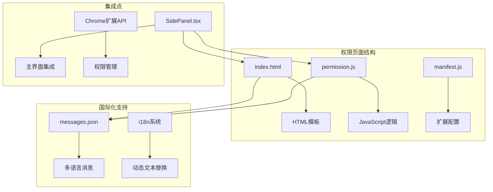
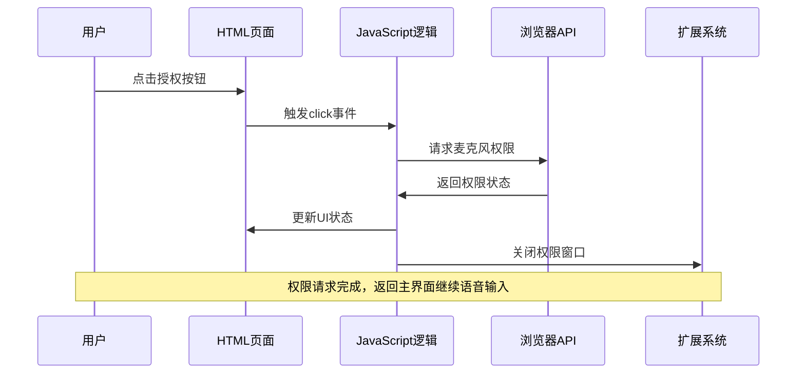
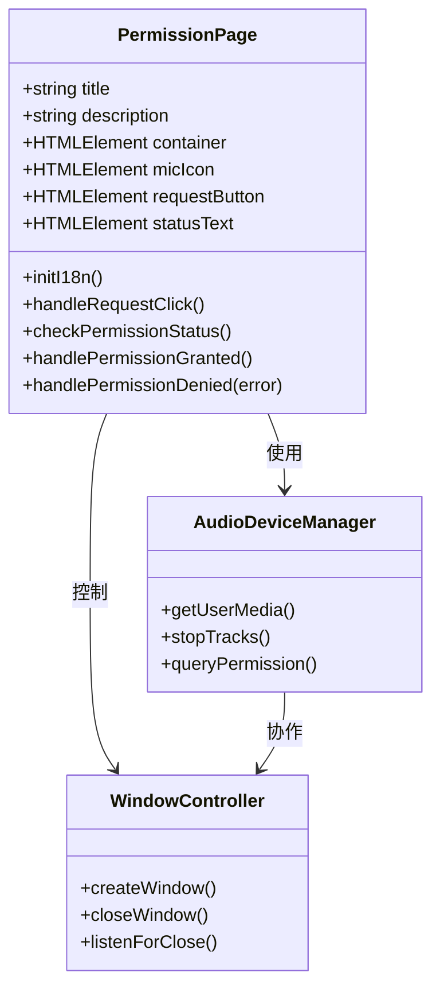
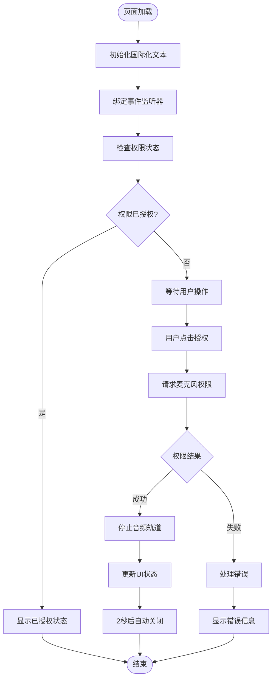
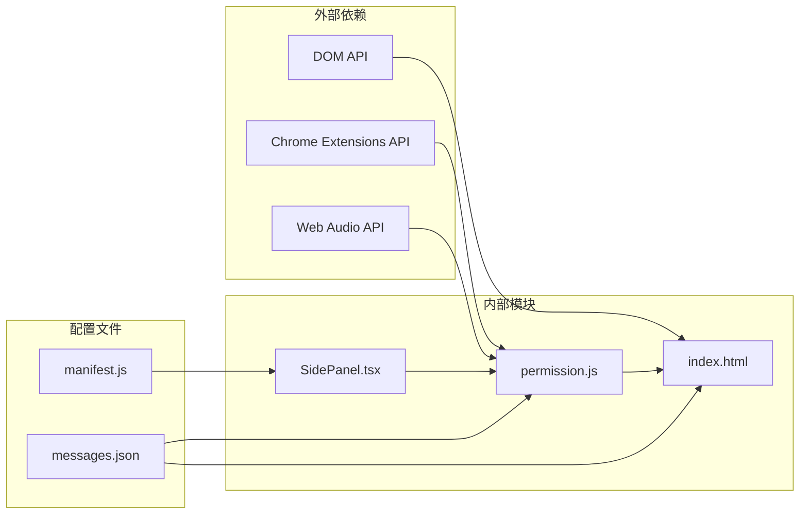

# 权限页面

<cite>
**本文档中引用的文件**
- [index.html](file://chrome-extension/public/permission/index.html)
- [permission.js](file://chrome-extension/public/permission/permission.js)
- [SidePanel.tsx](file://pages/side-panel/src/SidePanel.tsx)
- [manifest.js](file://chrome-extension/manifest.js)
- [messages.json](file://packages/i18n/locales/en/messages.json)
</cite>

## 目录
1. [简介](#简介)
2. [项目结构](#项目结构)
3. [核心组件](#核心组件)
4. [架构概览](#架构概览)
5. [详细组件分析](#详细组件分析)
6. [依赖关系分析](#依赖关系分析)
7. [性能考虑](#性能考虑)
8. [故障排除指南](#故障排除指南)
9. [结论](#结论)

## 简介

nanobrowser权限页面是一个专门设计用于请求和管理麦克风权限的用户界面。当用户尝试使用语音输入功能时，该页面会自动弹出，要求用户授权访问设备的麦克风。该系统实现了完整的权限生命周期管理，包括权限检查、请求、授予和错误处理。

权限页面的核心功能是为语音转文本（STT）功能提供必要的音频输入访问权限，同时确保用户能够理解权限请求的目的和影响。

## 项目结构

权限页面相关文件位于Chrome扩展的公共资源目录中，采用模块化设计：

**图表来源**
- [index.html](file://chrome-extension/public/permission/index.html#L1-L89)
- [permission.js](file://chrome-extension/public/permission/permission.js#L1-L65)
- [manifest.js](file://chrome-extension/manifest.js#L1-L101)

**章节来源**
- [index.html](file://chrome-extension/public/permission/index.html#L1-L89)
- [permission.js](file://chrome-extension/public/permission/permission.js#L1-L65)
- [manifest.js](file://chrome-extension/manifest.js#L1-L101)

## 核心组件

权限页面由三个主要组件构成：

### HTML模板组件
负责定义用户界面的结构和样式，包括渐变背景、毛玻璃效果容器和动画麦克风图标。

### JavaScript逻辑组件  
处理权限请求的完整生命周期，从用户交互到权限状态更新。

### 国际化消息系统  
提供多语言支持，确保不同地区用户的本地化体验。

**章节来源**
- [index.html](file://chrome-extension/public/permission/index.html#L1-L89)
- [permission.js](file://chrome-extension/public/permission/permission.js#L1-L65)

## 架构概览

权限页面采用事件驱动的架构模式，通过DOM事件和浏览器API实现完整的权限管理流程：

**图表来源**
- [permission.js](file://chrome-extension/public/permission/permission.js#L10-L40)
- [SidePanel.tsx](file://pages/side-panel/src/SidePanel.tsx#L869-L904)

## 详细组件分析

### UI设计与视觉效果

权限页面采用了现代化的UI设计，具有以下特征：

#### 渐变背景系统
使用CSS线性渐变创建视觉吸引力的背景效果：
- 起始颜色：#667eea（蓝色调）
- 结束颜色：#764ba2（紫色调）
- 渐变角度：135度

#### 毛玻璃效果容器
通过CSS backdrop-filter属性实现模糊效果：
- 背景透明度：10%
- 模糊半径：10px
- 边框圆角：20px
- 投影效果：轻微阴影增强层次感

#### 动画麦克风图标
使用CSS关键帧动画创建呼吸效果：
- 初始缩放：100%
- 最大缩放：110%
- 动画周期：2秒无限循环

**图表来源**
- [index.html](file://chrome-extension/public/permission/index.html#L5-L50)
- [permission.js](file://chrome-extension/public/permission/permission.js#L1-L65)

**章节来源**
- [index.html](file://chrome-extension/public/permission/index.html#L1-L89)

### 权限请求流程

JavaScript逻辑实现了完整的权限请求和管理流程：

#### 初始化阶段
- DOM加载完成后设置国际化文本
- 绑定用户交互事件监听器
- 检查当前权限状态

#### 用户交互处理
- 点击授权按钮触发权限请求
- 显示加载状态指示器
- 调用navigator.mediaDevices.getUserMedia API

#### 权限状态管理
- 成功获取权限后立即停止音频轨道
- 更新UI显示授权成功状态
- 自动关闭权限窗口（延迟2秒）

#### 错误处理机制
- 处理各种权限错误类型
- 提供具体的错误信息和解决方案
- 显示友好的错误提示

**图表来源**
- [permission.js](file://chrome-extension/public/permission/permission.js#L1-L65)

**章节来源**
- [permission.js](file://chrome-extension/public/permission/permission.js#L1-L65)

### 主界面集成

权限页面与主界面通过Chrome扩展API进行无缝集成：

#### 窗口管理
- 创建独立的弹窗窗口
- 设置合适的窗口尺寸（500x600）
- 监听窗口关闭事件

#### 权限状态同步
- 窗口关闭后检查最终权限状态
- 自动重试语音输入功能
- 处理权限被拒绝的情况

**章节来源**
- [SidePanel.tsx](file://pages/side-panel/src/SidePanel.tsx#L869-L904)

## 依赖关系分析

权限页面的依赖关系体现了清晰的分层架构：

**图表来源**
- [manifest.js](file://chrome-extension/manifest.js#L70-L80)
- [permission.js](file://chrome-extension/public/permission/permission.js#L1-L10)

### 扩展配置依赖
权限页面需要在manifest.js中正确配置才能正常工作：
- web_accessible_resources配置
- 权限声明
- 资源路径映射

### 国际化依赖
所有用户可见的文本都通过i18n系统管理，确保多语言支持。

**章节来源**
- [manifest.js](file://chrome-extension/manifest.js#L70-L80)
- [messages.json](file://packages/i18n/locales/en/messages.json#L165-L195)

## 性能考虑

权限页面的设计充分考虑了性能优化：

### 加载性能
- 静态HTML和CSS减少运行时计算
- 内联样式避免额外的HTTP请求
- 小巧的JavaScript文件

### 响应性能
- 异步权限请求不阻塞主线程
- 及时的UI状态更新
- 合理的自动关闭延迟

### 资源管理
- 权限授予后立即释放音频资源
- 避免内存泄漏
- 最小化的DOM操作

## 故障排除指南

### 常见问题及解决方案

#### 权限请求失败
**症状**：点击授权按钮后无响应或显示错误
**原因**：浏览器安全设置或设备问题
**解决**：检查浏览器权限设置，确认麦克风设备可用

#### 窗口无法关闭
**症状**：权限窗口持续存在
**原因**：JavaScript执行异常
**解决**：刷新页面重新尝试

#### 多语言显示异常
**症状**：界面显示英文而非本地语言
**原因**：国际化文件缺失或配置错误
**解决**：检查扩展的语言设置

**章节来源**
- [permission.js](file://chrome-extension/public/permission/permission.js#L34-L63)

## 结论

nanobrowser权限页面是一个设计精良的用户权限管理系统，它成功地平衡了功能性、用户体验和安全性需求。通过清晰的架构设计、完善的错误处理机制和优秀的国际化支持，该系统为语音输入功能提供了可靠的权限基础。

该权限页面的主要优势包括：
- 直观的用户界面设计
- 完整的权限生命周期管理
- 强大的错误处理能力
- 全面的国际化支持
- 与主应用的无缝集成

未来的改进方向可能包括更丰富的视觉反馈、更详细的错误诊断信息以及对更多音频设备的支持。