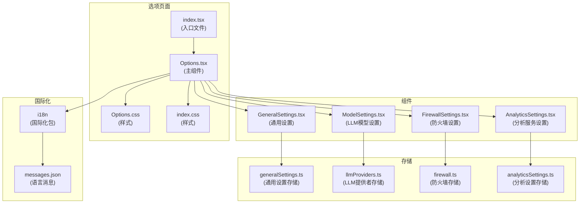
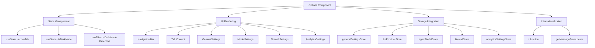
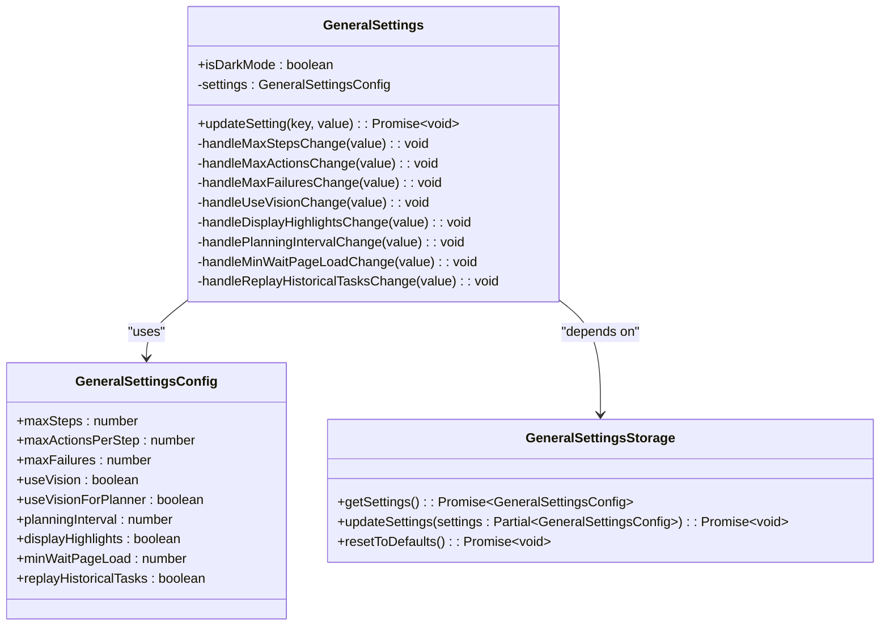
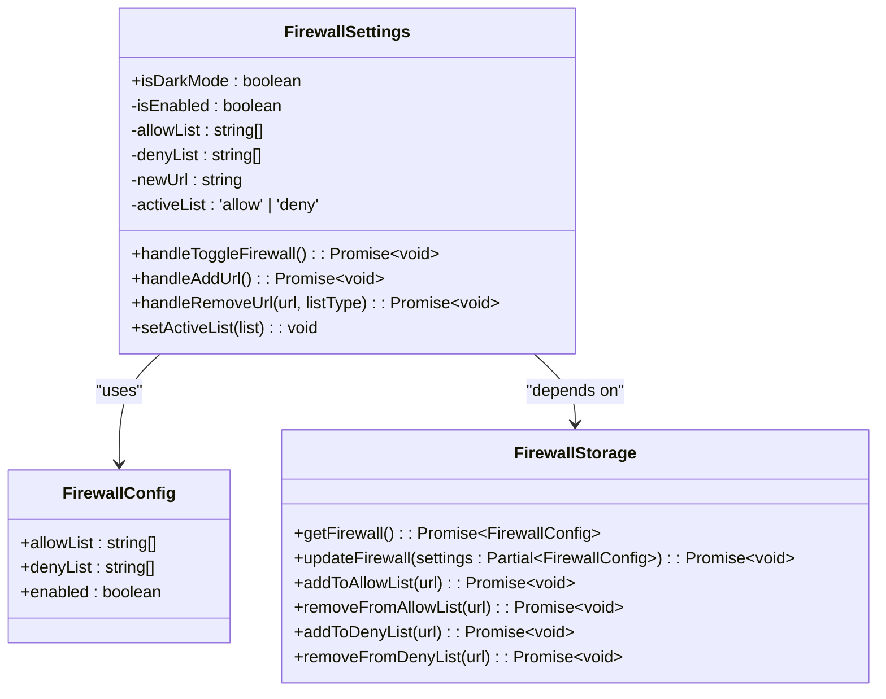
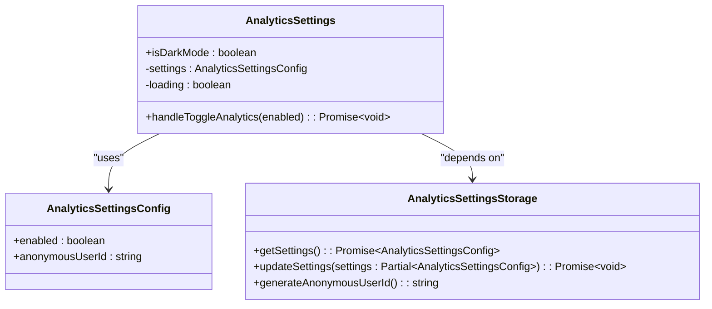
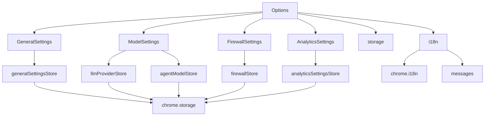

# 选项页面

<cite>
**本文档中引用的文件**  
- [Options.tsx](file://pages/options/src/Options.tsx)
- [GeneralSettings.tsx](file://pages/options/src/components/GeneralSettings.tsx)
- [ModelSettings.tsx](file://pages/options/src/components/ModelSettings.tsx)
- [FirewallSettings.tsx](file://pages/options/src/components/FirewallSettings.tsx)
- [AnalyticsSettings.tsx](file://pages/options/src/components/AnalyticsSettings.tsx)
- [Options.css](file://pages/options/src/Options.css)
- [index.css](file://pages/options/src/index.css)
- [generalSettings.ts](file://packages/storage/lib/settings/generalSettings.ts)
- [llmProviders.ts](file://packages/storage/lib/settings/llmProviders.ts)
- [agentModels.ts](file://packages/storage/lib/settings/agentModels.ts)
- [firewall.ts](file://packages/storage/lib/settings/firewall.ts)
- [analyticsSettings.ts](file://packages/storage/lib/settings/analyticsSettings.ts)
- [getMessageFromLocale.ts](file://packages/i18n/lib/getMessageFromLocale.ts)
- [messages.json](file://packages/i18n/locales/en/messages.json)
</cite>

## 目录
1. [简介](#简介)
2. [项目结构](#项目结构)
3. [核心组件](#核心组件)
4. [架构概述](#架构概述)
5. [详细组件分析](#详细组件分析)
6. [依赖分析](#依赖分析)
7. [性能考虑](#性能考虑)
8. [故障排除指南](#故障排除指南)
9. [结论](#结论)

## 简介
nanobrowser选项页面是扩展程序的配置中心，为用户提供了一个集中管理各种设置的界面。该页面通过标签页导航结构组织了四个主要功能区域：LLM模型配置、通用设置、防火墙规则和分析服务设置。用户可以通过直观的界面调整这些设置，以定制扩展程序的行为。选项页面实现了与存储系统的深度集成，确保用户配置能够持久化保存并在不同会话间同步。此外，页面支持国际化和响应式设计，包括暗色模式适配，为用户提供一致且现代化的用户体验。

## 项目结构
选项页面位于`pages/options`目录下，遵循清晰的组件化结构。主入口文件`index.tsx`负责初始化React应用并将其挂载到DOM中。核心组件`Options.tsx`定义了页面的整体布局和标签页导航逻辑。各个设置面板被拆分为独立的子组件，分别位于`components`目录下，包括`GeneralSettings.tsx`、`ModelSettings.tsx`、`FirewallSettings.tsx`和`AnalyticsSettings.tsx`。样式文件`Options.css`和`index.css`使用Tailwind CSS框架实现响应式设计和主题支持。整个页面通过`@extension/storage`包与浏览器的存储系统集成，实现配置的持久化。



**Diagram sources**
- [index.tsx](file://pages/options/src/index.tsx)
- [Options.tsx](file://pages/options/src/Options.tsx)
- [GeneralSettings.tsx](file://pages/options/src/components/GeneralSettings.tsx)
- [ModelSettings.tsx](file://pages/options/src/components/ModelSettings.tsx)
- [FirewallSettings.tsx](file://pages/options/src/components/FirewallSettings.tsx)
- [AnalyticsSettings.tsx](file://pages/options/src/components/AnalyticsSettings.tsx)
- [generalSettings.ts](file://packages/storage/lib/settings/generalSettings.ts)
- [llmProviders.ts](file://packages/storage/lib/settings/llmProviders.ts)
- [firewall.ts](file://packages/storage/lib/settings/firewall.ts)
- [analyticsSettings.ts](file://packages/storage/lib/settings/analyticsSettings.ts)
- [getMessageFromLocale.ts](file://packages/i18n/lib/getMessageFromLocale.ts)
- [messages.json](file://packages/i18n/locales/en/messages.json)

**Section sources**
- [index.tsx](file://pages/options/src/index.tsx)
- [Options.tsx](file://pages/options/src/Options.tsx)
- [Options.css](file://pages/options/src/Options.css)
- [index.css](file://pages/options/src/index.css)

## 核心组件
选项页面的核心组件是`Options.tsx`，它负责管理整个页面的状态和布局。该组件使用`useState`和`useEffect`钩子来管理活动标签页和暗色模式状态。通过`TABS`常量定义了标签页的配置，包括ID、图标和标签文本。`activeTab`状态变量决定了当前显示的设置面板，通过`renderTabContent`函数根据当前标签页渲染相应的子组件。页面还集成了错误边界和加载状态处理，确保应用的健壮性。`GeneralSettings`、`ModelSettings`、`FirewallSettings`和`AnalyticsSettings`四个子组件分别负责不同领域的配置，它们通过`isDarkMode`属性接收主题信息，以实现一致的视觉体验。

**Section sources**
- [Options.tsx](file://pages/options/src/Options.tsx)
- [GeneralSettings.tsx](file://pages/options/src/components/GeneralSettings.tsx)
- [ModelSettings.tsx](file://pages/options/src/components/ModelSettings.tsx)
- [FirewallSettings.tsx](file://pages/options/src/components/FirewallSettings.tsx)
- [AnalyticsSettings.tsx](file://pages/options/src/components/AnalyticsSettings.tsx)

## 架构概述
选项页面采用React函数组件和Hooks的现代架构。主组件`Options`通过组合多个子组件来构建用户界面，实现了关注点分离。状态管理主要依赖React的`useState`和`useEffect`钩子，对于复杂的业务逻辑，组件通过`@extension/storage`包与外部存储系统交互。这种架构使得组件保持了相对的纯净，将数据持久化逻辑委托给专门的存储模块。页面的响应式设计通过Tailwind CSS实现，暗色模式检测则利用`window.matchMedia` API监听系统偏好设置。整个架构体现了组件化、可维护性和用户体验优先的设计原则。



**Diagram sources**
- [Options.tsx](file://pages/options/src/Options.tsx)
- [generalSettings.ts](file://packages/storage/lib/settings/generalSettings.ts)
- [llmProviders.ts](file://packages/storage/lib/settings/llmProviders.ts)
- [firewall.ts](file://packages/storage/lib/settings/firewall.ts)
- [analyticsSettings.ts](file://packages/storage/lib/settings/analyticsSettings.ts)
- [getMessageFromLocale.ts](file://packages/i18n/lib/getMessageFromLocale.ts)

## 详细组件分析
### 通用设置分析
`GeneralSettings`组件允许用户配置扩展程序的核心行为参数。它通过`generalSettingsStore`从存储中读取初始设置，并使用`useState`管理本地状态。组件中的每个输入控件都绑定了`updateSetting`函数，该函数首先乐观地更新本地状态以提供即时反馈，然后调用存储API更新持久化数据。这种模式确保了用户界面的响应性。组件还处理了设置之间的依赖关系，例如当`useVision`启用时，`displayHighlights`也会被强制启用。所有用户界面文本都通过`t`函数进行国际化处理，确保支持多语言。



**Diagram sources**
- [GeneralSettings.tsx](file://pages/options/src/components/GeneralSettings.tsx)
- [generalSettings.ts](file://packages/storage/lib/settings/generalSettings.ts)

**Section sources**
- [GeneralSettings.tsx](file://pages/options/src/components/GeneralSettings.tsx)
- [generalSettings.ts](file://packages/storage/lib/settings/generalSettings.ts)

### 模型设置分析
`ModelSettings`组件为用户提供了管理LLM模型配置的复杂界面。它支持多种LLM提供者，包括OpenAI、Azure OpenAI、Ollama等，并允许用户添加自定义提供者。组件使用`useCallback`和`useMemo`优化性能，避免不必要的重新渲染。状态管理涉及多个`useState`变量，用于跟踪提供者、模型选择、参数设置等。与存储系统的交互通过`llmProviderStore`、`agentModelStore`等API进行。组件实现了复杂的业务逻辑，如模型参数的默认值设置、推理努力度的管理以及Azure部署名称的处理。用户界面包含可搜索的下拉菜单、键盘导航和表单验证，提供了高级的交互体验。

```mermaid
classDiagram
class ModelSettings {
+isDarkMode : boolean
-providers : Record~string, ProviderConfig~
-selectedModels : Record~AgentNameEnum, string~
-modelParameters : Record~AgentNameEnum, {temperature, topP}~
-reasoningEffort : Record~AgentNameEnum, 'minimal' | 'low' | 'medium' | 'high'~
+handleModelChange(agent, model) : Promise~void~
+handleParameterChange(agent, param, value) : Promise~void~
+handleReasoningEffortChange(agent, value) : Promise~void~
+handleApiKeyChange(provider, key) : void
+handleNameChange(provider, name) : void
+addModel(provider, model) : void
+removeModel(provider, model) : void
+addCustomProvider() : void
+addBuiltInProvider(provider) : void
}
class ProviderConfig {
+apiKey : string
+name : string
+type : ProviderTypeEnum
+baseUrl : string
+modelNames : string[]
+azureDeploymentNames : string[]
+azureApiVersion : string
+createdAt : number
}
class AgentModelConfig {
+provider : string
+modelName : string
+parameters : {temperature : number, topP : number}
+reasoningEffort : 'minimal' | 'low' | 'medium' | 'high'
}
class LLMProviderStorage {
+getAllProviders() : Promise~Record~string, ProviderConfig~~
+setProvider(providerId, config) : Promise~void~
+removeProvider(providerId) : Promise~void~
}
class AgentModelStorage {
+getAgentModel(agent) : Promise~AgentModelConfig~
+setAgentModel(agent, config) : Promise~void~
+resetAgentModel(agent) : Promise~void~
}
ModelSettings --> ProviderConfig : "uses"
ModelSettings --> AgentModelConfig : "uses"
ModelSettings --> LLMProviderStorage : "depends on"
ModelSettings --> AgentModelStorage : "depends on"
```

**Diagram sources**
- [ModelSettings.tsx](file://pages/options/src/components/ModelSettings.tsx)
- [llmProviders.ts](file://packages/storage/lib/settings/llmProviders.ts)
- [agentModels.ts](file://packages/storage/lib/settings/agentModels.ts)

**Section sources**
- [ModelSettings.tsx](file://pages/options/src/components/ModelSettings.tsx)
- [llmProviders.ts](file://packages/storage/lib/settings/llmProviders.ts)
- [agentModels.ts](file://packages/storage/lib/settings/agentModels.ts)

### 防火墙设置分析
`FirewallSettings`组件实现了对网站访问的控制功能。它通过`firewallStore`与存储系统交互，管理允许列表和拒绝列表。组件使用`useCallback`优化加载函数，并通过`useEffect`在组件挂载时加载初始设置。用户可以通过输入框添加新的URL到活动列表（允许或拒绝），并可以随时从列表中移除条目。组件还提供了防火墙的启用/禁用开关，允许用户快速控制整个功能。为了提升用户体验，组件实现了列表的切换按钮和清晰的视觉反馈。所有操作都通过异步函数与存储系统同步，确保数据的一致性。



**Diagram sources**
- [FirewallSettings.tsx](file://pages/options/src/components/FirewallSettings.tsx)
- [firewall.ts](file://packages/storage/lib/settings/firewall.ts)

**Section sources**
- [FirewallSettings.tsx](file://pages/options/src/components/FirewallSettings.tsx)
- [firewall.ts](file://packages/storage/lib/settings/firewall.ts)

### 分析服务设置分析
`AnalyticsSettings`组件管理用户对分析数据收集的偏好。它通过`analyticsSettingsStore`读取和更新分析设置，并实现了实时订阅功能，以响应其他组件对设置的更改。组件在加载时显示加载状态，并处理可能的错误情况。用户可以通过开关控制分析功能的启用/禁用，界面会根据当前状态显示相应的提示信息。组件还详细说明了收集和不收集的数据类型，以增强用户信任。匿名用户ID的生成和管理在存储层完成，确保了用户隐私的保护。



**Diagram sources**
- [AnalyticsSettings.tsx](file://pages/options/src/components/AnalyticsSettings.tsx)
- [analyticsSettings.ts](file://packages/storage/lib/settings/analyticsSettings.ts)

**Section sources**
- [AnalyticsSettings.tsx](file://pages/options/src/components/AnalyticsSettings.tsx)
- [analyticsSettings.ts](file://packages/storage/lib/settings/analyticsSettings.ts)

## 依赖分析
选项页面的依赖关系清晰且层次分明。主组件`Options`依赖于四个设置子组件和`@extension/storage`包。每个设置子组件又依赖于特定的存储模块，如`GeneralSettings`依赖`generalSettingsStore`，`ModelSettings`依赖`llmProviderStore`和`agentModelStore`等。存储模块本身依赖于浏览器的`chrome.storage` API，并通过`createStorage`函数提供统一的接口。国际化功能通过`@extension/i18n`包实现，该包依赖于Chrome的`i18n` API和本地化的消息文件。这种依赖结构确保了代码的模块化和可维护性，同时也便于单元测试和功能扩展。



**Diagram sources**
- [Options.tsx](file://pages/options/src/Options.tsx)
- [GeneralSettings.tsx](file://pages/options/src/components/GeneralSettings.tsx)
- [ModelSettings.tsx](file://pages/options/src/components/ModelSettings.tsx)
- [FirewallSettings.tsx](file://pages/options/src/components/FirewallSettings.tsx)
- [AnalyticsSettings.tsx](file://pages/options/src/components/AnalyticsSettings.tsx)
- [generalSettings.ts](file://packages/storage/lib/settings/generalSettings.ts)
- [llmProviders.ts](file://packages/storage/lib/settings/llmProviders.ts)
- [agentModels.ts](file://packages/storage/lib/settings/agentModels.ts)
- [firewall.ts](file://packages/storage/lib/settings/firewall.ts)
- [analyticsSettings.ts](file://packages/storage/lib/settings/analyticsSettings.ts)
- [getMessageFromLocale.ts](file://packages/i18n/lib/getMessageFromLocale.ts)
- [messages.json](file://packages/i18n/locales/en/messages.json)

**Section sources**
- [Options.tsx](file://pages/options/src/Options.tsx)
- [GeneralSettings.tsx](file://pages/options/src/components/GeneralSettings.tsx)
- [ModelSettings.tsx](file://pages/options/src/components/ModelSettings.tsx)
- [FirewallSettings.tsx](file://pages/options/src/components/FirewallSettings.tsx)
- [AnalyticsSettings.tsx](file://pages/options/src/components/AnalyticsSettings.tsx)
- [generalSettings.ts](file://packages/storage/lib/settings/generalSettings.ts)
- [llmProviders.ts](file://packages/storage/lib/settings/llmProviders.ts)
- [agentModels.ts](file://packages/storage/lib/settings/agentModels.ts)
- [firewall.ts](file://packages/storage/lib/settings/firewall.ts)
- [analyticsSettings.ts](file://packages/storage/lib/settings/analyticsSettings.ts)
- [getMessageFromLocale.ts](file://packages/i18n/lib/getMessageFromLocale.ts)
- [messages.json](file://packages/i18n/locales/en/messages.json)

## 性能考虑
选项页面在性能方面进行了多项优化。首先，通过使用`useCallback`和`useMemo`等React Hooks，避免了不必要的函数创建和计算，减少了组件的重新渲染。其次，组件的拆分和组合遵循了单一职责原则，使得每个组件只关注特定的功能，提高了可维护性和性能。与存储系统的交互被设计为异步操作，避免了阻塞主线程。对于复杂的`ModelSettings`组件，通过`getAvailableModelsCallback`和`getSortedProviders`等优化函数，确保了大型数据集的高效处理。此外，页面的懒加载和代码分割（通过`withSuspense`）确保了初始加载速度的优化。

## 故障排除指南
如果选项页面出现加载问题，首先检查浏览器控制台是否有JavaScript错误。确认`@extension/storage`和`@extension/i18n`包是否正确安装和导入。如果特定设置无法保存，检查`chrome.storage`权限是否在`manifest.json`中正确声明。对于国际化问题，确保`messages.json`文件中的键名正确无误，并且`generate-i18n.mjs`脚本已成功运行以生成类型文件。如果暗色模式检测失败，确认`window.matchMedia` API是否被正确使用。对于复杂的模型配置问题，检查`llmProviderStore`和`agentModelStore`的API调用是否正确，并验证存储的数据结构。

**Section sources**
- [Options.tsx](file://pages/options/src/Options.tsx)
- [Options.css](file://pages/options/src/Options.css)
- [generalSettings.ts](file://packages/storage/lib/settings/generalSettings.ts)
- [llmProviders.ts](file://packages/storage/lib/settings/llmProviders.ts)
- [getMessageFromLocale.ts](file://packages/i18n/lib/getMessageFromLocale.ts)

## 结论
nanobrowser选项页面是一个功能丰富、架构清晰的配置中心。它通过组件化设计和现代化的React技术栈，为用户提供了一个直观、高效的设置管理界面。页面的标签页导航结构使得不同领域的配置井然有序，而与存储系统的深度集成确保了用户偏好的持久化。国际化支持和响应式设计（包括暗色模式）提升了用户体验的广度和深度。整体架构体现了良好的软件工程实践，为未来的功能扩展和维护奠定了坚实的基础。