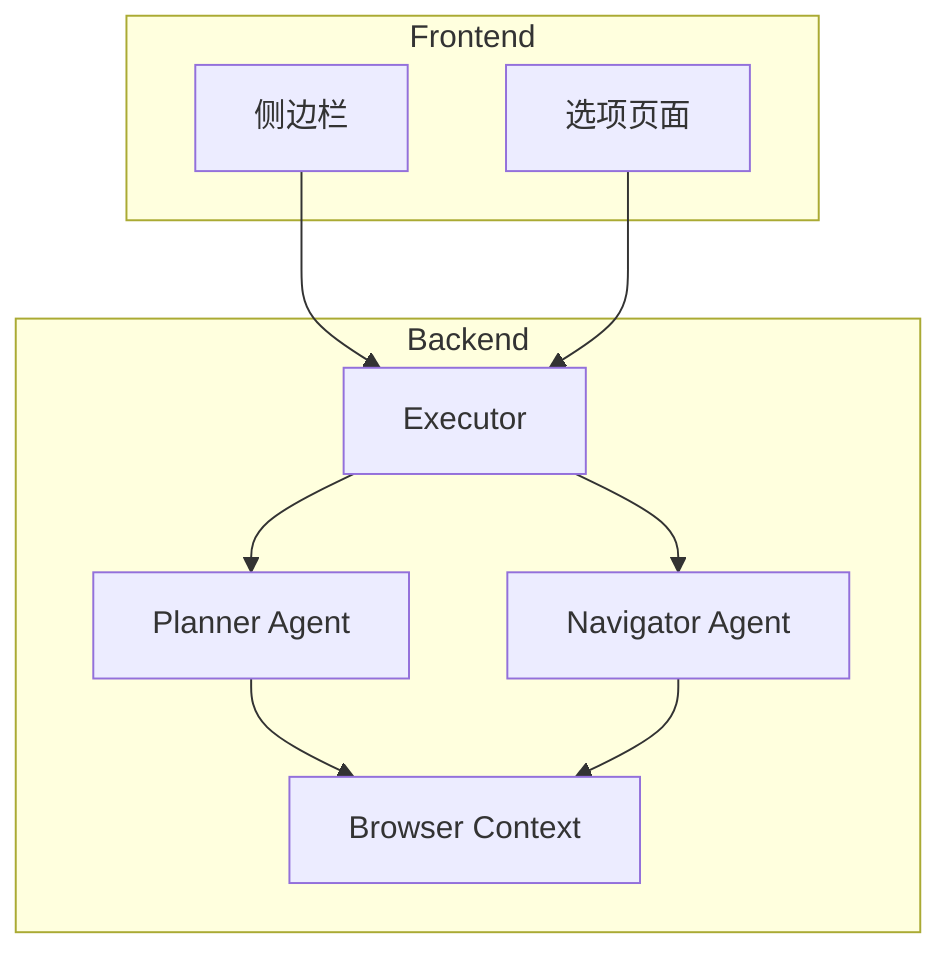
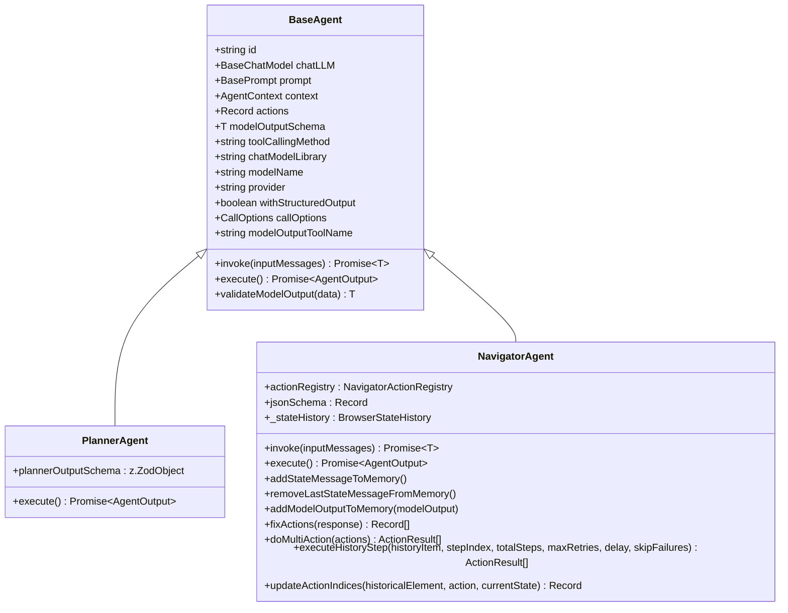
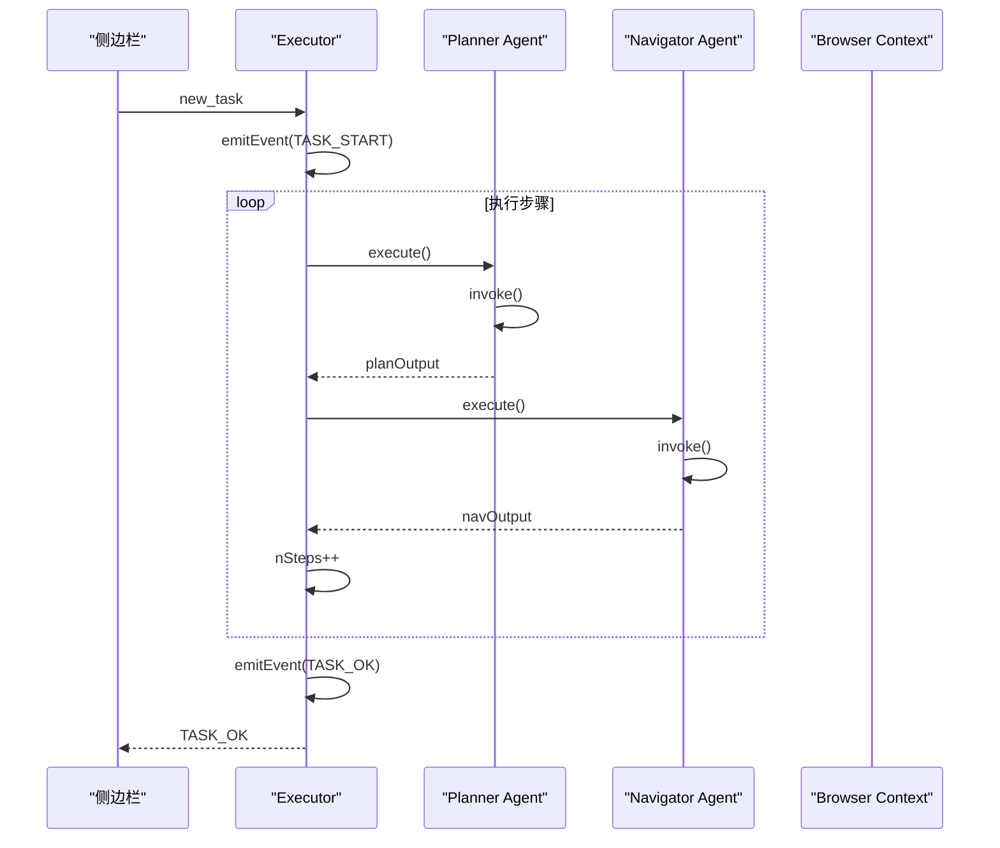
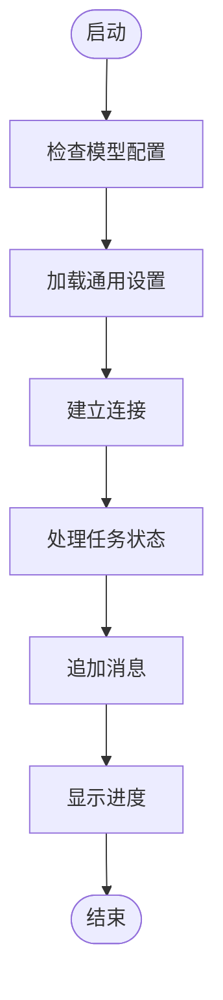
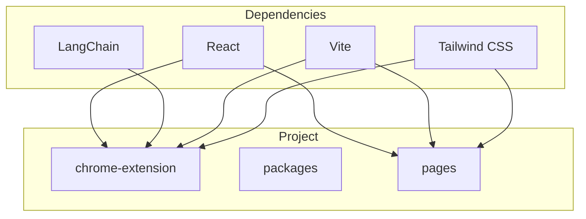

# 项目概述

<cite>
**本文档中引用的文件**  
- [README.md](file://README.md)
- [package.json](file://package.json)
- [chrome-extension/package.json](file://chrome-extension/package.json)
- [turbo.json](file://turbo.json)
- [pnpm-workspace.yaml](file://pnpm-workspace.yaml)
- [chrome-extension/src/background/index.ts](file://chrome-extension/src/background/index.ts)
- [chrome-extension/src/background/agent/agents/base.ts](file://chrome-extension/src/background/agent/agents/base.ts)
- [chrome-extension/src/background/agent/agents/planner.ts](file://chrome-extension/src/background/agent/agents/planner.ts)
- [chrome-extension/src/background/agent/agents/navigator.ts](file://chrome-extension/src/background/agent/agents/navigator.ts)
- [chrome-extension/src/background/agent/executor.ts](file://chrome-extension/src/background/agent/executor.ts)
- [chrome-extension/src/background/browser/context.ts](file://chrome-extension/src/background/browser/context.ts)
- [pages/side-panel/src/SidePanel.tsx](file://pages/side-panel/src/SidePanel.tsx)
- [pages/options/src/Options.tsx](file://pages/options/src/Options.tsx)
- [packages/storage/lib/index.ts](file://packages/storage/lib/index.ts)
</cite>

## 目录
1. [简介](#简介)
2. [项目结构](#项目结构)
3. [核心组件](#核心组件)
4. [架构概述](#架构概述)
5. [详细组件分析](#详细组件分析)
6. [依赖分析](#依赖分析)
7. [性能考虑](#性能考虑)
8. [故障排除指南](#故障排除指南)
9. [结论](#结论)

## 简介

nanobrowser 是一个开源的 AI 网页自动化工具，作为 Chrome 扩展运行，提供了一种基于多智能体系统的浏览器自动化解决方案。该项目旨在为用户提供一个免费且功能强大的替代方案，类似于 OpenAI Operator，但具有更灵活的 LLM 选项和完全的本地控制。nanobrowser 的核心价值在于其多智能体系统，该系统能够协作完成复杂的网页工作流，同时保持用户数据的隐私和安全。

**Section sources**
- [README.md](file://README.md#L1-L265)

## 项目结构

nanobrowser 项目采用 monorepo 结构，使用 Turbo 进行构建编排和 pnpm 工作区管理。项目主要分为三个部分：`chrome-extension`、`packages` 和 `pages`。

- **chrome-extension**: 包含主 Chrome 扩展清单和后台脚本，是多智能体系统的核心。
- **packages**: 包含共享包，如 `shared`（通用工具和类型）、`storage`（Chrome 扩展存储抽象）、`ui`（共享 React 组件）等。
- **pages**: 包含 UI 页面，如 `side-panel`（主聊天界面）、`options`（扩展设置页面）和 `content`（页面注入的内容脚本）。

这种结构使得代码模块化，便于维护和扩展。

**Section sources**
- [README.md](file://README.md#L42-L88)
- [pnpm-workspace.yaml](file://pnpm-workspace.yaml#L1-L5)

## 核心组件

nanobrowser 的核心组件包括多智能体系统、交互式侧边栏、任务自动化、后续问题、对话历史和多 LLM 支持。多智能体系统由专门的 AI 智能体组成，协作完成复杂的网页工作流。交互式侧边栏提供直观的聊天界面，实时更新状态。任务自动化功能可以无缝地在网站上自动化重复性任务。用户可以提出上下文相关的后续问题，了解已完成任务的细节。对话历史功能使用户能够轻松访问和管理与 AI 智能体的交互历史。此外，nanobrowser 支持多种 LLM，用户可以连接首选的 LLM 提供商，并为不同的智能体分配不同的模型。

**Section sources**
- [README.md](file://README.md#L26-L54)

## 架构概述

nanobrowser 的架构基于多智能体系统，包括 Navigator、Planner 和 Validator 三个专门的智能体。Navigator 负责处理 DOM 交互和网页导航，Planner 负责高层次的任务规划和策略，Validator 负责验证任务完成情况和结果。这些智能体通过 `Executor` 类协调，`Executor` 类负责管理任务执行的整个生命周期，包括启动、暂停、恢复和取消任务。

**Diagram sources**
- [chrome-extension/src/background/executor.ts](file://chrome-extension/src/background/agent/executor.ts#L70-L106)
- [chrome-extension/src/background/agent/agents/planner.ts](file://chrome-extension/src/background/agent/agents/planner.ts#L1-L131)
- [chrome-extension/src/background/agent/agents/navigator.ts](file://chrome-extension/src/background/agent/agents/navigator.ts#L1-L666)

## 详细组件分析

### 多智能体系统分析

nanobrowser 的多智能体系统是其核心功能，通过专门的智能体协作完成复杂的网页工作流。每个智能体都有明确的职责和交互方式。

#### 基础智能体类

**Diagram sources**
- [chrome-extension/src/background/agent/agents/base.ts](file://chrome-extension/src/background/agent/agents/base.ts#L1-L210)
- [chrome-extension/src/background/agent/agents/planner.ts](file://chrome-extension/src/background/agent/agents/planner.ts#L1-L131)
- [chrome-extension/src/background/agent/agents/navigator.ts](file://chrome-extension/src/background/agent/agents/navigator.ts#L1-L666)

#### 执行器组件

**Diagram sources**
- [chrome-extension/src/background/agent/executor.ts](file://chrome-extension/src/background/agent/executor.ts#L1-L434)

### 侧边栏界面分析

侧边栏是用户与 nanobrowser 交互的主要界面，提供了一个直观的聊天界面，用户可以通过简单的文本命令与多智能体系统进行交互。

**Diagram sources**
- [pages/side-panel/src/SidePanel.tsx](file://pages/side-panel/src/SidePanel.tsx#L1-L799)

**Section sources**
- [pages/side-panel/src/SidePanel.tsx](file://pages/side-panel/src/SidePanel.tsx#L1-L799)

## 依赖分析

nanobrowser 项目依赖于多个外部库和工具，包括 React、LangChain、Vite、Tailwind CSS 等。这些依赖项通过 pnpm 工作区进行管理，确保了依赖的一致性和可维护性。

**Diagram sources**
- [package.json](file://package.json#L1-L80)
- [chrome-extension/package.json](file://chrome-extension/package.json#L1-L55)

**Section sources**
- [package.json](file://package.json#L1-L80)
- [chrome-extension/package.json](file://chrome-extension/package.json#L1-L55)

## 性能考虑

nanobrowser 的性能考虑主要集中在多智能体系统的协调和任务执行的效率上。通过使用 Turbo 进行构建编排，项目能够高效地管理和优化构建过程。此外，多智能体系统的设计允许并行处理任务的不同方面，提高了整体执行效率。

## 故障排除指南

在使用 nanobrowser 时，可能会遇到一些常见问题，如模型配置错误、任务执行失败等。以下是一些故障排除建议：

- **模型配置错误**: 确保在设置页面中正确配置了 LLM API 密钥，并选择了合适的模型。
- **任务执行失败**: 检查任务描述是否清晰明确，避免高阶、模糊的命令。
- **连接问题**: 确保 Chrome 扩展已正确安装并启用，且网络连接正常。

**Section sources**
- [README.md](file://README.md#L26-L54)
- [pages/options/src/Options.tsx](file://pages/options/src/Options.tsx#L1-L100)

## 结论

nanobrowser 项目通过其多智能体系统和灵活的 LLM 选项，为用户提供了一个强大且隐私保护的浏览器自动化工具。其 monorepo 结构和模块化设计使得项目易于维护和扩展。未来的发展方向包括支持更多 LLM 提供商、优化多智能体系统的协调机制以及增强用户界面的交互性。